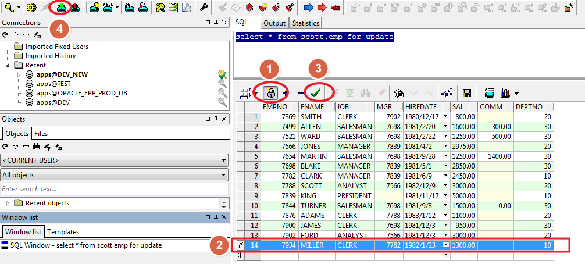
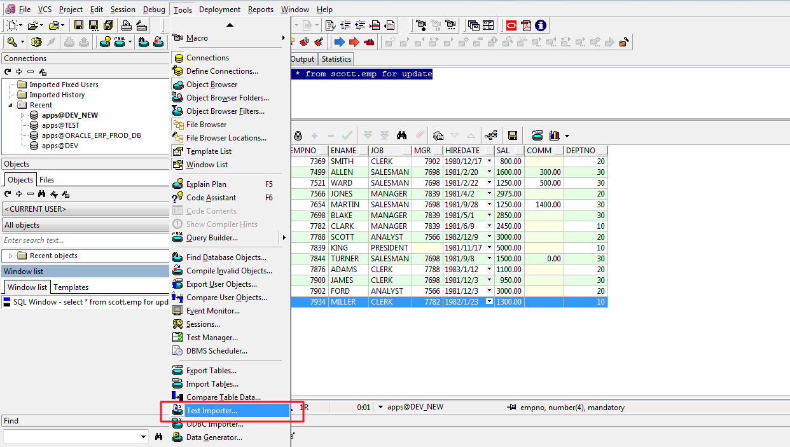
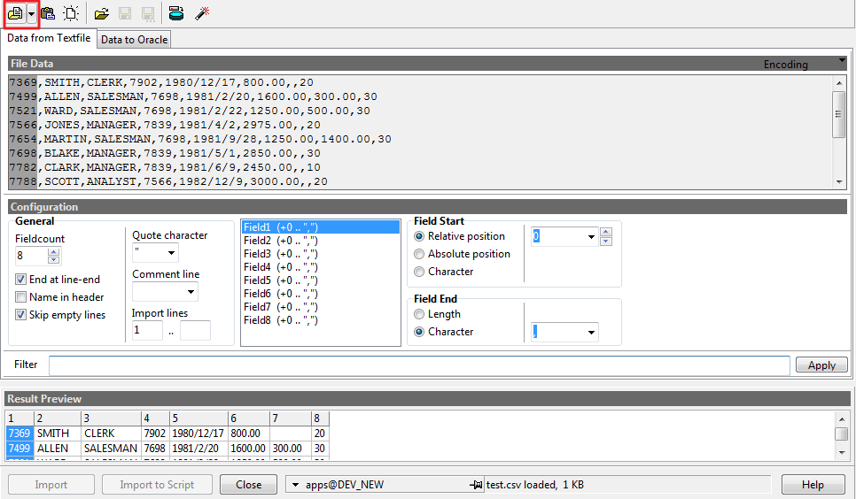
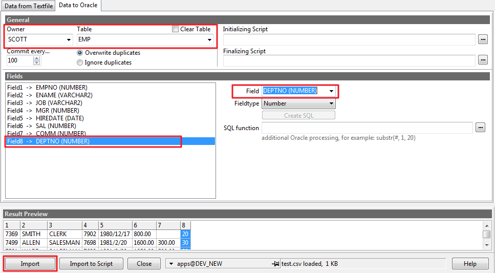
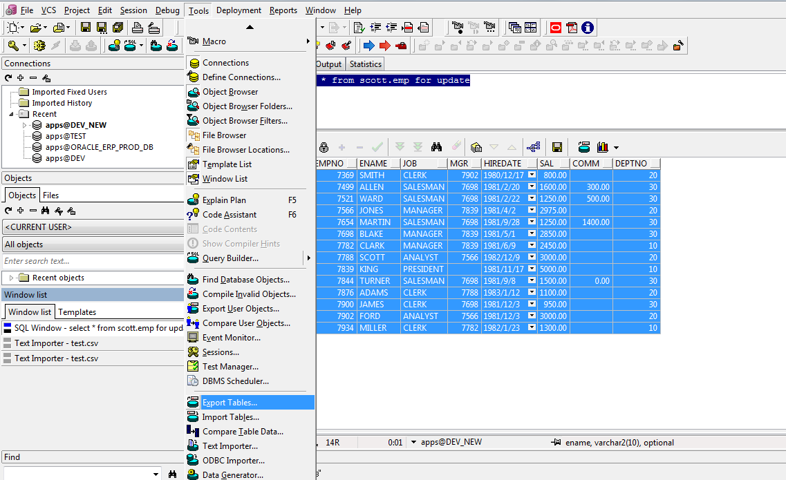
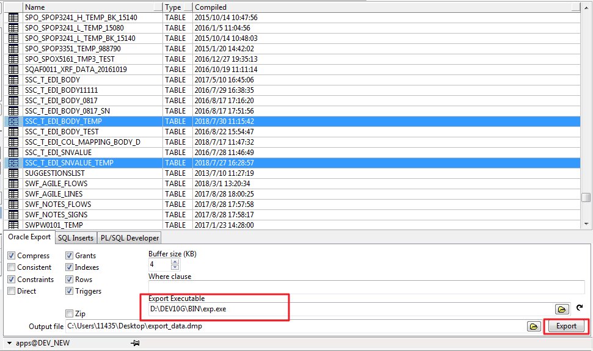
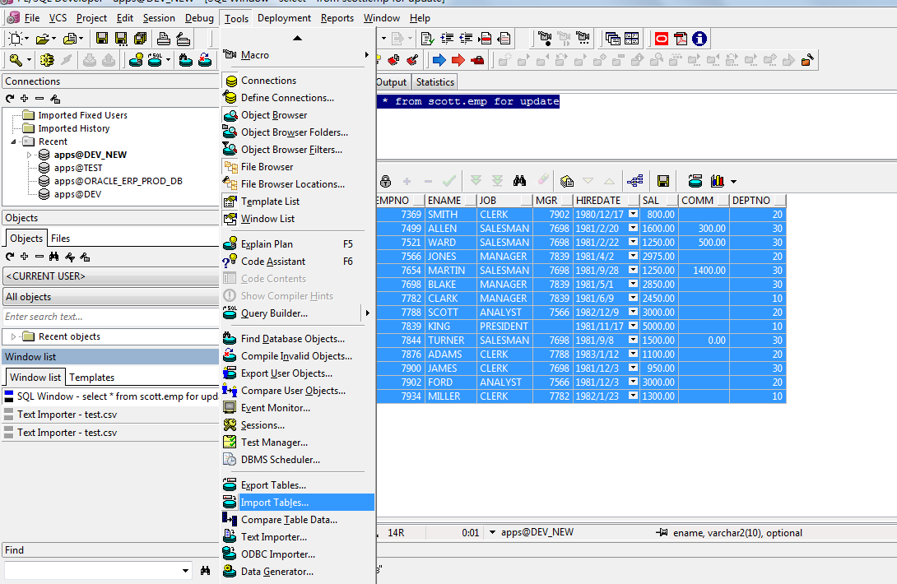
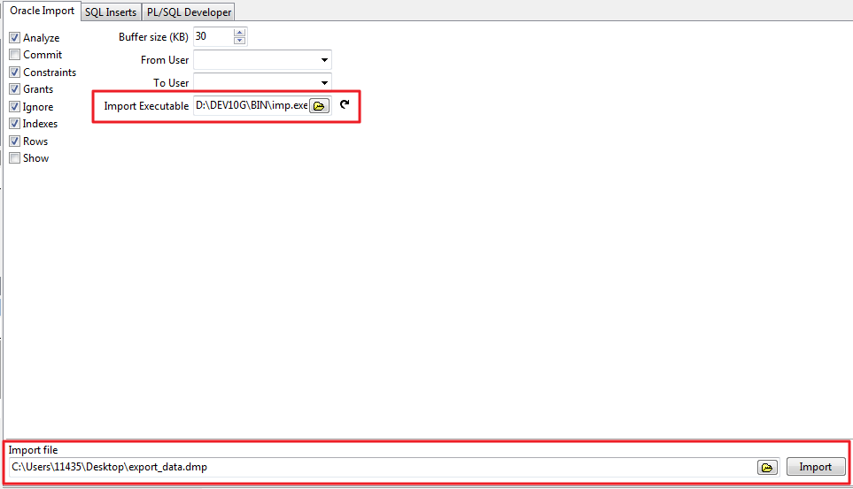

### 使用 for update

```sql
select * from scott.emp for update
```

可以拷貝 excel 中的數據到行列下方，也可以手動添加修改數據，修改完成後點擊對號，確認無誤進行 commit， 否則 rollback。



### Text Importer 導入 csv 文件

Tools -> Text Importer


Data from File


Data to Oracle


### Import Tables 導入 dmp 文件

對於大量需要在數據庫之間遷移的數據應該用這種方法

Tools -> Export Tables


選擇要導出的表，可以導出多張表


Tools -> Import Tables


選擇導出的 dmp 文件

