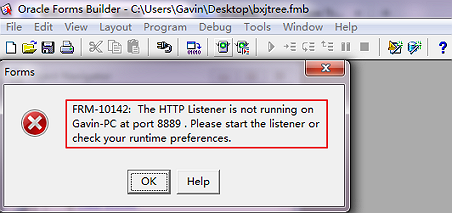
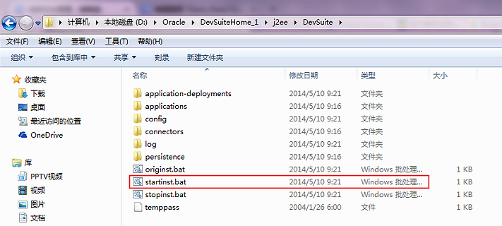
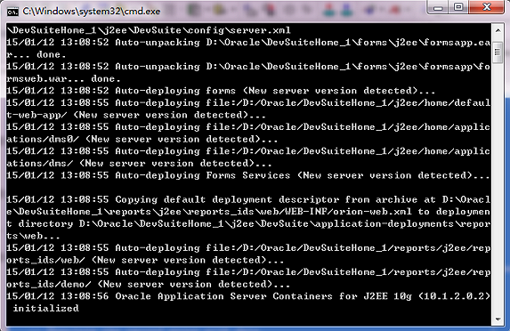
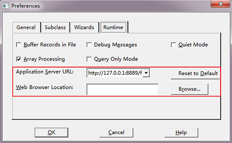
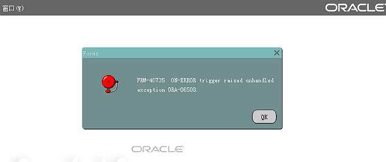
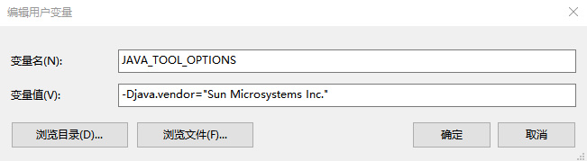

> 转载：[Form_Form Builder 本地部署运行的实现（案例）- 东方瀚海 ](https://www.cnblogs.com/eastsea/p/4219828.html)

# Form Builder 本地部署运行的实现

在做开发时，总是希望 Form Builder 可以在本地进行编译开发，不需要总是上传至服务器编译，以下提供了一种方式，可以在本地编译 fmb 文件，并运行，节省部分开发时间

不过这种方式只适合非基于 Template.fmb 开发的本地编译，算是一种缺点。

Step1. 在 Form 本地运行时会提提示 FRM-10142: The HTTP Listener is not running on Hostname at port 889

Step2. 启动 startinst.bat

D:\Oracle\DevSuiteHome_1\j2ee\DevSuite

Step3. 运行时，不要关闭该窗口，Form Builder 就可以在本地运行了

Step4. 操作了问题一的解决办法后，再次运行表单，会出现浏览器崩溃的情况。

安装找到 Developer Suite 安装目录下的 jinit 文件夹（如：C:\DevSuiteHome\jinit），安装其中的 jinit.exe 应用程序。

Step5. 打开的 Oracle Forms Builder 中，点击菜单->编辑->首选项。

在弹出框中，选择“运行时”选项卡，然后在“应用程序服务器 URL”中，输入`http://127.0.0.1:8889/forms/frmservlet?config=jpi`，在“浏览器位置”中，选择你的浏览器。

Step6. 到此，再运行表单，就会正常了。

基于 Template.fmb 无法在本机的 Form Builder 中运行，必须上传到服务器上，才能运行，否则会提示 FRM-40735: ON-ERROR trigger raised unhandled exception DBA-06508。

全新开发的 Form(不基于 Template.fmb)，可直接在 Form Builder 中运行。

运行表单产生 FRM-92095: Oracle Jnitiator version too low - please install version 1.1.8.2 or higher， 添加用户变量 `JAVA_TOOL_OPTIONS = -Djava.vendor="Sun Microsystems Inc."`

