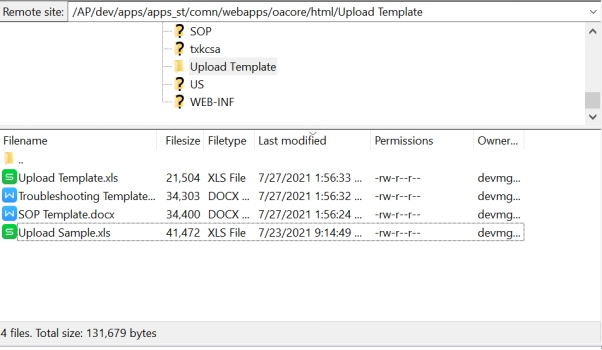
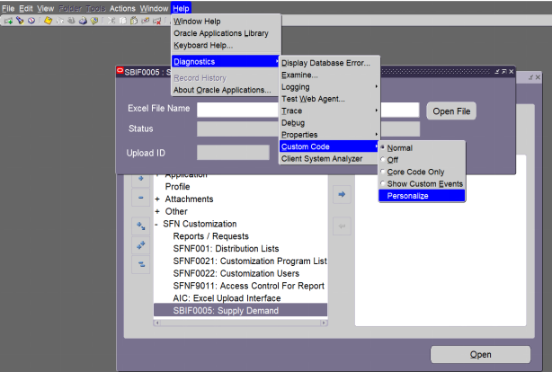
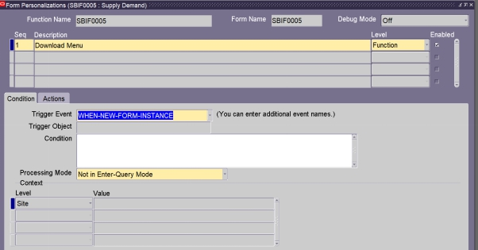
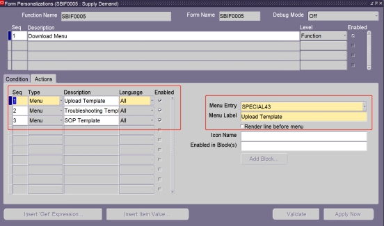
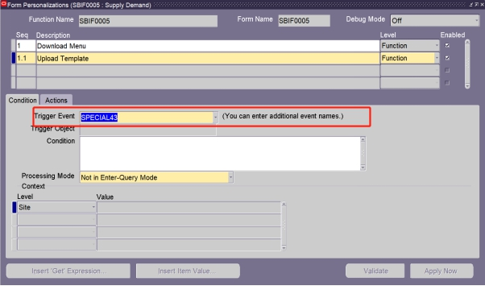
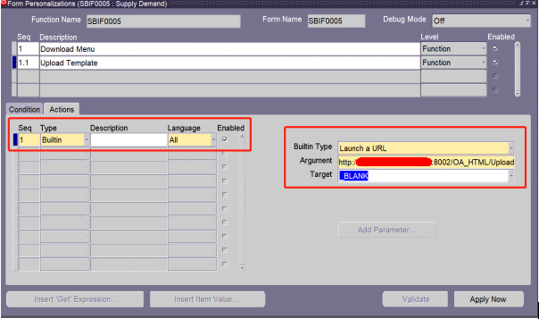
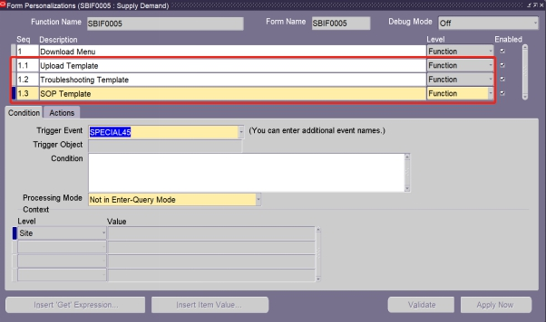
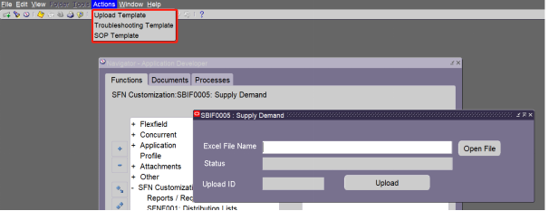
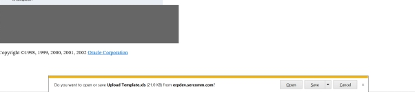
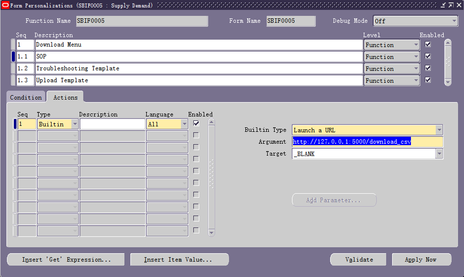

## General Description

New application of menu to download files in a form using Form Personalization. This is useful for users and save MIS maintain time cost because you could add in the Actions menu a list of files you can download. For example, you can add Upload Templates, Troubleshooting file for users, SOP for that specific form, etc.

## Uploading the Files to be Used

First, upload the files to the oracle server. **Path: /AP/dev/apps/apps_st/comn/webapps/oacore/html/**
You can create a new folder in this Path. It is possible to use a name with blank space.
The folder includes SOP, Troubleshooting and Upload Template files.
Remember the Folder and File name path as we will use it later. For this example it is **Upload Template/Upload Sample.xls**

## Setting up the Actions Menu through Form Personalization

Open the Form you want to use. Then navigate the Menu bar **Help>Diagnostics>Custom Code>Personalize**

Create a new WHEN-NEW-FORM-INSTANCE trigger. You can then copy the parameter as below.

For the menu entry you we will use Special43 to Special45. We will setup this Menu Entry later. On the Menu label, type the name you want to show in the Actions menu. Add all the Actions you need and choose a different Special for each menu item. Click Save.

**Special1 - Special15 will display the Entry to Tools Menu**
**Special16 - Special30 will display the Entry to Reports Menu**
**Special31 - Special45 will display the Entry to Action Menu**

Now we can setup each Menu. Choose the Special you chose for each menu and add it to the Trigger Event.

Add a new action and choose Builtin. For the Builtin Type, choose Launch a URL. For the Target type \_BLANK

For the Argument, use the URL http://domain:8002/OA_HTML/FolderName/FileName.
The Folder and File name comes from the path that we uploaded to in the erp server.

Repeat this step for the two other Files. And then finally Save.

## Testing

Open the form again and we can see the Files in the Action Menu.

After clicking the Upload Template, a file download will prompt you to download.

## Extension

I guess in http://domain:8002/OA_HTML/FolderName/FileName OA_HTML maybe a static folder of oracle erp server, you can access file under the folder by browser directly. So you can use other http server that support static file access or file download, such as python flask. This is a sample example. [Python Flask Download File](python-upload-download.md).

