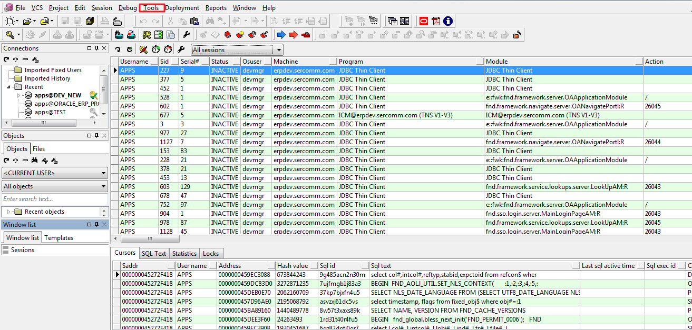
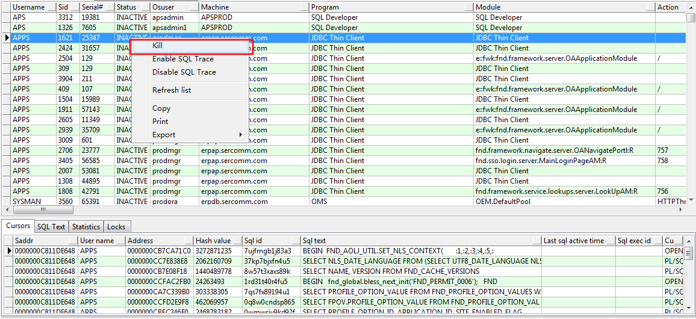

如果數據庫 compile 文件一致等待， form 一直 pending 可能由於其他 session lock 此時就需要 kill session

### 打開 plsql, Tools -> Session



### 找到 lock 的 session 右鍵 kill



### 如果無法 kill session, kill session 對應的進程(progress)

3.1 查找進程 id

```sql
SELECT  p.program, p.spid
FROM v$session s, v$process p
WHERE s.paddr = p.addr
AND s.sid IN (1705)
```

3.2 telnet-login db server

3.3 kill progress

```shell
[prodora@erpdb ~]$ ps -ef | grep 20713
prodora  20713     1  0 Aug06 ?        00:00:00 oraclePROD (LOCAL=NO)
prodora  27756 19554  0 10:57 pts/3    00:00:00 grep 20713

[prodora@erpdb ~]$ kill -9 20713
```

### kill session 也可以使用 sql 語句

```sql
-- 查看鎖住的表
SELECT b.owner,b.object_name,a.session_id,a.locked_mode
FROM v$locked_object a ,dba_objects b
WHERE b.object_id = a.object_id;

-- 查看鎖住的會話
SELECT b.username,b.sid,b.serial#,logon_time
FROM v$locked_object a,v$session b
WHERE a.session_id = b.sid order by b.logon_time;

-- 斷開會話
alter system kill session 'sid,serial#'
```
