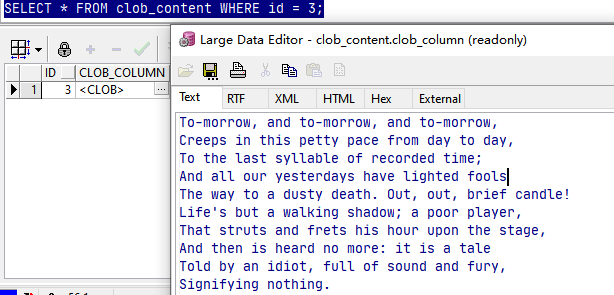
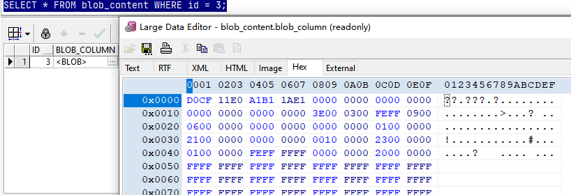

## 大对象类型 LOB

LOB 四种类型：

- **CLOB** 字符 LOB 类型，用于存储字符数据。
- **NCLOB** 国际语言字符集 LOB 类型。
- **BLOB** 二进制 LOB 类型，用于存储二进制数据。
- **BFILE** 二进制 FILE 类型，用于存储指向文件的指针，这些文件可以存储于硬盘、CD、DVD 等。

LOB 组成：

- **LOB 定位器** 一个指针，指定 LOB 数据的位置。
- **LOB 数据** 存储在 LOB 中的实际字符或字节数据。

LOB 比 LONG, LONG RAW 优点：

- LOB 最多可以存储 128TB 的数据，LONG, LONG RAW 最多只能存储 2GB 数据。
- 一个表可以有多个 LOB 列，但只能有一个 LONG 或 LONG RAW 列。
- LOB 数据可以随机访问，LONG 和 LONG RAW 只能顺序访问。

## 创建包含大对象的表

```sql
-- This script does the following:
--   1. Creates lob_user
--   2. Creates the database tables
--   3. Populates the database tables with sample data
--   4. Creates the PL/SQL code

-- attempt to drop the user (this will generate an error
-- if the user does not yet exist; do not worry about this
-- error); this statement is included so that you do not have
-- to manually run the DROP before recreating the schema
DROP USER lob_user CASCADE;

-- attempt to drop the sample files directory (this will
-- generate an error if the directory does not yet exist;
-- do not worry about this error);
-- this statement is included so that you do not have
-- to manually run the DROP before recreating the schema
DROP DIRECTORY SAMPLE_FILES_DIR;

-- create lob_user
CREATE USER lob_user IDENTIFIED BY lob_password;

-- create the BFILE directory
CREATE DIRECTORY SAMPLE_FILES_DIR AS 'C:\sample_files';

-- grant read and write permissions on the BFILE directory
GRANT read, write ON DIRECTORY SAMPLE_FILES_DIR TO lob_user;

-- allow the user to connect, create database objects and
-- create directory objects (for the BFILEs)
GRANT connect, resource TO lob_user;

-- give lob_user a quota of 10M on the users tablespace
ALTER USER lob_user QUOTA 10M ON users;

-- connect as lob_user
CONNECT lob_user/lob_password;

-- create the tables
CREATE TABLE clob_content (
  id          INTEGER PRIMARY KEY,
  clob_column CLOB NOT NULL
);

CREATE TABLE blob_content (
  id          INTEGER PRIMARY KEY,
  blob_column BLOB NOT NULL
);

CREATE TABLE bfile_content (
  id           INTEGER PRIMARY KEY,
  bfile_column BFILE NOT NULL
);

CREATE TABLE long_content (
  id          INTEGER PRIMARY KEY,
  long_column LONG NOT NULL
);

CREATE TABLE long_raw_content (
  id              INTEGER PRIMARY KEY,
  long_raw_column LONG RAW NOT NULL
);

-- populate tables with sample data
INSERT INTO clob_content (
  id, clob_column
) VALUES (
  1, TO_CLOB('Creeps in this petty pace')
);

INSERT INTO clob_content (
  id, clob_column
) VALUES (
  2, TO_CLOB(' from day to day')
);

INSERT INTO blob_content (
  id, blob_column
) VALUES (
  1, TO_BLOB('100111010101011111')
);

INSERT INTO blob_content (
  id, blob_column
) VALUES (
  2, TO_BLOB('A0FFB71CF90DE')
);

INSERT INTO bfile_content (
  id, bfile_column
) VALUES (
  1, BFILENAME('SAMPLE_FILES_DIR', 'textContent.txt')
);

INSERT INTO bfile_content (
  id, bfile_column
) VALUES (
  2, BFILENAME('SAMPLE_FILES_DIR', 'binaryContent.doc')
);

INSERT INTO long_content (
  id, long_column
) VALUES (
  1, 'Creeps in this petty pace'
);

INSERT INTO long_content (
  id, long_column
) VALUES (
  2, ' from day to day'
);

INSERT INTO long_raw_content (
  id, long_raw_column
) VALUES (
  1, '100111010101011111'
);

INSERT INTO long_raw_content (
  id, long_raw_column
) VALUES (
  2, 'A0FFB71CF90DE'
);

COMMIT;
```

textContent.txt 和 binaryContent.doc 文件内容

```
To-morrow, and to-morrow, and to-morrow,
Creeps in this petty pace from day to day,
To the last syllable of recorded time;
And all our yesterdays have lighted fools
The way to a dusty death. Out, out, brief candle!
Life's but a walking shadow; a poor player,
That struts and frets his hour upon the stage,
And then is heard no more: it is a tale
Told by an idiot, full of sound and fury,
Signifying nothing.
```

## 检索 LOB 定位器

```sql
-- create the PL/SQL code
CREATE PROCEDURE get_clob_locator(
  p_clob IN OUT CLOB,
  p_id   IN INTEGER
) AS
BEGIN
  -- get the LOB locator and store it in p_clob
  SELECT clob_column
  INTO p_clob
  FROM clob_content
  WHERE id = p_id;
END get_clob_locator;
/

CREATE PROCEDURE get_blob_locator(
  p_blob IN OUT BLOB,
  p_id   IN INTEGER
) AS
BEGIN
  -- get the LOB locator and store it in p_blob
  SELECT blob_column
  INTO p_blob
  FROM blob_content
  WHERE id = p_id;
END get_blob_locator;
/
```

## 从 CLOB 和 BLOB 读取数据

READ 方法用于将 LOB 数据读取到缓存区，各个版本的语法如下：

```sql
 PROCEDURE read(lob_loc IN            BLOB,
                amount  IN OUT NOCOPY INTEGER,
                offset  IN            INTEGER,
                buffer  OUT           RAW);

  PROCEDURE read(lob_loc IN            CLOB     CHARACTER SET ANY_CS,
                 amount  IN OUT NOCOPY INTEGER,
                 offset  IN            INTEGER,
                 buffer  OUT           VARCHAR2 CHARACTER SET lob_loc%CHARSET);


 PROCEDURE read(file_loc IN             BFILE,
                amount   IN OUT NOCOPY  INTEGER,
                offset   IN             INTEGER,
                buffer   OUT            RAW);
```

其中：

- lob_loc 是要读取的 CLOB、NCLOB 或 BLOB 数据。
- file_loc 是要读取的 BFILE 数据。
- amount 是要从 CLOB/NCLOB 数据中读取的最大字符数目，或是要从 BLOB/BFILE 数据中读取的最大字节数目。
- offset 是开始读取的偏移量(偏移量从 1 开始计算).
- buffer 是 OUT 变量，用于存储从 LOB 对象中读取的数据。

READ() 方法抛出的异常

| 异常           | 抛出条件                                                     |
| -------------- | ------------------------------------------------------------ |
| VALUE_ERROR    | 任何一个输入参数为空值                                       |
| INVALID_ARGVAL | 只要满足如下条件之一：<br />- amount < 1<br />- amount > MAXBUFFERSIZE<br />- offset < 1<br />- offset > LOBMAXSIZE |
| NO_DATA_FOUND  | 到达 LOB 的末尾，LOB 中再无字节或字符可读取                  |

```SQL

CREATE PROCEDURE read_clob_example(
  p_id IN INTEGER
) AS
  v_clob CLOB;
  v_offset INTEGER := 1;
  v_amount INTEGER := 50;
  v_char_buffer VARCHAR2(50);
BEGIN
  -- get the LOB locator and store it in v_clob
  get_clob_locator(v_clob, p_id);

  -- read the contents of v_clob into v_char_buffer, starting at
  -- the v_offset position and read a total of v_amount characters
  DBMS_LOB.READ(v_clob, v_amount, v_offset, v_char_buffer);

  -- display the contents of v_char_buffer
  DBMS_OUTPUT.PUT_LINE('v_char_buffer = ' || v_char_buffer);
  DBMS_OUTPUT.PUT_LINE('v_amount = ' || v_amount);
END read_clob_example;
/

CALL read_clob_example(1);
-- Result
-- v_char_buffer = Creeps in this petty pace
-- v_amount = 25

CREATE PROCEDURE read_blob_example(
  p_id IN INTEGER
) AS
  v_blob BLOB;
  v_offset INTEGER := 1;
  v_amount INTEGER := 25;
  v_binary_buffer RAW(25);
BEGIN
  -- get the LOB locator and store it in v_blob
  get_blob_locator(v_blob, p_id);

  -- read the contents of v_blob into v_binary_buffer, starting at
  -- the v_offset position and read a total of v_amount bytes
  DBMS_LOB.READ(v_blob, v_amount, v_offset, v_binary_buffer);

  -- display the contents of v_binary_buffer
  DBMS_OUTPUT.PUT_LINE('v_binary_buffer = ' || v_binary_buffer);
  DBMS_OUTPUT.PUT_LINE('v_amount = ' || v_amount);
END read_blob_example;
/

CALL read_blob_example(1);
-- Result
-- v_binary_buffer = 100111010101011111
-- v_amount = 9
```

## 向 CLOB 写数据

此过程中的 SELECT 语句使用了 FOR UPDATE 子句， 因为要使用 WRITE() 函数向 CLOB 写入数据。

```SQL
CREATE PROCEDURE write_example(
  p_id IN INTEGER
) AS
  v_clob CLOB;
  v_offset INTEGER := 7;
  v_amount INTEGER := 6;
  v_char_buffer VARCHAR2(10) := 'pretty';
BEGIN
  -- get the LOB locator into v_clob for update (for update
  -- because the LOB is written to using WRITE() later)
  SELECT clob_column
  INTO v_clob
  FROM clob_content
  WHERE id = p_id
  FOR UPDATE;

  -- read and display the contents of the CLOB
  read_clob_example(p_id);

  -- write the characters in v_char_buffer to v_clob, starting 
  -- at the v_offset position and write a total of v_amount characters
  DBMS_LOB.WRITE(v_clob, v_amount, v_offset, v_char_buffer);

  -- read and display the contents of the CLOB
  -- and then rollback the write
  read_clob_example(p_id);
  ROLLBACK;
END write_example;
/

CALL write_example(1);

-- Result
-- v_char_buffer = Creeps in this petty pace
-- v_amount = 25
-- v_char_buffer = Creepsprettyis petty pace
-- v_amount = 25
```

## 向 CLOB 追加数据

```sql
CREATE PROCEDURE append_example AS
  v_src_clob CLOB;
  v_dest_clob CLOB;
BEGIN
  -- get the LOB locator for the CLOB in row #2 of
  -- the clob_content table into v_src_clob
  get_clob_locator(v_src_clob, 2);

  -- get the LOB locator for the CLOB in row #1 of
  -- the clob_content table into v_dest_clob for update
  -- (for update because the CLOB will be added to using
  -- APPEND() later)
  SELECT clob_column
  INTO v_dest_clob
  FROM clob_content
  WHERE id = 1
  FOR UPDATE;

  -- read and display the contents of CLOB #1
  read_clob_example(1);

  -- use APPEND() to copy the contents of v_src_clob to v_dest_clob
  DBMS_LOB.APPEND(v_dest_clob, v_src_clob);

  -- read and display the contents of CLOB #1
  -- and then rollback the change
  read_clob_example(1);
  ROLLBACK;
END append_example;
/

CALL append_example(1);

-- Result
-- v_char_buffer = Creeps in this petty pace
-- v_amount = 25
-- v_char_buffer = Creeps in this petty pace from day to day
-- v_amount = 41
```

## 比较两个 COB 中的数据

```sql
CREATE PROCEDURE compare_example AS
  v_clob1 CLOB;
  v_clob2 CLOB;
  v_return INTEGER;
BEGIN
  -- get the LOB locators
  get_clob_locator(v_clob1, 1);
  get_clob_locator(v_clob2, 2);

  -- compare v_clob1 with v_clob2 (COMPARE() returns 1
  -- because the contents of v_clob1 and v_clob2 are different)
  DBMS_OUTPUT.PUT_LINE('Comparing v_clob1 with v_clob2');
  v_return := DBMS_LOB.COMPARE(v_clob1, v_clob2);
  DBMS_OUTPUT.PUT_LINE('v_return = ' || v_return);

  -- compare v_clob1 with v_clob1 (COMPARE() returns 0
  -- because the contents are the same)
  DBMS_OUTPUT.PUT_LINE('Comparing v_clob1 with v_clob1');
  v_return := DBMS_LOB.COMPARE(v_clob1, v_clob1);
  DBMS_OUTPUT.PUT_LINE('v_return = ' || v_return);
END compare_example;
/

CALL compare_example();

-- Result
-- Comparing v_clob1 with v_clob2
-- v_return = 1
-- Comparing v_clob1 with v_clob1
-- v_return = 0
```

## 将数据从一个 CLOB 复制到另一个 CLOB

```sql
CREATE PROCEDURE copy_example AS
  v_src_clob CLOB;
  v_dest_clob CLOB;
  v_src_offset INTEGER := 1;
  v_dest_offset INTEGER := 7;
  v_amount INTEGER := 5;
BEGIN
  -- get the LOB locator for the CLOB in row #2 of
  -- the clob_content table into v_dest_clob
  get_clob_locator(v_src_clob, 2);

  -- get the LOB locator for the CLOB in row #1 of
  -- the clob_content table into v_dest_clob for update
  -- (for update because the CLOB will be added to using
  -- COPY() later)
  SELECT clob_column
  INTO v_dest_clob
  FROM clob_content
  WHERE id = 1
  FOR UPDATE;

  -- read and display the contents of CLOB #1
  read_clob_example(1);

  -- copy characters to v_dest_clob from v_src_clob using COPY(),
  -- starting at the offsets specified by v_dest_offset and
  -- v_src_offset for a total of v_amount characters
  DBMS_LOB.COPY(
    v_dest_clob, v_src_clob,
    v_amount, v_dest_offset, v_src_offset
  );

  -- read and display the contents of CLOB #1
  -- and then rollback the change
  read_clob_example(1);
  ROLLBACK;
END copy_example;
/

CALL copy_example();

-- Result
-- v_char_buffer =  from day to day
-- v_amount = 16
-- v_char_buffer = Creeps in this petty pace
-- v_amount = 25
-- v_char_buffer = Creep from his petty pace
-- v_amount = 25

```

## 使用临时 CLOB

```SQL
CREATE PROCEDURE temporary_lob_example AS
  v_clob CLOB;
  v_amount INTEGER;
  v_offset INTEGER := 1;
  v_char_buffer VARCHAR2(17) := 'Juliet is the sun';
BEGIN
  -- use CREATETEMPORARY() to create a temporary CLOB named v_clob
  DBMS_LOB.CREATETEMPORARY(v_clob, TRUE);

  -- use WRITE() to write the contents of v_char_buffer to v_clob
  v_amount := LENGTH(v_char_buffer);
  DBMS_LOB.WRITE(v_clob, v_amount, v_offset, v_char_buffer);

  -- use ISTEMPORARY() to check if v_clob is temporary
  IF (DBMS_LOB.ISTEMPORARY(v_clob) = 1) THEN
    DBMS_OUTPUT.PUT_LINE('v_clob is temporary');
  END IF;

  -- use READ() to read the contents of v_clob into v_char_buffer
  DBMS_LOB.READ(
    v_clob, v_amount, v_offset, v_char_buffer
  );
  DBMS_OUTPUT.PUT_LINE('v_char_buffer = ' || v_char_buffer);

  -- use FREETEMPORARY() to free v_clob
  DBMS_LOB.FREETEMPORARY(v_clob);
END temporary_lob_example;
/

CALL temporary_lob_example();

-- Result
-- v_clob is temporary
-- v_char_buffer = Juliet is the sun
```

## 删除 CLOB 中的数据

```sql
CREATE PROCEDURE erase_example AS
  v_clob CLOB;
  v_offset INTEGER := 2;
  v_amount INTEGER := 5;
BEGIN
  -- get the LOB locator for the CLOB in row #1 of
  -- the clob_content table into v_dest_clob for update
  -- (for update because the CLOB will be erased using
  -- ERASE() later)
  SELECT clob_column
  INTO v_clob
  FROM clob_content
  WHERE id = 1
  FOR UPDATE;

  -- read and display the contents of CLOB #1
  read_clob_example(1);

  -- use ERASE() to erase a total of v_amount characters
  -- from v_clob, starting at v_offset
  DBMS_LOB.ERASE(v_clob, v_amount, v_offset);

  -- read and display the contents of CLOB #1
  -- and then rollback the change
  read_clob_example(1);
  ROLLBACK;
END erase_example;
/

CALL erase_example();

-- Result
-- v_char_buffer = Creeps in this petty pace
-- v_amount = 25
-- v_char_buffer = C      in this petty pace
-- v_amount = 25
```

## 搜索 CLOB 中的数据

```sql
CREATE PROCEDURE instr_example AS
  v_clob CLOB;
  v_char_buffer VARCHAR2(50) := 'It is the east and Juliet is the sun';
  v_pattern VARCHAR2(5);
  v_offset INTEGER := 1;
  v_amount INTEGER;
  v_occurrence INTEGER;
  v_return INTEGER;
BEGIN
  -- use CREATETEMPORARY() to create a temporary CLOB named v_clob
  DBMS_LOB.CREATETEMPORARY(v_clob, TRUE);

  -- use WRITE() to write the contents of v_char_buffer to v_clob
  v_amount := LENGTH(v_char_buffer);
  DBMS_LOB.WRITE(v_clob, v_amount, v_offset, v_char_buffer);

  -- use READ() to read the contents of v_clob into v_char_buffer
  DBMS_LOB.READ(v_clob, v_amount, v_offset, v_char_buffer);
  DBMS_OUTPUT.PUT_LINE('v_char_buffer = ' || v_char_buffer);

  -- use INSTR() to search v_clob for the second occurrence of is,
  -- and INSTR() returns 29
  DBMS_OUTPUT.PUT_LINE('Searching for second ''is''');
  v_pattern := 'is';
  v_occurrence := 2;
  v_return := DBMS_LOB.INSTR(v_clob, v_pattern, v_offset, v_occurrence);
  DBMS_OUTPUT.PUT_LINE('v_return = ' || v_return);

  -- use INSTR() to search v_clob for the first occurrence of Moon,
  -- and INSTR() returns 0 because Moon doesn抰 appear in v_clob
  DBMS_OUTPUT.PUT_LINE('Searching for ''Moon''');
  v_pattern := 'Moon';
  v_occurrence := 1;
  v_return := DBMS_LOB.INSTR(v_clob, v_pattern, v_offset, v_occurrence);
  DBMS_OUTPUT.PUT_LINE('v_return = ' || v_return);

  -- use FREETEMPORARY() to free v_clob
  DBMS_LOB.FREETEMPORARY(v_clob);
END instr_example;
/

CALL instr_example();

-- Result
-- v_char_buffer = It is the east and Juliet is the sun
-- Searching for second 'is'
-- v_return = 27
-- Searching for 'Moon'
-- v_return = 0
```

## 将数据从文件复制到 CLOB 和 BLOB 中

```sql
CREATE PROCEDURE copy_file_data_to_clob(
  p_clob_id INTEGER,
  p_directory VARCHAR2,
  p_file_name VARCHAR2
) AS
  v_file UTL_FILE.FILE_TYPE;
  v_chars_read INTEGER;
  v_dest_clob CLOB;
  v_amount INTEGER := 32767;
  v_char_buffer VARCHAR2(32767);
BEGIN
  -- insert an empty CLOB
  INSERT INTO clob_content(
    id, clob_column
  ) VALUES (
    p_clob_id, EMPTY_CLOB()
  );

  -- get the LOB locator of the CLOB
  SELECT clob_column
  INTO v_dest_clob
  FROM clob_content
  WHERE id = p_clob_id
  FOR UPDATE;

  -- open the file for reading of text (up to v_amount characters per line)
  v_file := UTL_FILE.FOPEN(p_directory, p_file_name, 'r', v_amount);

  -- copy the data from the file into v_dest_clob one line at a time
  LOOP
    BEGIN
      -- read a line from the file into v_char_buffer;
      -- GET_LINE() does not copy the newline character into
      -- v_char_buffer
      UTL_FILE.GET_LINE(v_file, v_char_buffer);
      v_chars_read := LENGTH(v_char_buffer);

      -- append the line to v_dest_clob
      DBMS_LOB.WRITEAPPEND(v_dest_clob, v_chars_read, v_char_buffer);

      -- append a newline to v_dest_clob because v_char_buffer;
      -- the ASCII value for newline is 10, so CHR(10) returns newline
      DBMS_LOB.WRITEAPPEND(v_dest_clob, 1, CHR(10));
    EXCEPTION
      -- when there is no more data in the file then exit
      WHEN NO_DATA_FOUND THEN
        EXIT;
    END;
  END LOOP;

  -- close the file
  UTL_FILE.FCLOSE(v_file);

  DBMS_OUTPUT.PUT_LINE('Copy successfully completed.');
END copy_file_data_to_clob;
/

CALL copy_file_data_to_clob(3, 'SAMPLE_FILES_DIR', 'textContent.txt');

-- Result
-- Copy successfully completed.
```



```sql
CREATE PROCEDURE copy_file_data_to_blob(
  p_blob_id INTEGER,
  p_directory VARCHAR2,
  p_file_name VARCHAR2
) AS
  v_file UTL_FILE.FILE_TYPE;
  v_bytes_read INTEGER;
  v_dest_blob BLOB;
  v_amount INTEGER := 32767;
  v_binary_buffer RAW(32767);
BEGIN
  -- insert an empty BLOB
  INSERT INTO blob_content(
    id, blob_column
  ) VALUES (
    p_blob_id, EMPTY_BLOB()
  );

  -- get the LOB locator of the BLOB
  SELECT blob_column
  INTO v_dest_blob
  FROM blob_content
  WHERE id = p_blob_id
  FOR UPDATE;

  -- open the file for reading of bytes (up to v_amount bytes at a time)
  v_file := UTL_FILE.FOPEN(p_directory, p_file_name, 'rb', v_amount);

  -- copy the data from the file into v_dest_blob
  LOOP
    BEGIN
      -- read binary data from the file into v_binary_buffer
      UTL_FILE.GET_RAW(v_file, v_binary_buffer, v_amount);
      v_bytes_read := LENGTH(v_binary_buffer);

      -- append v_binary_buffer to v_dest_blob
      DBMS_LOB.WRITEAPPEND(v_dest_blob, v_bytes_read/2,
        v_binary_buffer);
    EXCEPTION
      -- when there is no more data in the file then exit
      WHEN NO_DATA_FOUND THEN
        EXIT;
    END;
  END LOOP;

  -- close the file
  UTL_FILE.FCLOSE(v_file);

  DBMS_OUTPUT.PUT_LINE('Copy successfully completed.');
END copy_file_data_to_blob;
/

CALL copy_file_data_to_blob(3, 'SAMPLE_FILES_DIR', 'binaryContent.doc');

-- Result
-- Copy successfully completed.
```



## 将数据从 CLOB 和 BLOB 复制到文件

```sql
CREATE PROCEDURE copy_clob_data_to_file(
  p_clob_id INTEGER,
  p_directory VARCHAR2,
  p_file_name VARCHAR2
) AS
  v_src_clob CLOB;
  v_file UTL_FILE.FILE_TYPE;
  v_offset INTEGER := 1;
  v_amount INTEGER := 32767;
  v_char_buffer VARCHAR2(32767);
BEGIN
  -- get the LOB locator of the CLOB
  SELECT clob_column
  INTO v_src_clob
  FROM clob_content
  WHERE id = p_clob_id;

  -- open the file for writing of text (up to v_amount characters at a time)
  v_file := UTL_FILE.FOPEN(p_directory, p_file_name, 'w', v_amount);

  -- copy the data from v_src_clob to the file
  LOOP
    BEGIN
      -- read characters from v_src_clob into v_char_buffer
      DBMS_LOB.READ(v_src_clob, v_amount, v_offset, v_char_buffer);

      -- copy the characters from v_char_buffer to the file
      UTL_FILE.PUT(v_file, v_char_buffer);

      -- add v_amount to v_offset
      v_offset := v_offset + v_amount;
    EXCEPTION
      -- when there is no more data in the file then exit
      WHEN NO_DATA_FOUND THEN
        EXIT;
    END;
  END LOOP;

  -- flush any remaining data to the file
  UTL_FILE.FFLUSH(v_file);

  -- close the file
  UTL_FILE.FCLOSE(v_file);

  DBMS_OUTPUT.PUT_LINE('Copy successfully completed.');
END copy_clob_data_to_file;
/

CALL copy_clob_data_to_file(3, 'SAMPLE_FILES_DIR', 'textContent2.txt');

-- Result
-- Copy successfully completed.

CREATE PROCEDURE copy_blob_data_to_file(
  p_blob_id INTEGER,
  p_directory VARCHAR2,
  p_file_name VARCHAR2
) AS
  v_src_blob BLOB;
  v_file UTL_FILE.FILE_TYPE;
  v_offset INTEGER := 1;
  v_amount INTEGER := 32767;
  v_binary_buffer RAW(32767);
BEGIN
  -- get the LOB locator of the BLOB
  SELECT blob_column
  INTO v_src_blob
  FROM blob_content
  WHERE id = p_blob_id;

  -- open the file for writing of bytes (up to v_amount bytes at a time)
  v_file := UTL_FILE.FOPEN(p_directory, p_file_name, 'wb', v_amount);

  -- copy the data from v_src_blob to the file
  LOOP
    BEGIN
      -- read characters from v_src_blob into v_binary_buffer
      DBMS_LOB.READ(v_src_blob, v_amount, v_offset, v_binary_buffer);

      -- copy the binary data from v_binary_buffer to the file
      UTL_FILE.PUT_RAW(v_file, v_binary_buffer);

      -- add v_amount to v_offset
      v_offset := v_offset + v_amount;
    EXCEPTION
      -- when there is no more data in the file then exit
      WHEN NO_DATA_FOUND THEN
        EXIT;
    END;
  END LOOP;

  -- flush any remaining data to the file
  UTL_FILE.FFLUSH(v_file);

  -- close the file
  UTL_FILE.FCLOSE(v_file);

  DBMS_OUTPUT.PUT_LINE('Copy successfully completed.');
END copy_blob_data_to_file;
/

CALL copy_file_data_to_blob(3, 'SAMPLE_FILES_DIR', 'binaryContent2.doc');

-- Result
-- Copy successfully completed.
```

## 将数据从 BFILE 复制到 CLOB 和 BLOB 中

```sql
CREATE PROCEDURE copy_bfile_data_to_clob(
  p_bfile_id INTEGER,
  p_clob_id INTEGER
) AS
  v_src_bfile BFILE;
  v_directory VARCHAR2(200);
  v_filename VARCHAR2(200);
  v_length INTEGER;
  v_dest_clob CLOB;
  v_amount INTEGER := DBMS_LOB.LOBMAXSIZE;
  v_dest_offset INTEGER := 1;
  v_src_offset INTEGER := 1;
  v_src_csid INTEGER := DBMS_LOB.DEFAULT_CSID;
  v_lang_context INTEGER := DBMS_LOB.DEFAULT_LANG_CTX;
  v_warning INTEGER;
BEGIN
  -- get the locator of the BFILE
  SELECT bfile_column
  INTO v_src_bfile
  FROM bfile_content
  WHERE id = p_bfile_id;

  -- use FILEEXISTS() to check if the file exists
  -- (FILEEXISTS() returns 1 if the file exists)
  IF (DBMS_LOB.FILEEXISTS(v_src_bfile) = 1) THEN
    -- use OPEN() to open the file
    DBMS_LOB.OPEN(v_src_bfile);

    -- use FILEGETNAME() to get the name of the file and the directory
    DBMS_LOB.FILEGETNAME(v_src_bfile, v_directory, v_filename);
    DBMS_OUTPUT.PUT_LINE('Directory = ' || v_directory);
    DBMS_OUTPUT.PUT_LINE('Filename = ' || v_filename);

    -- insert an empty CLOB
    INSERT INTO clob_content(
      id, clob_column
    ) VALUES (
      p_clob_id, EMPTY_CLOB()
    );

    -- get the LOB locator of the CLOB (for update)
    SELECT clob_column
    INTO v_dest_clob
    FROM clob_content
    WHERE id = p_clob_id
    FOR UPDATE;

    -- use LOADCLOBFROMFILE() to get up to v_amount characters
    -- from v_src_bfile and store them in v_dest_clob, starting
    -- at offset 1 in v_src_bfile and v_dest_clob
    DBMS_LOB.LOADCLOBFROMFILE(
      v_dest_clob, v_src_bfile,
      v_amount, v_dest_offset, v_src_offset,
      v_src_csid, v_lang_context, v_warning
    );

    -- check v_warning for an inconvertible character
    IF (v_warning = DBMS_LOB.WARN_INCONVERTIBLE_CHAR) THEN
      DBMS_OUTPUT.PUT_LINE('Warning! Inconvertible character.');
    END IF;

    -- use CLOSE() to close v_src_bfile
    DBMS_LOB.CLOSE(v_src_bfile);
    DBMS_OUTPUT.PUT_LINE('Copy successfully completed.');
  ELSE
    DBMS_OUTPUT.PUT_LINE('File does not exist');
  END IF;
END copy_bfile_data_to_clob;
/

CALL copy_bfile_data_to_clob(1, 4);

-- Result
-- Copy successfully completed.

CREATE PROCEDURE copy_bfile_data_to_blob(
  p_bfile_id INTEGER,
  p_blob_id INTEGER
) AS
  v_src_bfile BFILE;
  v_directory VARCHAR2(200);
  v_filename VARCHAR2(200);
  v_length INTEGER;
  v_dest_blob BLOB;
  v_amount INTEGER := DBMS_LOB.LOBMAXSIZE;
  v_dest_offset INTEGER := 1;
  v_src_offset INTEGER := 1;
BEGIN
  -- get the locator of the BFILE
  SELECT bfile_column
  INTO v_src_bfile
  FROM bfile_content
  WHERE id = p_bfile_id;

  -- use FILEEXISTS() to check if the file exists
  -- (FILEEXISTS() returns 1 if the file exists)
  IF (DBMS_LOB.FILEEXISTS(v_src_bfile) = 1) THEN
    -- use OPEN() to open the file
    DBMS_LOB.OPEN(v_src_bfile);

    -- use FILEGETNAME() to get the name of the file and
    -- the directory
    DBMS_LOB.FILEGETNAME(v_src_bfile, v_directory, v_filename);
    DBMS_OUTPUT.PUT_LINE('Directory = ' || v_directory);
    DBMS_OUTPUT.PUT_LINE('Filename = ' || v_filename);

    -- insert an empty BLOB
    INSERT INTO blob_content(
      id, blob_column
    ) VALUES (
      p_blob_id, EMPTY_BLOB()
    );

    -- get the LOB locator of the BLOB (for update)
    SELECT blob_column
    INTO v_dest_blob
    FROM blob_content
    WHERE id = p_blob_id
    FOR UPDATE;

    -- use LOADBLOBFROMFILE() to get up to v_amount bytes
    -- from v_src_bfile and store them in v_dest_blob, starting
    -- at offset 1 in v_src_bfile and v_dest_blob
    DBMS_LOB.LOADBLOBFROMFILE(
      v_dest_blob, v_src_bfile,
      v_amount, v_dest_offset, v_src_offset
    );

    -- use CLOSE() to close v_src_bfile
    DBMS_LOB.CLOSE(v_src_bfile);
    DBMS_OUTPUT.PUT_LINE('Copy successfully completed.');
  ELSE
    DBMS_OUTPUT.PUT_LINE('File does not exist');
  END IF;
END copy_bfile_data_to_blob;
/
```


