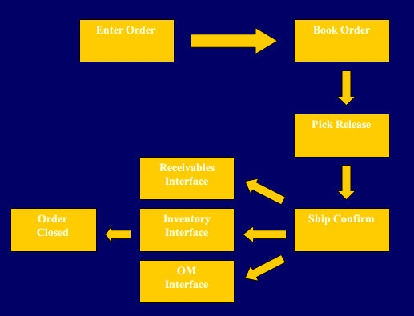
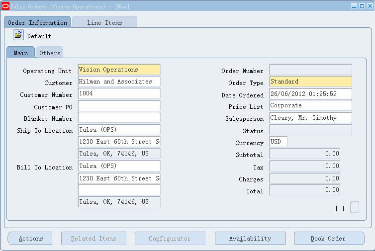
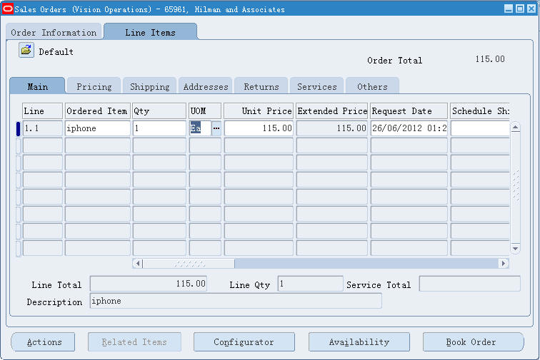
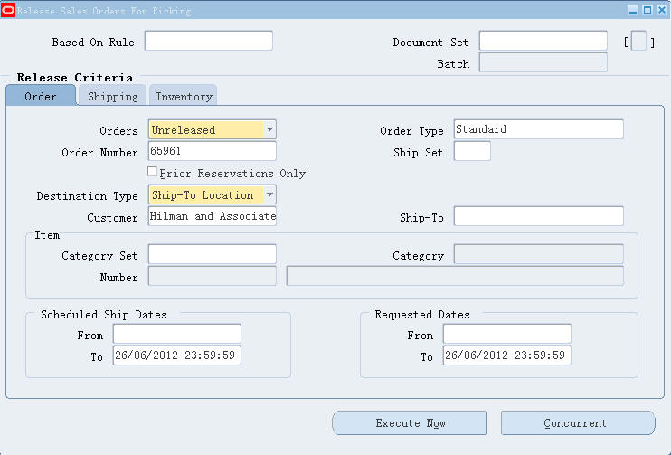
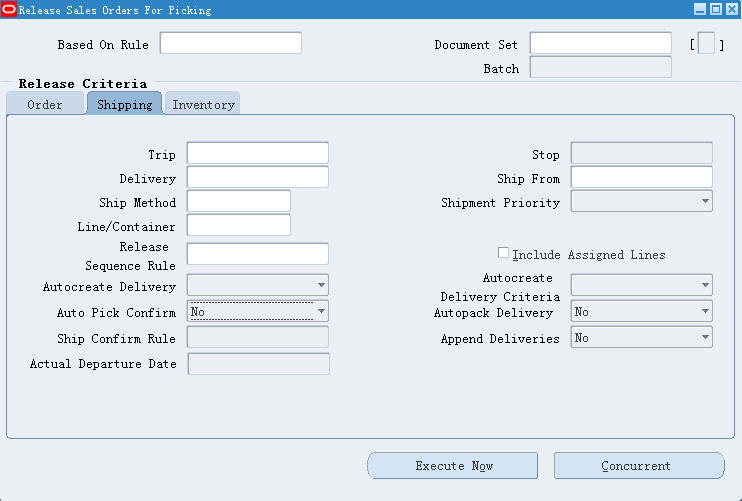
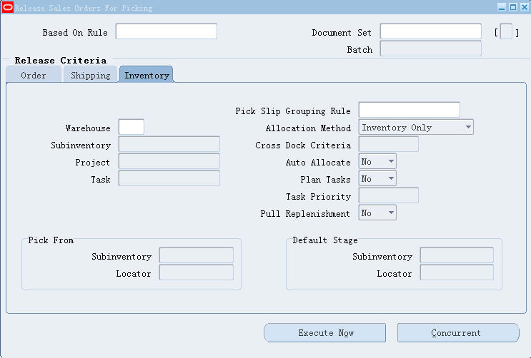

## 基本流程

## 创建订单

路径：Order Management > Orders, Returns > Sales Orders

填写订单头信息，客户，订单类型，销售人员

填写订单体信息，输入物料，数量...

然后 Book Order，订单 Book 之后，你会发现订单头的 Status 的状态变成了`"Booked"`，订单行的状态为 `"Awaiting Shipping"`，记录下来你的订单号，后边的每一步都需要这个订单号。

状态：订单 Book 之后，这个时候发运单也就产生了，如果你去 Shipping Transactions Form, 查找订单，你就会发现发运单的 `Line Status 为 Ready to Release，Next Step 为 Pick Release`

## Pick Release

路径：Order Management > Shipping > Release Sales Orders > Release Sales Orders

Pick Release 俗称挑库（即从仓库中挑选货物），在 Order Number 中输入待挑库的订单号

Auto Pick Confirm 设置为 No

Auto Allocate 设置为 N

Auto Allocate 和 Auto Pick Confirm 都可以设置为 Yes，只不过为了讲的更加详细，这里都设置为 No，设置为 Yes 的话，那么后边的 Allocate 和 Pick Confirm 两步，系统就会自动帮你完成。

这里有两个按钮来执行 Pick Release，”Concurrent“是把 Pick Release 的任务发给 Concurrent Request 来执行，"Execute Now"是系统再前段执行 Pick Release，直到执行结束才把控制权返还给 User，这里我们点击 Concurrent 按钮。

Pick Release 后台做了什么事情？Pick Release 会创建一个 Pick Wave 类型 Move Order，`这个Move Order就是用来把库存中的货物搬到一个临时发货区(Staging)`,如果打开 INV 日志就能看到系统是调用 INV_MOVE_ORDER_PUB.CREATE_MOVE_ORDER_HEADER 来创建 Move Order 的。(对于 Pick Release 的后台流程可以参见我的总结：[Pick Release Process](http://vdisk.weibo.com/s/7D5rq))

另外需要提到的是，在 Pick Release 之后，系统会针对你的订单生成一条 Reservation（预留），这个时候的预留称为 Soft Reservations,因为还没有明确从哪个库出货，所以会在 Org 级别创建物料的保留。

状态：这个时候，`Shipping Transaction的Line Status为"Released to Warehouse",Next Step为"Transact Move Order"；订单头的状态仍为Booked,行状态仍为”Awaiting Shipping“。`

### Pick Confirm

路径：Inventory > Move Orders > Transact Move Orders

Pick Confirm（挑库确认）的动作实际上是在 Transact Move Order 中完成的，先 Allocate 挑选货物，再 Transact Move Order.

查询页面，Pick Wave 那个 Tab，输入订单号

进入 TMO 主界面后，点击 Allocate，Allocate 会根据你系统默认的 Picking Rule 来挑选货物，然后给你一个 Suggestion 的挑库项，Suggestion 记录会保存在 MTL_MATERIAL_TRANSACTIONS_TEMP 表（即 Pending Transactions）。

另外完成 Allocate 之后，你会看到界面 Allocation 项会出现 Single,Multiple 或者 None 的标识，Single 表示，系统给你了产生了一条 Suggestion 的 Transaction 记录，Multiple 表示产生了多条；None 表示没有产生 Suggestion 记录（很可能是因为你系统中库存数量不足）

接下来一步就是去 Transact 这个 Move Order

按 Transact 之后，Inventory Transaction Manager 会处理 Suggestion Transactions（MMTT），然后物料转移的动作就真实发生了,`物料就从正式Subinventory到临时存货区(Staging)`。这个 Transction 可以从 Material Transaction 的 Form 中查询到。

另外对于 Reservation 来说，在 Transact 之后，因为库存明确了，Reservation 就会变得更加明确，是对哪个 Sub，locator 做保留。

状态：这个时候，Shipping Transaction 的 Line Status 为"Staged/Pick Confirmed",Next Step 为"Ship Confirm/Close Trip Stop"；订单头的状态仍为 Booked,行状态变为了”Picked“。

## Ship Confirm Deliveries

路径：Order Management > Shipping > Transactions

切换到 Delivery 页签，准备 Ship Confirm(发货确认)，如果你在 Pick Release 的时候，没有选择 Autocreate Delivery，那么系统会检查 Define Shipping Parameters 里边这两个的设置，如果 shipping parameters 里边也没有选择，那么你需要手工的在 Ship Confirm 的时候选择 Action->Auto-create Deliveries.

Delivery 信息实际上包含你要投递货物到哪里，使用哪家物流公司....

Delivery 页签，点击 Ship Confirm 按钮后，会弹出一个窗口，"Defer Interface"如果被勾上，说明你要手动的运行 Interface Trip Stop SRS，我们勾上 Defer Interface，点 OK。

Delivery was successfully confirmed!!!

Ship Confirm 这个动作会插入一条记录到 MTL_TRANSACTIONS_INTERFACE 表中，这个 MTI 记录的类型为 Sales Order Issue，这条记录会被接下来的 Interface Trip Stop 来处理，最终从 MTI 转到 MMT 表中。

状态：这个时候，Shipping Transaction 的 Line Status 为"Shipped",Next Step 为"Run Interfaces"；订单头的状态仍为 Booked,行状态变为了”Shipped“。

## Interface Trip Stop - SRS

因为我们在 Ship Confirm 的时候设置了 Defer Interface,所以这里我们还需要手动的运行 Interface Trip Stop - SRS。

路径：Order Management > Shipping > Interface > Run > Request:Interface Trip Stop - SRS

Interface Trip Stop 实际上包含两部分：Order Management Interface SRS（更新发运行状态、以准备生成 AR 发票）和 Inventory Interface SRS（产生库存出货事务）

Order Management Interface - SRS 是在 Inventory Interface SRS 之前运行的，这个 Request 更新发运行状态、以准备生成 AR 发票，OM Interface 运行结束后会更新 WSH_DELIVERY_DETAILS 表的 OE_INTERFACED_FLAG 为 Y。

Inventory Interface SRS 会根据 Shipping Transaction 来插入记录到 MTI,进而 INV Manager 会把这条 MTI 记录转到 MMT 表中，一条 Sales Order Issue 的 transaction 记录就产生了，并完成库存数量的扣减和 Reservation 的删除。Inventory Interface SRS 运行完之后，会更新 WSH_DELIVERY_DETAILS 表的 INV_INTERFACED_FLAG 字段为 Y。

状态：这个时候，Shipping Transaction 的 Line Status 为"Interfaced",Next Step 为"Not Applicable"；订单头的状态仍为 Booked,行状态变为了”Shipped“。

关于 ITS，还可以参见我的另一篇文章：http://blog.csdn.net/pan_tian/article/details/8624936

## Workflow background Process

路径：Inventory > Workflow Background Engine

Item Type:OM Order Line

Process Deferred:Yes

Process Timeout:No

这个 program 用于处理 Deffered 状态的 workflow,Workflow Background Process 运行后，相关数据就会从 Order 表导入到 RA Interface 表中去(RA_INTERFACE_LINES_ALL,RA_INTERFACE_SALESCREDITS_ALL,RA_Interface_distribution)

你可以通过下边的 SQL 来查看 RA Interface 信息：

1.SELECT \* FROM RA_INTERFACE_LINES_ALL WHERE sales_order = '65961';

2.SELECT \* FROM RA_INTERFACE_SALESCREDITS_ALL

WHERE INTERFACE_LINE_ID IN (SELECT INTERFACE_LINE_ID FROM RA_INTERFACE_LINES_ALL WHERE sales_order = '65961' );

3.SELECT \* FROM RA_INTERFACE_DISTRIBUTIONS_ALL

WHERE INTERFACE_LINE_ID IN (SELECT INTERFACE_LINE_ID FROM RA_INTERFACE_LINES_ALL WHERE sales_order = '65961' );

数据插入到 RA Interface 之后，再看 OE_ORDER_LINES_ALL 的 INVOICE_INTERFACE_STATUS_CODE 字段变成了 Yes，INVOICED_QUANTITY 变为了订单行的数量。并且你会发现订单行的状态变成了 Closed，订单头的状态仍为 Booked。

## AutoInvoice

用于生成 AR 发票

路径：Account Receivable > Interface > AutoInvoice

Name:Autoinvoice Master Program

Invoice Source:Order Entry

Default Day:当前日期

提交后，在 request 里能看到”Autoinvoice Import Program“在运行。

从上图，可以看出 Auto Invoice Program 用于处理 RA 的 interface 表，然后生成真正的营收发票信息,最终数据会插入 AR 正式表中（RA_CUSTOMER_TRX_ALL,RA_CUSTOMER_TRX_LINES,AR_PAYMENT_SCHEDULES）.

可以到订单里 Order > Action > Additional Information > Invoices/Credit Memos 中能看到发票信息，也可以通过下边 SQL 查看订单和 AR 信息,

SELECT ooha.order_number , oola.line_number so_line_number , oola.ordered_item ,
oola.ordered_quantity \* oola.unit_selling_price so_extended_price ,
rcta.trx_number invoice_number , rcta.trx_date , rctla.line_number inv_line_number ,
rctla.unit_selling_price inv_unit_selling_price
FROM oe_order_headers_all ooha , oe_order_lines_all oola , ra_customer_trx_all rcta , ra_customer_trx_lines_all rctla
WHERE ooha.header_id = oola.header_id
AND rcta.customer_trx_id = rctla.customer_trx_id
AND rctla.interface_line_attribute6 = TO_CHAR (oola.line_id)
AND rctla.interface_line_attribute1 = TO_CHAR (ooha.order_number)
AND order_number = :p_order_number;

如果 Autoinvoice Import Program 有出现 error 的情况，你可以查看 RA_INTERFACE_ERRORS_ALL 表 Message_text 字段，来获取错误信息。

## Closing the Order

订单的关闭是自动的，在所有行工作流结束（Close 或者 Cancel）后 0.5 天，订单头也将在 Workflow Background Process 的推动下关闭。

还有另外一种说法：you can wait until month-end and the “Order Flow – Generic” workflow will close it for you.

## Order&Shipping Transactions Status Summary

| Step               | Order Header Status | Order Line Status | Order Flow Workflow Status (Order Header)       | Line Flow Workflow Status (Order Line) | Shipping Transaction Status(RELEASED_STATUS in WDD)                                                          |
| :----------------- | :------------------ | :---------------- | :---------------------------------------------- | :------------------------------------- | ------------------------------------------------------------------------------------------------------------ |
| 1. Enter an Order  | Entered             | Entered           | Book Order Manual                               | Enter – Line                           | N/A                                                                                                          |
| 2. Book the Order  | Booked              | Awaiting Shipping | Close Order                                     | Schedule ->Create Supply ->Ship – Line | Ready to Release(R)                                                                                          |
| 3. Pick the Order  | Booked              | Picked            | Close Order                                     | Ship – Line                            | 1.Released to Warehouse(S)(Pick Release but not pick confirm) 2.Staged/Pick Confirmed(Y)(After pick confirm) |
| 4. Ship the Order  | Booked              | Shipped           | Close Order                                     | Fulfill – Deferred                     | 1.Shipped(After ship confirm) 2.Interfaced(C)(After ITS)                                                     |
| Booked             | Closed              | Close Order       | Fulfill ->Invoice Interface ->Close Line -> End |                                        |                                                                                                              |
| 5. Close the Order | Closed              | Closed            | End                                             | End                                    |                                                                                                              |

关于订单，shipping txn 的状态，可以参见另外一篇文章：http://blog.csdn.net/pan_tian/article/details/7696528

Oracle Order Management Flow([Source Link](http://oracleapps88.blogspot.com/2015/07/oracle-order-management-flow.html))

> [Oracle EBS 订单的流程(Order->AR) - xxc_weil 的博客 - CSDN 博客](https://blog.csdn.net/xxc_weil/article/details/78740569)
