> 转载: Learn how to create reporting layout formats easily and simply using Oracle XML Publisher. - by Tim Dexter (tim.dexter@oracle.com)

XML Publisher provides a new reporting paradigm in the market place. Traditional reporting tools hold the datasource (query), layout and translation in a single executable file. XML Publisher takes the approach of splitting the three components apart. This makes reporting much more flexible and easier to maintain.

With the layout now independent of the data this allows IT departments to start consolidating their datsources into fewer extraction programs. No longer do they have to have one query, one layout. A single data extraction can now support multiple layouts allowing users to apply various layouts to a single datasource and generate completely different report outputs.

The IT department can also free itself from the perrenial problem of having to build and maintain layouts formats. The layout templates can be built using familiar desktop tools such as MSWord or Adobe Acrobat. These can be built by functional users with a little practice. Organizations can see huge savings in time and effort in getting reports to their end users. At every stage the process is faster:

Developing data extraction programs - the IT department can use various methods for extracting data one of the fastest being the XML Publisher data engine. At its most basic, give it SQL and it will return XML data.

Building Layouts - no longer a tedious thread of email between business analyst and developer to get the layout just right. The analyst knows the requirements intimately and can build the layout him or herself and get it right first time. Then pass to the developer for deployment to the server.

Deploying - whether you're using EBS or Online or you have plugged XML Publisher into your own application deployment is simple. There are options to deploy datasources and templates to either the filesystem or the database.

## Background / Overview

This article will introduce the RTF template formats that can be used with XML Publisher. It will take you from a simple listing report to a complete report layout inlcuding headers, footers, images, master-detail relationships and conditional formatting all from the comfort of an MSWord interface.

## Preliminary Setup

To aid in the building of RTF templates XML Publisher provides the XML Publisher Template Builder for MSWord. Prior to starting the examples you should download this plugin and install it. This is available from metalink, the latest version is 5.5 and can be found by downloading patch 4561835. Alternatively you can download from the Oracle Store site by searching for XML Publisher. You will also need to download and unpack the zip file associated with this article.

Once you have sucessfully installed the plugin you will find a new tool bar and menu entry in your MSWord install.

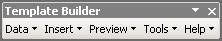

**Insert field dialog**

All of the following report formats are based on EmployeeListing.xml:

```xml
<?xml version="1.0"?>
<ROWSET>
    <ROW num="1">
        <EMPNO>100</EMPNO>
        <ENAME>Jo Bloggs</ENAME>
        <JOB>CLERK</JOB>
        <SAL>1000</SAL>
        <DNAME>ACCOUNTING</DNAME>
    </ROW>
    <ROW num="2">
        <EMPNO>100</EMPNO>
        <ENAME>Jane Doe</ENAME>
        <JOB>CLERK</JOB>
        <SAL>1000</SAL>
        <DNAME>ACCOUNTING</DNAME>
    </ROW>
    <ROW num="3">
        <EMPNO>300</EMPNO>
        <ENAME>Ella Padberg</ENAME>
        <JOB>IT</JOB>
        <SAL>2000</SAL>
        <DNAME>RESEARCH</DNAME>
    </ROW>
    <ROW num="4">
        <EMPNO>4000</EMPNO>
        <ENAME>Ms. Wilbert Hills</ENAME>
        <JOB>Automotive</JOB>
        <SAL>4000</SAL>
        <DNAME>RESEARCH</DNAME>
    </ROW>
    <ROW num="5">
        <EMPNO>500</EMPNO>
        <ENAME>Rick Harvey</ENAME>
        <JOB>Electronics</JOB>
        <SAL>5000</SAL>
        <DNAME>RESEARCH</DNAME>
    </ROW>
    <ROW num="6">
        <EMPNO>600</EMPNO>
        <ENAME>Rick Harvey</ENAME>
        <JOB>Electronics</JOB>
        <SAL>8000</SAL>
    </ROW>
</ROWSET>
```

As you can see the data is showing employee details and the department they work in. There is no master-detail relationship in the data, it is completely 'flat'.

## Your First Template - Simple Employee Detail

The simplest output we could generate would be to show an employee and their details. So open MSWord and use the Data > Load XML data option on the Template Builder toolbar and select the XML file - EmployeeListing.xml. You will get confirmation that the data has loaded successfully. Now use the Insert > Field option, this will open a dialog box showing the available fields from the data.

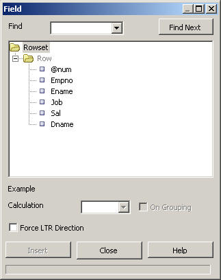

Notice the list of available fields in the dialog. We can use this dialog to enter these fields into our report. Select the insertion point in the Word document and then click on a field and then use the Insert button. Using this method build a layout similar to the one below add the boiler plate text as you go.

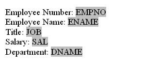

**Simple Employee Detail Template**

You'll notice that as you use the insert button that Microsoft Form Fields are being inserted into the document. This is the object that XML Publisher uses to store the mapping to the XML element in the data. This is done so that a user can easily drag and drop report objects around the document without having to worry about the 'nuts and bolts' of the report. Double click on a field and you'll get the Field Property dialog, now click on the Help button and you'll see the method XML Publisher uses to map to the data elements.

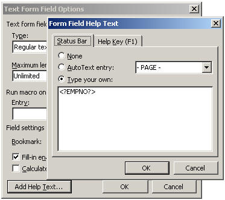

**Form Field Dialog**

Notice in this case we see `<?EMPNO?>`, this tells the XML Publisher template parser that the EMPNO element value should be inserted into the final document using `'<?' and '?>'` to delimit the element mapping.

Now select Preview > PDF from the toolbar, the template builder will prompt you to save template as an RTF format. Once this is done the template will be applied to the data. You'll get something like:

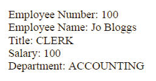

**Simple Employee Detail Output**

Great, so now you have the first employee and their details but where are the others from the XML data. This template lacks the commands to loop over the employees and it therefore only shows the first record. Next we'll add those commands. (EmployeeListing1.rtf)

## Get your employees listing

So we want to loop over the employees and get all of their data into the output. Go back to MS Word close your original document and create a new one and load the data again, alternatively just delete the content. Now use the toolbar and select Insert > Table/Form. You'll be presented with the following dialog, notice it is made up of three regions.

Left Pane - this shows the source XML tree

Center Pane - this is the target or document pane

Right Pane - this has the Property palette and Preview region

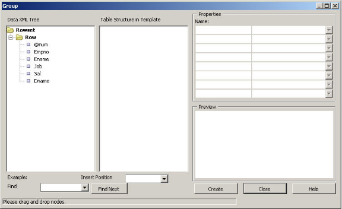

**Insert Table/Form dialog**

To create the looping structure use your mouse and click on the 'Row' node, hold it down and drag it to the center pane and let go. A popup will ask if you want to drop a 'Single Node' or 'All Nodes', select 'All Nodes'. You'll now see a new tree structure with the 'Row' element at the top. Select this node with your mouse and you see the properties palette and preview region fill.

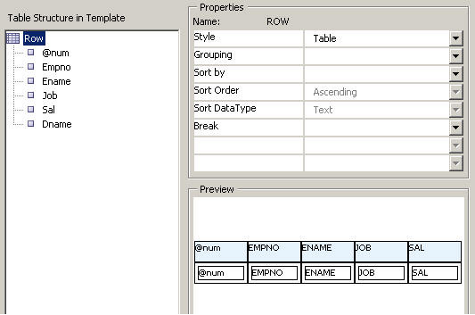

**Properties and Preview**

Try changing the 'Style' property and then clicking on the tree; you can specify 'Table', 'Form' and 'Free Form'. You'll see the preview region update based on your choices. Select 'Table' and then highlight the '@num' value and use the delete key to remove it from the tree. Now hit OK. The template builder will then insert the necessary structures into your template.


**Inserted table structure**

Notice the data is now presented in a table, there are two rows created, one for the column headers and the second for the form fields. The builder will put in some default boilerplate based on the XML data element names. The regular form fields are still there but you will also notice two extra fields 'F' and 'E'. These contain the looping commands:

F - `<?for-each:ROW?>` - ROW is the group in the XML and this command is saying, “for each member of the ROW group carry out the following ie enter the fields EMPNO, ENAME, etc

E - `<?end for-each?>` - this command closes the loop.

Now preview this template in the format of your choice, you'll see the following:

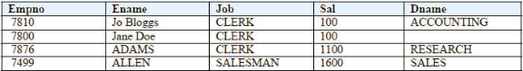

So now we are seeing all of the employees details in a table. So we now have a basic listing report but lets say we wanted to group the employees by their department or job. (EmployeeListing2.rtf)

## Regroup your employees

Our data does not reflect this grouping but the template builder can help us to group the data in the template despite not having the supporting structure in the data. This feature is extremely powerful, a generic 'flat' extract can support many layout formats allowing users to decide how they want to see the data.

Either create a new document or delete the existing content. We are going to create a report that shows the employees by department. We will use the same dialog as before, so open it up, Insert > Table/Form and clear the center pane if needed.

Click and hold on the ROW node and drag to the center pane and 'Drop All', remove the @num node. Highlight the ROW node and then on the Grouping property drop down select 'DNAME' i.e. the department name. Now click back on the ROW node and you'll see the tree has been updated.

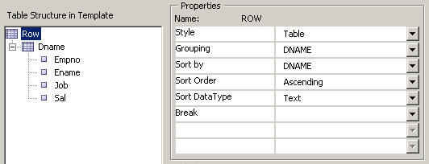

**Regrouping dialog**

You'll notice that the document tree has been updated to show the grouping we have created. In its current state we will have a Table in Table report ie the employee data will be a nested table within a department table. We are going to have a simpler format. Select the Row node and change the Style property to 'Free Form', notice the icon next to the node is updated to give a clue as to the nature of how that node will be rendered. Now click OK and you should get template like:

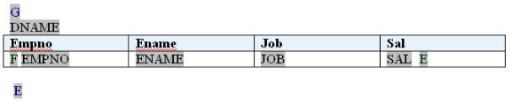

**Regrouping template**

You can see the familiar table and its fields but we now have two extra fields:

G - `<?for-each-group:ROW;./DNAME?><?sort:DNAME;'ascending';data-type='text'?>` - this command is specifying that the ROW group should be then grouped by DNAME. There is also a sort command to sort by the DNAME as well. The sort criteria can be changed using the property palette. The template will now loop over this newly created group.

E - `<?end for-each-group?>` - this closes out the new DNAME group.

There has been another update, the original 'F' field now contains, `<?for-each:current-group()?>`, this is saying loop over the current group i.e. the DNAME group we created above. Try previewing this template and you'll get something like:

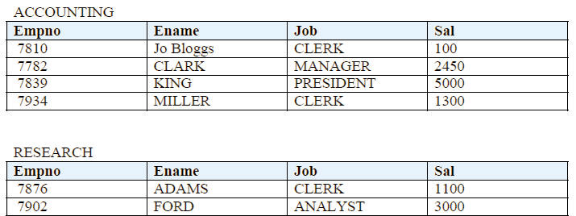

**Grouping by department output**

We have now created a report that shows our employees by their department. We could easily group them by their job titles, or even group by department and then by job title.

## Totals and tallies

So now we have imposed some grouping on our data we want to add some sub totals, lets say we want to know how much the salary cost is in each department and how many employees are in each. These values are not in the XML data but we can create them in the template. For this we are going to go back to the insert field dialog. Lets insert the employee count first, move the cursor to just after the DNAME field, then use the toolbar Insert > Field. Select the EMPNO field and then select 'count' from the Calculation drop down box. Finally we need to check the Grouping box to let the builder know we are creating a summary field on top of the grouped data and then click on insert.

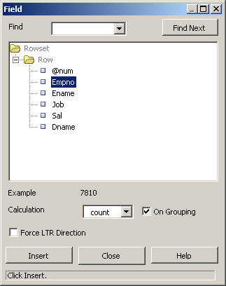

**Insert summary field**

You'll see a new field created, 'countEMPNO', this field contains the code to calculate the number of employees, `<?count(current-group()/ENAME)?>`.

Now create a new row in the employee table and move the cursor to the cell under the SAL field. Use the dialog again, this time create a 'sum' on the SAL element, don't forget the Grouping checkbox. You should end up with a template like this:

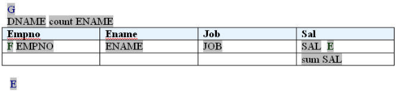

**Summary column template**

Now preview your template and you'll get the following:

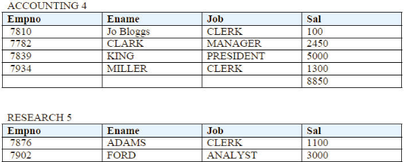

**Summary output**

You'll notice we now have an employee number after the department name and a total salary amount for each department. You can create complex calculations in the template, its up to you.

## Conditional Formatting

You'll probably have noticed that the report output has some employees that do not belong to any department. Let's assume we want to hide those employees that do not have a department.

We can achieve this quite simply with an 'if' statement. The current release of the Template Builder does not support inserting conditional statements so we are going to have to write some code by hand.

We need to add a new formfield, you may need to enable the 'Form' toolbar in MSWord(or you can copy the previous form field then modify it). Now place the cursor just after the 'G' field and insert a form field. Open the properties and then the help text and enter,` '<?if:DNAME!=""?>'`. This command is basically checking if the DNAME element has a value. Now place the cursor just before the last 'E' field and create another field, this time enter `'<?end if?>'`, this closes the if statement. So if the 'if' statement is evaluated to true then the content between the 'if' and 'end if' statement i.e the department and employee data will be displayed; if evaluated to false as in the first set of data then it will not be show. Your template should look something like this:

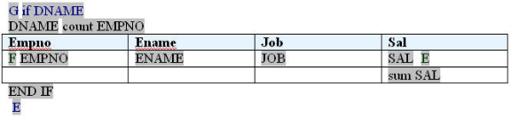

**Conditional template**

The output when you run this template will not contain those employees that do not belong to a department. You could equally exclude employees with a salary greater than 5000. Its up to you and your users.

## Dressing Up

So we now have the basic structure of the report we want, we now need to add formatting to make it more readable. For this we'll use MSWord functionality.

You can update colors, fonts, styles highlighting plain boiler plate and fields, XML Publisher will respect the formatting. For number formatting, again we use MSWord functionality. Double click on the SAL field to get the field dialog, now specify the field type to be 'Number' and then pick a Format from the drop list, you can enter a default number in the 'Default Number' field.

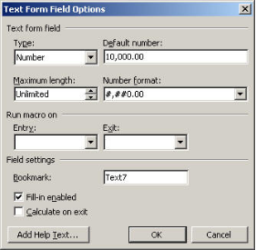

Now click OK. You'll see the field value is now formatted according to the format you specified. XML Publisher will respect this at runtime. This will also work for date formatting.

You can update the header and footer too; add boiler plate, images, etc. MSWord will not allow you to enter form fields in the header or footer but you can enter the command string e.g. `<?DNAME?>`. You can also add page numbers using the native MSWord method. You can very quickly build a report layout similar to:

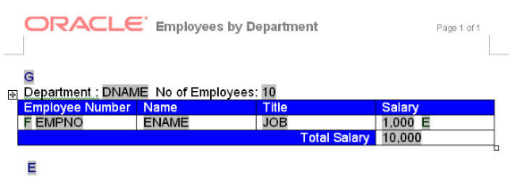

**Formatted template**

This template will now generate the following output.

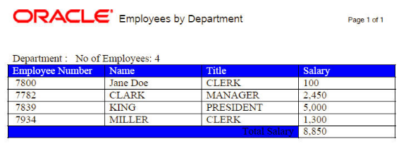

**Formatted report output**

Of course if you or your users want to make a change then just reopen the template and update the layout.

## Deployment

Once you are happy with your template its then a question of deploying it to the server whether that be for the E Business Suite, Peoplesoft, JD Edwards or XML Publisher Enterprise.

## Conclusion

This document has given you brief introduction to the world of XML Publisher RTF templates, it has hopefully provided you a glimpse of the power of XML Publisher and the flexibility it provides to you and your users. There are many sample templates delivered with the Template builder install and the User Guide documentation covers how to create other report objects such as charts, shapes, page totals, conditional formatting objects etc.

[RTF Sample](employees.rtf)

## Other

### How to keep field's prefix zero?

Change field to text field use concat.`<?concat('="',customer_po,'"')?>`

