> 转载：[XML Publisher Report from XML Data Template - QUEST4APPS](https://www.quest4apps.com/xml-report-from-xml-data-template/)

I used to wonder how to develop XML Publisher reports without using rdf or sql or pl/sql concurrent program. The traditional way is to

1. Create a RDF or SQL or PL/SQL procedure
2. Register the RDF or SQL or PL/SQL report as a concurrent program and set the output to XML
3. Run the above report and get the output and save it as a XML file
4. Use the XML data in building the Template using Microsoft Word

This seemed to be a little cumbersome for me. So I was searching for alternatives. Then I stumbled upon the following solution. And I hope this helps all of you. This is part one of a series of blogs. Hope you enjoy this and come up with questions and suggestions. So let us take a look at how we can create xml report from xml data template.

The XML data template is an XML document that consists of four basic sections:

1. Parameters
2. Triggers
3. Data Query
4. Data Structure

This structure is shown in the following graphic:

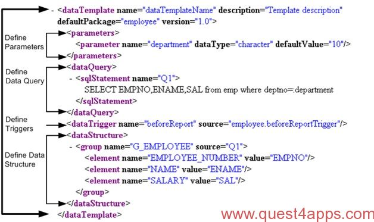

Step by Step Guide to create a sample XML Data Template:

**Decide on the SQL Query**

In the example, we are trying to get the following data from the AP_INVOICES_ALL Table

1. INVOICE_NUM
2. INVOICE_CURRENCY_CODE
3. INVOICE_AMOUNT

The query for the same will be like below:

```sql
SELECT  invoice_num
        ,invoice_currency_code
        ,invoice_amount
  FROM  ap_invoices_all;
```

**Decide on the parameters**

We will be using two parameters to limit the data being retrieved:

1. ORG_ID
2. VENDOR_ID

The resulting query will be like:

```sql
SELECT  invoice_num
        ,invoice_currency_code
        ,invoice_amount
  FROM  ap_invoices_all
 WHERE  org_id = :p_OrgId
   AND  vendor_id = :p_VendorId;
```

That’s all we need to construct the XML Data Template.

```xml
<?xml version="1.0" encoding="UTF-8" ?>
<dataTemplate name ="invoiceData" description="Invoice Data" Version="1.0" >
<parameters>
<parameter name="p_OrgId" dataType="number" />
<parameter name="p_VendorId" dataType="number" />
</parameters>
<dataQuery>
<sqlStatement name="Q1">
<![CDATA[
SELECT invoice_num,invoice_currency_code,invoice_amount
  FROM ap_invoices_all
 WHERE org_id = :p_OrgId
   AND vendor_id = :p_VendorId
]]>
</sqlStatement>
</dataQuery>
<dataStructure>
<group name="G_INV" source="Q1">
<element name="INV_NUMBER" value="invoice_num" />
<element name="CURRENCY_CODE" value="invoice_currency_code" />
<element name="AMOUNT" value="invoice_amount" />
</group>
</dataStructure>
</dataTemplate>
```

If you see the above XML Data Template, we have specified the parameters that are being used and also the SQL Query that will be fetching the data. The SQL Query is using the parameters that are being defined under the Parameters Section. I have also included a jpeg image of the XML File Definition. Sometimes when you copy the XML Definition from the blog, you might run into “invalid characters” that can cause issues. So check the jpeg image and make use of it.

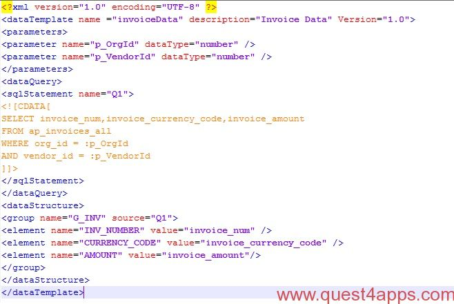

Save the same as “.xml” file in your local system. After saving the file, you should be able to open it in the browser. Double click the xml file and the file should open. The file will look as shown below:

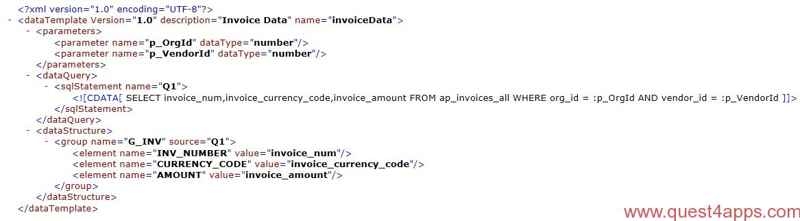

Open Word. Go to Add-Ins. You will be able to see the BI Publisher Menu. Under the Menu, Select Data > Load XML Schema. Select the xml file that we just created.

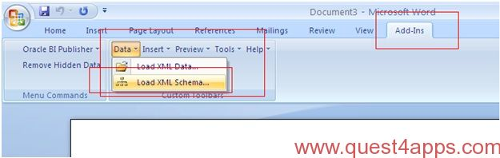

If the data is loaded successfully, you will get the below message:

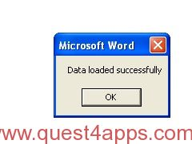

Click OK and to Continue. Select Insert > Table/Form

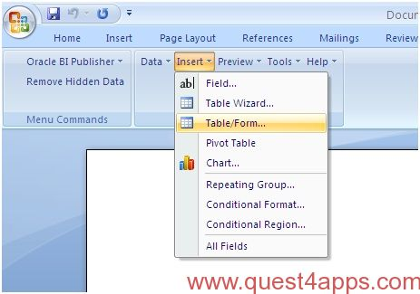

You will get the below screen:

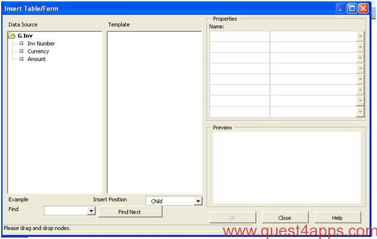

Drag and Drop **G Inv** element from Data Source to the Template Region as shown below


Select **Drop All Nodes** from the choices. We will be getting the below screen:

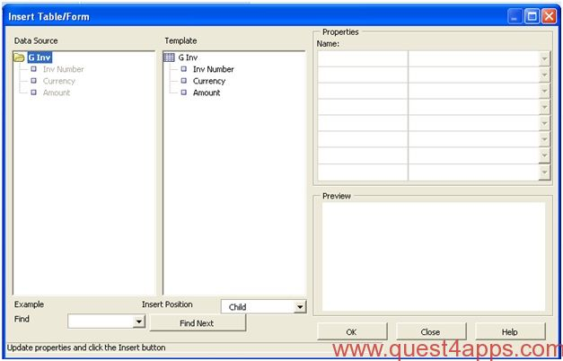

Press **OK**. We will get the below template in the Word Document. Save the same as XXINV_DETAILS.rtf.

| **Inv Number** | **Currency** | **Amount** |
| -------------- | ------------ | ---------- |
| F INV_NUMBER   | CURRENCY     | AMOUNT E   |

Go to **XML Publisher Administrator** responsibility and create a new Data Definition. Give the following for the fields:

Name - XXINV_DETAILS

Code - XXINV_DETAILS

Application - Provisioning (or your custom application)

Start Date - Automatically Populated

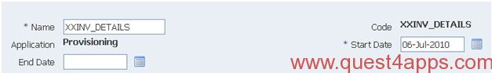

Press “Add File” next to Data Template. Browse and upload the XML Data Template that we have created here (Here upload is xml data-template not rtf).

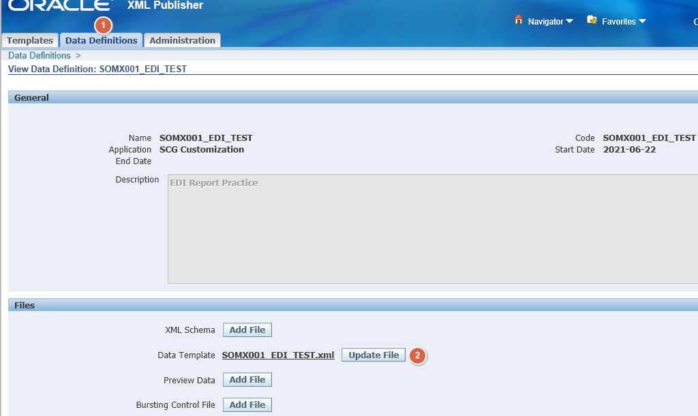

Go to Data Templates and create a new Data Template. Give the following details:

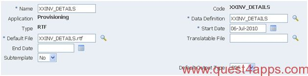

Select the Data Definition that we had created prior to this.

Select Language as US English and upload the RTF File that we have created (XXINV_DETAILS.rtf).

Navigate to System Administrator > Concurrent > Program > Define.

Create a new Concurrent Program and give the following details.

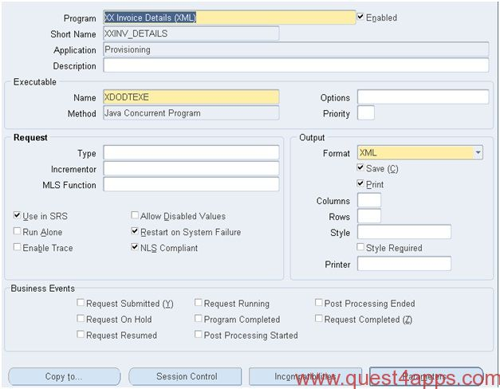

The Executable should always be **XDODTEXE**.

Click on Parameters and give the following details:

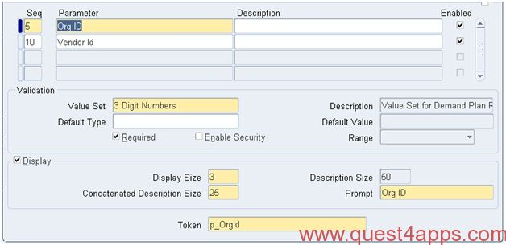

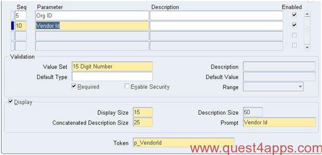

Assign the program to the request group and run the program.

Hope this helps. Let me know your thoughts and feel free to ask any questions that you might have. Also, check out the next blog which has Triggers being called from the XML Template file. You can check it here.

Also check out more advanced topic on XML Templates - [XML Template Part 3](https://www.quest4apps.com/xml-report-part3/)
