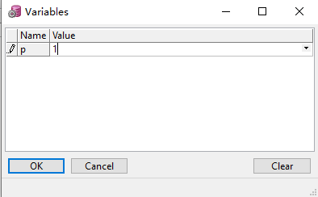

## DDL

`DDL(Data Definition Language)`数据定义语言，用于定义和管理 SQL 数据库中的所有对象的语言，包括 `CREATE, ALTER, DROP, TRUNCATE, COMMENT, GRANT, REVOKE`

### DB Objects

| view           | functional                         |
| -------------- | ---------------------------------- |
| user_objects   | 当前用户通过 DDL 建立的所有对象    |
| user_tables    | 当前用户的所有表                   |
| user_views     | 当前用户的所有视图                 |
| user_sequences | 当前用户的所有索引                 |
| user_source    | 当前用户的 Package, Trigger Source |

使用：判断表是否存在，如果存在就删除

```sql
declare
  num number;
begin
  select count(1) into num
    from user_tables
   where table_name = upper('test');

  if num > 0 then
    execute immediate 'drop table test';
  end if;
end;
```

user_tables 只能查询当前用户的表, 如果查询其他 `owner` 的表需要查询 `dba_tables` 或者 `all_tables`

-   **dba_tables:** describes all relational tables in the database.
-   **all_tables:** describes the relational tables **accessible** to the current user.
-   **user_tables:** describes the relational tables **owned** by the current user.

```sql
select *
  from dba_tables
 where owner = upper('ysc')
   and table_name = upper('som_edi_temp_h');
```

使用：查找文本所在 Source

在做 Transact Move Orders 时弹出错误：累计拣货数量超过报关数量。

-   检查 form 的 trigger 没有发现 **累计拣货数量超过报关数量** 相关代码和描述。
-   在 PL/SQL 中使用 `select * from all_source s where s.text like '%累计拣货数量超过报关数量%';` 可以在 DB trigger 中找到相关文字，查看 trigger 代码可以看到实际原因是报关资料抄写没有抄写成功。

### Table Columns

The `ALL_TABLE_COLUMNS` view filters out system-generated hidden columns and invisible columns.
The `ALL_TAB_COLS` view does not filter out hidden columns and invisible columns.

```sql
select *
  from all_tab_cols t
 where t.table_name = upper('table_name')
   and t.owner = 'APPS'

select listagg(t.column_name, ',') within group(order by t.segment_column_id)
  from all_tab_cols t
 where t.table_name = upper('table_name')
   and t.owner = 'APPS';
```

### GET_DDL

在 Oracle 中，使用 `DBMS_METADATA`包中的 `GET_DDL`函数来获得对应对象的定义语句。

GET_DDL 函数的定义和参数说明如下：

```sql
DBMS_METADATA.GET_DDL (
    object_type     IN VARCHAR2,                           --对象类型
    name            IN VARCHAR2,                           --对象名称
    schema          IN VARCHAR2 DEFAULT NULL,              --对象所在的Schema，默认为当前用户所在所Schema
    version         IN VARCHAR2 DEFAULT 'COMPATIBLE',      --对象原数据的版本
    model           IN VARCHAR2 DEFAULT 'ORACLE',          --原数据的类型默认为ORACLE
    transform       IN VARCHAR2 DEFAULT 'DDL')
    RETURN CLOB;                                           --对象的原数据默认以CLOB类型返回
```

GET_DDL 函数使用

```sql
select dbms_metadata.get_ddl('TABLE', 'ASO_BI_QOT_APRB_MV', 'APPS') from dual;
select dbms_metadata.get_ddl('SEQUENCE', 'RA_TRX_NUMBER_1000_S', 'APPS') from dual;
-- 获取所有sequence的定义
select dbms_metadata.get_ddl('SEQUENCE', u.object_name)
  from user_objects u
 where object_type='SEQUENCE';
```

### DB Dynamic Message

以 `v$`开头的表一般是 oracle 的系统视图 ，具体存放数据库相关动态信息。

**v\$session**

`v$session` 是 APPS 用户下面对于 `sys.v_$session` 视图的同义词。在这个视图中，每一个连接到数据库实例中的 session 都拥有一条记录。包括用户 session 及后台进程如 DBWR，LGWR，arcchiver 等等。v\$session 是基础信息视图，用于找寻用户 `SID 或 SADDR` 。

**v\$sql**

含有 SQL_TEXT, USERS_OPENING （执行语句的用户数等）

**v\$database**

select name from v\$database; （返回当前数据库名，例如 TEST)

**v\$version**

返回数据库版本

### Rename Table Name

```sql
RENAME TABLE SAMP.EMP_ACT TO EMPLOYEE_ACT
```

### Alter Table Columns

| 操作             |                                                                   |
| ---------------- | ----------------------------------------------------------------- |
| 更新字段名       | alter table table_name **rename column** column_old to column_new |
| 删除字段         | alter table table_name **drop column** column_name                |
| 添加字段并附值   | alter table table_name **add column_name** number(1) default 1    |
| 修改字段数据类型 | alter table table_name **modify column_name** varchar2(20);       |
| 修改字段值       | update table_name set column_name=value where column_name=value;  |

### Cretate Synonym

```sql
--before
select * from app.suppliers;

--create synonym
CREATE PUBLIC SYNONYM suppliers
FOR app.suppliers;

--now
select * from suppliers;

--drop
drop public SYNONYM suppliers;

--没有 public 创建的 synonym 仅对当前 owner 有效
CREATE SYNONYM suppliers
FOR app.suppliers;

-- 查询所有 synonym
select * from all_synonyms sn where sn.SYNONYM_NAME like 'SOM_EDI%';
```

### DB Link

```sql
-- 查询数据库 db_link (user_db_links, all_db_links, dba_db_links)
select * from all_db_links;

-- 查询远程数据库数据
select * from "dbo"."ssc_t_edi_head"@db_link  where "delivery_no" = 'xxx'

-- 获取当前数据库 ip
select utl_inaddr.get_host_address from dual;
```

## DML

`DML(Data Manipulation Language)`数据操纵语言，SQL 中处理数据等操作统称为数据操纵语言，包括 `SELECT, INSERT, UPDATE, DELETE, CALL, EXPLAIN PLAN, LOCK TABLE`

### Select 1

`select 1 from table` 用于判断是否存在满足条件的数据，如果有都返回 1，类似于 `select anyCol from table` 一般用于判断结果集是否存在。

```sql
update som_edi_so_import_temp esit
   set esit.ret_code          = 'E'
 where esit.ret_code is null
   and not exists (
       select 1
         from hr_operating_units hou
        where hou.name = esit.ou_name);
```

### Select Into

当在 PL_SQL 中执行 `SELECT ... INTO ...`语句时，如果返回结果集为空，则回触发 `NO_DATA_FOUND` 错误；
但是当 SELECT 中有字段用到 `max, min, sum` 等聚合函数时，即使结果集为空，也不会触发 `NO_DATA_FOUND` 错误， 因为聚合函数 `max, sum`在处理的时候如果不存在结果集会自动引入 `null` 。

```sql
--当执行该存储过程时，会提示错误
CREATE OR REPLACE PROCEDURE RD.EXCEPTION_TEST IS
test   date;
BEGIN
    SELECT END_TIME
    INTO   test
    FROM   RD.R_LINE_STOP_TIME
    WHERE  rownum = 1;
END EXCEPTION_TEST;
--ORA-01403: no data found
--ORA-06512: at "RD.EXCEPTION_TEST", line 17
--ORA-06512: at line 1

--当执行带有函数的存储过程时，则并不会报 no data found 异常.
CREATE OR REPLACE PROCEDURE RD.EXCEPTION_TEST IS
test    date;
BEGIN
    SELECT max(END_TIME)
      INTO test
      FROM RD.R_LINE_STOP_TIME
    WHERE rownum = 1;
END EXCEPTION_TEST;
```

注意，当`SELECT ... INTO ...`触发 ORA-01422: exact fetch returns more than requested number of rows 异常时，会将第一个结果插入，如下虽然产生了异常，后续 l_number 的值为 1.

```sql
declare
  l_number number;
begin
  begin
    select *
      into l_number
      from (select 1 from dual union select 2 from dual);
  exception
    when others then
      dbms_output.put_line(sqlerrm);
  end;
  dbms_output.put_line(l_number);
end;
--ORA-01422: exact fetch returns more than requested number of rows
--1
```

### Insert Into

select 语句如果查询不到数据, insert into 不会产生异常

```sql
insert into babb_temp(si) select 1 from dual where 1 <> 1;
```

### Insert Mutiple

```sql
insert into babb_test_over(name,class,score)
select 'a','3',45 from dual union all
select 'b','3',55 from dual union all
select 'c','2',74 from dual union all
select 'd','3',99 from dual
```

### Case When

| 类型        | 结尾      | 碰到没有处理的分支而又缺少 ELSE 子句时                        |
| ----------- | --------- | ------------------------------------------------------------- |
| case 语句   | end case; | 报错 ORA-06592: CASE not found while executing CASE statement |
| case 表达式 | end       | 返回 NULL                                                     |

**简单 case 语句 ，case 后有 selector**

```sql
CASE SELECTOR
WHEN EXPRESSION 1 THEN STATEMENT 1;
WHEN EXPRESSION 2 THEN STATEMENT 2;
...
WHEN EXPRESSION N THEN STATEMENT N;
ELSE STATEMENT N+1;
END CASE;

if som_edi_temp_d_rec.customer_id = 'XXX' then
  case l_edi_shipping_method
      when 'S' then l_freight_terms_code := '10FCA';
      when 'A' then l_freight_terms_code := '10FCA';
  end case;
end if;
```

**搜索式 case 语句 ，case 后没有 selector**

```sql
CASE
WHEN SEARCH CONDITION 1 THEN STATEMENT 1;
WHEN SEARCH CONDITION 2 THEN STATEMENT 2;
...
WHEN SEARCH CONDITION N THEN STATEMENT N;
ELSE STATEMENT N+1;
END CASE;

select name,score,
   case
     when score >= 90 then
      '优秀'
     when score between 70 and 89 then
      '良好'
     when score between 60 and 69 then
      '及格'
     when score < 60 then
      '不及格'
   end 等级
 from test;
```

### Ref Cursor

`ref cursor` 可以用于定义游标变量，定义游标时不需要指定相应的 select 语句，但是当使用游标时（open）需要指定 select 语句。

使用 pl/sql 编写一个块，可以输入部门号，并显示该部门所有员工姓名和他的工资。

```sql
declare
--定义游标类型
type sp_emp_copy_cursor is ref cursor;
--定义一个游标变量
test_cursor sp_emp_copy_cursor;
v_ename emp_copy.ename%type;
v_sal emp_copy.sal%type;

begin
  --把test_cursor和一个select结合
  open test_cursor for select ename,sal from emp_copy where deptno=&no;
  --循环取出(fethch)
  loop
    fetch test_cursor into v_ename,v_sal;
    --判断test_cursor是否为空
    exit when test_cursor%notfound;
    dbms_output.put_line('名字：'||v_ename||'工资：'||v_sal);
  end loop;
  --关闭游标
  close test_cursor;
end;
```

`ref cursor`也称为动态游标，直到运行时才知道这条查询

```sql
declare
-- dynamic cursor
type rc is ref cursor;
-- static cursor
cursor c is select * from dual;
l_cursor rc;
begin
  if (to_char(sysdate,'dd') = 30) then
    -- ref cursor with dynamic sql
    open l_cursor for 'select * from emp';
  elsif (to_char(sysdate,'dd') = 29) then
    -- ref cursor with static sql
    open l_cursor for select * from dept;
  else
    -- ref cursor with static sql
    open l_cursor for select * from dual;
  end if;
  -- the "normal" static cursor
  open c;
end;
```

### Rowid Rownum

`rownum` 使用 SELECT 语句返回的结果集，若希望**按特定条件查询前 N 条记录**，可以使用伪列 rownum 。rownum 是对结果集加的一个伪列，即先查到结果集之后再加上去的一个列 （强调：先要有结果集）。简单的说 rownum 是符合条件结果的序列号。它总是从 1 开始排起的。使用 rownum 时，只能使用<、<=、!= 符号。

`rowid` 是数据的详细地址，通过 rowid，oracle 可以快速的定位某行具体的数据的位置。rowid 可以分为物理 rowid 和逻辑 rowid 两种。普通的表中的 rowid 是物理 rowid，索引组织表 (IOT) 的 rowid 是逻辑 rowid。当表中有大量重复数据时，可以使用 **rowid 快速删除重复的记录**。

```sql
--1. rownum 使用
--(1) 找到第二行以后的记录
select * from (select rownum no,id,name from student) where no>2;

--(2) rownum 和排序
--oracle中的rownum是在取数据的时候产生的序号，所以想对指定排序的数据指定rowmun行数据就必须注意了。可以看出，rownum并不是按照name列来生成的序号。系统是按照记录插入时的顺序给记录排的号，rowid也是顺序分配的。
select rownum,id,name from student order by name;
    rownum id     name
---------- ------ ---------------------------------------------------
       3 200003  李三
       2 200002  王二
       1 200001  张一
       4 200004  赵四

--为了解决这个问题，需要使用子查询
select rownum,id,name from (select * from student order by name);
    rownum ID     NAME
---------- ------ ---------------------------------------------------
      1 200003   李三
      2 200002   王二
      3 200001   张一
      4 200004   赵四

--(3) 更新表的某一列为 rownum

UPDATE T a
   SET a.neworder =
       (SELECT b.newOrder
          FROM (SELECT rrownum over(ORDER BY amount DESC) newOrder,
                       ROWID browid
                  FROM T) b
         WHERE b.browid = a.rowid)

--(4) 更新表不相关的两列
将 test_b mac 列覆盖 test_a mac 列

create table test_a (
   mac varchar2(100)
);

create table test_b (
   mac varchar2(100)
);

insert into test_a values('aaa');
insert into test_a values('bbb');

insert into test_b values('ccc');
insert into test_b values('ddd');

select * from  test_a;
select * from  test_b;

update test_a t
   set t.mac =
       (select b.mac
          from (select rownum rn, mac from test_a) a,
               (select rownum rn, mac from test_b) b
         where a.rn = b.rn
           and t.mac = a.mac);

-- 2.rowid 的使用

--快速删除重复的记录

delete from stu a
where rowid not in (select max(b.rowid)
from stu b
where a.no = b.no
and a.name = b.name
and a.sex = b.sex); --这里 max 使用 min 也可以

delete from stu a
where rowid < (select max(b.rowid)
from stu b
where a.no = b.no
and a.name = b.name
and a.sex = b.sex); --这里如果把 max 换成 min 的话，前面的 where 子句中需要把"<"改为">"

delete from stu
where rowid not in
(select max(rowid)
from stu t
group by t.no, t.name, t.sex); --使用了 group by，减少了显性的比较条件，提高效率

delete from stu a
where rowid not in (select max(b.rowid)
from stu b
where a.no < b.no
and a.name = b.name); --取 name 重复学号大的数据

```

### Set Operation

| 操作      | 描述 | 重复行 | 排序           |
| --------- | ---- | ------ | -------------- |
| union     | 并集 | 不包括 | 默认规则的排序 |
| union all | 并集 | 包括   | 不进行排序     |
| intersect | 交集 | 不包括 | 默认规则的排序 |
| minus     | 差集 | 不包括 | 默认规则的排序 |

union 和 union all 的区别是，union 会自动压缩多个结果集合中的重复结果，并进行默认排序。而 union all 则将所有的结果全部显示出来，不进行排序。

### Column Alias

如果字段别名中有空格等特殊字符，使用双引号引起来

```sql
select fnd_profile.value('ORG_ID')  "org id"  from dual;
```

### Implicit Conversion

| 操作             | 转换               |
| ---------------- | ------------------ |
| 比较 / 算术运算  | 字符型转换为数值型 |
| 连接时 (\|\|)    | 数值型转换为字符型 |
| 赋值、调用函数时 | 定义的变量类型为准 |

```sql
select '1' || 2  + 2 from dual;
-- 14

select 1 from dual where '12' > 2 ; --12 > 2 but '12' < '2'
-- 1
```

### Null

一般对于可空字段需要做特殊处理，因为 null 与 任何其它字段比较都会返回 `undefined`，例如 `null = null & null != null & null = 'XXX' & null <> 'XXX'` 都不成立。

```sql
cursor c_som_edi_temp_d is
  select *
    from som_edi_temp_d
   where edi_id = p_edi_id
     and nvl(transfer, 'Y') <> 'D';

select 1 from dual null = null
select 1 from dual null != null
select 1 from dual null <> 'D'
```

### null & ''

```sql
select length(''), length(null) from dual; --'' ''
select nvl('', 1) from dual; --1
select * from dual where '' is null; --X
```

### For Update

`for update` 和 `for update nowait` 是对操作的数据行进行加锁，在事务提交前防止其他操作对数据的修改。`for update` 和 `for update nowait` 主要区别在于是否等待，如果不加 `nowait` ，在另一个 session 执行 `update` 时就会等待，直至锁被释放。如果添加了 `nowait` 在另一个 session 执行 `update` 时就会报错 `ORA-00054: resource busy`

```sql
select * from som_edi_temp_h seh where seh.edi_id = '15194' for update
select * from som_edi_temp_h seh where seh.edi_id = '15194' for update nowait
```

### Escape Character

oracle 中从第二个 `'`开始表示转义符，使用 `escape` 可以设置其它字符为转义字符。

```sql
select ''''||sd.ordered_quantity||chr(39) from som_edi_temp_d sd;
-- 输出 '30', 第三个 ' 被第二个 ' 转义为一个 ', 也可以使用 chr(39) 直接表示 '
-- _表示确切的未知字符
select * from t11 where name like '%_%';
        ID NAME
---------- --------------------
        1 baaab
        2 ba_ab
        3 ba%ab
-- escape 设置 \ 为转义符
select * from t11 where name like '%\_%' escape '\';
        ID NAME
---------- --------------------
        2  ba_ab
```

### Quote

plsql 使用单引号作为转义符

最外层的两个单引号作为引号操作符，第二个作为转义符号，第三个单引号是真实的数据输出
`select '''' from dual;` 输出 `'`
q'' 内的内容会原样输出
`select q'[Route du Nant-d'Avril, 150]' from dual;`
替换字符串中的单引号为双引号
`replace(str, '''', '''''')`

### Nulls First

`nulls first`将 null 查询结果集排在最前面；`nulls last `将 null 查询结果集排在最后面。

```sql
select * from som_edi_810_header seh order by seh.invoice_date nulls last;

select * from som_edi_810_header seh order by seh.invoice_date nulls first;
```

### Flash Back

```sql
delete from babb_emp;
-- 打印 babb_emp 表一分钟前的数据(表名不能用简写形式)
select * from  babb_emp  as of timestamp (sysdate - 1/1440);
-- 添加条件
select * from  babb_emp  as of timestamp (sysdate - 1/1440) where babb_emp.id = '123';

-- Retrieve package was drop or replace
select *
  from all_source as of timestamp to_timestamp('20200902 16:00:00', 'YYYYMMDD HH24:MI:SS')
 where name = upper('som_edi_custom_utils_pkg')
 order by type, line
```

### Query Clob

```sql
select dbms_lob.substr(mpg.name) from mpg
```

### Update Use Subquery

`select 1 from dual where 1 <> 1` 查询不到数据, 但是会显示更新了 xx 条数据, 结果 customer_id 都会更新为 null。
因为没有为 som_edi_temp_d_temp 添加条件会更新这张表的所有数据, `select 1 from dual where 1 <> 1` 没有数据, customer_id 都会变成 null, 正确的更新做法是为 som_edi_temp_d_temp 添加条件限制要更新这张表的哪些数据。

```sql
update som_edi_temp_d_temp sed
   set sed.customer_id = (
     select 1 from dual where 1 <> 1
   );
```

## DCL

`DCL(Data Control Language)`数据控制语言，用来授予或回收访问数据库的某种特权，并控制数据库操纵事务发生的时间及效果，对数据库实行监视等，包括 `COMMI, SAVEPOINT, ROLLBACK, SET TRANSACTION`

### Savepoint Rollback

```sql
CREATE SEQUENCE "SUCRE"."DEPTNO_SEQ"
MINVALUE 1
MAXVALUE 1.00000000000000E+27
INCREMENT BY 10
START WITH 201
CACHE 20
NOORDER NOCYCLE;

DECLARE
     v_number number;
BEGIN
     v_number := 1;
     insert into DEPT values(deptno_seq.nextval,v_number,'');
     savepoint A;
     insert into DEPT values(deptno_seq.nextval,v_number+1,'');
     savepoint B;
     insert into DEPT values(deptno_seq.nextval,v_number+2,'');
     savepoint C;
     --退回到 A
     rollback to A;
     --提交，只会提交 point A前面的
     commit;
END;
```

## Func Procedure

### Package Create

第一次创建 oracle packge 时可能提示编译错误，但 plsql 并不会指出具体的错误，这时需要右键 `Edit Spec & Body` 重新打开 package 编译就可以看见具体的错误

```sql
-- package head
create or replace package apps.sms_po_requisitions_log_pkg is

  -- Author  : 11435
  -- Created : 2019/2/1 9:45:48
  -- Purpose : ASCP REQUISITIONS LOG

  procedure put_csv(p_value in varchar2, p_separator in varchar2 default ',');

end sms_po_requisitions_log_pkg;


-- package body
create or replace package body apps.sms_po_requisitions_log_pkg is

   procedure put_csv(p_value in varchar2, p_separator in varchar2 default ',') is
   begin
        /**
         Test In PL/SQL
         dbms_output.put      : output content to buffer
         dbms_output.new_line : output buffer to console and newline
        */
        dbms_output.put('"' || p_value || '"' || p_separator);
   exception
       when others then
           raise;
   end put_csv;
end sms_po_requisitions_log_pkg;
```

### Package Compile Error

PLS-004010: duplicate fields in RECORD, TABLE or argument list are not permitted
原因: 在 procedure 参数和定义部分同时定义了 p_seq_id

```sql
procedure proc_855(errbuf         out varchar2,
                   retcode        out varchar2,
                   p_seq_id       in number) is
p_seq_id         number;
```

### Procedure

```sql
--创建存储过程
create or replace procedure p_babb_test(num out number)
is
begin
  --select 语句中必须使用 into
  select count(*) into num from scott.emp;
end;
--调用存储过程
declare
  a number;
begin
  p_babb_test(a);
  dbms_output.put_line(a);
end;
--删除存储过程
drop procedure p_babb_test;
```

### Default Param

```sql
CREATE OR REPLACE PROCEDURE HelloWorld3 (
  p_user_name VARCHAR2,
  p_val1 VARCHAR2 DEFAULT ' Good Moning,',
  p_val2 VARCHAR2 DEFAULT ' Nice to Meet you'
) AS
BEGIN
  dbms_output.put_line('Hello ' || p_user_name || p_val1 || p_val2 || '!');
END HelloWorld3;
 /
Procedure created.

--指定参数名称调用
--当最后2个参数是有默认的时候，跳過中間的那個。
BEGIN
HelloWorld3('Edward');
HelloWorld3('Edward', p_val1 => ' Good Night,');
HelloWorld3('Edward', p_val1 => ' Good Night,', p_val2 => 'Bye');
HelloWorld3('Edward', p_val2 => ' HeiHei ');
END;
/
/*
Hello Edward Good Moning, Nice to Meet you!
Hello Edward Good Night, Nice to Meet you!
Hello Edward Good Night,Bye!
Hello Edward Good Moning, HeiHei !
*/
```

### Sum Count

| group/no group      | sum()         | count()       |
| ------------------- | ------------- | ------------- |
| no group 捞不到数据 | null          | 0             |
| group 捞不到数据    | no data found | no data found |

```sql
--没有数据返回0
select count(*) from test where 1 <> 1;
--有 group by 会先 group by, 此时什么都不会返回
select count(*) from test where 1 <> 1 group by test.name;
--没有数据返回 null
select count(*) from test where 1 <> 1;
--没有数据什么都不会返回
select sum(test.qty) from test where 1 <> 1  group by test.name;
--没有数据什么都不会返回
select sum(test.qty) from test where 1 <> 1  group by test.qty;
--返回 null
select null + 2 from dual;

--如果查不到数据min()返回空,此时into不会出错
select min(setd.po_line) into l_po_line from som_edi_temp_d setd;
--如果查不到数据会产生错误
select setd.po_line into l_po_line from som_edi_temp_d setd;
```

### Count Distinct

查找一个 pallet 下有几个不同的 carton

```sql
select count(distinct sel.carton_id_value)
  from som_edi_856_line sel
where sel.edi856_id = p_edi856_id
  and sel.pallet_id_value = p_pallet_id
group by sel.pallet_id_value;
```

### Instr Substr

`instr(sourceString,destString,start,appearPosition)`

`instr` 在一个字符串中查找指定的字符，返回被查找到的指定的字符的位置。可以从右向左查找即开始位置为负。查找不到返回 0。

`substr(cExpression,nStartPosition [,nCharactersReturned])`

`substr` 是从给定的字符表达式或字段中返回一个子字符串。

example: 返回不包含目录的文件名

```sql
select substr('c:\test\test.xlsx',
              instr('c:\test\test.xlsx', '\', -1, 1) + 1,
              length('c:\test\test.xlsx') - instr('c:\test\test.xlsx', '\', -1, 1))
  from dual;
--test.xlsx
```

### Option Filter

edi_id 是一个栏位并不是一个变量，如果没有传入 p_edi_id 则 edi_id = edi_id 恒成立

```sql
cursor c_edi_id is
  select edi_id
  from   som_edi_temp_h
  where  transfer in ('N', 'Q')
  and    edi_id = nvl(p_edi_id, edi_id)
  and    customer_id = nvl(p_customer_id, customer_id)
  and    trim(cust_po_number) = nvl(trim(p_customer_po),cust_po_number)
  and    edi_type = nvl(p_edi_type, edi_type)
  order by edi_id;
```

### TO_CHAR

```sql
--获取系统当前的分钟数mi,获取月份是mm
select to_char(sysdate,'mi')  as nowMinute from dual

--数字转换为字符串，并保留小数位数
select to_char(3.145, '9999990.00'), length(to_char(3.145, '9999990.00'))  from dual; --       3.15 11
select trim(to_char(3.145, '9999990.00')), length(trim(to_char(3.145, '9999990.00')))  from dual; --3.15 4
```

### CHR ASCII

在 oracle 中 chr() 函数和 ascii() 是一对反函数。chr() 函数将 ASCII 码转换为字符：字符 –> ASCII 码；ascii() 函数将字符转换为 ASCII 码：ASCII 码 –> 字符。

```sql
select chr(65) from dual;
CHR(65)
-------
A

SQL> select ascii('A') from dual;
ASCII('A')
----------
65

--chr(0)表示的是字符串的结束符
create table t_text (a varchar2(100));
insert into t_text values('1234');
select length(a), '-'||a||'-' from t_text;
LENGTH(A) '-'||A||'-'
---------- --------------------------
         4 -1234-

--这时候没有问题,现在加一个chr(0)
update t_text set a = a||chr(0);
select length(a),'-'||a||'-' from t_text;

LENGTH(A) '-'||A||'-'
---------- -------------------------
5 -1234

--chr(0)后面的东西没法显示出来
update t_text set a = a||'5678';
select length(a),'-'||a||'-' from t_text;
LENGTH(A) '-'||A||'-'
---------- --------------------------
         9 -1234

--可以使用substr
select substr(a,6,4) from t_text;
SUBSTR(A,6,4)
-------------
5678
```

### Trunc Extract Date

`trunc` 用于截取日期，默认截取日期到日，截取之后的类型仍然为 `date` 类型

`extract` 可以从日期和时间戳提取年月日等，返回 `number` 类型

```sql
SELECT TRUNC(SYSDATE) FROM DUAL; --2012-12-19
SELECT TRUNC(SYSDATE,'MM') FROM DUAL; --2012-12-1
SELECT TRUNC(SYSDATE,'YYYY') FROM DUAL; --2012-1-1
SELECT TRUNC(SYSDATE,'DD') FROM DUAL; --2012-12-19
SELECT TRUNC(SYSDATE,'HH') 或 HH24 FROM DUAL; --2012-12-19 14:00:00
SELECT TRUNC(SYSDATE,'MI') FROM DUAL; --2012-12-19 14:30:00
SELECT TRUNC(SYSDATE,'SS') FROM DUAL; -- 会出现 bad precison specifier，直接用SYSDATE不用TRUNC

select extract(year from systimestamp) year
      ,extract(month from systimestamp) month
      ,extract(day from systimestamp) day
from dual
union
select extract(year from sysdate) year
      ,extract(month from sysdate) month
      ,extract(day from sysdate) day
from dual
```

### Decode

`decode(条件,值1,返回值1,值2,返回值2,...值n,返回值n,缺省值)`

```sql
select decode(sign(变量1 - 变量2), -1, 变量1, 变量2) from dual; --取较小值

--注意: select 1 from dual where null = null; 中 null = null 不成立，但是在 decode 中是满足的
select decode(ship_loc.city, NULL, NULL, ship_loc.city || ', '); --变量处理

select *
  from table_subject
 order by decode(subject_name, '语文', 1, '数学', 2, '外语', 3); --根据文字排序
```

decode 注意事项

```sql
--decode 隐式转换以第一个返回值为基准

--number 不能转换为 sysdate
select decode('a', null, sysdate, 1) from dual; --ORA-00932: inconsistent datatypes: expected DATE got NUMBER
--varchar 可以转换为日期，但必须是指定格式
select decode('a', null, sysdate, 'a') from dual; --ORA-01858: a non-numeric character was found where a numeric was expected
--尝试将字符串 '1' 转换为日期
select decode('a', null, sysdate, '1') from dual; --ORA-01840: input value not long enough for date format
--'15-JAN-20' 是 Server 指定 Format 格式可以转换为日期
select decode('a', null, sysdate, '15-JAN-20') from dual; --2020/1/15

-- 'a' 是 varchar， sysdate 总是可以转换为 varchar, 返回 Server 指定 Format 格式
select decode(sysdate, null, 'a', sysdate) from dual; --14-JAN-20
```

### Listagg

同组字符串拼接函数

```sql
with temp as(
  select 'China' nation ,'Guangzhou' city from dual union all
  select 'China' nation ,'Shanghai' city from dual union all
  select 'China' nation ,'Beijing' city from dual union all
  select 'USA' nation ,'New York' city from dual union all
  select 'USA' nation ,'Bostom' city from dual union all
  select 'Japan' nation ,'Tokyo' city from dual
)
select nation, listagg(city,',')  within group(order by city desc), count(1)
from temp
group by nation;

nation  citylistagg                   count(1)
------  --------------------------    --------
China   Shanghai,Guangzhou,Beijing    3
Japan   Tokyo                         1
USA     New York,Bostom               2


-- null, '' 不会包含在 listagg 连接的字符串中, 需要进行 nvl 处理
with temp as(
  select 'China' nation ,'Guangzhou' city from dual union all
  select 'China' nation , null city from dual union all
  select 'China' nation ,'' city from dual union all
  select 'USA' nation ,'New York' city from dual union all
  select 'USA' nation ,'Bostom' city from dual union all
  select 'Japan' nation ,'Tokyo' city from dual
)
select nation, listagg(city,',')  within group(order by city desc), count(1)
  from temp
 group by nation;

nation  citylistagg                   count(1)
------  --------------------------    --------
China	Guangzhou	                  3
Japan	Tokyo	                      1
USA	    New York,Bostom	              2

--partitiobn by 不会影响记录条数
with temp as(
  select 'China' nation ,'Guangzhou' city from dual union all
  select 'China' nation ,'Shanghai' city from dual union all
  select 'China' nation ,'Beijing' city from dual union all
  select 'USA' nation ,'New York' city from dual union all
  select 'USA' nation ,'Bostom' city from dual union all
  select 'Japan' nation ,'Tokyo' city from dual
)
select nation, listagg(city, ',')  within group(order by city desc) over (partition by nation) as citylistagg, count(1) over(partition by nation) as g_total, count(1) over(partition by 1) as total
from temp;

NATION	CITYLISTAGG	                  G_TOTAL	TOTAL
------  --------------------------    --------  ------
China	Shanghai,Guangzhou,Beijing	  3	        6
China	Shanghai,Guangzhou,Beijing	  3	        6
China	Shanghai,Guangzhou,Beijing	  3	        6
Japan	Tokyo	                      1	        6
USA	    New York,Bostom	              2	        6
USA	    New York,Bostom               2	        6
```

### Length

对 `'' 和 null` 会返回空，不会返回 `0`

```sql
select length('') from dual;
select length(null) from dual;
```

### Decimal

```sql
select 1 from dual where 1 = 1.0;
-- 1
select 1.0 from dual;
-- 1
```

### Any is Null

```sql
select * from dual where greatest('a', 2, 3, null, sysdate) is null;
select * from dual where least('a', 2, 3, null, sysdate) is null;
```

### Str Clean

```sql
  --Remove all CR/LF, trim the left and right spaces, tabs
  function str_clean(p_str in varchar2) return varchar2
  is
    l_return varchar2(1000);
    l_tab_space varchar2(10) := chr(9) || ' ';
  begin
    /**
     * Standard ASCII Characters
     * Decimal    Description
     * 9    	    Horizontal tab (HT)
     * 10         Line feed (LF)
     * 13         Carriage return (CR)
     */
    begin
      --translate(p_str, 'a' || chr(10) || chr(13), 'a'): a translate to a, chr(10) & chr(13) replace to empty
      --ltrim(str, l_tab_space): trim left tab and space behavior like translate, such as 'chr(9) chr(9) a' will trim to 'a'
      --if use trim twice select trim(trim(chr(9) from chr(9) || ' ' || chr(9) ||  'a')) from dual; will got 'chr(9) a'
      select rtrim(ltrim(translate(p_str, 'a' || chr(10) || chr(13), 'a'), l_tab_space), l_tab_space)
        into l_return
        from dual;
    end;

    return l_return;

  end str_clean;
```

## PLSQL

### Sqlcode Sqlerrm

Oracle 内置函数 `SQLCODE` 和 `SQLERRM` 是一般用在异常 `OTHERS` 处理器中，分别用来返回 Oracle 的错误代码和错误消息。

在一个内在的异常中，SQLCODE 返回 Oracle 错误的序号，而 SQLERRM 返回的是相应的错误消息。

-   SQLCODE 返回 +100, SQLERRM 返回 "ORA-01403：NO DATA FOUND";
-   SQLCODE 返回 +1, SQLERRM 返回的是 "User-Defined Exception";
-   SQLCODE 返回 0, SQLERRM 返回 "ORA-0000：normal, successful completion"。

### Error Backtrace

```sql
declare
   l_char varchar2(20);
begin
  select 1 into l_char from dual where 1 <> 1;
exception when others then
  -- format_error_backtrace会打印出错行号
  dbms_output.put_line('format_error_backtrace: ' || dbms_utility.format_error_backtrace);
  dbms_output.put_line('format_error_stack: '|| dbms_utility.format_error_stack);
  dbms_output.put_line('format_call_stack: ' || dbms_utility.format_call_stack);
  dbms_output.put_line('sqlerrm: ' || sqlerrm);
  dbms_output.put_line('sqlcode: ' || sqlcode);
end;

/*
format_error_backtrace: ORA-06512: at line 4
format_error_stack: ORA-01403: no data found
format_call_stack: ----- PL/SQL Call Stack -----
  object      line  object
  handle    number  name
0x458e9f088         8  anonymous block
sqlerrm: ORA-01403: no data found
sqlcode: 100
*/
```

注意：
dbms_output.put 只会输出内容到缓存
dbms_output.new_line 输出缓存内容并换行

### Array

```sql
--固定数组
declare
  type type_array is varray(10) of varchar2(20); --一维数组，字符串类型
  var_array type_array := type_array('java', 'python', 'php');
begin
  --数组的长度用count(索引是從1開始的)
  for i in 1 .. var_array.count loop
    dbms_output.put_line(var_array(i));
  end loop;
end;

--可变数组
declare
  type type_array is table of varchar2(20) index by binary_integer;
  var_array type_array;
begin
  --下标必须是连续的,并且索引从1开始
  var_array(1) := 'java';
  var_array(2) := 'php';
  for i in 1 .. var_array.count loop
    dbms_output.put_line(var_array(i));
  end loop;
end;

--类似二维数组
--IS TABLE OF：指定是一个集合的表的数组类型，简单的来说就是一个可以存储一列多行的数据类型。
--INDEX BY BINARY_INTEGER：指索引组织类型。
--BULK COLLECT：指是一个成批聚合类型，简单的来说，它可以存储一个多行多列存储类型，采用BULK COLLECT可以将查询结果一次性地加载到集合中。
declare
  type type_array is table of som_edi_temp_d%rowtype index by binary_integer;
  var_array type_array;
begin
  select * bulk collect into var_array from som_edi_temp_d;
  for i in 1 .. 10 loop
    dbms_output.put_line('订单id: ' || var_array(i).edi_id || ', 订单类型: ' || var_array(i)
                         .edi_type);
  end loop;
end;

--数组的相关属性
COUNT             返回集合中元素的个数
DELETE            删除集合中所有元素
DELETE(x)         删除元素下标为x的元素，对VARRAY非法
DELETE(x,y)       删除元素下标从X到Y的元素，对VARRAY非法
EXIST(x)          如果集合元素x已经初始化，则返回TRUE, 否则返回FALSE
EXTEND            在集合末尾添加一个元素，对Index_by非法
EXTEND(x)         在集合末尾添加x个元素，对Index_by非法
EXTEND(x,n)       在集合末尾添加元素n的x个副本，对Index_by非法
FIRST             返回集合中的第一个元素的下标号，对于VARRAY集合始终返回1。
LAST              返回集合中最后一个元素的下标号，对于VARRAY返回值始终等于COUNT.
LIMIT             返回VARRY集合的最大的元素个数，Index_by集合和嵌套表无用
NEXT(x)           返回在第x个元素之后及紧挨着它的元素值，如果x是最后一个元素，返回null.
PRIOR(x)          返回在第x个元素之前紧挨着它的元素的值，如果x是第一个元素，则返回null。
TRIM              从集合末端开始删除一个元素，对于index_by不合法
TRIM(x)           从集合末端开始删除x个元素
```

## Other

### Tnsping

tnsping 可以检查 Oracle 是否连通, `tnsping instance`

> tnsping TEST

### SQL Plus Connect DB

```sql
sqlplus name/pwd@ip:port/service_name

--------tnsnames.ora--------
DEV =
  (DESCRIPTION =
    (ADDRESS_LIST =
      (ADDRESS = (PROTOCOL = tcp)(HOST = xxx)(PORT = yyy))
    )
    (CONNECT_DATA =
      (SID = DEV1)
    )
  )
--------tnsnames.ora--------
```

### Build Id Seq

```sql
select level as id from dual connect by  level < 5;
/*
1	1
2	2
3	3
4	4
5	5
*/
select rownum as id from xmltable('1 to 10');
select level + 5 as id from dual connect by  level <= 10 - 5;

--可以使用 connect by 生成测试数据
insert into TMP_TABLE select 'TMP'|| lpad(rownum, 7, 0), rownum, sysdate from dual connect by level <= 1000000;
```

### & Placeholder

```sql
select * from dual where 1 = &p;

DUMMY
-----
X
```


