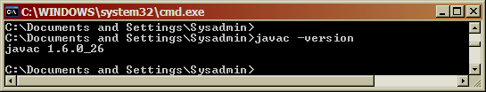
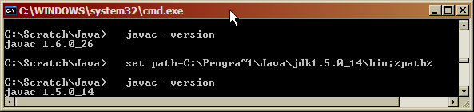
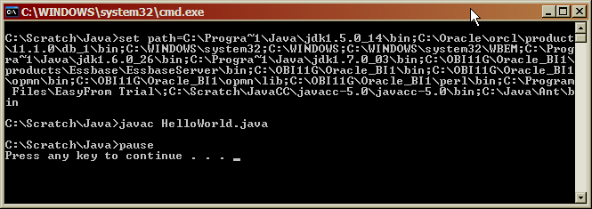
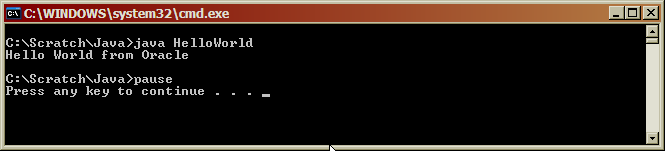
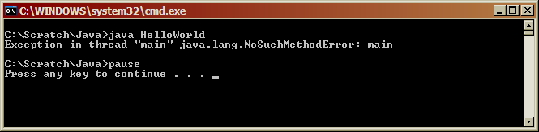
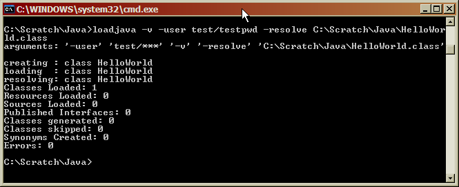
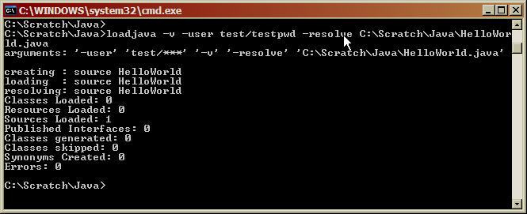
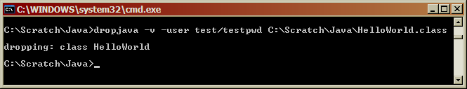
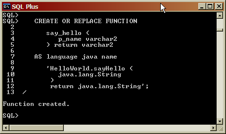
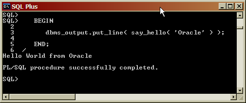

> 转载：[Calling Java from PL/SQL ](http://everything-oracle.com/plsqlcljv.htm)

## Introduction

This article describes how to call a method within a Java class from a PL/SQL wrapper subprogram. It‘s aimed at those PL/SQL programmers who have no previous knowledge of Java programming (to call PL/SQL from Java see [this article](http://everything-oracle.com/plsqlfrjv.htm)).

The outline of what we wish to do is as follows:

-   Create a Java program and test that it works outside of PL/SQL.

-   Compile the program using a file-based Java compiler.

-   Load and store the compiled code in an Oracle database schema.

-   Create a PL/SQL wrapper, or interface, for the Java program.

-   Call the PL/SQL wrapper from a PL/SQL subprogram.

## Introduction to Java

Our program will be a variant on the familiar "Hello World" program, one beloved of tutorial writers the world over. We‘ll pass in a name as a parameter and the program will return the text "Hello World from " with the name appended.

Let‘s start with the Java code needed to create the program and to test it:

```java
public class HelloWorld {
   public static String sayHello( String pName ){
      return "Hello World from " + pName;
   }

   public static void main( String args[] ){
      System.out.println( sayHello( "Oracle" ) );
   }
}
```

The program begins with the text "public class HelloWorld" and ends with "}" (the keyword "public" indicates that the class is visible to the outside world).

Think of this declaration as being similar to the following PL/SQL package declaration:

```sql
create or replace package hello_world as
end;
/

create or replace package body hello_world as
end;
/
```

This class contains two Java methods, "sayHello" and "main". Methods are similar to the functions and procedures that we declare and define within a PL/SQL package.

The method, "sayHello", performs the required functionality. The first line:

```java
public static String sayHello( String pName ){
```

implies that the method name is "sayHello" (the "Camel" notation is commonly used within Java - yes, it‘s much less readable and developer friendly than the PL/SQL equivalent, "say_hello").

The method takes a parameter "pName" with a datatype of "String" (the component within the brackets). It also returns a value with a datatype of "String" (the word that precedes the method‘s name).

The keyword "public" at the start of the line tell us that the method is publicly visible (similar to declaring it the header, rather than the body, of a PL/SQL package).

The keyword "static" that follows tells us that the method is like a PL/SQL packaged subprogram and belongs to the class, rather than to each instance of the class (object-oriented programming in Java offers many more variants than are possible within PL/SQL).

The second line:

```java
return "Hello World from " + pName;
```

is fairly self explanatory: double quotes function as single quotes would in PL/SQL, and the "+" in Java represents string concatenation, or "||" in PL/SQL.

The final "}" on the third line is equivalent to the PL/SQL "end;"

In PL/SQL, we could write this method as:

```sql
function say_hello( p_name varchar2 ) return varchar2 is
begin
   return 'Hello World from ' || p_name;
end;
```

The second method, "main", is just in the class for the purposes of testing (we‘ll remove it later). The keyword "void" indicates that the method returns no data (making it the equivalent of a PL/SQL procedure, rather than a function).

The parameter "args[]" represents a special notation, indicating an array of command line arguments. And, finally, "System.out.println" is the Java equivalent of our old friend "dbms_output.put_line".

So, the Java class is functionally equivalent to the PL/SQL package:

```sql
create or replace package hello_world as
   function say_hello( p_name varchar2 ) return varchar2;

   procedure main;
end;
/

create or replace package body hello_world as
   function say_hello( p_name varchar2 ) return varchar2 is
   begin
      return 'Hello World from ' || p_name;
   end;

   procedure main is
   begin
      dbms_output.put_line( say_hello( 'Oracle' ) );
   end;
end;
/
```

which when we run it from SQL Plus using:

```sql
call hello_world.main();
```

produces the output:

```
Hello World from Oracle
```

Needless to say, there is rather more to writing Java code than is illustrated by this very brief example, but it should be sufficient to orient those developers coming from a PL/SQL background.

## The Java Compiler

To compile Java code we need a Java compiler. A compiler is contained in a JDK (Java Development Kit), so we‘ll need to either (1) install an appropriate JDK, or (2) make use of an existing JDK.

We have three options:

-   **Use the JDK contained in the Oracle RDBMS:** the Oracle RDBMS contains an in-built JDK. We can use its compiler if we load the Java **source code** directly into the RDBMS. It will be automatically compiled. The downside is that we won‘t be able to test the code first before loading it into the RDBMS (the JDK in the RDBMS produces reasonable error messages when the code contains syntactic errors, but we won‘t be able to exercise the code until we create a PL/SQL wrapper and call it from a PL/SQL test stub).

-   **Compile the Java code with an incompatible JDK:** we can install or make use of an existing file-based JDK that is incompatible with that in the RDBMS - incompatible because it has a higher version number (for Oracle 11g the version number must be no greater than 1.5). We can compile and test the code, and when we are satisfied that it works correctly we can load the **source code** into the Oracle RDBMS and have it automatically compiled with the in-built JDK. The downside is that the source code is being compiled with one version of the JDK for testing, and with another version for use by PL/SQL (if we attempted to load the **compiled code** into the RDBMS we would get a [ORA-29552](http://everything-oracle.com/pj29552.htm) error).

-   **Compile the Java code with a compatible JDK:** we can install or make use of an existing file-based JDK that is compatible with that in the RDBMS. We can compile and test the code, and when we are satisfied that it works correctly we can load the **compiled code** into the Oracle RDBMS. The upside is that the compiled code that is used for testing is also referenced by our PL/SQL wrapper, reducing the likelihood of incompatibilities and errors.

To determine if a file-based JDK is installed and is present on the system path we can issue the command "javac -version" from a command window. If it is present, we will get the version number by way of a response:


​ **Figure 1 - Java Version**

If we don‘t get a version number, then either there is no JDK installed or it is not on the system path. By default, JDKs are installed under "C:\Program Files\Java". We can also determine whether a JDK has been installed by looking for the "Java" menu item in the "Control Panel".

If we need to install a JDK, then we can [download](http://www.oracle.com/technetwork/java/javase/archive-139210.html) one that is compatible with the JDK in the RDBMS.

It‘s quite likely that a file-based JDK already exists, and that it has a higher version number than the maximum version supported by the JDK in the RDBMS (many Oracle products and other products require a higher version of the JDK). If so, then we can still install a lower version of the JDK in addition to the one that is already present, and then temporarily add it to the system path when compiling Java code. For example, if the Java 1.5 JDK is installed under "C:\Program Files\Java", then the path can be overriden as follows:


​ **Figure 2 - Setting the JDK Path**

## Compile Test Class

We need to save our code for the test class in a file called "HelloWorld.java" (the Java compiler is rather fussy, and will fail to compile the code if the file name does not match the class name).

Next, we can create a simple "cmd" file to compile the test class:

```bat
set path=C:\Progra~1\Java\jdk1.5.0_14\bin;%path%
javac HelloWorld.java
pause
```

Assuming that both the class and command file are in directory "C:\Scratch\Java" (any directory will do), then when we run the command file we get the following output:


​ **Figure 3 - Java Compilation**

As we discussed in the previous section, the first line sets the path to the Java JDK. This line is unnecessary if the correct JDK is already on the system path, or if we wish to compile with an incompatible JDK for the purposes of testing, and then subsequently load the source code into the RDBMS.

The line "javac HelloWorld.java" does the actual compilation.

## Run Test Class

To run the compiled class we issue the command "java HelloWorld":


​ **Figure 4 - Test Run**

## Create Load Class

With testing complete, we can remove the "main" method from the class, so that it only contains the code needed to implement the requirement:

```java
public class HelloWorld {
   public static String sayHello( String pName ){
      return "Hello World from " + pName;
   }
}
```

## Compile Load Class

As before, we compile the modified class, while making sure that the correct version of the Java JDK is on the path:

```bat
set path=C:\Progra~1\Java\jdk1.5.0_14\bin;%path%
javac HelloWorld.java
```

Note, if we run the code via the file system JDK, but without the "main" method, then we get an error:


​ **Figure 5 - Error with no "main" Method**

## Load Class into Oracle

Next, we must load the compiled class into an Oracle database schema:

```bat
loadjava -v -user useranme/password@instance -resolve C:\Scratch\Java\HelloWorld.class
```

which produces the following output:


​ **Figure 6 - Load Class into Oracle**

The "v" option produces a more verbose and informative output, but it is not required. The "user" option identifies the Oracle database schema and password, and is required. The "resolve" option resolves any references that the compiled code may make to other classes or to in-built Java functionality stored in the schema PUBLIC, and, while optional, is recommended. The final term on the command line identifies the file containing the compiled class. In addition, the first time code is loaded into a schema the line:

-   created : CREATE$JAVA$LOB$TABLE

will appear before "resolving:", as storage structures within the schema are allocated.

Note, that in this case the output indicates that a compiled class is loaded, rather than source code.

To load the source code and have it compiled automatically, we simply change the file type from "class" to "java":

```bat
loadjava -v -user useranme/password@instance -resolve C:\Scratch\Java\HelloWorld.java
```

which produces the following output:


​ **Figure 7 - Load Source Code into Oracle**

Note, that in this case the output indicates that source code is loaded, rather than the compiled code.

If we need to drop the class from Oracle we use the corresponding "dropjava" command:

```bat
dropjava -v -user useranme/password@instance C:\Scratch\Java\HelloWorld.class
```

which produces the following output:


​ **Figure 8 - Drop Class from Oracle**

To drop both source code and class, we change the file type from "class" to "java". Note, if **source code has been loaded and we attempt to drop just the class we will get an uniformative error**, and neither will be dropped.

## Create PL/SQL Wrapper Function

The next step is to create a PL/SQL wrapper function that allows the Java code to be called as though it were PL/SQL. We need to map the Java method name, its parameters, and its return type onto PL/SQL equivalents.

In the "Introduction" we demonstrated how the PL/SQL function with header:

```sql
say_hello( p_name varchar2 ) return varchar2
```

performs the same functionality as the "HelloWorld" class method with header:

```java
String sayHello( String pName )
```

To create the wrapper we just create this PL/SQL function in the normal manner, but modify the body to include the method header in a slightly modified format:

```sql
CREATE OR REPLACE FUNCTION
   say_hello (
      p_name varchar2
   ) return varchar2
AS language java name
   'HelloWorld.sayHello(java.lang.String)
      return java.lang.String';
```

Note that the:

-   Method header is contained in quotes.

-   Wrapper ends with a semi-colon, and not with the usual "end;".

-   The method name is prefixed by the class name.

-   The datatype / parameter name references are replaced by an enhanced version of the datatype alone - "String" is replaced by "java.lang.String".

-   Function return datatype follows, rather than precedes the method.

When we run the code the wrapper function is created, and is now available for use in any PL/SQL subprogram.


​ **Figure 9 - Create PL/SQL Wrapper**

For a list of how different Java datatypes should be mapped to PL/SQL datatypes see [Table 3-1 SQL and PL/SQL Data Type to Oracle and JDBC Mapping Classes](http://docs.oracle.com/cd/B19306_01/java.102/b14188/datamap.htm).

## Run PL/SQL Wrapper Function

If we call the PL/SQL wrapper function, passing in the same parameter value as when testing the Java code directly:

```sql
BEGIN
   dbms_output.put_line( say_hello( 'Oracle' ) );
END;
```

then we get the same output as before:


​ **Figure 10 - Call PL/SQL Wrapper**

## Grant Permissions

For some use cases, we need to explicitly grant specific permissions using the "grant_permissions" procedure in the "dbms_java" package. For example, if we want to write a Java program that performs file operations on the files in directory "C:\Scratch\Java\" then we can do so as follows:

```sql
BEGIN

   dbms_java.grant_permission (
      'TEST',
      'SYS:java.io.FilePermission',
      'C:\Scratch\Java\*',
      'read,write,delete'
   );

END;
```

Note, that, unlike the normal database convention, the schema name, "TEST", **must be in uppercase.**

In addition, we also need to create a directory and grant permissions on that directory in the usual manner:

```sql
CREATE DIRECTORY text as 'C:\Scratch\Java';

GRANT read, write on directory text to test;
```
