> 转载：[Change Private Key Format to Use with PuTTY](https://docs.oracle.com/en/cloud/paas/goldengate-cloud/tutorial-change-private-key-format/)

This 10-minute tutorial shows you how to change your private key format to use with PuTTY, which is a Secure Shell (SSH) client for Windows that can connect to a remote machine. If you're using SSH on Linux, then this tutorial isn't for you.

## Background

PuTTY doesn't support the SSH private key format created by the Oracle Cloud wizards. You need to convert the private key to the PuTTY required format. To connect to a remote machine with PuTTY, your private key should have a **ppk** format.

For this tutorial, we assume that you already created an Oracle GoldenGate Cloud service instance and have a `privateKey` file unzipped from the `sshkeybundle.zip` that's generated when creating the service instance.

If you don't have these, then create a cloud service instance and generate a public/private key pair for it.

**Note:** Some Oracle Public Cloud services such as Oracle Storage Cloud Service don't provide access to their VMs with private keys. Instead you use REST API calls to access the service. This tutorial is for cloud services that allow SSH access to their VMs and therefore, you create a public/private key for the SSH access.

## What Do You Need?

- Windows
- PuTTY ([http://www.PuTTY.org](http://www.putty.org/))
- An SSH private key file unzipped from the **ssheybundle.zip,** downloaded when you created an Oracle GoldenGate Cloud service instance.

## Changing the Format of the SSH Private Key

After you download and install PuTTY:

1. Make a copy of your private key just in case you lose it when changing the format.

2. From the **Start** menu, go to **All Programs > PuTTY** > **PuTTYgen** and run the **PuTTYgen** program.

3. In the Parameters section:

   - For **Type of Key to generate**, select **RSA**.
   - For **Number of bits in a generated key**, leave the default value of `2048`.

4. Click **Load**.

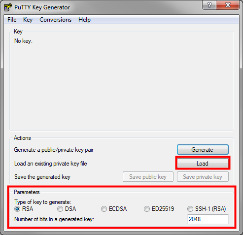

6. In the Load private key window, change the **PuTTY Private Key Files (\*.ppk)** drop-down menu option to **All Files (\*.\*)**.

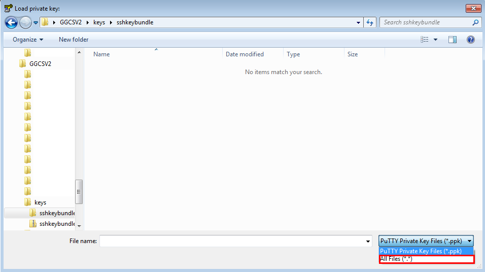

8. Find and select the **Private Key** file that you unzipped from the **sshkeybundle.zip** file, after you created an Oracle Cloud service instance. In this example, it's called **privateKey**.

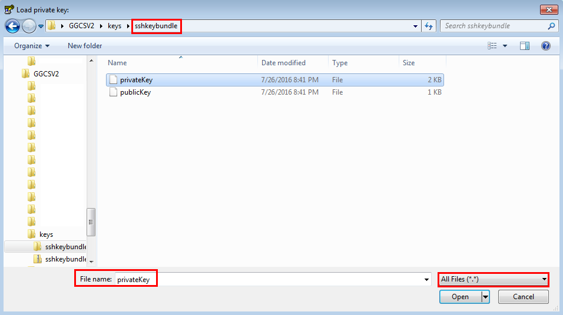

10. Click **Open**.

11. In the **PuTTYgen Notice** dialog box, click **OK**.

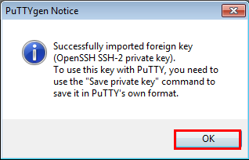

13. Change the key comment from imported-openssh-key to something meaningful. This comment appears on your PuTTY screen when you connect to your VM.

14. Click **Save private key**.

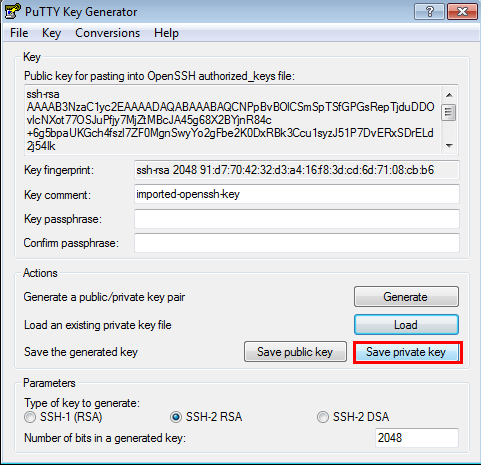

16. In the **PuTTYgen Warning** dialog box, click **Yes**.

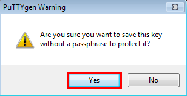

18. **Note:** The warning message suggests that you use a passphrase for extra privacy so no one can access the instance with just the private key. However, having a passphrase makes it complicated to automate, so decide whether or not to add a **passphrase** in the field.

19. If you decide to enter a passphrase, then remember it, because you can't access the instance without it.

20. If you're planning to use the private key with the ppk format for a SOCKS5 proxy connection on Linux, then you must set a passphrase. An easier way is to use the private key without the ppk format.

21. Name the **privateKey.ppk** file and save as type **.ppk (PuTTY Private Key Files)**, by entering the **.ppk** extension. This ensures that you aren't overwriting the original private key.

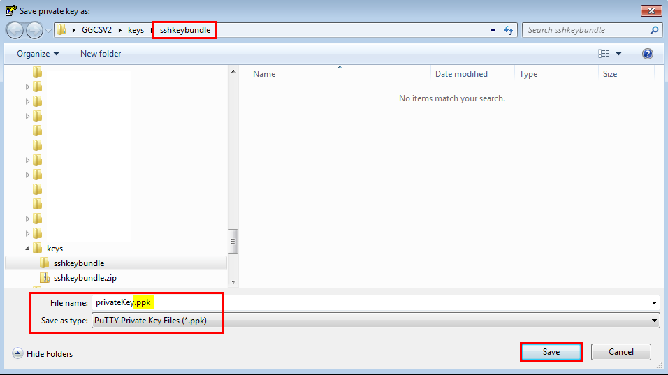

23. Click **Save**, close the PuTTY Key Generator window and remember the location of the private key file for future use.

## Convert ppk format to OpenSSH

Another option is to convert the ppk format to an OpenSSH format using the PuTTygen program:

1. Run the puTTygen program.
2. Click **Load**.
3. Select your private key that ends in `.ppk` and click **Open**.
4. Click the **Conversions** menu option.
5. Click **Export OpenSSH key**.
   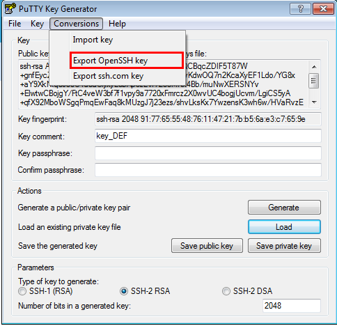

6. If you want a passphrase, enter it in the Key passphrase field and confirm it. Ensure that you know this passphrase later, because **it's not retrievable**.
7. If you didn’t choose a passphrase, confirm that you don’t want one.
   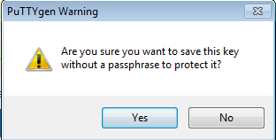

8. Give your private key a new name. For example, **SSHprivateKey** and click **Save**.
   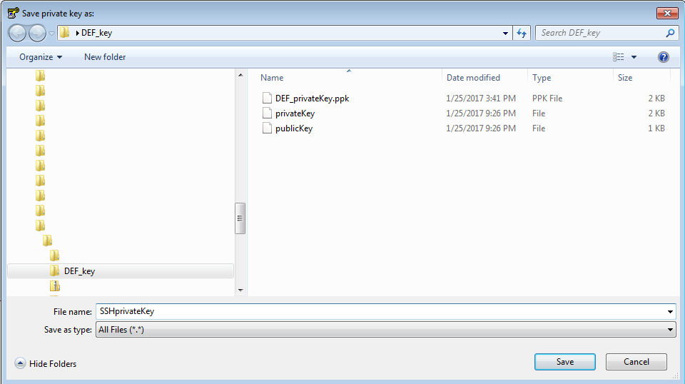

9. Close the PuTTygen program.
10. Confirm that your new private key has been saved in the location that you specified.
    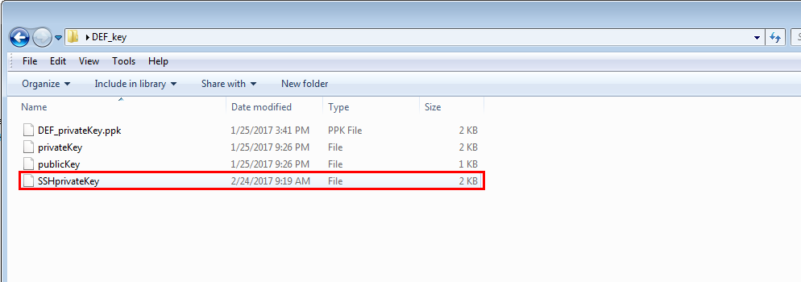

## Comments

Python paramiko connect SFTP cannot use ppk(PuTTY-User-Key-File, include public key and private key). So we need to use PuTTYgen load ppk then export OpenSSH(including private key only) key.

```python
import paramiko

hostname = 'xxx'
username = 'xxx'
password = 'xxx'
port = 22  # int

ssh = paramiko.SSHClient()
ssh.set_missing_host_key_policy(paramiko.AutoAddPolicy())
# customer_sftp.id_rsa SSH private key
ssh.connect(hostname, port=port, username=username, password=password, key_filename='./customer_sftp.id_rsa')
sftp = ssh.open_sftp()

# print(sftp)
# Some SFTP maybe not open the shell function 
# stdin, stdout, stderr = ssh.exec_command('ls')
# print(stdout.readlines())

# sftp.put(sourcefile, uploadfile)

sftp.close()
ssh.close()
```