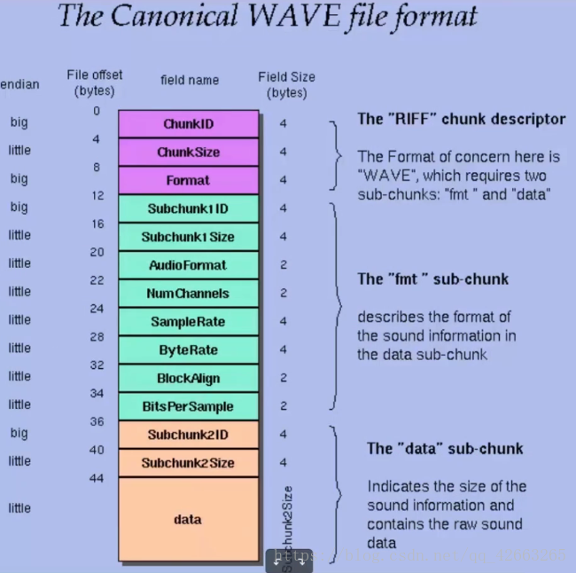

### wav 文件格式



### 字节序

小端字节序: 高位在后

大端字节序: 高位在前

```python
# 小端字节序 (513,)   2 * 256 + 1
print(struct.unpack('h', b'\x01\x02'))
# 大端字节序 (258,)   1 * 256 + 2
print(struct.unpack('>h', b'\x01\x02'))
```

### 解析 wav

降低音乐文件的音量

```python
import struct
import array

with open('snake.wav', 'rb') as fr, open('snake_copy.wav', 'wb') as fw:
    info = fr.read(44)
    # 声道数 short
    print(struct.unpack('h', info[22:24]))
    # 采样频率 int
    print(struct.unpack('i', info[24:28]))
    # 移动文件末尾
    fr.seek(0, 2)
    # 返回文件位置
    loc = fr.tell() 
    # 数据部分的长度 (h -> short)
    n = int((loc - 44) / 2)
    # 数组初始化
    buf = array.array('h', (0 for _ in range(n)))
    # 文件指针指到数据起始部分
    fr.seek(44)
    # 读取数据到 buf
    fr.readinto(buf)
    # print(buf[0])
    # 音频数据重采样 (音量减小)
    for i in range(n):
        buf[i] = int(buf[i] / 8)

    # 写入信息
    fw.write(info)
    # 写入数据
    buf.tofile(fw)
```

