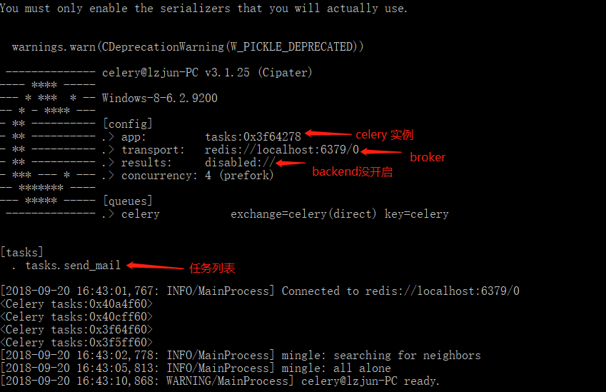
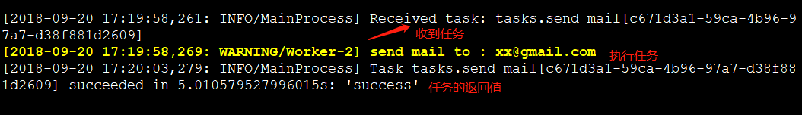

在一个应用服务中，对于时效性要求没那么高的业务场景，我们没必要等到所有任务执行完才返回结果，例如用户注册场景中，保存了用户账号密码之后，就可以立即返回，后续的账号激活邮件，可以用一种异步的形式去处理，这种异步操作可以用队列服务来实现。否则，如果等到邮件发送成功可能几秒过去了。

### Celery 是什么？

Celery 是 Python 语言实现的分布式队列服务，除了支持即时任务，还支持定时任务，Celery 有5个核心角色。

### 1、Task

任务(Task)就是你要做的事情，例如一个注册流程里面有很多任务，给用户发验证邮件就是一个任务，这种耗时任务可以交给Celery去处理，还有一种任务是定时任务，比如每天定时统计网站的注册人数，这个也可以交给Celery周期性的处理。

### 2、Broker

Broker 的中文意思是经纪人，指为市场上买卖双方提供中介服务的人。在Celery中它介于生产者和消费者之间经纪人，这个角色相当于数据结构中的队列。例如一个Web系统中，生产者是处理核心业务的Web程序，业务中可能会产生一些耗时的任务，比如短信，生产者会将任务发送给 Broker，就是把这个任务暂时放到队列中，等待消费者来处理。消费者是 Worker，是专门用于执行任务的后台服务。Worker 将实时监控队列中是否有新的任务，如果有就拿出来进行处理。Celery 本身不提供队列服务，一般用 Redis 或者 RabbitMQ 来扮演 Broker 的角色

### 3、Worker

Worker 就是那个一直在后台执行任务的人，也称为任务的消费者，它会实时地监控队列中有没有任务，如果有就立即取出来执行。

### 4、Beat

Beat 是一个定时任务调度器，它会根据配置定时将任务发送给 Broker，等待 Worker 来消费。

### 5、Backend

Backend 用于保存任务的执行结果，每个任务都有返回值，比如发送邮件的服务会告诉我们有没有发送成功，这个结果就是存在Backend中，当然我们并不总是要关心任务的执行结果。


记住这5个角色后面理解Celery就轻松了。

### 快速入门

接触任何新东西，没有什么比实际动手学得更快了。假设我们选择Redis作为broker，你需要安装redis并且已经启动了redis服务（这个步骤请自行借用搜索引擎解决）

### 0、安装celery

```python
pip install -U "celery[redis]"
```

### 1、创建Celery实例

```python
# tasks.py
from celery import Celery

app = Celery('tasks', broker='redis://localhost:6379/0')
```

### 2、创建任务

假设这个发送邮件的任务需要5秒钟才能执行完

```python
# tasks.py
@app.task
def send_mail(email):
    print("send mail to ", email)
    import time
    time.sleep(5)
    return "success"
```

在没有Celery的情况下，程序顺序执行，每个步骤都需要等上一步执行完成。又叫同步操作，例如：

```
1. 插入记录到数据库
2. 发邮件
3. 注册成功
```

我们可以把2放在一个任务中交给celery去异步执行，这样我们就不需要等待发邮件完成，你只需要安排celery去处理帮我去完成就好了。代码就变成了

```
1. 插入记录到数据库
2. 安排 celery 帮我去发邮件
3. 注册成功
```

第二步是非常快的，它只需要把任务放进队列里面去，并不会等任务真正执行完。这跟生活是完全贴切的，例如我们很多事情都不是自己亲历其为去做，而是将一个不太重要或即时性没那么高的事情转交给别人处理，我可以继续处理后面的事情。

### 3、启动 Worker

启动 Worker，监听 Broker 中是否有任务，命令：`celery worker`，你可能需要指定参数

```python
celery -A tasks worker --loglevel=info
```

-A： 指定 celery 实例在哪个模块中，例子中，celery实例在tasks.py文件中，启动成功后，能看到信息



函数用app.task 装饰器修饰之后，就会成为Celery中的一个Task。

### 4、调用任务

在主程序中调用任务，将任务发送给 Broker， 而不是真正执行该任务，比如下面的主程序是 register

```python
# user.py
from tasks import send_mail

def register():
    import time
    start = time.time()
    print("1. 插入记录到数据库")
    print("2. celery 帮我发邮件")
    send_mail.delay("xx@gmail.com")
    print("3. 告诉用户注册成功")
    print("耗时：%s 秒 " % (time.time() - start))

if __name__ == '__main__':
    register()
```

在主程序中，调用函数的`.delay`方法

目录结构：

```
── celery_test
   ├── tasks.py
   └── user.py
```

运行 python user.py， 启动应用程序

```
1. 插入记录到数据库
2. celery 帮我发邮件
3. 告诉用户注册成功
耗时：0.22688984870910645 秒 
```

程序花了不到0.23秒就执行完成，如果按照正常的同步逻辑去执行，至少需要5秒钟，因为发邮件的任务就花了5秒。

在worker服务窗口看日志信息



### 注意：

1、celery worker 启动时，如果是root用户，需要设置环境变量：

```
$ export C_FORCE_ROOT='true'
```

2、 Celery4.x Windows平台，需要运行 `celery -A your_app_name worker --pool=solo -l info`。

在Windows平台Celery运行的时候报错：ValueError: not enough values to unpack

```
[2019-05-06 09:50:10,365: ERROR/MainProcess] Task handler raised error: ValueError('not enough values to unpack (expected 3, got 0)')
Traceback (most recent call last):
  File "c:\users\lzjun\.virtualenvs\weihub-flask-j3runhkh\lib\site-packages\billiard\pool.py", line 358, in workloop
    result = (True, prepare_result(fun(*args, **kwargs)))
  File "c:\users\lzjun\.virtualenvs\weihub-flask-j3runhkh\lib\site-packages\celery\app\trace.py", line 544, in _fast_trace_task
    tasks, accept, hostname = _loc
ValueError: not enough values to unpack (expected 3, got 0)
```

Celery 的 版本是4.3.0，解决的方法是启动celery的时候添加参数 --pool=solo

```
celery -A your_app_name worker --pool=solo -l info
```

3、使用 RabbitMQ 或 Redis 作为 Broker，生产环境永远不要使用关系数据库

4、不要使用复杂对象作为任务函数的参数

```python
# Good
@app.task
def my_task(user_id):
    user = User.objects.get(id=user_id)
    print(user.name)
    # ...
# Bad
@app.task
def my_task(user):
    print(user.name)
    # ...
```

### 小结

学习Celery，首先需要知道它的应用场景，然后是Celery中的常见角色，最后按照步骤感受一下Celery是如何跑起来的。

> [Celery 快速入门 - FooFish-Python之禅](https://foofish.net/celery-toturial1.html)

