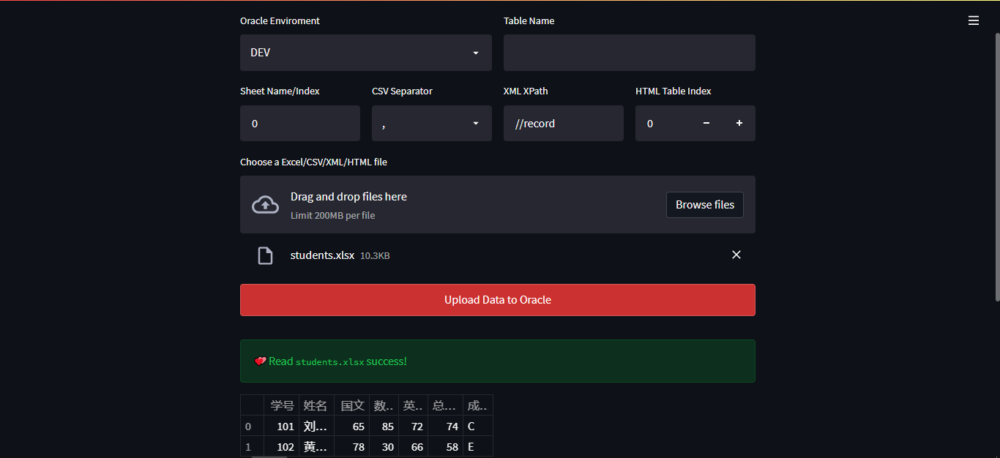

### Read Excel to Oracle

```python
from pathlib import Path
from sqlalchemy.dialects.oracle import VARCHAR2
from sqlalchemy import create_engine
import pandas as pd

dev = 'name:pwd@DEV'
conn_string = f'oracle+cx_oracle://{dev}'


def read_excels_to_db(paths):
    for path in paths:
        tablename = path.stem
        df = pd.read_excel(path, keep_default_na=False, engine='xlrd')
        # dtype = {c: VARCHAR2(df[c].str.len().max())
        #          for c in df.columns[df.dtypes == 'object'].tolist()}
        dtype = {c: VARCHAR2(1000)
                 for c in df.columns[df.dtypes == 'object'].tolist()}

        engine = create_engine(conn_string, echo=False)
        df.to_sql(tablename, con=engine, index=False, if_exists='append',
                  dtype=dtype, chunksize=10**4)


if __name__ == '__main__':
    paths = Path('./').glob('*.xlsx')
    read_excels_to_db(paths)

```

### Compress file to zip

```python
import os
import zipfile

def zip_large_file(filepath: str, max_size: int = 10 * 1024 * 1024):
    if os.path.getsize(filepath) > max_size:
        zip_file = os.path.splitext(filepath)[0] + '.zip'
        with zipfile.ZipFile(zip_file, 'w', zipfile.ZIP_DEFLATED) as zf:
            zf.write(filepath, os.path.basename(filepath))
        return zip_file
    else:
        return filepath
```

### Read Excel/XML/CSV/HTML  to Oracle by Streamlit and Pandas

```python
import os
import pandas as pd
import streamlit as st
from sqlalchemy import create_engine
from sqlalchemy.dialects.oracle import VARCHAR2


col1, col2 = st.columns(2)

with col1:
    env = st.selectbox('Oracle Enviroment', ('DEV', 'TEST', 'PROD'))

if env in ('DEV', 'TEST'):
    conn_string = f'oracle+cx_oracle://apps:apps@{env}'
elif env in ('PROD'):
    conn_string = f'oracle+cx_oracle://apps:serapps@{env}'

engine = create_engine(conn_string, echo=False)

with col2:
    tablename = st.text_input('Table Name', '')


col1, col2, col3, col4 = st.columns(4)

with col1:
    sheet_name_index = st.text_input('Excel Sheet Name/Index', '0')
    try:
        sheet_name = int(sheet_name_index)
    except:
        sheet_name = sheet_name_index


with col2:
    csv_separator = st.selectbox('CSV Separator', (',', '|', ':'))

with col3:
    xpath = st.text_input('XML XPath', '//record')

with col4:
    table_index = st.number_input('HTML Table Index', value=0)


uploaded_files = st.file_uploader(
    'Choose a Excel/CSV/XML/HTML file', accept_multiple_files=True)


is_upload = st.button('Upload Data to Oracle')
# button default style
# <div class="row-widget stButton">
#   <button kind="primary" class="css-1cpxqw2 edgvbvh1">Upload</button>
# </div>
st.markdown("""
<style>
div.stButton  button:first-child {
    background-color: rgb(204, 49, 49);
    width: 100%;
    color: #fff;
    padding: 8px;
}
</style>""", unsafe_allow_html=True)


if is_upload:
    for uploaded_file in uploaded_files:
        filename = uploaded_file.name
        basename, extension = os.path.splitext(filename)

        if not tablename:
            tablename = basename.lower()

        if extension in ('.xls', '.xlsx'):
            df = pd.read_excel(
                uploaded_file, sheet_name=sheet_name, keep_default_na=False, engine='openpyxl')
        elif extension in ('.csv', '.txt'):
            df = pd.read_csv(
                uploaded_file, keep_default_na=False, sep=csv_separator)
        elif extension in ('.xml'):
            df = pd.read_xml(uploaded_file, xpath=xpath)
        elif extension in ('.html'):
            data_lists = pd.read_html(uploaded_file)
            df = pd.DataFrame(data_lists[table_index])
        else:
            f'Unknown file format `{extension}`'

        dtype = {c: VARCHAR2(1000)
                 for c in df.columns[df.dtypes == 'object'].tolist()}
        st.success(f'💕Read `{filename}` success!')
        st.write(df.head())

        df.to_sql(tablename, con=engine, index=False,
                  if_exists='append', dtype=dtype, chunksize=10**4)

        st.success(f'💕Upload `{filename}` success!')
		'***' # markdown horizontal rule

# streamlit run 
```


