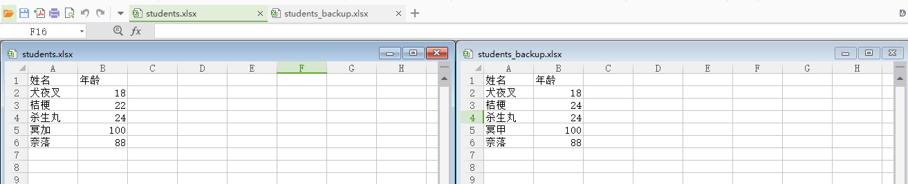
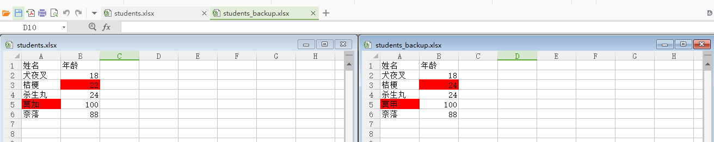

## xlrd

xlrd 读取 excel, 使用 xlrd 读取 excel 数据需要注意的类型.

| Sample           | Type symbol     | Type number | Python value                                                 | Converted value   |
| ---------------- | --------------- | ----------- | ------------------------------------------------------------ | ----------------- |
|                  | XL_CELL_EMPTY   | 0           | empty string ''                                              | None              |
| abc              | XL_CELL_TEXT    | 1           | a Unicode string                                             |                   |
| 123              | XL_CELL_TEXT    | 1           | a Unicode string                                             |                   |
| 123.0            | XL_CELL_TEXT    | 1           | a Unicode string                                             |                   |
| 123              | XL_CELL_NUMBER  | 2           | float                                                        | int               |
| 123.45           | XL_CELL_NUMBER  | 2           | float                                                        |                   |
| 2019/10/25       | XL_CELL_DATE    | 3           | float                                                        | datetime.datetime |
| 18:45:05         | XL_CELL_DATE    | 3           | float                                                        | datetime.datetime |
| 2019/10/25 19:37 | XL_CELL_DATE    | 3           | float                                                        | datetime.datetime |
| TRUE             | XL_CELL_BOOLEAN | 4           | int; 1 means TRUE, 0 means FALSE                             | bool              |
| #REF!            | XL_CELL_ERROR   | 5           | int representing internal Excel codes; for a text representation, refer to the supplied dictionary error_text_from_code | str               |

```python
import xlrd
from pprint import pprint


def read_sheet(sheet):
    """Read a worksheet's content into a 2-dimensional list

    :sheet: xlrd.sheet.Sheet instance
    :returns: list

    """
    sheet_values = []
    for row_num in range(sheet.nrows):
        row = sheet.row(row_num)
        row_values = []
        for cell in row:
            if cell.ctype == 0:     # XL_CELL_EMPTY
                row_values.append(None)
            elif cell.ctype == 2:   # XL_CELL_NUMBER
                # Trim the trailing ".0" by converting the number to int.
                if cell.value == int(cell.value):
                    row_values.append(int(cell.value))
                else:
                    row_values.append(cell.value)
            elif cell.ctype == 3:   # XL_CELL_DATE
                # Convert an Excel date/time number into a datetime.datetime object.
                # datemode=0: 1900-based on Windows
                row_values.append(
                    xlrd.xldate.xldate_as_datetime(cell.value, datemode=0))
            elif cell.ctype == 4:   # XL_CELL_BOOLEAN
                row_values.append(bool(cell.value))
            elif cell.ctype == 5:   # XL_CELL_ERROR
                row_values.append(xlrd.biffh.error_text_from_code[cell.value])
            else:
                row_values.append(cell.value)
        sheet_values.append(row_values)
    return sheet_values


if __name__ == "__main__":
    workbook = xlrd.open_workbook('test.xlsx')
    sheets = workbook.sheets()
    for sheet in sheets:
        data = read_sheet(sheet)
        pprint(data)

```

## xlwings

### compare excel

```python
import xlwings as xw

app = xw.App(visible=False, add_book=False)
book = app.books.open('students.xlsx')
book_backup = app.books.open('students_backup.xlsx')

for row in book.sheets[0].range("A1").expand():
    for cell in row:
        back_cell = book_backup.sheets[0].range(cell.address)
        if cell.value != back_cell.value:
            cell.color = back_cell.color = (255, 0, 0)

book.save()
book.close()

book_backup.save()
book_backup.close()

app.quit()
```



