### 系統環境

> 繁体操作系統: Microsoft Windows Server 2012 R2 Standard
>
> Python 版本：Python 3.6.2
>
> Web 框架: Python Flask
>
> 服務器：IIS (Internet Information Services)

### 启动 IIS 服务，安裝 CGI

1 控制台(檢視方式: 類別) -> 程式集 -> 開啓或關閉 Windows 功能

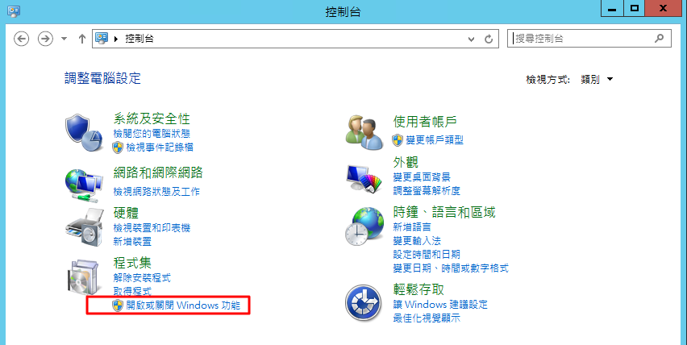

2 安裝 IIS 管理工具和 CGI

IIS 管理工具

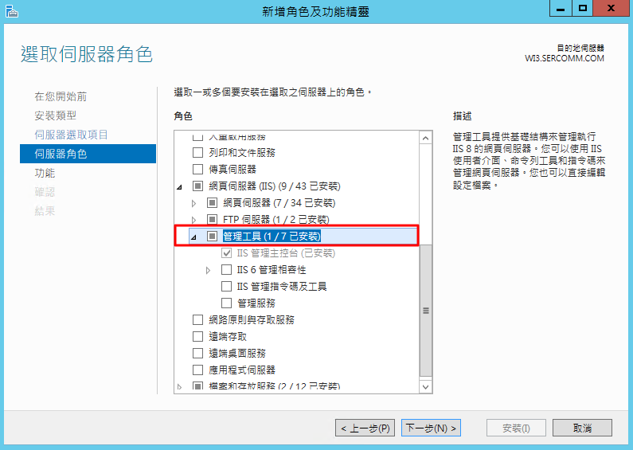

CGI 如果沒有安裝 CGI, **後續處理常式對應 會找不到 FastCgiModule**

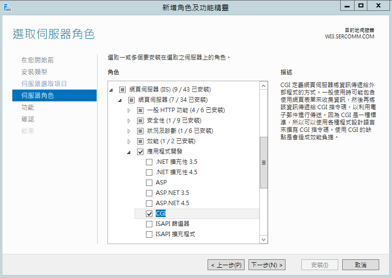

### 添加站臺

打開 IIS 服務 -> 站台 -> 新增網站，在弹出的窗口输入 `站台名稱` `實體路徑` `連接埠`

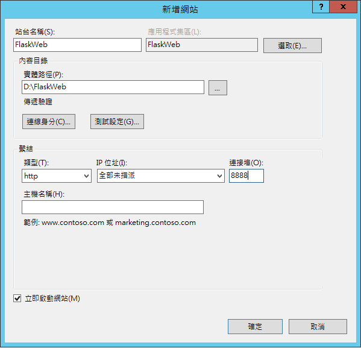

### Flask 项目添加插件

#### 安裝 wfastcgi

`pip install wfastcgi`

#### 啓動 wfastcgi

進入 Python Scripts 目錄 `C:\Program Files\Python36\Scripts` 執行 `wfastcgi-enable.exe`

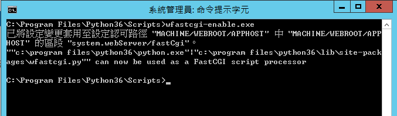

複製 FastCGI script processor

`"c:\program files\python36\python.exe"|"c:\program files\python36\lib\site-packages\wfastcgi.py"`

注意: program files 包含空格，需要用引號引起來, 複製時需要注意，如果設置錯誤會出現

<p style="color:red">HTTP 錯誤 500.0 - Internal Server Error </p>
<p style="color: red"> c:\program files\python36\python.exe - FastCGI 處理序意外地結束</p>

#### 配置 web.config

在項目根目錄下創建 web.config

如果使用 log, 路徑不要配置在項目目錄下, 需要配置其他目錄下。

```xml
<?xml version="1.0" encoding="UTF-8"?>
<configuration>
    <system.webServer>
        <security>
            <!-- URL 重写中的特殊字符，比如加号+等等 -->
            <requestFiltering allowDoubleEscaping="true"></requestFiltering>
        </security>
    </system.webServer>

    <appSettings>
        <!-- Required settings -->
        <!-- 指定 Falsk app 的 Python 文件名字，后面记得加上“.app” -->
        <add key="WSGI_HANDLER" value="hello.app" />
        <add key="PYTHONPATH" value="~/" />

        <!-- Optional settings -->
        <!-- 需要先创建日志目录，否则报错 -->
        <add key="WSGI_LOG" value="D:/logs/web.log" />
        <add key="WSGI_RESTART_FILE_REGEX" value="" />
    </appSettings>
</configuration>
```

### 配置 FastCGI

#### 處理常式對應

處理常式對應 -> 新增模組對應

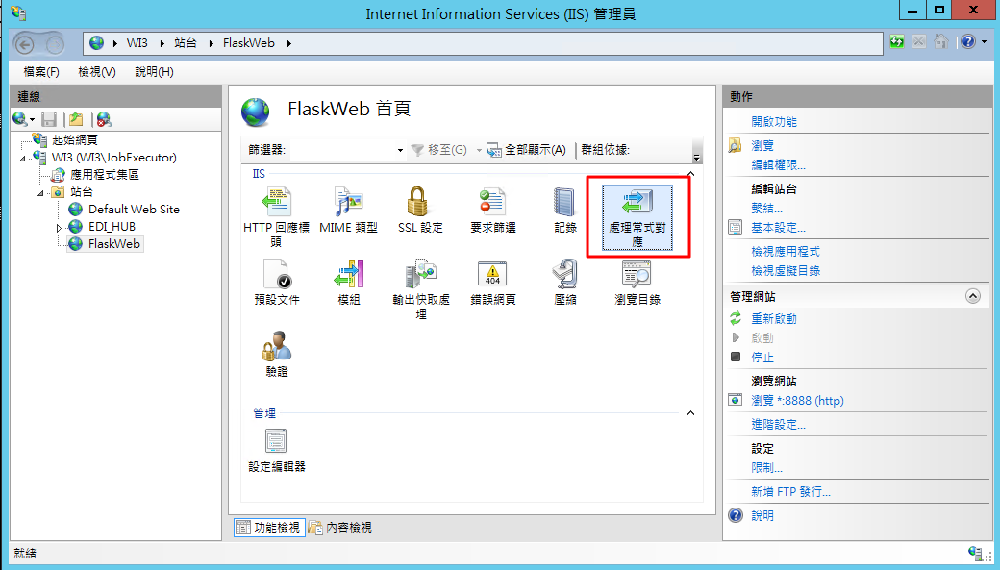

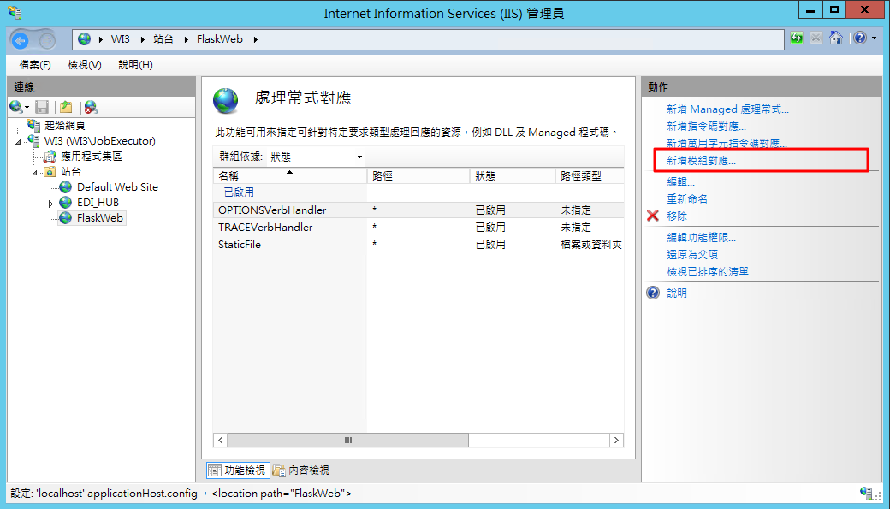

執行檔案填寫之前複製的 FastCGI script processor，program files 包含空格，需要用引號引起來

`"c:\program files\python36\python.exe"|"c:\program files\python36\lib\site-packges\wfastcgi.py"`

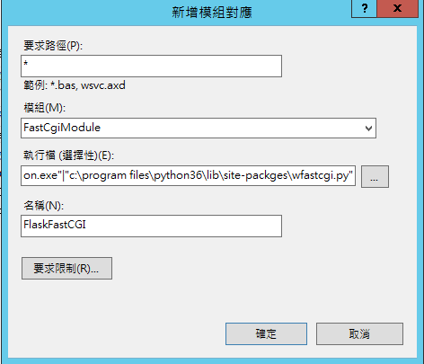

點擊要求限制：不要勾選方框

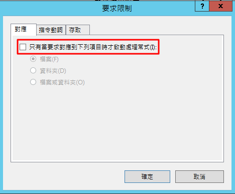

#### 主頁 FastCGI 設置

`PYTHONPATH(項目根路徑，不是 app 路徑)`

`WSGI_HANDLER(flask 啓動程序,例如項目啓動程序是 hello.py, 那麽此處需要填寫 hello.app)`

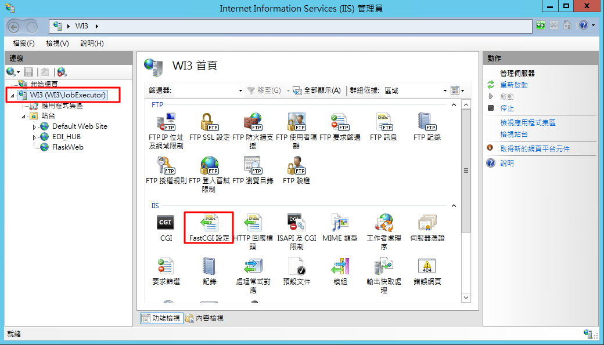

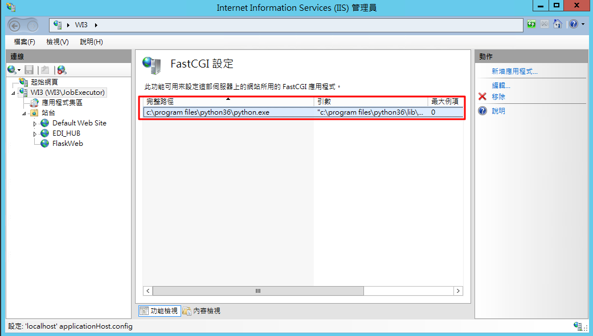

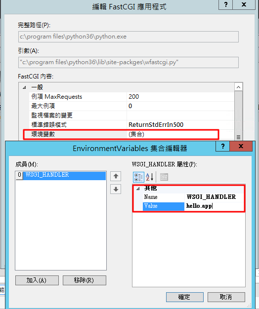

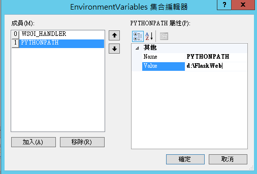
