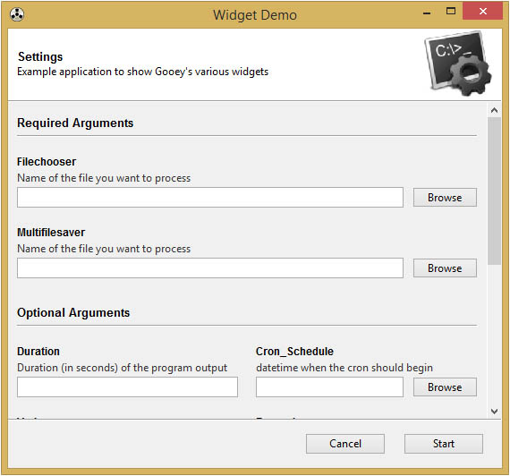
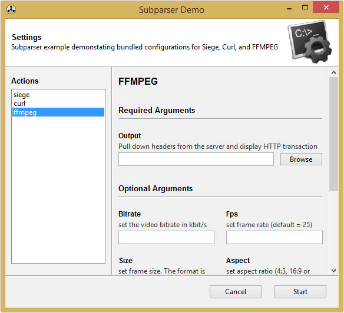

> [Gooey——把 CLI 程序变成 GUI | Python One to Million](https://py.windrunner.me/console/gooey.html)

[Gooey](https://github.com/chriskiehl/Gooey) 是一个 Python GUI 程序开发框架，基于 [wxPython](http://www.wxpython.org/) GUI 库，其使用方法类似于 Python 内置 CLI 开发库 argparse，因此很容易把一个基于 argparse 的 CLI 应用转换成 GUI 程序。

### 简单的示例

我们首先从一个简单的基于 argparse 库的 CLI 应用开始：

```python
from argparse import ArgumentParser

def main():
    parser = ArgumentParser(description="My Cool GUI Program!")
    parser.add_argument('Filename')
    parser.add_argument('Date')
    parser.parse_args()

if __name__ == '__main__':
    main()
```

这就有了一个接受 `Filename` 和 `Date` 的两个必填参数的 CLI 程序，为了简化程序我们并没有指定它的功能。

使用方法：`python cli.py FILENAME DATE`。

现在我们把它改成

```python
from gooey import Gooey, GooeyParser

@Gooey
def main():
    parser = GooeyParser(description="My Cool GUI Program!")
    parser.add_argument('Filename')
    parser.add_argument('Date')
    parser.parse_args()

if __name__ == '__main__':
    main()
```

于是我们得到了一个简单的 GUI 对话框，并且基本上没有修过多少代码：


当然，仅仅这样是不够的，我们的 Filename 参数需要对应一个文件，而 Date 参数是一个日期，如果有专用的控件就好了！ Gooey 当然也想到了：


仅仅修改了 2 行代码：

```python
parser.add_argument('Filename', widget="FileChooser")
parser.add_argument('Date', widget="DateChooser")
```

### 控件

上面已经看到了两个简单的控件：`FileChooser` 和 `DateChooser`，分别提供了一个“文件选择器”和 “日期选择器”。现在支持的 chooser 类控件有：

| 控件名           | 控件类型   |
| ---------------- | ---------- |
| FileChooser      | 文件选择器 |
| MultiFileChooser | 文件多选器 |
| DirChooser       | 目录选择器 |
| MultiDirChooser  | 目录多选器 |
| FileSaver        | 文件保存   |
| DateChooser      | 日期选择   |
| TextField        | 文本输入框 |
| Dropdown         | 下拉列表   |
| Counter          | 计数器     |
| CheckBox         | 复选框     |
| RadioGroup       | 单选框     |

### 国际化

Gooey 的国际化是通过配置实现的，使用方法如下：

```python
@Gooey(language='russian')
def main():
    ...
```

目前仅支持 `russian`，`english`、`dutch`、`french`、`portuguese` 的支持已在计划中。

### 配置

和 `language` 参数配置一样，Gooey 还支持很多其它配置，下面是它支持的参数列表：

| 参数                | 简介                                                                    |
| ------------------- | ----------------------------------------------------------------------- |
| advanced            | 切换显示全部设置还是仅仅是简化版本                                      |
| show_config         | Skips the configuration all together and runs the program immediately   |
| language            | 指定从 `gooey/languages` 目录读取哪个语言包                             |
| program_name        | GUI 窗口显示的程序名。默认会显 `sys.argv[0]`。                          |
| program_description | `Settings` 窗口顶栏显示的描述性文字。默认值从 `ArgumentParser` 中获取。 |
| default_size        | 窗口默认大小。                                                          |
| required_cols       | 设置必选参数行数。                                                      |
| optional_cols       | 设置可选参数行数。                                                      |
| dump_build_config   | 将设置以 JSON 格式保存在硬盘中以供编辑/重用。                           |

### 布局流

布局实例可以在下载这个 [exmaple 库](https://github.com/chriskiehl/GooeyExamples)体验。

| Flat Layout                         | Column Layout                          |
| ----------------------------------- | -------------------------------------- |
|  |  |
