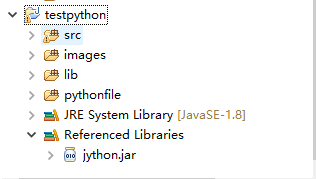
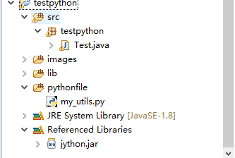

这段时间要做一个毕业设计，主要设计到图片识别的东西，但是机器学习那一块是用 CAFFE 的 python 接口做的，然后 Web 和 APP 使用 Java 语言开发的，所有开发的应用项目（网站和移动客户端）需要调用图片识别的 python 脚本，后来查查资料，使用 Jython 可以满足在 Java 中执行 python 脚本。

**测试环境：**

- Eclipse
- 1.8 的 JDK
- Jython 版本 2.5.2（只要 jar 包就行了）

这里默认大家已经安装了 Eclipse 和 JDK，JDK 不是 1.8 的也可以，使用平时开发用的 JDK 就可以了，至于 jython.jar 需要到官网去下载

1.建立一个 java project，然后将 jython.jar 文件放到目录下，然后选择 Build Path，将 jython.jar Add to Build Path 这样 就能使用 jython 的 API 了



2.在上面的图片中，已经显示了我的 project 的目录，其中 src 主要放测试代码，lib 放 jar 包，images 里面可以放一下后期要用到的图片，pythonfile 里面存放 python 脚本

3.建立相关文件后



其中 my_utils.py 中，我就简单的放了一个函数，主要是演示一下，java 调用 python 文件的方法；Test.java 里面是 java 的测试函数入口

先展示一下 my_utils.py 中的代码：

```python
#coding:utf-8

#do not have chinese

def adder(a, b):
    return a + b

if __name__ == '__main__':　　
    print(adder(2, 10))
```

**4.下面介绍两种调用方法：**

（1）在 Java 文件中调用本机 python 脚本中的函数

Test.java:

```java
//调用python文件中的函数，进行两个数求和运算
PythonInterpreter interpreter = new PythonInterpreter();
interpreter.execfile("./pythonfile/my_utils.py");
PyFunction func =     (PyFunction)interpreter.get("adder",PyFunction.class);
int a = 10, b = 2 ;
PyObject pyobj = func.__call__(new PyInteger(a), new PyInteger(b));
System.out.println("anwser = " + pyobj.toString());
```

（2）在 Java 文件中直接执行 python 脚本

Test.java:

```java
//直接运行python脚本
PythonInterpreter interpreter = new PythonInterpreter();

//执行python py文件
interpreter.execfile("pythonfile/my_utils.py");
```

两次的结果都是 12，区别 是：方法一调用函数，需要传递参数，大家可以注意一下，在 Java 文件中参数的传递方法，这算是 Jython 的一个特点吧；第二种方法直接运行脚本，在 Python 中将文件作为脚本运行可以加上 `if __name__ == '__main__'` 来判断，如果是作为脚本运行，就会执行 if 里面的代码，在这里就是调用一下函数，并打印结果。
