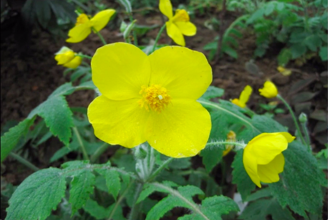
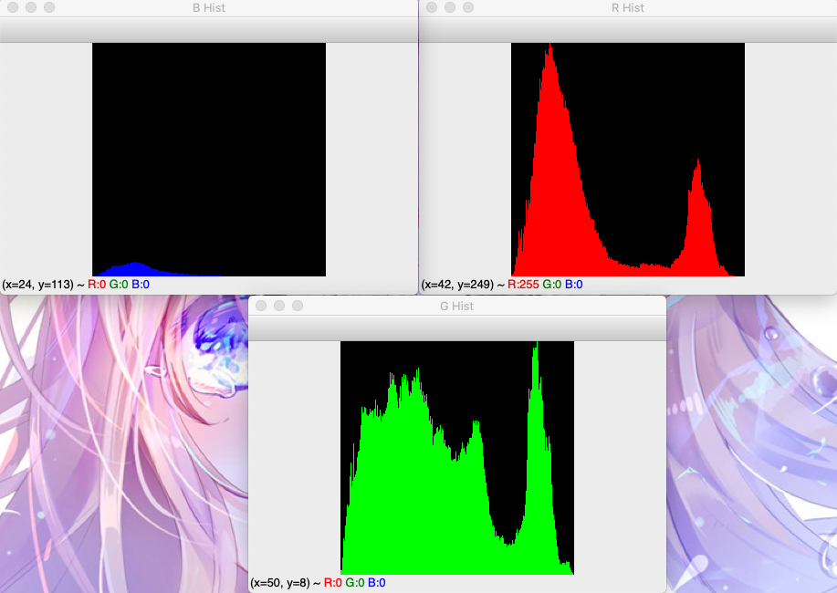

### 基础

#### 图像读取和显示

```python
import cv2 
# 0: 灰度图像, 1: 彩色图像
img = cv2.imread('image0.jpg', 1)
cv2.imshow('Image Title', img)
cv2.waitKey()  # 等待
# cv2.waitKey(2000) # 等待 2000 ms 后退出
```

#### 图像写入

```python
import cv2

img = cv2.imread('image0.jpg', 1)
cv2.imwrite('image1.jpg', img) 
```

#### 图像质量

```python
import cv2 
img = cv2.imread('image0.jpg', 1)
# [cv2.IMWRITE_JPEG_QUALITY, 0] jpg 图像质量 0-100, 0质量最差,压缩最大; jpg 是有损压缩
cv2.imwrite('imageTest.jpg', img, [cv2.IMWRITE_JPEG_QUALITY, 0])

# [cv2.IMWRITE_PNG_COMPRESSION, 0] png 图像压缩 0-9, 0压缩最小; png 是无损压缩
cv2.imwrite('imageTest.png', img, [cv2.IMWRITE_PNG_COMPRESSION, 0])
```

#### 像素操作

```python
import cv2
img = cv2.imread('image0.jpg', 1)
b, g, r = img[100, 100] # blue green red(bgr) not rgb
print(b, g, r)

for i in range(100):
    img[10 + i, 100] = (0, 0, 255)

cv2.imshow('Image Title', img)
cv2.waitKey(2000) 
```

### 图像美化

#### 彩色图片直方图

```python
import cv2
import numpy as np

def ImageHist(image, type):
    color = (255, 255, 255)
    windowName = 'Gray'
    if type == 31:
        color = (255, 0, 0)
        windowName = 'B Hist'
    elif type == 32:
        color = (0, 255, 0)
        windowName = 'G Hist'
    elif type == 33:
        color = (0, 0, 255)
        windowName = 'R Hist'
    # calcHist(images, channels(0 灰色通道), mask, histSize, ranges[, hist[, accumulate]]) -> hist
    hist = cv2.calcHist([image], [0], None, [256], [0.0, 255.0])
    # 最小值，最大值，最小值索引，最大值索引
    minV, maxV, minL, maxL = cv2.minMaxLoc(hist)
    histImg = np.zeros([256, 256, 3], np.uint8)
    for h in range(256):
        # 归一化
        normal = int(hist[h] * 256 / maxV)
        cv2.line(histImg, (h, 256), (h, 256 - normal), color)
    cv2.imshow(windowName, histImg)
    return histImg


img = cv2.imread('../images/image0.jpg', 1)
channels = cv2.split(img) # RGB -> R G B
for i in range(0, 3):
    ImageHist(channels[i], 31 + i)
cv2.waitKey(0)
```





