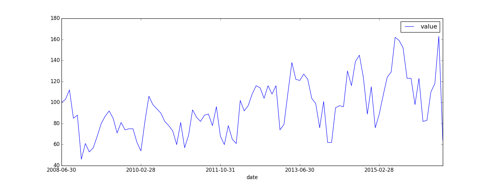

### load csv

```python
import pandas as pd
import matplotlib.pyplot as plt
df = pd.read_csv('data.csv')
# 打印前几条数据
# print(df.head())
'''
         Date  Value
0  2016-06-30   64.0
1  2016-05-31  163.0
2  2016-04-30  118.0
3  2016-03-31  110.0
4  2016-02-29   83.0
'''
def format_dataframe(df):
    # 把列名变成小写的"date"和"value"
    df.columns = ['date','value']
    # 按照时间顺序，排列数据
    df.sort_values(by='date',inplace=True)
    # 把时间设置为数据框的索引，这主要是便于后面绘图的时候，横轴正确显示日期数据
    df.set_index('date',inplace=True)
    return df
df = format_dataframe(df)
# print(df)
'''
    inplace = True
                value
    date
    2008-06-30  100.0
    2008-07-31  103.0
    2008-08-31  112.0

    inplace = False
                date  value
    0   2016-06-30   64.0
    1   2016-05-31  163.0
    2   2016-04-30  118.0
'''
df.plot(figsize=(16, 6))
plt.show()
```



#### 读取txt文件，自己指定分隔符、列名

```python
import pandas as pd
df = pd.read_csv(
    './test.txt',
    sep="\t",
    header=None,
    names=['pdate', 'pv', 'uv']
)


df = pd.read_csv(
    "./movies.dat",
    header=None,
    names="MovieID::Title::Genres".split("::"),
    sep="::",
    engine="python"
)
```

### load json

```python
import json
import pandas as pd
import matplotlib.pyplot as plt
def format_dataframe(df):
    # 把列名变成小写的"date"和"value"
    df.columns = ['date','value']
    # 按照时间顺序，排列数据
    df.sort_values(by='date',inplace=True)
    # 把时间设置为数据框的索引，这主要是便于后面绘图的时候，横轴正确显示日期数据
    df.set_index('date',inplace=True)
    return df

with open('data.json') as f :
    data = json.load(f)
    # JSON正确缩进后输出
    # print(json.dumps(data,indent=2))
    '''
    {
        "dataset": {
            "dataset_code": "M550_SALES",
            "transform": null,
            "frequency": "monthly",
            "id": 35366971,
            "data": [
            [
                "2016-06-30",
                64.0
            ],
            [
                "2016-05-31",
                163.0
            ]
          ]
        }
    }
    '''
    df = pd.DataFrame(data['dataset']['data'])
    # print(df.head())
    df = format_dataframe(df)
    # print(df.head())
    df.plot(figsize=(16, 6))
    plt.show()
```

### load xml

```python
from bs4 import BeautifulSoup
import pandas as pd
import matplotlib.pyplot as plt
with open('data.xml') as f :
    data = f.read()
    soup = BeautifulSoup(data,'lxml')
    # print(soup)
    '''
    <data>
        <datum type="array">
        <datum type="date">2008-07-31</datum>
        <datum type="float">103.0</datum>
        </datum>
        <datum type="array">
        <datum type="date">2008-06-30</datum>
        <datum type="float">100.0</datum>
        </datum>
    </data>
    '''
    dates = soup.find_all('datum',type='date')
    # print(dates[:5])
    dates = [item.text for item in dates]
    # print(dates[:5])
    values = soup.find_all('datum',type='float')
    values = [item.text for item in values]
    df = pd.DataFrame({'dates':dates,'values':values})
    # print(df.head())
    df = format_dataframe(df)
    df.plot(figsize=(16, 6))
    plt.show()
```

### load excel

```python
import pandas as pd
df = pd.read_excel('./test.xlsx')
```

### load db

##### mysql

```python
import pandas as pd
import pymysql
conn = pymysql.connect(
        host='127.0.0.1',
        user='root',
        password='root',
        database='test',
        charset='utf8'
    )
df = pd.read_sql("select * from test", con=conn)
```

