> 转载: [Pipenv——最好用的python虚拟环境和包管理工具 - ZingpLiu - 博客园](https://www.cnblogs.com/zingp/p/8525138.html)

pipenv 是[**Kenneth Reitz**](https://www.kennethreitz.org/)大神的作品，能够有效管理 Python 多个环境，各种包。过去我们一般用 virtualenv 搭建虚拟环境，管理 python 版本，但是跨平台的使用不太一致，且有时候处理包之间的依赖总存在问题；过去也常常用 pip 进行包的管理，pip 已经足够好，但是仍然推荐 pipenv，相当于 virtualenv 和 pip 的合体，且更加强大。pipenv 开源之后，在 GitHub 上有很高人气（截止于现在有 9600 多星）。

**pipenv 主要有以下特性：**

（1）pipenv 集成了 pip，virtualenv 两者的功能，且完善了两者的一些缺陷。

（2）过去用 virtualenv 管理 requirements.txt 文件可能会有问题，Pipenv 使用 Pipfile 和 Pipfile.lock，后者存放将包的依赖关系，查看依赖关系是十分方便。

（3）各个地方使用了哈希校验，无论安装还是卸载包都十分安全，且会自动公开安全漏洞。。

（4）通过加载.env 文件简化开发工作流程。

（5）支持 Python2 和 Python3，在各个平台的命令都是一样的。

下面快速介绍 pipenv 的基本使用，文章末尾有其 github 链接。本文的测试环境是 windows 下的 Python3.6，对于其他平台同样适用。

### 1 安装 pipenv

首先请确保安装了 python3 和对应的 pip3，如果你的 python 和 pip 对应的是 python3.x,忽略数字 3。

```
pip3 install pipenv
```

### 2 创建虚拟环境

```
mkdir project
cd project
pipenv install
```

如下：

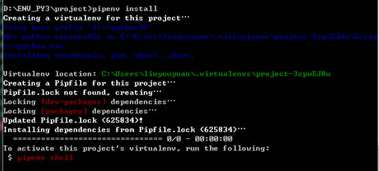

初始化好虚拟环境后，会在项目目录下生成 2 个文件`Pipfile`和`Pipfile.lock`。为 pipenv 包的配置文件，代替原来的 requirement.txt。

项目提交时，可将`Pipfile` 文件和`Pipfile.lock`文件一并提交，待其他开发克隆下载，根据此 Pipfile 运行命令`pipenv install --dev`生成自己的虚拟环境。

`Pipfile.lock` 文件是通过 hash 算法将包的名称和版本，及依赖关系生成哈希值，可以保证包的完整性。

### 3 安装 python 包（module）

用 pycharm 先打开咱们刚刚创建的 project，然后创建 APP 目录，在 app 目录下创建如下 spider.py 文件，导入 requests 库，并没有安装这个包。

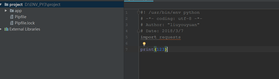

安装 requests 包，命令如下：

```
pipenv install requests
```

详情参见下图：

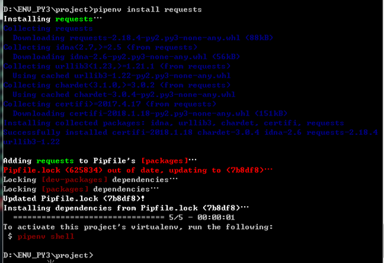

这样，在 pycharm 里就能看到 requests 已经可用，并且能抓取到网页了。

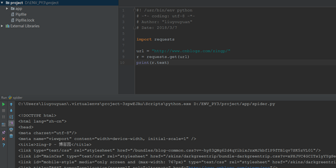

### 4 查看安装包及依赖关系

命令如下：

```
pipenv graph
```

详情参见下图：

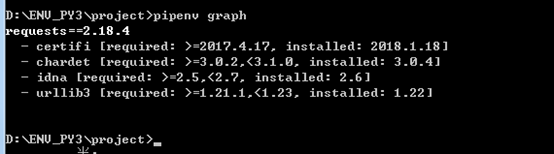

4.1 通过--dev 指明只安装在开发环境中

```
pipenv install --dev requests --three
```

详情如下图：

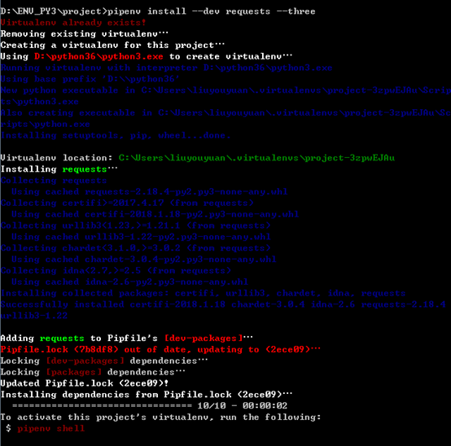

反应在 Pipfile 如下：

```ini
[[source]]

url = "https://pypi.python.org/simple"
verify_ssl = true
name = "pypi"


[packages]

requests = "*"


[dev-packages]

requests = "*"


[requires]

python_version = "3.6"
```

安装包记录是在`[dev-packages]` 部分，或是`[packages]` 部分。

在安装时，指定`--dev`参数，则只安装`[dev-packages]`下的包；若安装时不定指定`--dev`参数，只会安装`[packages]` 包下面的模块。

在构建新的 python 虚拟环境时，会自动下载安装`[requires]` 下的包。

### 5 兼容 requirements.txt 文件

**5.1 pipenv 可以像 virtualenv 一样用命令生成 requirements.txt 文件**，命令如下：

```
pipenv lock -r --dev > requirements.txt
```

详情如下图：

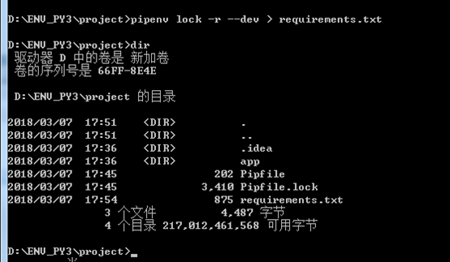

**5.2 pipenv 也可以通过 requirements.txt 安装包**

命令参见：

```
pipenv install -r requirements.txt
```

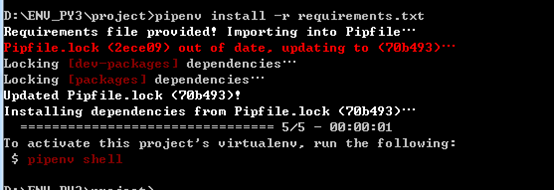

这样我们可以重用之前的 requirement.txt 文件来构建我们新的开发环境，把我们的项目顺利的迁到 pipenv。

### 6 运行 python 代码（py 文件）

**6.1 方法一： pipenv run python xxx.py**

```
pipenv run python xxx.py
```

详情如下：

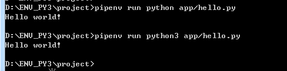

**6.2 方法二：启动虚拟环境的 shell 环境**

```
pipenv shell
```

详情如下：

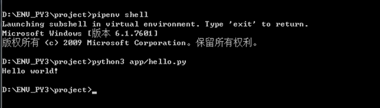

加上参数也可：

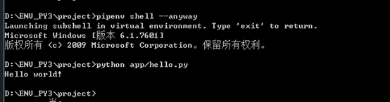

### 7 删除 python 包（module）

删除包的命令：

```
pipenv uninstall [module_name]
```

例如卸载之前安装的 requests 包：

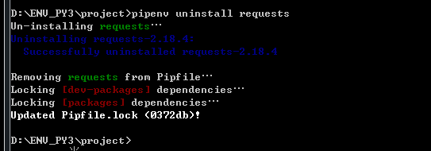

### 8 删除虚拟环境

```
pipenv --rm
```

如下：

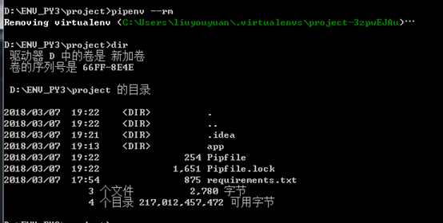

删除虚拟环境之后，再次运行 pip shell 会发现先为这个 project 创建虚拟环境，然后再打开 shell。如下：

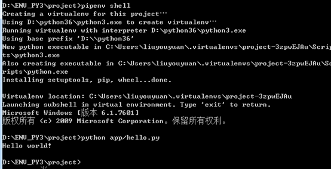

### 9 常用命令一览

```
pipenv --where                 列出本地工程路径
pipenv --venv                  列出虚拟环境路径
pipenv --py                    列出虚拟环境的Python可执行文件
pipenv install                 创建虚拟环境
pipenv isntall [moduel]        安装包
pipenv install [moduel] --dev  安装包到开发环境
pipenv uninstall[module]       卸载包
pipenv uninstall --all         卸载所有包
pipenv graph                   查看包依赖
pipenv lock                    生成lockfile
pipenv run python [pyfile]     运行py文件
pipenv --rm                    删除虚拟环境
```

作者：[ZingpLiu](http://www.cnblogs.com/zingp/)
出处：http://www.cnblogs.com/zingp/
本文版权归作者和博客园共有，欢迎转载，但未经作者同意必须保留此段声明，且在文章页面明显位置给出原文连接。
