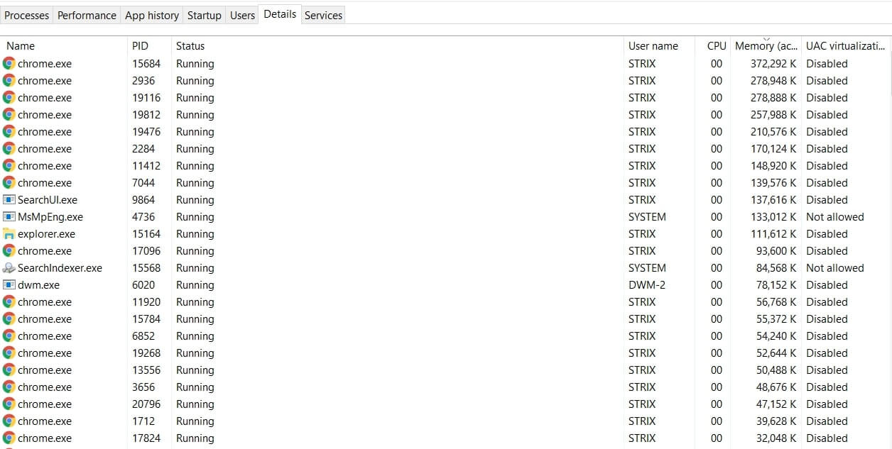
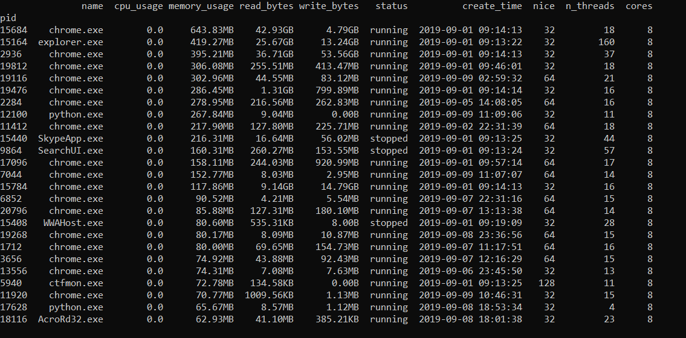

> 转载：[How to Make a Process Monitor in Python - Python Code](https://www.thepythoncode.com/article/make-process-monitor-python)

Monitoring [operating system processes](<https://en.wikipedia.org/wiki/Process_(computing)>) enables us to monitor and display process activity in the real time. In this tutorial, you will learn how to retrieve information on running processes in the operating system using Python, and build a task manager around it !

Now you're may be thinking about creating something like this:



Well, not exactly, we gonna make a command line version of this, the final script output will be this:



However, if you are a GUI programmer, you can make this a lot better with your own design and compete with Windows Task Manager!

**\*Related:** How to Handle Files in Python using OS Module.\*

Alright, now let's get into building this. First, let's install the dependencies:

```markup
pip3 install psutil pandas
```

Open up a new Python file and import the necessary modules:

```python
import psutil
from datetime import datetime
import pandas as pd
import time
import os
```

We'll use [psutil](https://github.com/giampaolo/psutil) as it is a cross-platform library for retrieving running processes information in Python.

The reason that we need [pandas](https://pandas.pydata.org/) here is that after retrieving processes information, we gonna need to sort by columns and printing in a tabular way.

Now, we need a way to retrieve all processes in a loop. Luckily for us, there is the function psutil.process_iter() which returns a generator yielding a process instance for all running processes in the operating system.

Let's build the core function that returns all process information, we gonna store all the processes in a list of dictionaries, so it can be easy later on to convert it to a dataframe:

```python
def get_processes_info():
    # the list the contain all process dictionaries
    processes = []
```

Let's start the loop and iterate over the generator:

```python
for process in psutil.process_iter():
    # get all process info in one shot
    with process.oneshot():
        # get the process id
        pid = process.pid
        if pid == 0:
            # System Idle Process for Windows NT, useless to see anyways
            continue
```

As you may notice, I have eliminated the PID of 0, which is the System Idle Process that is for Windows NT, it has no useful information anyways.

process.oneshot() helps us retrieve process information efficiently (faster way), we already got the [pid](https://en.wikipedia.org/wiki/Process_identifier), let's get the process name:

```python
# get the name of the file executed
name = process.name()
```

Retrieving the time when the process was created in timestamp, as a result, we'll convert to a proper Python datetime object:

```python
# get the time the process was spawned
try:
    create_time = datetime.fromtimestamp(process.create_time())
except OSError:
    # system processes, using boot time instead
    create_time = datetime.fromtimestamp(psutil.boot_time())
```

Let's get the process CPU usage as well as the number of cores that can execute this process:

```python
try:
    # get the number of CPU cores that can execute this process
    cores = len(process.cpu_affinity())
except psutil.AccessDenied:
    cores = 0
# get the CPU usage percentage
cpu_usage = process.cpu_percent()
```

_Note: **cpu_affinity()** method only works for Linux, Windows and FreeBSD, so if you're using another OS such as MacOS, you should comment the above code._

The reason I wrapped process.cpu_affinity() in a try/except block is that sometimes it will raise a psutil.AccessDenied for system processes (make sure you run Python as an administrator).

process.cpu_percent() method returns a float representing the current process CPU utilization as a percentage. It compares process times to system CPU times elapsed since last call, returning immediately. That means that the first time this is called it will return 0.0.

Getting the status of the process, whether it is running, sleeping, etc:

```python
# get the status of the process (running, idle, etc.)
status = process.status()
```

Process priority:

```python
try:
    # get the process priority (a lower value means a more prioritized process)
    nice = int(process.nice())
except psutil.AccessDenied:
    nice = 0
```

Memory usage:

```python
try:
    # get the memory usage in bytes
    memory_usage = process.memory_full_info().uss
except psutil.AccessDenied:
    memory_usage = 0
```

Total written and read bytes by this process:

```python
# total process read and written bytes
io_counters = process.io_counters()
read_bytes = io_counters.read_bytes
write_bytes = io_counters.write_bytes
```

Total threads spawned:

```python
# get the number of total threads spawned by this process
n_threads = process.num_threads()
```

Finally, the user that spawned that process:

```python
# get the username of user spawned the process
try:
    username = process.username()
except psutil.AccessDenied:
    username = "N/A"
```

Let's add all this information to our list and get out of the loop and return it:

```python
processes.append({
    'pid': pid, 'name': name, 'create_time': create_time,
    'cores': cores, 'cpu_usage': cpu_usage, 'status': status, 'nice': nice,
    'memory_usage': memory_usage, 'read_bytes': read_bytes, 'write_bytes': write_bytes,
    'n_threads': n_threads, 'username': username,
})

return processes
```

As mentioned earlier, we gonna convert processes list into a pandas.DataFrame, as a result, the following function takes the previous processes list and convert it to a dataframe:

```python
def construct_dataframe(processes):
    # convert to pandas dataframe
    df = pd.DataFrame(processes)
    # set the process id as index of a process
    df.set_index('pid', inplace=True)
    # sort rows by the column passed as argument
    df.sort_values(sort_by, inplace=True, ascending=not descending)
    # pretty printing bytes
    df['memory_usage'] = df['memory_usage'].apply(get_size)
    df['write_bytes'] = df['write_bytes'].apply(get_size)
    df['read_bytes'] = df['read_bytes'].apply(get_size)
    # convert to proper date format
    df['create_time'] = df['create_time'].apply(datetime.strftime, args=("%Y-%m-%d %H:%M:%S",))
    # reorder and define used columns
    df = df[columns.split(",")]
    return df
```

The above function doesn't only convert that list into a dataframe, it does many other things:

-   It sets the index of a each row in the dataframe as the process id (as it is the unique identifier).
-   It sorts the rows by the column sort_by that will be passed as command line arguments (we'll get into it).
-   Since we need a good way to print bytes, it applies get_size() function (which we'll declare in a moment) that converts bunch of big numbers into a bytes format (such as 54.4MB, 103.3KB, etc.)
-   It also format the create time as a readable date.

Here is the get_size() function:

```python
def get_size(bytes):
    """
    Returns size of bytes in a nice format
    """
    for unit in ['', 'K', 'M', 'G', 'T', 'P']:
        if bytes < 1024:
            return f"{bytes:.2f}{unit}B"
        bytes /= 1024
```

Now let's do some command line argument parsing:

```python
if __name__ == "__main__":
    import argparse
    parser = argparse.ArgumentParser(description="Process Viewer & Monitor")
    parser.add_argument("-c", "--columns", help="""Columns to show,
                                                available are name,create_time,cores,cpu_usage,status,nice,memory_usage,read_bytes,write_bytes,n_threads,username.
                                                Default is name,cpu_usage,memory_usage,read_bytes,write_bytes,status,create_time,nice,n_threads,cores.""",
                        default="name,cpu_usage,memory_usage,read_bytes,write_bytes,status,create_time,nice,n_threads,cores")
    parser.add_argument("-s", "--sort-by", dest="sort_by", help="Column to sort by, default is memory_usage .", default="memory_usage")
    parser.add_argument("--descending", action="store_true", help="Whether to sort in descending order.")
    parser.add_argument("-n", help="Number of processes to show, will show all if 0 is specified, default is 25 .", default=25)
    parser.add_argument("-u", "--live-update", action="store_true", help="Whether to keep the program on and updating process information each second")

    # parse arguments
    args = parser.parse_args()
    columns = args.columns
    sort_by = args.sort_by
    descending = args.descending
    n = int(args.n)
    live_update = args.live_update
```

If you're not familiar with Python's argparse built-in module, it allows us to easily parse arguments passed from the command line (i.e terminal).

We added a bunch of arguments, such as columns to show, sort_by column that we'll sort by in the dataframe, number of processes to show, and live_update which is responsible for whether you want to keep the program running and continuously updating and printing process information each time (like top command in Linux).

Finally, let's call our functions we made and show the dataframe:

```python
# print the processes for the first time
processes = get_processes_info()
df = construct_dataframe(processes)
if n == 0:
    print(df.to_string())
elif n > 0:
    print(df.head(n).to_string())
# print continuously
while live_update:
    # get all process info
    processes = get_processes_info()
    df = construct_dataframe(processes)
    # clear the screen depending on your OS
    os.system("cls") if "nt" in os.name else os.system("clear")
    if n == 0:
        print(df.to_string())
    elif n > 0:
        print(df.head(n).to_string())
    time.sleep(0.7)
```

I'm using head() method here which prints the first n rows.

Now, to execute this, you should run it as an administrator to get information about system processes as well, here is a sample output from my linux box:

```markup
root@rockikz:~/pythonscripts# python3 process_monitor.py --columns name,cpu_usage,memory_usage,status -n 20 --sort-by memory_usage --descending
                name  cpu_usage memory_usage    status
pid
1312          mysqld        0.0     144.63MB  sleeping
915      gnome-shell        0.0      81.00MB  sleeping
3214         python3        0.0      58.12MB   running
1660   rtorrent main        0.0      35.84MB  sleeping
2466   rtorrent main        0.0      24.02MB  sleeping
3186             php        0.0      19.58MB  sleeping
737             Xorg        0.0      15.52MB  sleeping
1452         apache2        0.0      12.18MB  sleeping
872      teamviewerd        0.0      11.53MB  sleeping
974        gsd-color        0.0       8.65MB  sleeping
553   NetworkManager        0.0       7.71MB  sleeping
1045          colord        0.0       7.16MB  sleeping
982     gsd-keyboard        0.0       6.23MB  sleeping
969    gsd-clipboard        0.0       6.09MB  sleeping
548     ModemManager        0.0       5.68MB  sleeping
986   gsd-media-keys        0.0       4.94MB  sleeping
1001       gsd-power        0.0       4.72MB  sleeping
962    gsd-xsettings        0.0       4.59MB  sleeping
1023       gsd-wacom        0.0       4.40MB  sleeping
961      packagekitd        0.0       4.31MB  sleeping
```

And there we go ! We are done with this, as discussed above, you can make a GUI version of this, with buttons to kill, suspend, and resume the process as there are already available functions for that (process.kill(), process.suspend() and process.resume()).

There are also another information you can retrieve that are not discussed here, type help(psutil.Process) for all available fields and methods, or check [their official documentation](https://psutil.readthedocs.io/en/latest/).

Full code.

```python
import psutil
from datetime import datetime
import pandas as pd
import time
import os


def get_size(bytes):
    """
    Returns size of bytes in a nice format
    """
    for unit in ['', 'K', 'M', 'G', 'T', 'P']:
        if bytes < 1024:
            return f"{bytes:.2f}{unit}B"
        bytes /= 1024


def get_processes_info():
    # the list the contain all process dictionaries
    processes = []
    for process in psutil.process_iter():
        # get all process info in one shot
        with process.oneshot():
            # get the process id
            pid = process.pid
            if pid == 0:
                # System Idle Process for Windows NT, useless to see anyways
                continue
            # get the name of the file executed
            name = process.name()
            # get the time the process was spawned
            try:
                create_time = datetime.fromtimestamp(process.create_time())
            except OSError:
                # system processes, using boot time instead
                create_time = datetime.fromtimestamp(psutil.boot_time())
            try:
                # get the number of CPU cores that can execute this process
                cores = len(process.cpu_affinity())
            except psutil.AccessDenied:
                cores = 0
            # get the CPU usage percentage
            cpu_usage = process.cpu_percent()
            # get the status of the process (running, idle, etc.)
            status = process.status()
            try:
                # get the process priority (a lower value means a more prioritized process)
                nice = int(process.nice())
            except psutil.AccessDenied:
                nice = 0
            try:
                # get the memory usage in bytes
                memory_usage = process.memory_full_info().uss
            except psutil.AccessDenied:
                memory_usage = 0
            # total process read and written bytes
            io_counters = process.io_counters()
            read_bytes = io_counters.read_bytes
            write_bytes = io_counters.write_bytes
            # get the number of total threads spawned by this process
            n_threads = process.num_threads()
            # get the username of user spawned the process
            try:
                username = process.username()
            except psutil.AccessDenied:
                username = "N/A"

        processes.append({
            'pid': pid, 'name': name, 'create_time': create_time,
            'cores': cores, 'cpu_usage': cpu_usage, 'status': status, 'nice': nice,
            'memory_usage': memory_usage, 'read_bytes': read_bytes, 'write_bytes': write_bytes,
            'n_threads': n_threads, 'username': username,
        })

    return processes


def construct_dataframe(processes):
    # convert to pandas dataframe
    df = pd.DataFrame(processes)
    # set the process id as index of a process
    df.set_index('pid', inplace=True)
    # sort rows by the column passed as argument
    df.sort_values(sort_by, inplace=True, ascending=not descending)
    # pretty printing bytes
    df['memory_usage'] = df['memory_usage'].apply(get_size)
    df['write_bytes'] = df['write_bytes'].apply(get_size)
    df['read_bytes'] = df['read_bytes'].apply(get_size)
    # convert to proper date format
    df['create_time'] = df['create_time'].apply(
        datetime.strftime, args=("%Y-%m-%d %H:%M:%S",))
    # reorder and define used columns
    df = df[columns.split(",")]
    return df


if __name__ == "__main__":
    import argparse
    parser = argparse.ArgumentParser(description="Process Viewer & Monitor")
    parser.add_argument("-c", "--columns", help="""Columns to show,
                                                available are name,create_time,cores,cpu_usage,status,nice,memory_usage,read_bytes,write_bytes,n_threads,username.
                                                Default is name,cpu_usage,memory_usage,read_bytes,write_bytes,status,create_time,nice,n_threads,cores.""",
                        default="name,cpu_usage,memory_usage,read_bytes,write_bytes,status,create_time,nice,n_threads,cores")
    parser.add_argument("-s", "--sort-by", dest="sort_by",
                        help="Column to sort by, default is memory_usage .", default="memory_usage")
    parser.add_argument("--descending", action="store_true",
                        help="Whether to sort in descending order.")
    parser.add_argument(
        "-n", help="Number of processes to show, will show all if 0 is specified, default is 25 .", default=25)
    parser.add_argument("-u", "--live-update", action="store_true",
                        help="Whether to keep the program on and updating process information each second")

    # parse arguments
    args = parser.parse_args()
    columns = args.columns
    sort_by = args.sort_by
    descending = args.descending
    n = int(args.n)
    live_update = args.live_update
    # print the processes for the first time
    processes = get_processes_info()
    df = construct_dataframe(processes)
    if n == 0:
        print(df.to_string())
    elif n > 0:
        print(df.head(n).to_string())
    # print continuously
    while live_update:
        # get all process info
        processes = get_processes_info()
        df = construct_dataframe(processes)
        # clear the screen depending on your OS
        os.system("cls") if "nt" in os.name else os.system("clear")
        if n == 0:
            print(df.to_string())
        elif n > 0:
            print(df.head(n).to_string())
        time.sleep(0.7)
```
