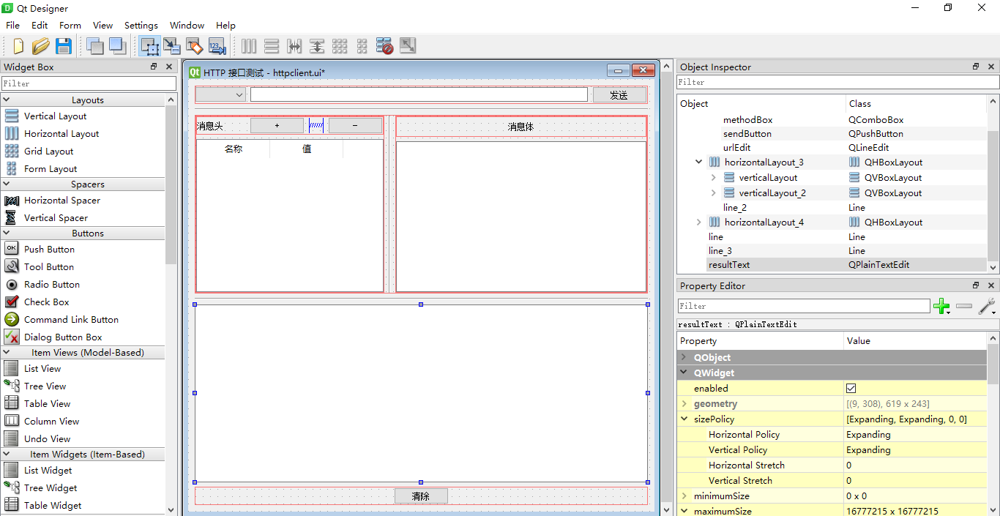

> [Python Qt  | 白月黑羽](http://www.python3.vip/tut/py/gui/qt_01/)

## Install

```sh
pip install pyside2
pip install pyside2 -i https://pypi.douban.com/simple/
```

## Qt Designer UI

运行 `C:\Program Files\Python36\Scripts\pyside2-designer.exe` 创建 User Interface:  httpclient.ui



```xml
<?xml version="1.0" encoding="UTF-8"?>
<ui version="4.0">
 <class>Form</class>
 <widget class="QWidget" name="Form">
  <property name="geometry">
   <rect>
    <x>0</x>
    <y>0</y>
    <width>615</width>
    <height>591</height>
   </rect>
  </property>
  <property name="windowTitle">
   <string>HTTP 接口测试</string>
  </property>
  <layout class="QVBoxLayout" name="verticalLayout_3">
   <item>
    <layout class="QHBoxLayout" name="horizontalLayout" stretch="1,8,1">
     <item>
      <widget class="QComboBox" name="methodBox"/>
     </item>
     <item>
      <widget class="QLineEdit" name="urlEdit"/>
     </item>
     <item>
      <widget class="QPushButton" name="sendButton">
       <property name="text">
        <string>发送</string>
       </property>
      </widget>
     </item>
    </layout>
   </item>
   <item>
    <widget class="Line" name="line">
     <property name="orientation">
      <enum>Qt::Horizontal</enum>
     </property>
    </widget>
   </item>
   <item>
    <layout class="QHBoxLayout" name="horizontalLayout_3" stretch="3,1,4">
     <item>
      <layout class="QVBoxLayout" name="verticalLayout">
       <item>
        <layout class="QHBoxLayout" name="horizontalLayout_2">
         <item>
          <widget class="QLabel" name="label_3">
           <property name="sizePolicy">
            <sizepolicy hsizetype="Preferred" vsizetype="Preferred">
             <horstretch>2</horstretch>
             <verstretch>0</verstretch>
            </sizepolicy>
           </property>
           <property name="text">
            <string>消息头</string>
           </property>
          </widget>
         </item>
         <item>
          <widget class="QPushButton" name="addHeaderButton">
           <property name="sizePolicy">
            <sizepolicy hsizetype="Minimum" vsizetype="Fixed">
             <horstretch>1</horstretch>
             <verstretch>0</verstretch>
            </sizepolicy>
           </property>
           <property name="baseSize">
            <size>
             <width>0</width>
             <height>0</height>
            </size>
           </property>
           <property name="text">
            <string>+</string>
           </property>
           <property name="iconSize">
            <size>
             <width>16</width>
             <height>16</height>
            </size>
           </property>
          </widget>
         </item>
         <item>
          <spacer name="horizontalSpacer">
           <property name="orientation">
            <enum>Qt::Horizontal</enum>
           </property>
           <property name="sizeHint" stdset="0">
            <size>
             <width>20</width>
             <height>20</height>
            </size>
           </property>
          </spacer>
         </item>
         <item>
          <widget class="QPushButton" name="removeHeaderButton">
           <property name="sizePolicy">
            <sizepolicy hsizetype="Minimum" vsizetype="Fixed">
             <horstretch>1</horstretch>
             <verstretch>0</verstretch>
            </sizepolicy>
           </property>
           <property name="text">
            <string>-</string>
           </property>
          </widget>
         </item>
        </layout>
       </item>
       <item>
        <widget class="QTableWidget" name="headerTable">
         <attribute name="verticalHeaderStretchLastSection">
          <bool>false</bool>
         </attribute>
         <column>
          <property name="text">
           <string>名称</string>
          </property>
         </column>
         <column>
          <property name="text">
           <string>值</string>
          </property>
         </column>
        </widget>
       </item>
      </layout>
     </item>
     <item>
      <widget class="Line" name="line_2">
       <property name="orientation">
        <enum>Qt::Vertical</enum>
       </property>
      </widget>
     </item>
     <item>
      <layout class="QVBoxLayout" name="verticalLayout_2" stretch="0,0">
       <item>
        <layout class="QHBoxLayout" name="horizontalLayout_9">
         <property name="topMargin">
          <number>8</number>
         </property>
         <property name="bottomMargin">
          <number>8</number>
         </property>
         <item>
          <widget class="QLabel" name="label_2">
           <property name="sizePolicy">
            <sizepolicy hsizetype="Fixed" vsizetype="Preferred">
             <horstretch>0</horstretch>
             <verstretch>0</verstretch>
            </sizepolicy>
           </property>
           <property name="text">
            <string>消息体</string>
           </property>
          </widget>
         </item>
        </layout>
       </item>
       <item>
        <widget class="QPlainTextEdit" name="bodyText"/>
       </item>
      </layout>
     </item>
    </layout>
   </item>
   <item>
    <widget class="Line" name="line_3">
     <property name="orientation">
      <enum>Qt::Horizontal</enum>
     </property>
    </widget>
   </item>
   <item>
    <widget class="QPlainTextEdit" name="resultText">
     <property name="placeholderText">
      <string/>
     </property>
    </widget>
   </item>
   <item>
    <layout class="QHBoxLayout" name="horizontalLayout_4">
     <item>
      <widget class="QPushButton" name="clearButton">
       <property name="sizePolicy">
        <sizepolicy hsizetype="Fixed" vsizetype="Fixed">
         <horstretch>0</horstretch>
         <verstretch>0</verstretch>
        </sizepolicy>
       </property>
       <property name="text">
        <string>清除</string>
       </property>
      </widget>
     </item>
    </layout>
   </item>
  </layout>
 </widget>
 <resources/>
 <connections/>
</ui>
```

## Progam Logic

httpclient.py

```python
from PySide2.QtWidgets import QApplication
from PySide2.QtUiTools import QUiLoader
from PySide2.QtGui import QIcon
from requests import Request, Session


class HttpGui:

    def __init__(self):
        self.ui = QUiLoader().load('httpclient.ui')
        self.ui.methodBox.addItems(['GET', 'POST', 'PUT', 'DELETE'])
        self.ui.headerTable.setColumnWidth(0, 110)
        self.ui.headerTable.setColumnWidth(1, 110)

        self.ui.urlEdit.setText('http://localhost:3000/users')

        self.ui.sendButton.clicked.connect(self.handle_request)
        self.ui.clearButton.clicked.connect(self.handle_clear)
        self.ui.addHeaderButton.clicked.connect(self.handle_header_add)
        self.ui.removeHeaderButton.clicked.connect(self.handle_header_remove)

    def handle_header_add(self):
        current_row = self.ui.headerTable.currentRow()
        self.ui.headerTable.insertRow(current_row + 1)

    def handle_header_remove(self):
        current_row = self.ui.headerTable.currentRow()
        self.ui.headerTable.removeRow(current_row)

    def handle_request(self):
        self.ui.resultText.clear()
        method = self.ui.methodBox.currentText()
        url = self.ui.urlEdit.text()
        headers = {}
        ht = self.ui.headerTable
        for row in range(0, ht.rowCount()):
            key = ht.item(row, 0).text()
            value = ht.item(row, 1).text()
            if not key.strip():
                continue
            headers[key] = value
        data = self.ui.bodyText.toPlainText()
        session = Session()
        req = Request(method, url, headers=headers, data=data)
        prepped = req.prepare()
        resp = session.send(prepped)
        self.ui.resultText.appendPlainText(resp.text)

    def handle_clear(self):
        self.ui.resultText.clear()


app = QApplication([])
app.setWindowIcon(QIcon('logo.png'))
stats = HttpGui()
stats.ui.show()
app.exec_()
```

## Publisher

在 Windows 上只需要执行下面的命令，即可制作独立exe程序。这样就会在当前目录下产生一个名为 `dist` 的目录。里面就有一个名为 httpclient 的目录，我们的可执行程序 httpclient.exe 就在里面。

```
pyinstaller httpclient.py --noconsole --hidden-import PySide2.QtXml
```

`--noconsole` 指定不要命令行窗口，否则我们的程序运行的时候，还会多一个黑窗口。 但是我建议大家可以先去掉这个参数，等确定运行成功后，再加上参数重新制作exe。因为这个黑窗口可以显示出程序的报错，这样我们容易找到问题的线索。
`--hidden-import PySide2.QtXml` 参数是因为这个 QtXml库是动态导入，PyInstaller没法分析出来，需要我们告诉它，

最后，别忘了，把程序所需要的ui文件拷贝到打包目录中。因为PyInstaller只能分析出需要哪些代码文件。 而你的程序动态打开的资源文件，比如 图片、excel、ui这些，它是不会帮你打包的。在 `dist/httpclient` 中添加 logo.png, 示例代码需要从 httpclient.ui 中加载界面，也需要手动拷贝到 `dist/httpclient` 目录中。然后，再双击运行 `httpclient.exe` ，完美!