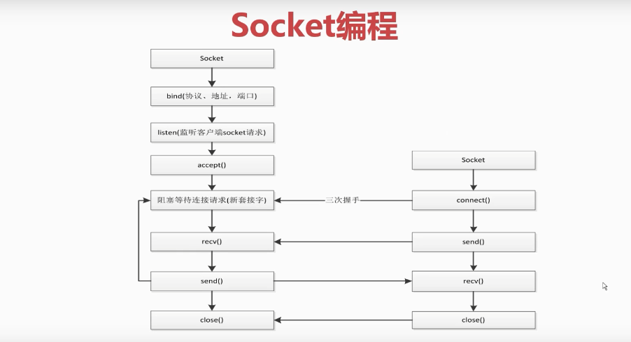

### socket flow



### socket server

```python
import socket
import threading

server = socket.socket(socket.AF_INET, socket.SOCK_STREAM)

server.bind(('127.0.0.1', 8000))

server.listen()

def handle_sock(sock, addr):
    while True:
        data = sock.recv(1024).decode('utf8')
        if data == 'Q':
            break
        print(data)
        ret_data = input('please input: ')
        sock.send(ret_data.encode('utf-8'))
    sock.close()

while True:
    sock, addr = server.accept()
    client_sock = threading.Thread(target=handle_sock, args=(sock, addr))
    client_sock.start()

# sock, addr = server.accept()

# while True:
#     data = sock.recv(1024)
#     print(data.decode('utf8'))
#     ret_data = input('please input: ')
#     sock.send(ret_data.encode('utf-8'))

# server.close()
# sock.close()
```

### socket client

```python
import socket

client = socket.socket(socket.AF_INET, socket.SOCK_STREAM)

client.connect(('127.0.0.1', 8000))

while True:
    ret_data = input('please input: ')
    client.send(ret_data.encode('utf-8'))
    data = client.recv(1024)
    print(data.decode('utf-8'))

# client.close()
```

### socket http

```python
import socket
from urllib.parse import urlparse

def get(url):
    url = urlparse(url)
    host = url.netloc
    path = url.path

    if path == '':
        path = '/'

    client = socket.socket(socket.AF_INET, socket.SOCK_STREAM)
    client.connect((host, 80))
    request_header = f'GET {path} HTTP/1.1\r\nHost:{host}\r\nConnection:close\r\n\r\n'
    print(request_header)
    client.send(request_header.encode('utf-8'))

    data = b''
    while True:
        d = client.recv(1024)
        if d:
            data += d
        else:
            break

    client.close()

    html_data = data.decode('utf-8').split('\r\n\r\n')[1]
    return html_data

if __name__ == '__main__':
    data = get('https://www.baidu.com/')
    print(data)
```
