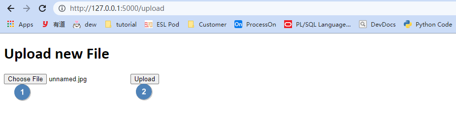
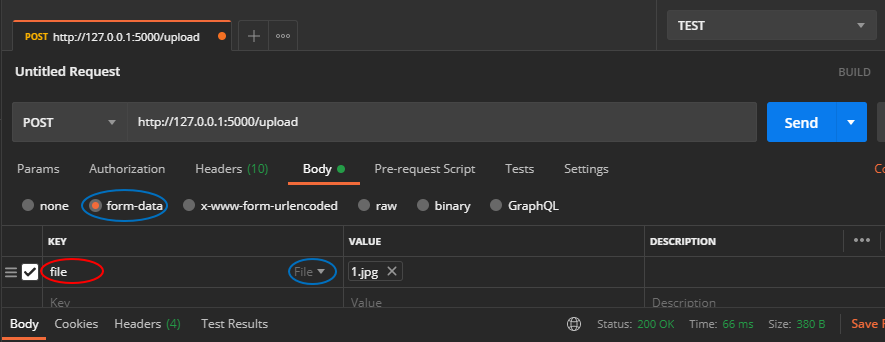

## Upload

Create `app.py` and run by terminal, and create `uploads` folder in the current directory. 

**app.py**

```python
import os
from flask import Flask, render_template, make_response, flash, request, redirect, url_for
from werkzeug.utils import secure_filename


app = Flask(__name__)

UPLOAD_FOLDER = 'uploads'
ALLOWED_EXTENSIONS = {'txt', 'pdf', 'png', 'jpg', 'jpeg', 'gif'}

app.config['UPLOAD_FOLDER'] = UPLOAD_FOLDER


def allowed_file(filename):
    return '.' in filename and \
           filename.rsplit('.', 1)[1].lower() in ALLOWED_EXTENSIONS

@app.route('/upload', methods=['GET', 'POST'])
def upload_file():
    if request.method == 'POST':
        # check if the post request has the file part
        if 'file' not in request.files:
            flash('No file part')
            return redirect(request.url)
        file = request.files['file']
        # If the user does not select a file, the browser submits an
        # empty file without a filename.
        if file.filename == '':
            flash('No selected file')
            return redirect(request.url)
        if file and allowed_file(file.filename):
            filename = secure_filename(file.filename)
            file.save(os.path.join(app.config['UPLOAD_FOLDER'], filename))
            # return redirect(url_for('download', name=filename))

    return '''
    <!doctype html>
    <title>Upload new File</title>
    <h1>Upload new File</h1>
    <form method=post enctype=multipart/form-data>
      <input type=file name=file>
      <input type=submit value=Upload>
    </form>
    '''
```

**Bash**

```bash
$ export FLASK_APP=app
$ flask run
 * Running on http://127.0.0.1:5000/
```

**CMD**

```shell
> set FLASK_APP=app
> flask run
 * Running on http://127.0.0.1:5000/
```

**Powershell**

```powershell
> $env:FLASK_APP = "app"
> flask run
 * Running on http://127.0.0.1:5000/
```

Then visit `http://127.0.0.1:5000/` by chrome, `Choose file & Upload`. You will find the file occurs in the `uploads` folder.



## Test Uplaod by Other ways

### Postman

notice KEY need use `file`, because in python get files by `file = request.files['file']`




### VSCode RestClient

notice `file=@test.jpg` and `name="file"`

```shell
### curl upload
curl -X POST -F file=@test.jpg http://127.0.0.1:5000/upload


### rest upload
POST http://127.0.0.1:5000/upload HTTP/1.1
Content-Type: multipart/form-data; boundary=myboundary

--myboundary
Content-Disposition: form-data; name="file"; filename="test.jpg"
Content-Type: image/png

< ./test.jpg
--myboundary--
```

### Curl

```curl
curl -X POST -F file=@test.jpg http://127.0.0.1:5000/upload
```

## Download

Add content as below in `app.py`, response need set `Content-Disposition`.

```python
@app.route('/')
def download():
    return render_template('download.html')


@app.route('/download_csv/')
def download_csv():
    csv = 'foo,bar,baz\nhai,bai,crai\n'
    response = make_response(csv)
    response.headers['Content-Disposition'] = 'attachment; filename=test.csv'
    response.mimetype = 'text/csv'

    return response
```

create `templates/download.html`

```html
<!DOCTYPE html>
<html lang="en">
    <head>
        <meta charset="UTF-8" />
        <meta http-equiv="X-UA-Compatible" content="IE=edge" />
        <meta name="viewport" content="width=device-width, initial-scale=1.0" />
        <title>Download</title>
    </head>
    <body>
        <a href="/download_csv" >Click here to Download</a><br/>
        <a download="test.csv" href="static/test.csv">Click here to Download (HTML5 Support)</a>
    </body>
</html>
```

create `static/test.csv`

```csv
foo,bar,baz
hai,bai,crai
```

Then visit `http://127.0.0.1:5000/` by chrome, a dialog box is displayed asking you to save the file.

