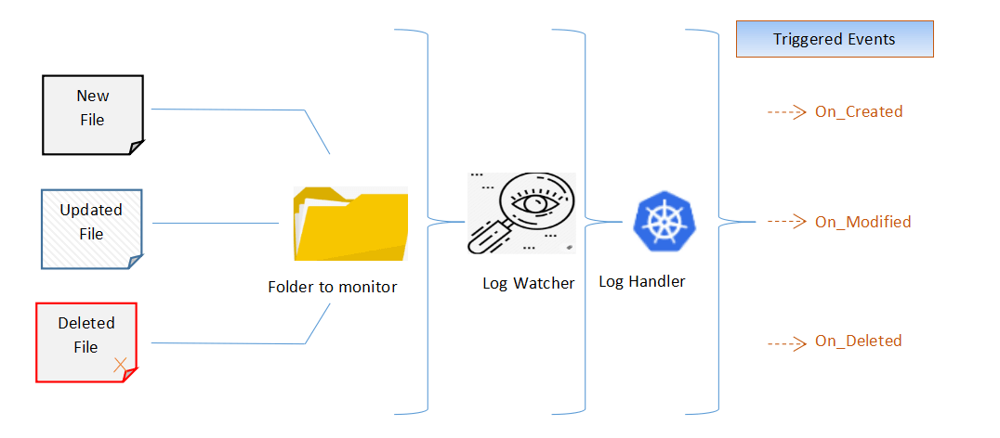
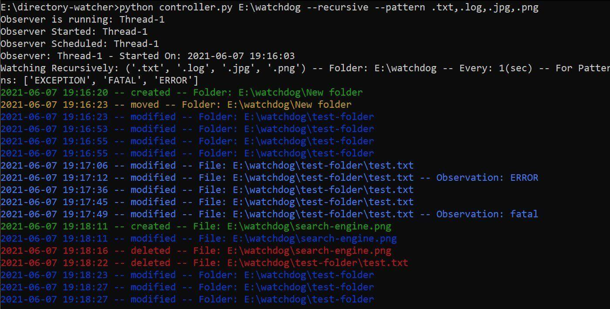

> 转载：[How to Create a Watchdog in Python - Python Code](https://www.thepythoncode.com/article/create-a-watchdog-in-python)

Within software development, application logging plays a key role. As much as we’d like our software to be perfect, issues will always arise therefore it’s important to have a robust monitoring and logging in place to control and manage the inevitable chaos.

Nowadays, application support engineers need to be able to easily access and analyze the huge volumes of log data their applications and infrastructure are generating. When an issue occurs, they cannot afford to wait for a minute or two until a query returns results. They need speed, regardless of the amount of data they are collecting and querying.

In this tutorial, you will learn how to create a watchdog in Python; we will explain how to detect changes in a particular directory (Let’s suppose the directory hosting the logs of your application(s)). Whenever a change occurs, the modified or newly created files of predefined types will be processed in a timely manner to retrieve the lines meeting specified patterns.

On the other hand, all the lines within these files that don’t match the specified patterns are considered outliers and are abandoned in our analysis.

We will be using [watchdog](https://pypi.org/project/watchdog/) and [pygtail ](https://pypi.org/project/pygtail/)libraries to detect the changes occurring, there is also a Flask, Redis, and SocketIO version where a GUI web app is created for the same purpose, you can always refer to it [here](https://github.com/bassemmarji/Flask_Log_Inspector).

## Process Flowchart



To get started, let's install the requirements:

```python
$ pip3 install Pygtail==0.11.1 watchdog==2.1.1
```

First, let's define the configuration parameters for our application within `config.py`:

```python
# Application configuration File
################################
# Directory To Watch, If not specified, the following value will be considered explicitly.
WATCH_DIRECTORY = "C:\\SCRIPTS"
# Delay Between Watch Cycles In Seconds
WATCH_DELAY = 1
# Check The WATCH_DIRECTORY and its children
WATCH_RECURSIVELY = False
# whether to watch for directory events
DO_WATCH_DIRECTORIES = True
# Patterns of the files to watch
WATCH_PATTERN = '.txt,.trc,.log'
LOG_FILES_EXTENSIONS = ('.txt', '.log', '.trc')
# Patterns for observations
EXCEPTION_PATTERN = ['EXCEPTION', 'FATAL', 'ERROR']
```

The parameters in `config.py` will be the default ones, later on, in the script, we can override them if we want.

Next, let's create `checker.py` for defining a checking mechanism, this mechanism will leverage the modules pygtail and re in order to pinpoint the observations based on the parameter `EXCEPTION_PATTERN` we just defined in `config.py`:

```python
import datetime
from pygtail import Pygtail

# Loading the package called re from the RegEx Module in order to work with Regular Expressions
import re

class FileChecker:
    def __init__(self, exceptionPattern):
        self.exceptionPattern = exceptionPattern

    def checkForException(self, event, path):
        # Get current date and time according to the specified format.
        now = (datetime.datetime.now()).strftime("%Y-%m-%d %H:%M:%S")
        # Read the lines of the file (specified in the path) that have not been read yet
        # Meaning by that it will start from the point where it was last stopped.
        for num, line in enumerate(Pygtail(path), 1):
            # Remove leading and trailing whitespaces including newlines.
            line = line.strip()
            # Return all non-overlapping matches of the values specified in the Exception Pattern.
            # The line is scanned from left to right and matches are returned in the oder found.
            if line and any(re.findall('|'.join(self.exceptionPattern), line, flags=re.I | re.X)):
                # Observation Detected
                type = 'observation'
                msg = f"{now} -- {event.event_type} -- File = {path} -- Observation: {line}"
                yield type, msg
            elif line:
                # No Observation Detected
                type = 'msg'
                msg = f"{now} -- {event.event_type} -- File = {path}"
                yield type, msg
```

The method `checkForException()` defined in the above code will ingest the events dispatched by the observer class of the watchdog module (to be seen later on).

These events will be triggered for any file change in the given directory, an event object has 3 attributes:

- `event_type`: The type of the event as a string (modified, created, moved, or deleted).
- `is_directory`: a boolean indicating whether the event was emitted for a directory.
- `src_path`: The source path of the file system object that triggered the event.

Now let's define our `controller.py`, first, let's import the libraries:

```python
# The Observer watches for any file change and then dispatches the respective events to an event handler.
from watchdog.observers import Observer
# The event handler will be notified when an event occurs.
from watchdog.events import FileSystemEventHandler
import time
import config
import os
from checker import FileChecker
import datetime
from colorama import Fore, init, Style

init()

GREEN = Fore.GREEN
BLUE = Fore.BLUE
RESET = Fore.RESET
RED = Fore.RED
YELLOW = Fore.YELLOW

event2color = {
    "created": GREEN,
    "modified": BLUE,
    "deleted": RED,
    "moved": YELLOW,
}

def print_with_color(s, color=Fore.WHITE, brightness=Style.NORMAL, **kwargs):
    """Utility function wrapping the regular `print()` function 
    but with colors and brightness"""
    print(f"{brightness}{color}{s}{Style.RESET_ALL}", **kwargs)
```

Copy

We'll be [using `colorama`](https://www.thepythoncode.com/article/change-text-color-in-python) to distinguish between different events with text colors, for more about colorama, check [this tutorial](https://www.thepythoncode.com/article/change-text-color-in-python).

Next, let's define our event handler:

```python
# Class that inherits from FileSystemEventHandler for handling the events sent by the Observer
class LogHandler(FileSystemEventHandler):

    def __init__(self, watchPattern, exceptionPattern, doWatchDirectories):
        self.watchPattern = watchPattern
        self.exceptionPattern = exceptionPattern
        self.doWatchDirectories = doWatchDirectories
        # Instantiate the checker
        self.fc = FileChecker(self.exceptionPattern)

    def on_any_event(self, event):
        now = (datetime.datetime.now()).strftime("%Y-%m-%d %H:%M:%S")
        # print("event happened:", event)
        # To Observe files only not directories
        if not event.is_directory:
            # To cater for the on_move event
            path = event.src_path
            if hasattr(event, 'dest_path'):
                path = event.dest_path
            # Ensure that the file extension is among the pre-defined ones.
            if path.endswith(self.watchPattern):
                msg = f"{now} -- {event.event_type} -- File: {path}"
                if event.event_type in ('modified', 'created', 'moved'):
                    # check for exceptions in log files
                    if path.endswith(config.LOG_FILES_EXTENSIONS):
                        for type, msg in self.fc.checkForException(event=event, path=path):
                            print_with_color(msg, color=event2color[event.event_type])
                    else:
                        print_with_color(msg, color=event2color[event.event_type])
                else:
                    print_with_color(msg, color=event2color[event.event_type])
        elif self.doWatchDirectories:
            msg = f"{now} -- {event.event_type} -- Folder: {event.src_path}"
            print_with_color(msg, color=event2color[event.event_type])

    def on_modified(self, event):
        pass

    def on_deleted(self, event):
        pass

    def on_created(self, event):
        pass

    def on_moved(self, event):
        pass
```

Copy

The `LogHandler` class inherits from the class named [`FileSystemEventHandler`](https://pythonhosted.org/watchdog/api.html#watchdog.events.FileSystemEventHandler) of the watchdog library, and mainly overwrites its `on_any_event()` method.

Below are some useful methods if this class:

- `on_any_event()`: Called for any event.
- `on_created()`: Called when a file or a directory is created.
- `on_modified()`: Called when a file is modified or when a directory is renamed.
- `on_deleted()`: Called when a file or directory is deleted.
- `on_moved()`: Called when a file or directory is moved.

The code alloted for the `on_any_event()` method will:

- Observe files and directories.
- Verify that the extension of the file subject to the event is among the ones pre-defined in the variable `WATCH_PATTERN` within `config.py`
- Produce a message illustrating the event or the observation if detected.

Now let's write our `LogWatcher` class:

```python
class LogWatcher:
    # Initialize the observer
    observer = None
    # Initialize the stop signal variable
    stop_signal = 0
    # The observer is the class that watches for any file system change and then dispatches the event to the event handler.
    def __init__(self, watchDirectory, watchDelay, watchRecursively, watchPattern, doWatchDirectories, exceptionPattern, sessionid = None, namespace = None):
        # Initialize variables in relation
        self.watchDirectory = watchDirectory
        self.watchDelay = watchDelay
        self.watchRecursively = watchRecursively
        self.watchPattern = watchPattern
        self.doWatchDirectories = doWatchDirectories
        self.exceptionPattern = exceptionPattern
        self.namespace = namespace
        self.sessionid = sessionid

        # Create an instance of watchdog.observer
        self.observer = Observer()
        # The event handler is an object that will be notified when something happens to the file system.
        self.event_handler = LogHandler(watchPattern, exceptionPattern, self.doWatchDirectories)

    def schedule(self):
        print("Observer Scheduled:", self.observer.name)
        # Call the schedule function via the Observer instance attaching the event
        self.observer.schedule(
            self.event_handler, self.watchDirectory, recursive=self.watchRecursively)

    def start(self):
        print("Observer Started:", self.observer.name)
        self.schedule()
        # Start the observer thread and wait for it to generate events
        now = (datetime.datetime.now()).strftime("%Y-%m-%d %H:%M:%S")
        msg = f"Observer: {self.observer.name} - Started On: {now} - Related To Session: {self.sessionid}"
        print(msg)

        msg = (
            f"Watching {'Recursively' if self.watchRecursively else 'Non-Recursively'}: {self.watchPattern}"
            f" -- Folder: {self.watchDirectory} -- Every: {self.watchDelay}(sec) -- For Patterns: {self.exceptionPattern}"
        )
        print(msg)
        self.observer.start()

    def run(self):
        print("Observer is running:", self.observer.name)
        self.start()
        try:
            while True:
                time.sleep(self.watchDelay)

                if self.stop_signal == 1:
                    print(
                        f"Observer stopped: {self.observer.name}  stop signal:{self.stop_signal}")
                    self.stop()
                    break
        except:
            self.stop()
        self.observer.join()

    def stop(self):
        print("Observer Stopped:", self.observer.name)

        now = (datetime.datetime.now()).strftime("%Y-%m-%d %H:%M:%S")
        msg = f"Observer: {self.observer.name} - Stopped On: {now} - Related To Session: {self.sessionid}"
        print(msg)
        self.observer.stop()
        self.observer.join()

    def info(self):
        info = {
            'observerName': self.observer.name,
            'watchDirectory': self.watchDirectory,
            'watchDelay': self.watchDelay,
            'watchRecursively': self.watchRecursively,
            'watchPattern': self.watchPattern,
        }
        return info
```

Here is what we did on `LogWatcher` class:

- Create an instance of the [`watchdog.observer`](https://pythonhosted.org/watchdog/api.html#module-watchdog.observers) thread class, the observer watches for any file system change and then dispatches the corresponding event to the event handler.
- Create an instance of the event handler `LogHandler`, that inherits from the `FileSystemEventHandler`. The event handler is notified when any change occurs.
- Assign a schedule to our observer and define other input parameters like the directory to watch, watching mode, and others. Beware that when setting the `recursive` parameter to `True`, you must ensure that you have sufficient access rights on the subfolders.

Finally, let's make command line arguments around the code using [`argparse`](https://docs.python.org/3/library/argparse.html):

```python
def is_dir_path(path):
    """Utility function to check whether a path is an actual directory"""
    if os.path.isdir(path):
        return path
    else:
        raise NotADirectoryError(path)

if __name__ == "__main__":
    import argparse
    parser = argparse.ArgumentParser(
        description="Watchdog script for watching for files & directories' changes")
    parser.add_argument("path",  --position arguments
                        default=config.WATCH_DIRECTORY,
                        type=is_dir_path,
                        )
    parser.add_argument("-d", "--watch-delay",
                        help=f"Watch delay, default is {config.WATCH_DELAY}",
                        default=config.WATCH_DELAY,
                        type=int,
                        )
    parser.add_argument("-r", "--recursive",
                        action="store_true",
                        help=f"Whether to recursively watch for the path's children, default is {config.WATCH_RECURSIVELY}",
                        default=config.WATCH_RECURSIVELY,
                        )
    parser.add_argument("-p", "--pattern",
                        help=f"Pattern of files to watch, default is {config.WATCH_PATTERN}",
                        default=config.WATCH_PATTERN,
                        )
    parser.add_argument("--watch-directories",
                        action="store_true",
                        help=f"Whether to watch directories, default is {config.DO_WATCH_DIRECTORIES}",
                        default=config.DO_WATCH_DIRECTORIES,
                        )
    # parse the arguments
    args = parser.parse_args()
    # define & launch the log watcher
    log_watcher = LogWatcher(
        watchDirectory=args.path,
        watchDelay=args.watch_delay,
        watchRecursively=args.recursive,
        watchPattern=tuple(args.pattern.split(",")),
        doWatchDirectories=args.watch_directories,
        exceptionPattern=config.EXCEPTION_PATTERN,
    )
    log_watcher.run()
```

We defined `is_dir_path()` in order to ensure that the path entered is a valid directory. Let's use the script:



I've passed `--recursive` to watch everything is happening on `E:\watchdog` directory including the sub-folders, I also specified a pattern of `.txt,.log,.jpg,.png`, for watching text and image files.

Then I created a folder and started writing on a text file, then moved an image and deleted it, the watchdog is catching everything!

Note that you can have the option to either override parameters in `config.py` or pass the parameters here.

## Conclusion

I hope this article helped you after we explored in depth the available features of [watchdog](https://pythonhosted.org/watchdog/) and [pygtail](https://pypi.org/project/pygtail/) libraries.

It is worthy to note that by extending the described functionalities, you may associate an alerting mechanism or play a sound whenever a fatal error occurred in one of your log files. By doing so, when an observation is pinpointed, the configured workflow or alert will be triggered automatically.