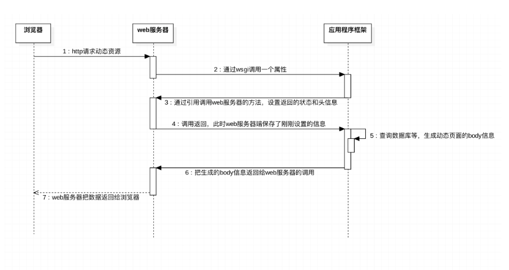

### 浏览器请求动态 web 页面过程



### WSGI

WSGI：Web Server Gateway Interface。
WSGI 接口定义非常简单，它只要求 Web 开发者实现一个函数，就可以响应 HTTP 请求。

```python
def application(environ, start_response):
    start_response('200 OK', [('Content-Type', 'text/html')])
    return [b'Hello, web!']
```

上面的 application()函数就是符合 WSGI 标准的一个 HTTP 处理函数，它接收两个参数：

- environ：一个包含所有 HTTP 请求信息的 dict 对象；
- start_response：一个发送 HTTP 响应的函数。

### 测试

处理函数(hello.py)

```python
def application(environ, start_response):
    start_response('200 OK', [('Content-Type', 'text/html')])
    body = '<h1>Hello, %s!</h1>' % (environ['PATH_INFO'][1:] or 'web')
    return [body.encode('utf-8')]
```

服务器(server.py)

```python
# 从wsgiref模块导入:
from wsgiref.simple_server import make_server
# 导入我们自己编写的application函数:
from hello import application

# 创建一个服务器，IP地址为空，端口是8000，处理函数是application:
httpd = make_server('', 8000, application)
print('Serving HTTP on port 8000...')
# 开始监听HTTP请求:
httpd.serve_forever()
```

在浏览器输入: http://127.0.0.1:8000/Babb, 返回 Hello, Babb!

### 简单使用

web.py

```python
from wsgiref.simple_server import make_server
from jinja2 import Template


def index():
    with open('index.html', 'r', encoding='utf-8') as f:
        content = f.read()
    print(content)
    return [content.encode('utf-8')]
    #　return ['index'.encode('utf-8')]


def login():
    with open('login.html', 'r', encoding='utf-8') as f:
        content = f.read()
    return [content.encode('utf-8')]
    # return ['login'.encode('utf-8')]


def template():
    with open('template.html', 'r', encoding='utf-8') as f:
        content = f.read()
    template = Template(content)
    data = template.render(name='犬夜叉', user_list=['桔梗', '日暮戈薇'])
    return [data.encode('utf-8')]


def routers():

    urlpatterns = (
        ('/index/', index),
        ('/login/', login),
        ('/template/', template),
    )

    return urlpatterns


def RunServer(environ, start_response):
    start_response('200 OK', [('Content-Type', 'text/html')])
    url = environ['PATH_INFO']
    urlpatterns = routers()
    func = None
    for item in urlpatterns:
        if item[0] == url:
            func = item[1]
            break
    if func:
        return func()
    else:
        return ['404 not found'.encode('utf-8')]


if __name__ == '__main__':
    httpd = make_server('127.0.0.1', 8000, RunServer)
    print("Serving HTTP on port 8000...")
    httpd.serve_forever()

```

template.html

```html
<!DOCTYPE html>
<html>
  <head lang="en">
    <meta charset="UTF-8" />
    <title></title>
  </head>
  <body>
    <h1>{{name}}</h1>

    <ul>
      
      <li>{{item}}</li>
      
    </ul>
  </body>
</html>
```
