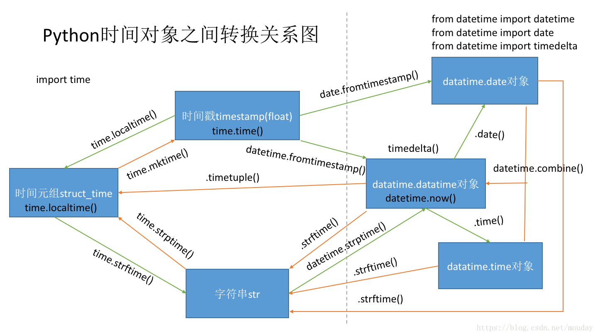
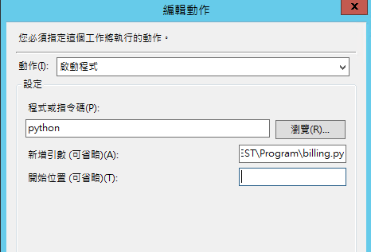

> Thoughts - even fears - were airy things, formless until you made them solid with your voice and once given that weight, they could crush you. - Firefly Lane

## IO

### file open

open 返回的实际上是一个生成器对象

```python
# 读取控制台或者文件内容
import fileinput
for line in fileinput.input():
    print(line)

data_rows = []
for line in open(filename):
    line_arr = line.rstrip('\n').split('@#@')
    data_rows.append(line_arr)
print(data_rows)


f = open(filename, 'r')
print(next(f))
print(next(f))
f.close()
```

### file state

-   获取文件目录名，文件名
-   获取文件是否存在，是目录还是文件
-   获取文件大小
-   获取文件创建时间，上次访问时间，修改时间

```python
import os,sys
import time
import datetime

print(__file__, sys.argv[0]) # python test.py => test.py test.py
path = r'E:\study_python\test\fast02.py'
print(os.path.basename(path), os.path.dirname(path), os.path.split(path))
# fast02.py E:\study_python\test ('E:\\study_python\\test', 'fast02.py')

print(os.path.exists(path)
     ,os.path.isfile(path)
     ,os.path.isdir(path)
     ,os.path.getsize(path)
     ,os.path.getatime(path)   # 获取文件上一次读取的时间
     ,datetime.datetime.fromtimestamp(os.path.getmtime(path)) # 获取文件修改时间,并转换为日期
     ,os.path.getctime(path))
# True True False 1740 1536125104.7735167 2018-09-05 16:59:29.086361 1536125104.7735167
```

### StringIO

```python
from io import StringIO

# f = StringIO('hello, world')
# print(f.readline())

f = StringIO()
f.write('hello, world')
print(f.readline())  # 读取不到数据
f.seek(0)
print(f.readline())  # hello, world
```

### print

`print('*', end='\n')`: 默认输出换行

`print('*', end='')`: 输出不换行

`print('*', '&', sep=' ')`: 默认以空格分隔多个参数

`print('*', '&', sep='@')`: 用 @ 分隔多个参数

```python
num_stars = int(input('How many stars do you want ? '))
for _ in range(num_stars):
     print('*',end='')
# 4
# ****

print('*', '&', sep=' ')   # * &
print('*', '&', sep='@')   # *@&
```

### print %s, %r

`%r(repr)` unambiguously recreate the object it represents 可以重建它所代表的对象

```python
s = "world"
print("hello {!s}".format(s), ',', "hello %s" % s)
print("hello {!r}".format(s), ',', "hello %r" % s)
# hello world , hello world
# hello 'world' , hello 'world'
d = datetime.date.today()
print("today is {!s}".format(d), "today is %s" % d)
print("today is {!r}".format(d), "today is %r" % d)
# today is 2019-10-28 today is 2019-10-28
# today is datetime.date(2019, 10, 28) today is datetime.date(2019, 10, 28)
```

### prettytable

```python
from prettytable import PrettyTable
row = PrettyTable(["城市","总访问量", "失败量", "慢速量","失败率","慢速率"])
row.align["城市"] = "l" # Left align city names
row.padding_width = 1   # One space between column edges and contents (default)

retrow = [['郑州',241,1,2,0.41,0.83],['灵宝',56,0,1,0.0,1.79]]
for r in retrow:
    row.add_row(r)
with open('D:/study/fragment/mytable','w',encoding='utf-8') as hfile:
    hfile.write(str(row))
    hfile.close()

# mytable
# +------+----------+--------+--------+--------+--------+
# | 城市 | 总访问量  | 失败量 | 慢速量 | 失败率 | 慢速率 |
# +------+----------+--------+--------+--------+--------+
# | 郑州 |   241    |   1    |   2    |  0.41  |  0.83  |
# | 灵宝 |    56    |   0    |   1    |  0.0   |  1.79  |
# +------+----------+--------+--------+--------+--------+
```

### shutil.move & os.rename

```python
# os.rename() requires to include the file name in both the source and destination arguments
os.rename('path/to/file.txt', 'path/to/new/directory/file.txt')
# while shutil.move() requires the new directory as destination or include the filename
shutil.move('path/to/file.txt', 'path/to/new/directory/')
shutil.move('path/to/file.txt', 'path/to/new/directory/file.txt')


# if file exsists, os.rename will raise file exists error
os.rename('path/to/file.txt', 'path/to/new/directory/file.txt')
# if file exsists, this will raise file exists error
shutil.move('path/to/file.txt', 'path/to/new/directory/')
# if file exsists, this will coverage but no error
shutil.move('path/to/file.txt', 'path/to/new/directory/file.txt')

# shutil.copy will coverage, no error
shutil.copy('path/to/file.txt', 'path/to/new/directory/')
shutil.copy('path/to/file.txt', 'path/to/new/directory/file.txt')
```

## Container

### + & +=

```python
a = [1, 2]
c = a + [3, 4]
# c = a + (3, 4) # TypeError: can only concatenate list (not "tuple") to list

a += (5, 6)      # += 实际调用的是 extend，参数可以是任意序列类型，并且 += 是 inpalce 操作
a.extend(range(3))
```

### \_\_sub\_\_

通过定义 `__sub__` 方法可以给类型添加 `-` 操作

```python
a = [1, 2, 3]
b = [2, 3, 4]
print(a + b) # [1, 2, 3, 2, 3, 4]

class SubList(list):
    def __sub__(self, b):
        a = self[:]
        b = b[:]
        while len(b) > 0:
            ele = b.pop()
            if ele in a:
                a.remove(ele)
        return a

al = SubList(a)
bl = SubList(b)
print(al - bl) [1]
```

### collections type check

`collections`模块定义了很多跟容器和迭代器（序列、映射、集合等）有关的抽象基类。

`numbers`库定义了跟数字对象（整数、浮点数、有理数等）有关的基类。

`io`库定义了很多跟 I/O 操作相关的基类。可以用这些抽象基类检查数据类型。

```python
import collections

# Check if x is a sequence
if isinstance(x, collections.Sequence):
    pass

# Check if x is iterable
if isinstance(x, collections.Iterable):
    pass

# Check if x has a size
if isinstance(x, collections.Sized):
    pass

# Check if x is a mapping
if isinstance(x, collections.Mapping):
    pass
```

### Iterable

展开嵌套序列

```python
from collections import Iterable

def flatten(items, ignore_types=(str, bytes)):
    for x in items:
        if isinstance(x, Iterable) and not isinstance(x, ignore_types):
            yield from flatten(x)
        else:
            yield x

items = [1, 2, [3, 4, [5, 6], 'abc'], b'abc']
for x in flatten(items):
    print(x)
```

### iter()

iter 函数可以接受一个可选的 callable 对象和一个标记（结尾）值作为输入参数。 当以这种方式使用的时候，它会创建一个迭代器， 这个迭代器会不断调用 callable 对象直到返回值和标记值相等为止。

```python
f = open('log2.txt', 'r')
for chunk in iter(lambda:f.read(10), ''):
    print(chunk)
f.close()
# hello
# worl
# d
```

### defaultdict realize multidict

`defaultdict` 可以实现字典的值对应为列表或集合，列表会保持元素的插入顺序，集合会去除重复元素

```python
from collections import defaultdict

d = defaultdict(list)
d['a'].append(1)
d['a'].append(3)
d['a'].append(2)
d['b'].append(2)
d['b'].append(2)
print(d)  # defaultdict(<class 'list'>, {'a': [1, 3, 2], 'b': [2, 2]})

d = defaultdict(set)
d['a'].add(1)
d['a'].add(3)
d['a'].add(2)
d['b'].add(2)
d['b'].add(2)
print(d)   # defaultdict(<class 'set'>, {'a': {1, 2, 3}, 'b': {2}})

# extend
d.setdefault('a', []).append(1)
d.setdefault('a', []).append(2)
d.setdefault('b', set()).add(2)
d.setdefault('b', set()).add(2)
print(d)   # {'a': [1, 2], 'b': {2}}
```

### zip

```python
prices = {
    'ACME': 45.23,
    'AAPL': 612.78,
    'IBM': 205.55,
    'HPQ': 37.20,
    'FB': 10.75
}
print(sorted(zip(prices.values(), prices.keys())))

# zip() 函数创建的是只能返回一次的迭代器
prices_and_names = zip(prices.values(), prices.keys())
print(min(prices_and_names)) # OK
print(max(prices_and_names)) # ValueError: max() arg is an empty sequence
```

### dict_keys & dict_items

字典的 keys() 和 items() 方法分别返回一个键视图对象和一个包含 （键，值） 对的元素视图对象， 支持集合并、交、差运算，values() 也是类似，但是不支持集合运算，因为值视图不能保证元素互不相同

```python
a = {
    'x' : 1,
    'y' : 2,
    'z' : 3
}

b = {
    'w' : 10,
    'x' : 11,
    'y' : 2
}
print(a.keys(), a.items())      # dict_keys(['x', 'y', 'z']) dict_items([('x', 1), ('y', 2), ('z', 3)])
print(a.keys() & b.keys())      # {'x', 'y'}
print(a.keys() - b.keys())      # {'z'}
print(a.items() - b.items())    # {('x', 1), ('z', 3)}
c = {key: a[key] for key in a.keys() - {'z'}}
print(c)                        # {'x': 1, 'y': 2}
```

### dict & set comprehension

```python
my_dict = {"Babb": 18, "Owen": 28}
reversed_dict = {value: key for key, value in my_dict.items()}
print(reversed_dict)
my_set = {key for key, value in my_dict.items()}
print(my_set)
```

### tuple compare

```python
class A:
    def __init__(self, name):
        self.name = name

print((1, A('babb')) < (2, A('owen'))) # True
print((1, A('babb')) < (1, A('owen'))) # '<' not supported between instances of 'A' and 'A'
print((1, 1, A('babb')) < (1, 2, A('owen'))) # True
print((1, ['1', '2']) < (2, ['1', '3'])) # True
```

### unpack

解包裹

```python
def func2(a, b, c):
    print(a, b, c)


a = (1, 2, 3)
func2(*a)
b = {'a':'1', 'b':'2', 'c':'3'}
func2(**b)
```

### itertools groupby

```python
import itertools
from operator import itemgetter

employees = [
    [100, '犬夜叉', 2000],
    [200, '杀生丸', 3000],
    [100, '桔梗', 1000],
    [200, '玲', 800],
    [100, '冥加', 800],
    [300, '奈落', 4000]
]

D = {}
for no, role in itertools.groupby(employees, itemgetter(0)):
    D[no] = D.setdefault(no, 0) + 1

print(D) # {100: 3, 200: 2, 300: 1}
```

## Class

### super()

super() 用来调用父类某个已经覆盖的方法，遵循菱形继承顺序，格式 `super(type[, object-or-type])`，
`super(subtype, self) 用来调用父类的实例方法` 在 python3 中等价于 `super().__init__()`，`super(subtype, subtype) 可以用来调用父类的类方法`

```python
class A:
    def spam(self):
        print('A.spam')
        super().spam() # 会调用 B 的 spam 方法，尽管 A 没有直接继承 B

class B:
    def spam(self):
        print('B.spam')

class C(A, B):
    pass

c = C()
c.spam()
print(C.__mro__)
# (<class '__main__.C'>, <class '__main__.A'>, <class '__main__.B'>, <class 'object'>)
```

### \_\_class\_\_ point to class

```python
In [12]: class A:
    ...:     pass

In [13]: a = A()

In [14]: a.__class__
Out[14]: __main__.A

In [15]: b = a.__class__()

In [16]: b
Out[16]: <__main__.A at 0x4fcb5f8>

In [17]: b.__class__
Out[17]: __main__.A
```

### calendar

```python
import calendar
# 打印日历
cal = calendar.month(2018,9)
print(cal)

# 判断是否为闰年
ret = calendar.isleap(2018)
print(ret)

#    September 2018
# Mo Tu We Th Fr Sa Su
#                 1  2
#  3  4  5  6  7  8  9
# 10 11 12 13 14 15 16
# 17 18 19 20 21 22 23
# 24 25 26 27 28 29 30

# False
```

### type() & isinstance

```python
class A:
    pass

class B(A):
    pass

isinstance(A(), A)    # returns True
type(A()) == A        # returns True
isinstance(B(), A)    # returns True
type(B()) == A        # returns False
isinstance(1, (float,int)) # isinstance 第二个参数可以是一个元组
```

### dynamic monkey patch

```python
class Foo():
    def bar(self):
        print('Foo.bar')

def bar(self):
    print('Modified bar')

Foo().bar()
Foo.bar = bar
Foo().bar()
```

### dynamic import

动态导入是指模块可以以字符串的形式导入

```python
module_names = ['sys', 'os', 're']
modules = list(map(__import__, module_names))
sys = modules[0]
print(sys.version)


import importlib
module2 = importlib.import_module('sys')
print(module2.version)
```

### typing udt(user-defined types)

```python
from typing import List

Vector = List[float]
Matrix = List[Vector]

def addMatrix(a : Matrix, b : Matrix) -> Matrix:
    result = []
    for i, row in enumerate(a):
        result_row =[]
        for j, col in enumerate(row):
            result_row += [a[i][j] + b[i][j]]
        result += [result_row]
    return result

x = [[1.0, 0.0], [0.0, 1.0]]
y = [[2.0, 1.0], [0.0, -2.0]]
z = addMatrix(x, y)

print(z)
# [[3.0, 1.0], [0.0, -1.0]]
```

## Fun

### imp

如果你模块不在 sys.path，可以使用 imp 模块中的方法 imp.load_source

```python
import imp

imp.load_source("hi", "C://data/hi.py")
import hi

# 可以自己指定模块的名字，相当与 import hi as hello
imp.load_source("hello", "C://data/hi.py")
import hello
```

### fun \_\_code\_\_

函数是一个对象， 对象有自己的作用域， 即命名空间，每个命名空间对应一个 `__code__` ，包含对象的相关信息

```python
def fun(a,b,c,*d, e,f):
    localvar = 1

print(dir(fun.__code__))
print('co_argcount:' ,fun.__code__.co_argcount)                  #位置参数个数(a,b,c)
print('co_kwonlyargcount:',fun.__code__.co_kwonlyargcount)       #仅限关键字参数个数(e,f)
print('all_local:',fun.__code__.co_nlocals)                      #函数中局部参数(位置参数+关键字+可变参数(*d) + 本地变量)
print('consts:',fun.__code__.co_consts)                          #函数内部的常量
print('filename:',fun.__code__.co_filename)                      #函数所属的文件
print('name:',fun.__code__.co_name)                              #函数名
print('func_lineno:',fun.__code__.co_firstlineno)                #函数位於第几行

# ['__class__', '__delattr__', '__dir__', '__doc__', '__eq__', '__format__', '__ge__', '__getattribute__', '__gt__', '__hash__', '__init__', '__init_subclass__', '__le__', '__lt__', '__ne__', '__new__', '__reduce__', '__reduce_ex__', '__repr__', '__setattr__', '__sizeof__', '__str__', '__subclasshook__', 'co_argcount', 'co_cellvars', 'co_code', 'co_consts', 'co_filename', 'co_firstlineno', 'co_flags', 'co_freevars', 'co_kwonlyargcount', 'co_lnotab', 'co_name', 'co_names', 'co_nlocals', 'co_stacksize', 'co_varnames']
# co_argcount: 3
# co_kwonlyargcount: 2
# all_local: 7
# consts: (None, 1)
# filename: code_test.py
# name: fun
# func_lineno: 7
```

### switch case

```python
def foo(var):
    return {
            'a': 1,
            'b': 2,
            'c': 3,
    }.get(var,0)

print(foo('d')) # 0

def foo(var,x):
    return {
            'a': lambda x: x+1,
            'b': lambda x: str(x+2)+var,
            'c': lambda x: x+3,
    }[var](x)

print(foo('b', 2)) # 4b
```

### insepect

打印源码，获得定义模块

```python
import inspect

print(inspect.getsource(inspect.getsource))
print(inspect.getmodule(inspect.getmodule))
print(inspect.currentframe().f_lineno)
👍
# def getsource(object):
#     """Return the text of the source code for an object.

#     The argument may be a module, class, method, function, traceback, frame,
#     or code object.  The source code is returned as a single string.  An
#     OSError is raised if the source code cannot be retrieved."""
#     lines, lnum = getsourcelines(object)
#     return ''.join(lines)

# <module 'inspect' from 'C:\\Program Files\\Python36\\lib\\inspect.py'>
# 23
```

### compile to pyc

```python
# 单个文件
# python -m foo.py
import py_compile
py_compile.compile(file)

# 多个文件
# python -m compileall <dir>
import compileall
compileall.compile_dir(dir)
```

### traceback

`traceback.print_exc()` 可以打印出错误堆栈信息，可以显示错误行号

```python
try:
    1 / 0
except Exception as e:
    print(e)
# division by zero

import traceback
try:
    1 / 0
except Exception as e:
    # traceback.print_exc() <=>  print(traceback.format_exc())
    print(traceback.format_exc())
# Traceback (most recent call last):
#   File "C:/Users/11435/Desktop/Test/traceback_test.py", line 8, in <module>
#     1 / 0
# ZeroDivisionError: division by zero
```

### decorator wraps

`wraps(func)` 可以保持原函数的状态， 如果没有添加此段，返回的是包装函数的状态，`whatIsLeaving.__doc__` 返回 None, `whatIsLeaving.__name__` 返回 living

```python
from functools import wraps

def thisIsLiving(func):
    @wraps(func)
    def living(*args,**kwargs):
        return func(*args,**kwargs) + "living is sleep and eat"
    return living

@thisIsLiving
def whatIsLeaving():
    '''
    什么是活着
    '''
    return "what is living? "

print(whatIsLeaving.__doc__)
print(whatIsLeaving.__name__)
print(whatIsLeaving())

#     什么是活着

# whatIsLeaving
# what is living ? living is sleep and eat
```

### argparse

parse command line option

```python
import argparse

parser = argparse.ArgumentParser()
parser.add_argument("--h", help="Hub ID", dest="hubid")
parser.add_argument("--t", help="File Type", dest="filetype")

args = parser.parse_args()
print(args.hubid, args.filetype)

# python argparse_test.py --h  Morrison --t csv
# Morrison csv
```

### csv to database

```python
import pandas as pd
from sqlalchemy import create_engine

# import  os
# os.environ["NLS_LANG"] = "GERMAN_GERMANY.UTF8"

# 初始化数据库连接，使用cx_oracle模块
engine = create_engine('oracle+cx_oracle://username:pass@ip:port/instance')

# 读取本地CSV文件
df = pd.read_csv("test.csv", sep=',')

# 将新建的DataFrame储存为Oracle中的数据表，不储存index列
# 字符串在oracle中存储的是clob对象
df.to_sql('test', engine, index= False)

print("Write to Oracle successfully!")
```

### rsplit()

rsplit 从右向左切割，和 spit 类似，rsplit() 默认分隔符为所有空字符，包括空格、换行 (\n)、制表符 (\t) 等

```python
s = "this is string example....wow!!!"

print(s.rsplit())
print(s.rsplit('i', 2))
print(s.rsplit('w'))
print(s.rsplit(None, 2))

# ['this', 'is', 'string', 'example....wow!!!']
# ['this ', 's str', 'ng example....wow!!!']
# ['this is string example....', 'o', '!!!']
# ['this is', 'string', 'example....wow!!!']
```

### glob.iglob()

iglob 返回一个 generator

```python
import glob
g = glob.iglob('*.txt')
print(g, list(g))

# <generator object _iglob at 0x00000000025CB4C0> ['combine.txt', 'test.txt']
```

### keyword argument and keyword-only argumnet

在函数 a 中，x 和 y 是位置参数（positional） 同时也可以作为关键字参数（keyword），在函数 b, c 中 y 是仅限关键字参数（keword-only）即强制关键字参数，因为在 y 之前存在 `*`, 需要指明 y 的值

```python
def a(x, y):
    pass

a(1, 2)
a(x=1, y=2)

def b(x, *, y):
    pass

b(1, y=2)

def c(x, *z, y):
    pass

c(1, 2, 3, y=4)
```

### lambda free variable

lambda 表达式中的 x 是一个自由变量， 在运行时绑定值，而不是定义时就绑定，这跟函数的默认值参数定义是不同的。因此，在调用 lambda 表达式的时候，x 的值是执行时的值。如果你想让某个匿名函数在定义时就捕获到值，可以将那个参数值定义成默认参数即可

```python
x = 10
a = lambda y: x + y
x = 20
b = lambda y: x + y
print(a(10))
print(b(10))
# 30
# 30

x = 10
a = lambda y, x=x: x + y
x = 20
b = lambda y, x=x: x + y
print(a(10))
print(b(10))
# 20
# 30

funcs = [lambda x, n=n: x + n for n in range(3)]
for func in funcs:
    print(func(1))
# 1
# 2
# 3
```

### \_\_str\_\_ & \_\_repr\_\_

`__repr__()` 方法返回一个实例的代码表示形式，通常用来重新构造这个实例。 内置的 repr() 函数返回这个字符串，跟我们使用交互式解释器显示的值是一样的。
`__str__()` 方法将实例转换为一个字符串，使用 str() 或 print() 函数会输出这个字符串。

```python
class Pair:
    def __init__(self, x, y):
        self.x = x
        self.y = y

    def __repr__(self):
        # !r 格式化代码指明输出使用 __repr__() 来代替默认的 __str__()
        return 'Pair({0.x!r}, {0.y!r})'.format(self)

    def __str__(self):
        return '({0.x!s}, {0.y!s})'.format(self)

# >>> p = Pair(3, 4)
# >>> p
# Pair(3, 4) # __repr__() output
# >>> print(p)
# (3, 4) # __str__() output
```

### date

```python
import time
now = time.time()
print(now)
tl = time.localtime(now)
print(tl)
date = time.strftime('%Y-%m-%d %H:%M:%S', tl)
print(date)

dnow = '2017-10-16 12:34:00'
timestamp = time.mktime(time.strptime(dnow,'%Y-%m-%d %H:%M:%S'))
print(timestamp)

# 1563515277.4810107
# time.struct_time(tm_year=2019, tm_mon=7, tm_mday=19, tm_hour=13, tm_min=47, tm_sec=57, tm_wday=4, tm_yday=200, tm_isdst=0)
# 2019-07-19 13:47:57
# 1508128440.0
```



### boolean

There are not many values that evaluate to False, except empty values, such as (), [], {}, "", the number 0, and the value None. And of course the value False evaluates to False.

The following will return False:

```python
bool(False)
bool(None)
bool(0)
bool("")
bool(())
bool([])
bool({})
```

One more value, or object in this case, evaluates to False, and that is if you have an object that is made from a class with a `__len__` function that returns 0 or False:

```python
class myclass():
  def __len__(self):
    return 0

myobj = myclass()
print(bool(myobj))  # False

if myobj:
    print(True)  # not execute
```

Python xml.etree returns Element object len is 0 if the element's not has child elements. So don't use `if a:` or `if not a:` to determine if an element exists

```python
import xml.etree.ElementTree

config = xml.etree.ElementTree.parse('.\cfgEDIASNackFileImporter.xml').getroot()

receiver = config.find("./Notification/Appender[@Name='MailSTI']/Receiver")

print(len(receiver), boolen(receiver)) # 0 False
```

```xml
<Config>
    <Notification>
        <SMTP Server="xxx.xxx" />

        <Appender Name="MailCharter">
            <Receiver value="BU3_CHARTER@sercomm.com"/>
        </Appender>
    </Notification>
</Config>
```

## Regex

### re.search() & re.match()

`re.search()` 查找第一个符合条件的，不要求必须是文件的开头
`re.match()` 查找文件开头是否符合条件

```python
import re

string = 'abc1de2f'

m = re.search('[0-9]',string)
print(m, m.group()) # <_sre.SRE_Match object; span=(3, 4), match='1'>  1

m = re.match('[0-9]', string)
print(m) # None

m = re.match('[0-9]', '1abc1de2f')
print(m, m.group()) # <_sre.SRE_Match object; span=(0, 1), match='1'>  1
```

### name group

name group: 命名组，可以通过 `?P<name>` 给查找到的 group 命名

```python
import re

m = re.search(r'out_(\d{4})','out_1984.txt')
print(m.group(0), m.group(1)) # out_1984 1984

m = re.search(r'out_(?P<year>\d{4})', 'out_1984.txt')
print(m.group('year')) # 1984
```

### reference group

reference group: 引用组，可以通过 `\n` 引用分组，代表引用第 n 个分组

```python
import re
# \1 表示引用第一个分组
ret = re.match(r"<([a-zA-Z]*)>\w*</\1>", "<html>hh</html>")
print(ret.group())
```

### regex example

提取网页中的文字内容

```python
import re
data_str = '''
<div>
        <p>岗位职责：</p>
<p>完成推荐算法、数据统计、接口、后台等服务器端相关工作</p>
</div>
'''
# 1. [^>] 非 > 字符
print(re.sub(r'<[^>]*>|&nbsp;|\n', '', data_str))
# 2. .*?  匹配任意字符一个或多个, ? 非贪婪匹配
print(re.sub(r'<.*?>|&nbsp;|\n', '', data_str))
```

## Web

### html_request_header to dict

将请求头通过分割转换为列表，再通过 `dict(list)` 函数将 list 转换为 dict
`dict([['Host', 'open.tool.hexun.com']]) => {'Host': 'open.tool.hexun.com'}`

```python
import os
raw_headers = """Host: open.tool.hexun.com
Pragma: no-cache
Cache-Control: no-cache
User-Agent: Mozilla/5.0 (Macintosh; Intel Mac OS X 10_13_2) AppleWebKit/537.36 (KHTML, like Gecko) Chrome/63.0.3239.84 Safari/537.36
Accept: */*
Referer: http://stock.hexun.com/gsxw/
Accept-Encoding: gzip, deflate
Accept-Language: zh-CN,zh;q=0.9,en;q=0.8"""

headers = dict([line.split(': ') for line in raw_headers.split('\n')])
print(headers)
```

### request_html

request_html 将获取页面和解析页面内容整合在一起

```python
from requests_html import HTMLSession

session = HTMLSession()
r = session.get('https://python.org/')
print(r.html.links)

about = r.html.find('#about', first=True)
print(about.text)

content = r.html.search('Python is a {} language')[0]
print(content)
```

### HTMLParser unescape from html entity

将 html 实体转换为普通字符

```python
from html.parser import HTMLParser

def decode_html(input):
    h = HTMLParser()
    s = h.unescape(input)
    return s

print(decode_html('&#38451;&#38175;&#12345;&lt;&sect;')) # 阳锟〹<§
```

## Other

### freevars

```python
def make_averager():
    series = []

    def averager(new_value):
        series.append(new_value)
        total = sum(series)
        return total / len(series)

    return averager

avg = make_averager()
print(avg.__code__.co_freevars)
print(avg.__code__.co_varnames)

print(avg.__closure__)
print(avg.__closure__[0].cell_contents)
avg(10)
avg(11)
print(avg.__closure__[0].cell_contents)

# ('series',)
# ('new_value', 'total')
# (<cell at 0x000001C112507618: list object at 0x000001C114148E08>,)
# []
# [10, 11]


def make_averager_nonlocal():

    count = 0
    sum = 0

    def averager(new_value):
        nonlocal count
        nonlocal sum

        count += 1
        sum += new_value
        return sum / count

    return averager

print(make_averager_nonlocal().__code__.co_freevars)
# ('count', 'sum')
```

### timeit

```python
import timeit

TIMES = 10000

SETUP = """
symbols = '$¢£¥€¤'
def non_ascii(c):
    return c > 127
"""

# Signature: repeat(stmt='pass', setup='pass', timer=<built-in function perf_counter>, repeat=3, number=1000000, globals=None)
def clock(label, cmd):
    res = timeit.repeat(cmd, setup=SETUP, number=TIMES)
    print(label, *('{:.3f}'.format(x) for x in res))

clock('listcomp        :', '[ord(s) for s in symbols if ord(s) > 127]')
clock('listcomp + func :', '[ord(s) for s in symbols if non_ascii(ord(s))]')
clock('filter + lambda :', 'list(filter(lambda c: c > 127, map(ord, symbols)))')
clock('filter + func   :', 'list(filter(non_ascii, map(ord, symbols)))')
```

### eval

功能：将字符串 str 当成有效的表达式来求值并返回计算结果。

语法： eval(source[, globals[, locals]]) -> value

参数：

source：一个 Python 表达式或函数 compile() 返回的代码对象

globals：可选。必须是 dictionary

locals：可选。任意 map 对象

可以把 list,tuple,dict 和 string 相互转化。

```python
a = "[[1,2], [3,4], [5,6], [7,8], [9,0]]"
print (type(a)) # str
b = eval(a)
print(type(b))  # list
```

### uuid

uuid: 通用唯一标识符（Universally Unique ID，UUID）

```python
import uuid
user_id = uuid.uuid4()
print(user_id)
# cb79af9a-b05f-49a7-acd2-2675852e12f9

from datetime import datetime

def next_id():
    return '%015d%s000' % (int(time.time() * 1000), uuid.uuid4().hex)
print(next_id())  # 001583823607352451339f583754d75b479e67714a227ea000
print('%015d' % 10) # '000000000000010'
```

### partial

```python
from functools import partial

# 默认按十进制转换
r1 = int("12")
print(r1, type(r1))
# 12 <class 'int'>

# 按二进制转换
r2 = int("0101", base=2)
print(r2, type(r2))
# 5 <class 'int'>

# 使用偏函数, 改造原有的int函数
int2 = partial(int, base=2)
r3 = int2("0101")
print(r3, type(r3))
# 5 <class 'int'>
```

### base64

```python
import base64
s = 'hello'
# b64encode: Encode the bytes-like object s using Base64 and return a bytes object.
a = base64.b64encode(s.encode())
print(a) # b'aGVsbG8='

# encode: Encode a file; input and output are binary files.
with open('01.png', 'rb') as r, open('01.txt', 'wb') as w:
    base64.encode(r, w)
```

### venv

python3 create virtual enviroment

-   创建虚拟环境 `python -m venv my-project`
-   激活虚拟环境
    在 Posix 标准平台下：`source <venv>/bin/activate`

    在 Windows 下：`<venv>/Scripts/activate.bat`

### reload module

```python
# reload_test.py
def test:
    print('---1---')
> import reload_test
> reload_test.test()
# ---1---

# 修改文件后需要重新导入模块:
def test:
    print('---2---')

> from imp import reload
> reload(reload_test)
> reload_test.test()
# ---2---
```

### import order

```python
import sys
# 查看模块搜索顺序
print(sys.path)
# 程序执行时添加新的模块路径
sys.path.append('/home/jbn/xxx')
# 可以确保先搜索这个路径
sys.path.insert(0, '/home/jbn/xxx')
```

### share file use mobile and computer

1. cmd 进入需要共享的文件夹，执行 `python -m http.server`
2. ipconfig/all 查看电脑 ip
3. 手机端连接和电脑同一个网段的 wifi，在浏览器输入电脑 ip:port 即可共享文件

### chardet

根据文件内容检测编码

```python
with open("chardet_test.py", "rb") as f:
    file_data = f.read()
    result = chardet.detect(file_data)
    print(result)
    file_content = file_data.decode(encoding=result["encoding"])
    print('-' * 50)
    print(file_content)
```

### delete bom

```python
s = open('./850_with_bom.json',
         mode='r', encoding='utf-8-sig').read()
open('./850.json', mode='w', encoding='utf-8').write(s)
```

### window pip install PermissionError

PermissionError: [WinError 5] 拒绝访问。

找到 python 安装目录赋予当前用户完全控制的权限

### window schedule call python

如果没有设置 python 环境变量可以在开始位置写入 python.exe 的路径，如 `C:\Program Files\Python36`



### flask index page

```python
@app.route('/', methods = ['GET', 'POST'])
@app.route('/page=<page>', methods = ['GET', 'POST'])
def index(page=1):
    pass
```

### python mod

假设 q 是 a、b 相除产生的商(quotient)，r 是相应的余数(remainder)，那么在几乎所有的计算系统中，都满足：a = b x q + r，其中 |r|<|a|。 所以 `r = a - (a / b) x b`

python 使用 floor 向下整除法

```python
print(-17 // 10, 17 // -10, -17 // -10)
# -17 % 10 = -17 - (-17 // 10) * 10 = -17 - (-2) * 10 = 3
print(-17 % 10, 17 % -10, -17 % -10)
# -2 -2 1
# 3 -3 -7
```

js 使用向上整除法

```js
// -17 % 10 = -17 - parseInt(-17 / 10) * (-10) = -17 - (-1) * (-10) = -7
console.log(-17 % 10, 17 % -10, -17 % -10);
// -7 7 -7
```

### replace double slash to one slash

```python
s = r'foo \\ bar'
print(s)
print(s.replace('\\\\', '\\'))

s = 'foo \\\\ bar'
print(s)
print(s.replace('\\\\', '\\'))

# foo \\ bar
# foo \ bar
# foo \\ bar
# foo \ bar
```

### replace normal Unicode str to Unicode encoded str

将普通的 Unicode 字符串转换为 Unicode 编码的字符串
`'\\u9500\\u552e' or r'\u9500\u552e'=> '\u9500\u552e'`

```python
import json
import re
s = '\\u9500\\u552e'
print(s)
print('\u9500\u552e')

# \u 不能组成完整字符，unicode error
# res = re.sub('\\u', '\u', s)


s = '\\u9500\\u552e'
print(json.loads(f'"{s}"'))

print(s.encode().decode('unicode_escape'))

# \u9500\u552e
# 销售
# 销售
# 销售
```

### while break

```python
# command = ''
# while command.lower() != 'quit':
#     command = input('>')
#     result = eval(command)
#     print(result)


while True:
    command = input('>')
    print('ECHO', command)
    if command.lower() == 'quit':
        break
```

### pyppeteer

```python
import asyncio
from pyppeteer import launch


async def main():
    browser = await launch()
    page = await browser.newPage()
    await page.goto('http://example.com')
    await page.screenshot({'path': 'example.png'})
    await browser.close()

# AttributeError: module 'asyncio' has no attribute 'run'
# use python 3.7
# asyncio.run(main())

loop = asyncio.get_event_loop()
loop.run_until_complete(asyncio.wait([main()]))
loop.close()
```

### douban pypi

```python
pip install requests -i https://pypi.douban.com/simple/
```

### python & python -m

`python run.py` 是把 run.py 所在的目录放到 sys.path 属性中

`python -m run.py` 是把输入命令的目录放到 sys.path 属性中

### format xml

```python
import xml.dom.minidom as xdom
from pathlib import Path

work_dir = r'C:\Users\11435\Desktop\practice\python\formatxml\xmlfiles'

paths = Path(work_dir).glob('**/*.xml')
for path in paths:
    prettied = xdom.parseString(path.read_text()).toprettyxml()
    path.write_text(prettied)
```
