## basic operation

### create, read, list, remove object

```R
# create
a <- 1
b <- 2

# read
print(a)
print(b)

# list
ls()

# remove variables a & b
rm(a, b)

# clear enviroment
rm(list = ls())
```

### getwd, setwd

```R
getwd()
# set work dir
setwd("D:\\study\\r")
getwd()
```

### package

```R
install.packages("RColorBrewer")
# load package
library(RColorBrewer)
# use package
display.brewer.all()

# detach package
detach(package:RColorBrewer)

# list loaded packages
search()

# assign install directory
install.packages("RColorBrewer", "D:\\study\\r\\library")
library(RColorBrewer, lib.loc = "D:\\study\\r\\library")
```

### help

```R
?print
help(print)
```

## vector

```R
?c

num1 <- c(1.1, 2.2, 3.3)
num2 <- 1:3
char <- c('a', 'b', 'c')
logit <- c(TRUE, FALSE, T, F)
char2 <- c(1, 'a', TRUE)

num1[1]
num1[c(1, 3)]
num1[c(T, F, T)]
num1[-2] # delete element whitch location is 2

sex <- c('F', 'M', 'F', 'M')
sexf <- factor(sex)
sexf
# [1] F M F M
# Levels: F M

num3 <- c('first'=1, 'second'=2, 'third'=3)
num3[c('first', 'third')]


a <- 20:30
a%%2==0
# [1]  TRUE FALSE  TRUE FALSE  TRUE FALSE  TRUE FALSE  TRUE FALSE  TRUE
a[a%%2==0]
# [1] 20 22 24 26 28 30


num1[1] <- 100
num1[c(1, 3)] <- c(1, 3)

class(num1)
# [1] "numeric"
class(char)
# [1] "character"
class(logit)
# [1] "logical"
class(sexf)
# [1] "factor"


is.character(num1)
# [1] FALSE
num1 = as.character(num1)
num1
# [1] "1"   "2.2" "3"
is.numeric(num2)
# [1] TRUE
is.logical(logit)
# [1] TRUE
as.logical(c(1, 0, 1))
# [1]  TRUE FALSE  TRUE


NA
NaN
Inf
-Inf
NULL
b <- c(NA, 0/1, sqrt(-1), 1/0, -1/0, NULL)
b
# [1]   NA    0  NaN  Inf -Inf
is.na(b) # NA, NaN
is.finite(b)
is.infinite(b)
```

## matrix

```R
?matrix

m <- matrix(1:6, nrow=2, ncol = 3, dimnames = list(c("r1", "r2"), c("c1", "c2", "c3")))
m

#    c1 c2 c3
# r1  1  3  5
# r2  2  4  6

m <- matrix(1:6, nrow=2, ncol = 3, byrow = T, dimnames = list(c("r1", "r2"), c("c1", "c2", "c3")))
m
#    c1 c2 c3
# r1  1  2  3
# r2  4  5  6

class(m)
# [1] "matrix" "array"
m[1, 1]
m[1,]
m[,1]
m[c(T, F), ]
m['r1',]
m[1,] = c(100, 99, 98)
m
m[1,] = 100
m
#     c1  c2  c3
# r1 100 100 100
# r2   4   5   6

t(m) # 矩阵转置
#     r1 r2
# c1 100  4
# c2 100  5
# c3 100  6
```

## data.frame

```R
student <- data.frame(id=c(1001, 1002, 1003),
                      name=c("lily", "babb", "bob"),
                      sex=c('F', 'M', 'M'))
student

student <- data.frame(id=c(1001, 1002, 1003),
                      name=c("lily", "babb", "bob"),
                      sex=c('F', 'M', 'M'), stringsAsFactors = T)
student
#     id name sex
# 1 1009 lily   F
# 2 1002 babb   M
# 3 1003  bob   M

student[1, 1]
student[1,]
student[,1]
a <- student[, 'id']
b <- student['id']
c <- student$id
typeof(a) # double
typeof(b) # list
typeof(c) # double
class(a) # numeric
class(b) # data.frame
class(c) # numeric

student[c('id', 'name')]
student[1, 1] = 100
student


vNumeric <- c(1, 2, 3)
vCharacter <- c("a", "b", "c")
vLogical <- c(T, F, T)

dfa <- cbind(vNumeric, vvCharacter, vLogical)
dfa # Matrix of one data type

df <- as.data.frame(bind(vNumeric, vvCharacter, vLogical))
df
```

### data.frame example

```R
install.packages("readxl")

library(readxl)

tm <- read_excel("data/tianmaoTV.xlsx", skip = 1)
View(tm)  # R is case sensitive, View not equal view

tm['total_sales'] <- tm$current_price * tm$month_sales_count
tm[c('current_price', 'month_sales_count', 'total_sales')]
tm$discount <- tm$current_price / tm$original_price

a <- 1:10
ifelse(a%%2==0, 'even', 'old')

tm['price_class'] <- ifelse(tm$current_price < 1000, 'low',
                            ifelse(tm$current_price < 2000, 'middle', 'high'))
tm[c('price_class', 'current_price')]

# rename
names(tm)
names(tm)[1] <- 'mingcheng'
names(tm)%in%"weight"
names(tm)[names(tm)%in%"weight"] <- "zhongliang"


# extract subset
ntm <- tm[, -c(1:3)] # exclude 1:3
cols <- c("mingcheng", "description", "current_price")
logit <- names(tm)%in%cols
ntm <- tm[,!logit]

tm[1,]
logit <- tm$brand == "Xiaomi/小米"
xm <- tm[logit,]
View(xm)


xm2 <- subset(tm, brand=="Xiaomi/小米", c("mingcheng", "description", "current_price"))
View(xm2)
```

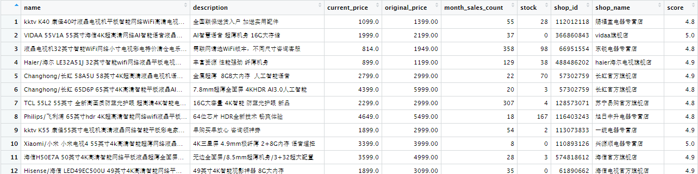

## plot

```R
?plot
?par
?pch

plot(mtcars$wt)
plot(mtcars$wt, mtcars$disp)
plot(mtcars)
```

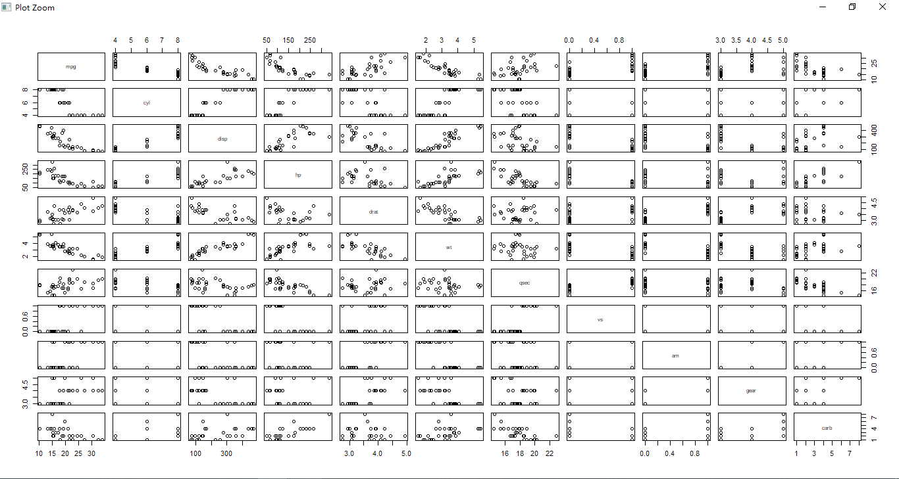

```R
# type
rm(mtcars)  # Restore default R dataset after edits
order(mtcars$wt)
mtcars <- mtcars[order(mtcars$wt), ]
par(mfrow=c(3, 3))
plot(mtcars$wt, mtcars$disp, type='p')
plot(mtcars$wt, mtcars$disp, type='l')
plot(mtcars$wt, mtcars$disp, type='b')
plot(mtcars$wt, mtcars$disp, type='o')
plot(mtcars$wt, mtcars$disp, type='h')
plot(mtcars$wt, mtcars$disp, type='s')
plot(mtcars$wt, mtcars$disp, type='S')
plot(mtcars$wt, mtcars$disp, type='n')
```

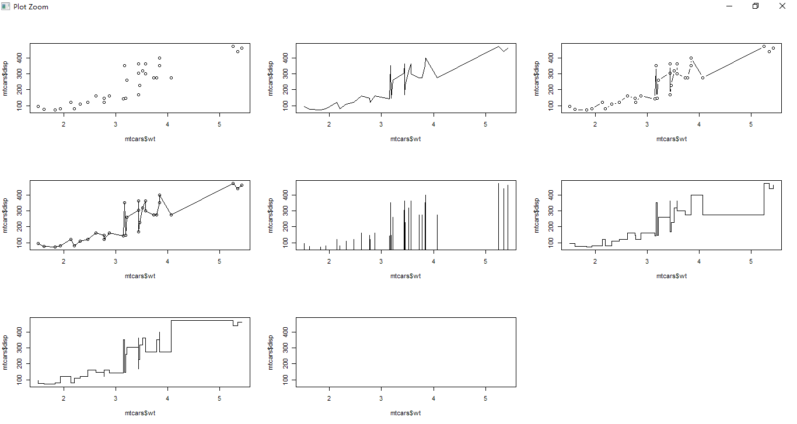

```R
par(mfrow=c(3, 3))
plot(mtcars$wt, mtcars$disp)
# pch (shape)
plot(mtcars$wt, mtcars$disp, pch=2)
# cex (size)
plot(mtcars$wt, mtcars$disp, pch=2, cex = 2)
# lty (line type)
plot(mtcars$wt, mtcars$disp, type = 'l', lty=3)
# lwd (line width)
plot(mtcars$wt, mtcars$disp, type = 'l', lty=3, lwd = 2)
# col (color)
plot(mtcars$wt, mtcars$disp, type = 'l', lty=3, lwd = 2, col='blue')
plot(mtcars$wt, mtcars$disp, type = 'l', lty=3, lwd = 2, col=4)
plot(mtcars$wt, mtcars$disp, type = 'l', lty=3, lwd = 2, col='#0000FF')
plot(mtcars$wt, mtcars$disp, type = 'l', lty=3, lwd = 2, col=rgb(red = 0, green = 0, blue=1))
```

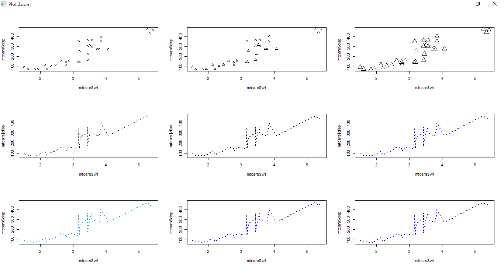

```R
par(mfrow=c(2, 2))

# xlim, ylim
plot(mtcars$wt, mtcars$disp, type = 'l', xlim = c(3, 4), ylim = c(200, 300))

# main
plot(mtcars$wt, mtcars$disp, type = 'l', main = "wt&disp")

# sub
plot(mtcars$wt, mtcars$disp, type = 'l', main = "wt&disp", sub="2021/05/08")

# xlab, ylab
plot(mtcars$wt, mtcars$disp, type = 'l', xlab = "wt", ylab = "disp")
```

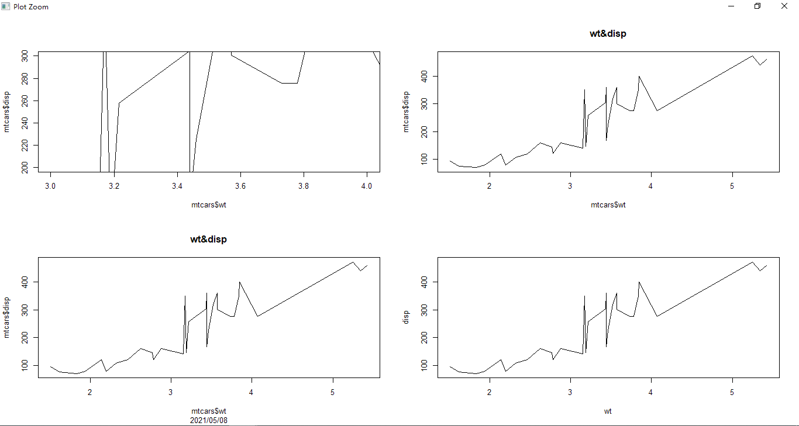

## lines, points

```R
setwd("D:/study/r")

library(readxl)
s <- read_excel("data/stock.xlsx")
View(s)
```

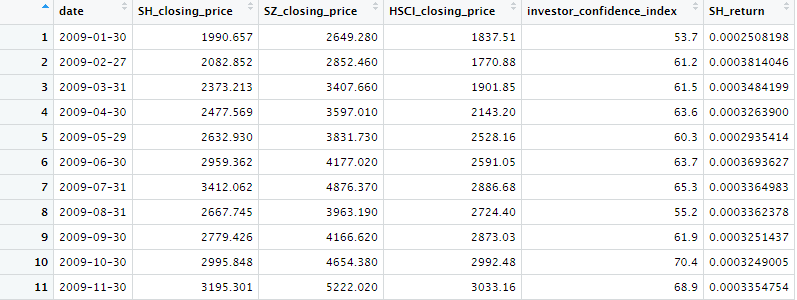...

```R
plot(s$date, s$SH_closing_price, type="l")
abline(h=3000, v=as.POSIXct('2015-01-30'), lty=4, col='blue')
# 显示不完整，因为 lines 是基于 plot 绘制的, range 差异较大
lines(s$date, s$SZ_closing_price, lty = 2)
range(s$SH_closing_price)
# [1] 1979.206 4611.744
range(s$SZ_closing_price)
# [1]  2649.28 12219.79
```

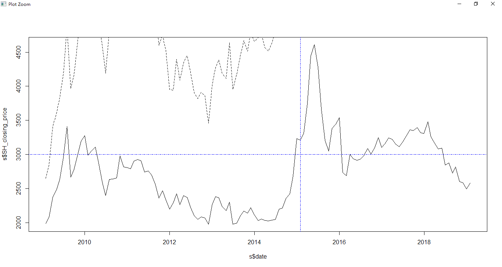

```R
plot(s$date, s$SH_closing_price, type="l", ylim=c(1500, 13000))
abline(h=3000, v=as.POSIXct('2015-01-30'), lty=4, col='red')
lines(s$date, s$SZ_closing_price, lty = 2, col="blue")
```

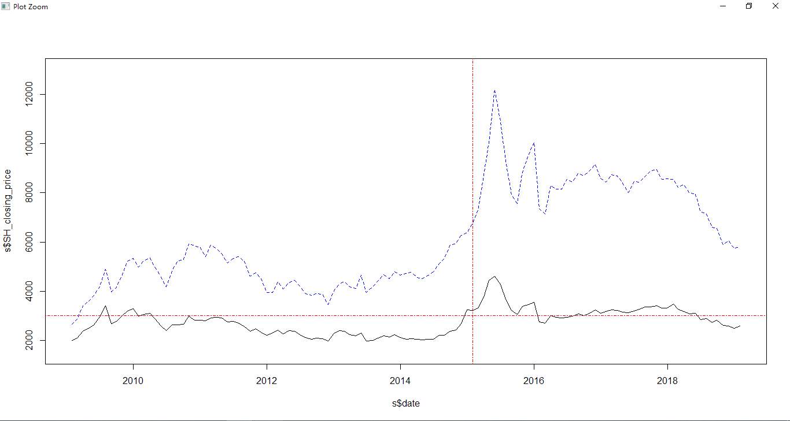

```R
plot(s$SH_closing_price, s$investor_confidence_index, type='l')
order(c(9, 8, 7)) # [1] 3 2 1
c(9, 8, 7)[order(c(9, 8, 7))] # [1] 7 8 9
s1 <- s[order(s$SH_closing_price),]
plot(s1$SH_closing_price, s1$investor_confidence_index, type='l')
```

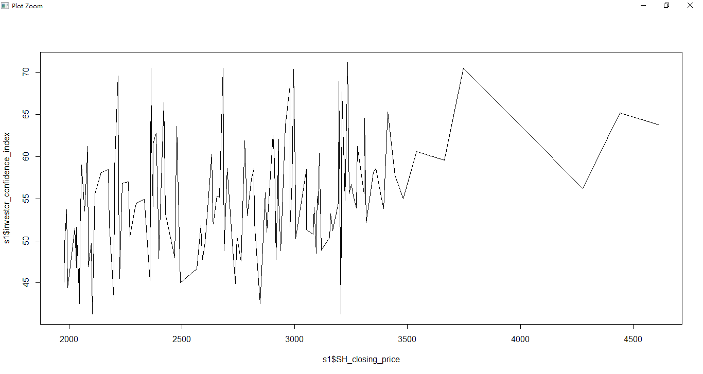

```R
s$class <- ifelse(s$SH_closing_price < 3000, 1, 2)
s[c('SH_closing_price', 'class')]
# s1 <- subset(s, class == 1)
# s2 <- subset(s, class == 2)
# plot(s1$SH_closing_price, s1$investor_confidence_index,
#     pch = 16, col='blue', xlim= range(s$SH_closing_price), ylim = range(s$investor_confidence_index))
# points(s2$SH_closing_price, s2$investor_confidence_index, pch=17, col= "green")

c('blue', 'green')[c(1, 2, 1, 2)]
# [1] "blue"  "green" "blue"  "green"

plot(s$SH_closing_price, s$investor_confidence_index,
     col=c('blue', 'green')[s$class], pch=c(16, 17)[s$class])
```

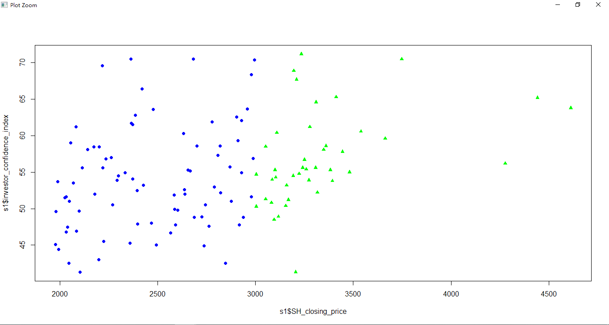

```R
matplot(s$date, s[, 2:4], lty = 1:3, type="l")
```

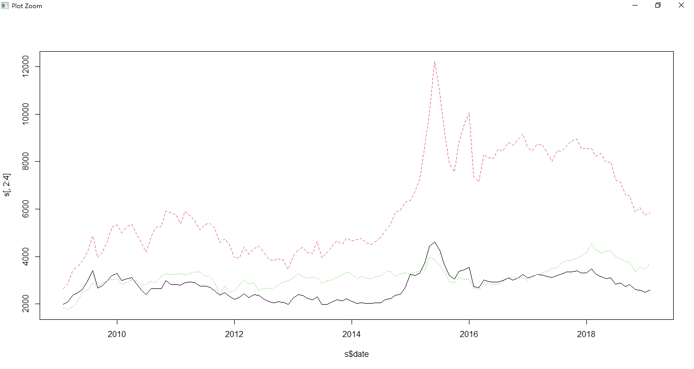

## biaxial

```R
library(readxl)
s <- read_excel('data/stock.xlsx')

par()$mar
par(mar=c(5, 4, 4, 4)) # adjust margin size
plot(s$date, s$SH_closing_price, type="l", xlab = "time", ylab="SH_closing_price")
par(new=T)  # second plot show at first plot
plot(s$date, s$investor_confidence_index, type="l", lty=2, ann = F, yaxt = 'n')
axis(side = 4)
mtext(text = "investor_confidence_index", side=4, line = 2)
legend('topright', legend = c('SH_closing_price', 'investor_confidence_index'), lty=c(1, 2), bty='n')
```

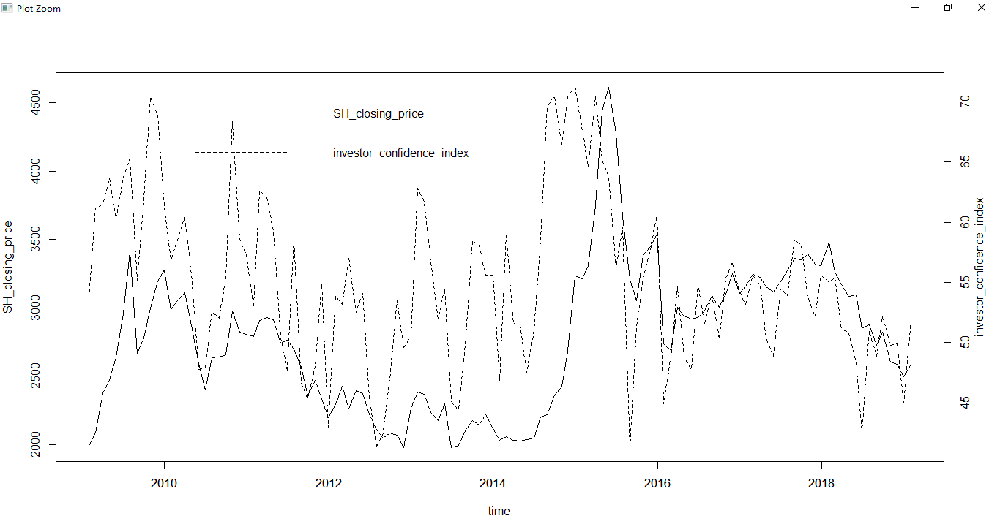

## histogram, density

```R
library(readxl)
d <- read_excel("data/returndaily.xlsx")
View(d)
```

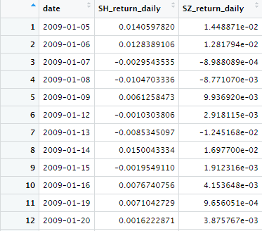

```R
x <- d$SH_return_daily
y <- hist(x)
y <- hist(x, breaks = 100)
breaks <- seq(min(x), max(x), length.out = 101)
y <- hist(x, breaks = breaks)  # Frequency
y <- hist(x, breaks = breaks, freq = F) # Density
y$breaks[2]-y$breaks[1]
y$counts
y$density
y$density * (y$breaks[2] - y$breaks[1])
sum(y$density * (y$breaks[2] - y$breaks[1])) # 1
```

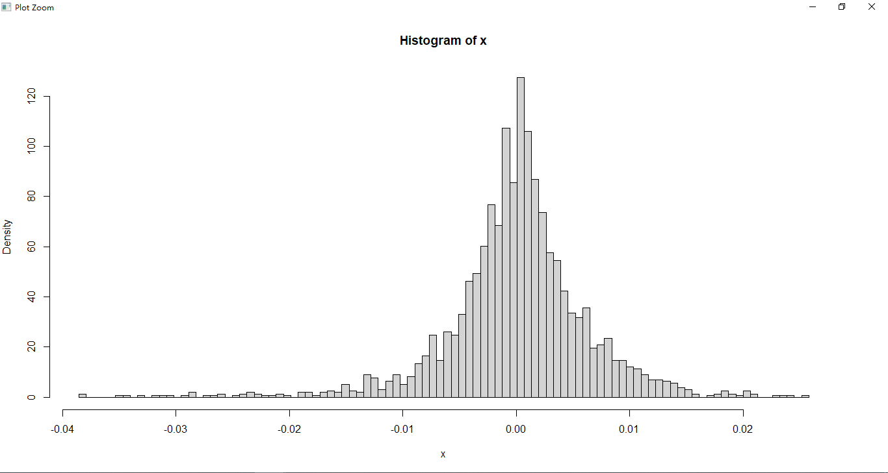

```R
z <- density(x, bw = 0.001)
plot(z)
z$bw
```

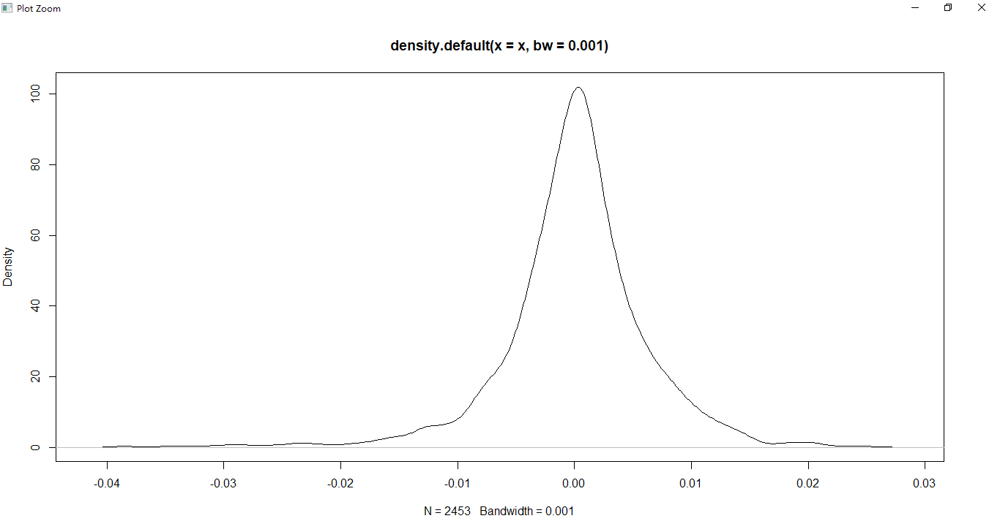

```R
hist(x, breaks = breaks, freq = F, col='red', border="white")
lines(density(x, bw=0.001), col="blue")
```

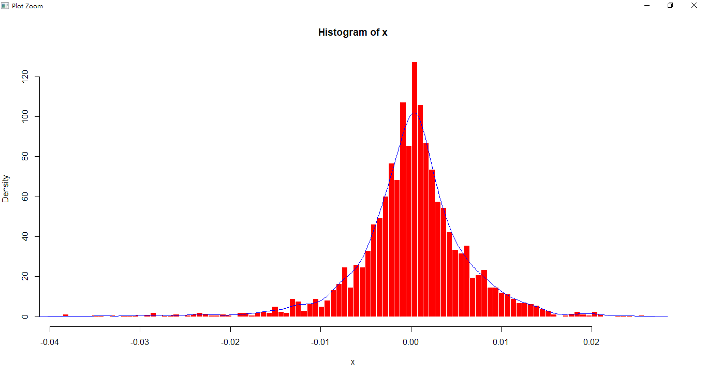

```R
a <- rnorm(10000, 0, 1)
hist(a, col='red', freq=F, breaks=100, border="white")
lines(density(a, bw=0.5), col="blue")
```

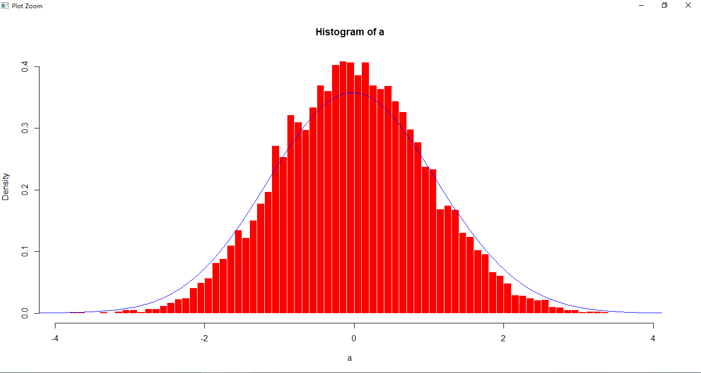

```R
install.packages("fBasics")
library(fBasics)

Sys.setlocale(category = "LC_ALL",local="chinese")
describe <- function(x) {
  m <- mean(x)
  v <- var(x)
  s <- sd(x)
  skew <- skewness(x)
  k <- kurtosis(x)
  jar <- jarqueberaTest(x)
  p <- jar@test$p.value
  return (c("均值" = m, "方差" = v, "标准差" = s, "偏度" = skew, "峰度" = k, "P值" = p))
}

describe(x)
```

## color

```R
colors() # 657 colors
a = 1:26
b = 1:26
d = merge(a, b)
View(d)

d = d[1:657, ]
plot(d, col=colors(), cex=3, pch=15)

for (i in 1:26) {
  for (j in 1:26) {
    text(i, j, labels = i + (j - 1) * 26, cex = 0.5)
  }
}
```

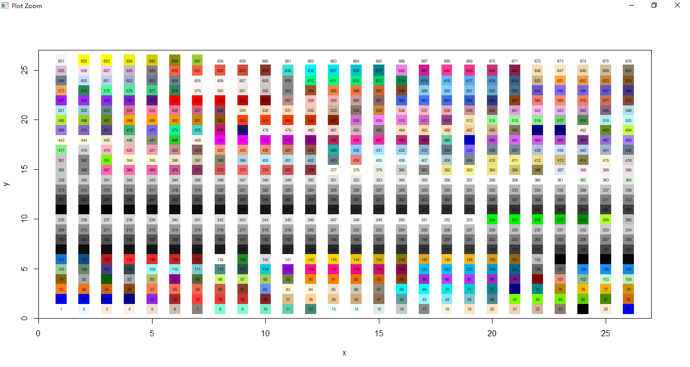

```R
# color palette
par(mfrow=c(2, 3))
plot(1:10, rep(1, 10), col=rainbow(10), cex=4, pch=15)
plot(1:10, rep(1, 10), col=rainbow(10, alpha = 0.5), cex=4, pch=15)
plot(1:10, rep(1, 10), col=heat.colors(10), cex=4, pch=15)
plot(1:10, rep(1, 10), col=terrain.colors(10), cex=4, pch=15)
plot(1:10, rep(1, 10), col=topo.colors(10), cex=4, pch=15)
plot(1:10, rep(1, 10), col=cm.colors(10), cex=4, pch=15)
```

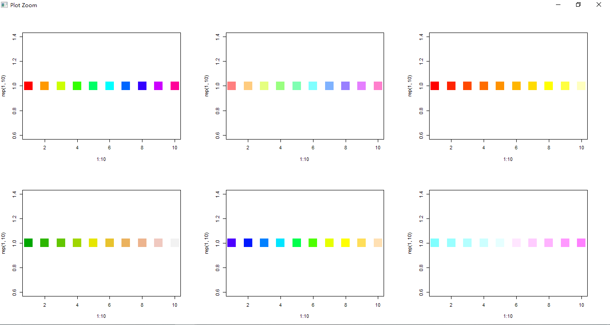

```R
# color extension
par(mfrow=c(1, 2))
cols <- colorRampPalette(c("yellow", "red"))(50)
plot(1:50, col=cols, pch=16, cex = 2)

mtcars <- mtcars[order(mtcars$wt),]
plot(mtcars$wt, mtcars$disp, col=cols, pch=16, cex = 2)
```

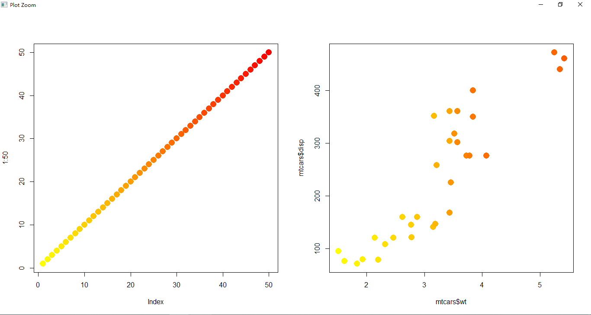

```R
# color schema
par(mfrow=c(1, 3))
# install.packages("RColorBrewer")
library(RColorBrewer)
display.brewer.all()
cols <- brewer.pal(8, "Accent")
plot(1:8, rep(1, 8), col = cols, pch=16, cex=3)

# install.packages("colorspace")
library(colorspace)
# hcl_palettes(plot = T)
cols <- qualitative_hcl(8, "Dynamic")
plot(1:8, rep(1, 8), col = cols, pch=16, cex=3)
```

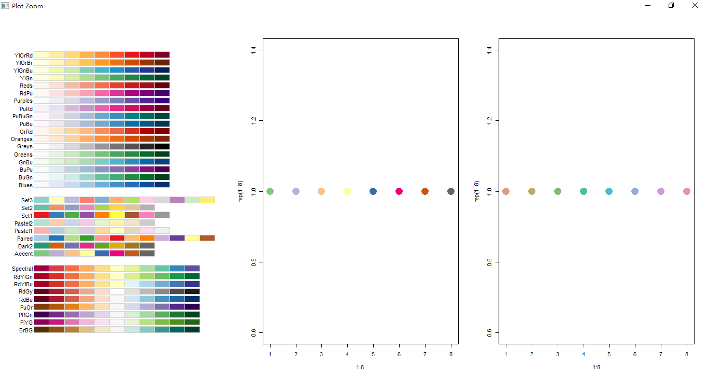

## bar, pie, box

```R
par(mfrow=c(2, 2))

barplot(1:5)
X <- table(mtcars$gear)
X
#  3  4  5
# 15 12  5
barplot(X)
barplot(X, names.arg = c("gear-3", "gear-4", "gear-5"), ylim=c(0,20))
barplot(X, names.arg = c("gear-3", "gear-4", "gear-5"), ylim=c(0,20), width = c(3, 2, 1))
```

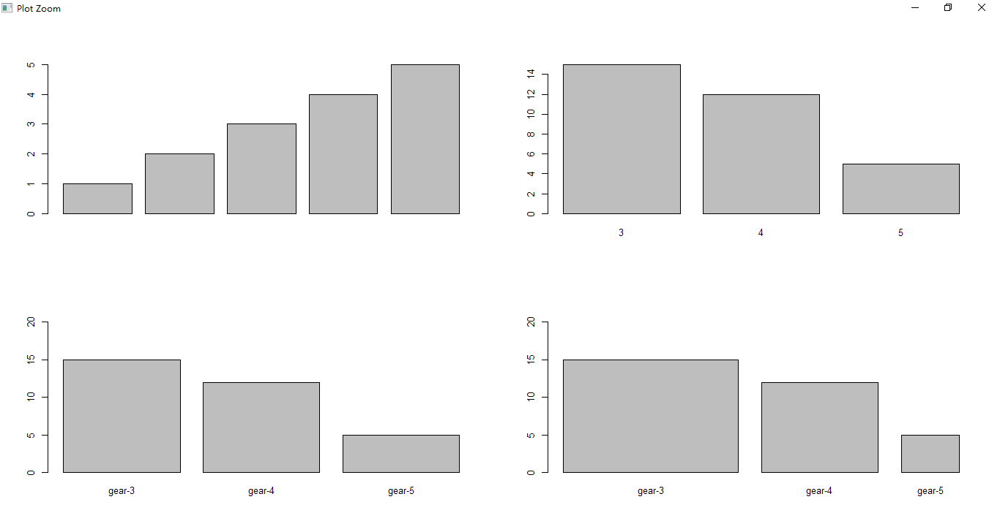

```R
par(mfrow=c(1, 2))
X <- table(mtcars[c("vs", "gear")])
X
#    gear
#  vs  3  4  5
#   0 12  2  4
#   1  3 10  1
barplot(X)
barplot(X, beside = T, col = c("yellow", "red"), legend.text = c("VS-0", "VS-1"))
```

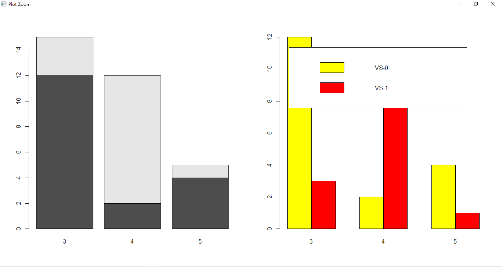

```R
red <- grep("red", colors(), value=T, ignore.case = T)
red
barplot(rep(1, length(red)), col=red, names.arg = red,
        horiz = T, las=1, cex.names = 0.5, xaxt="n")
```

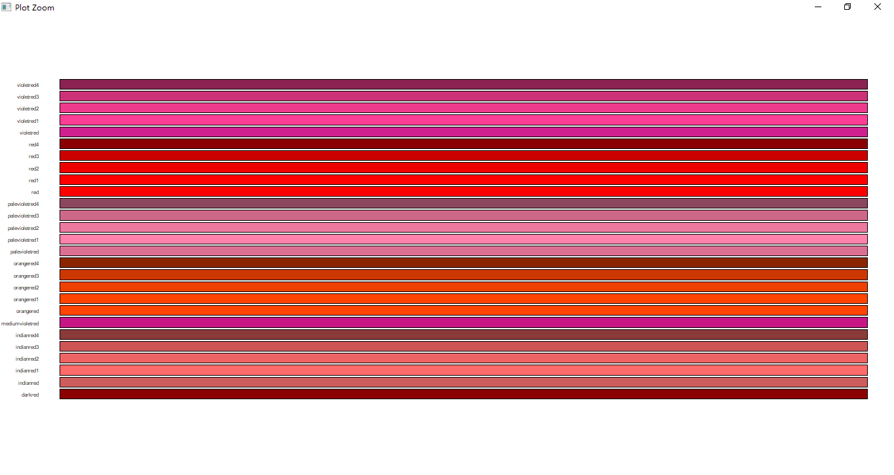

```R
par(mfrow=c(2, 3))
a = 1:4
pie(a)
pie(a, labels = LETTERS[1:4])
names(a) = LETTERS[1:4]
pie(a)
pie(a, clockwise = T, col = c("red", "green", "blue", "yellow"), border = "white")
pie(a, clockwise = T, col = terrain.colors(4), border = "white")
pie(rev(a), clockwise = T, col = rev(terrain.colors(4)), border = "white")
```

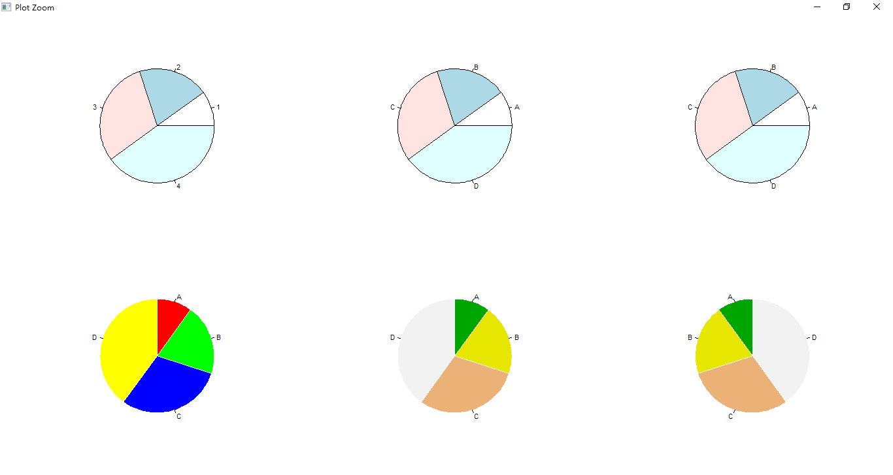

```R
# boxplot
par(mfrow=c(1, 2))
r <- rnorm(50, 0, 1)
b <- c(r, 5, 6, -5, -6)
y <- boxplot(b)
y
y$stats
y$out


r2 <- c(rnorm(50, 0, 1), rnorm(50, 10, 1))
r3 <- c(rep(c("class1", "class2"), times=c(50, 50)))
rd <- data.frame(r2, r3)
View(rd)
boxplot(r2~r3, data=rd)
```

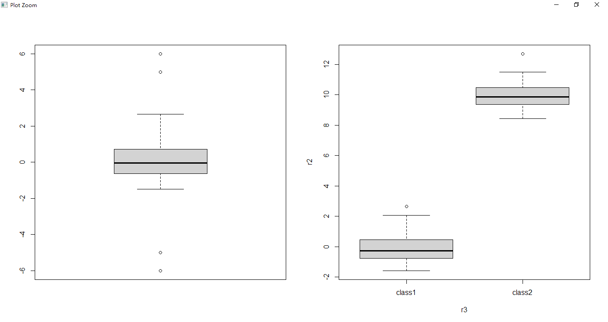

## pairs, cor, smoothScatter, curve

```R
mdata <- mtcars[c('mpg', 'disp', 'hp', 'drat','wt')]
mdata
pairs(mdata, col="blue", pch=16)
# pairs(mdata, col="blue", pch=16, upper.panel = NULL)
```

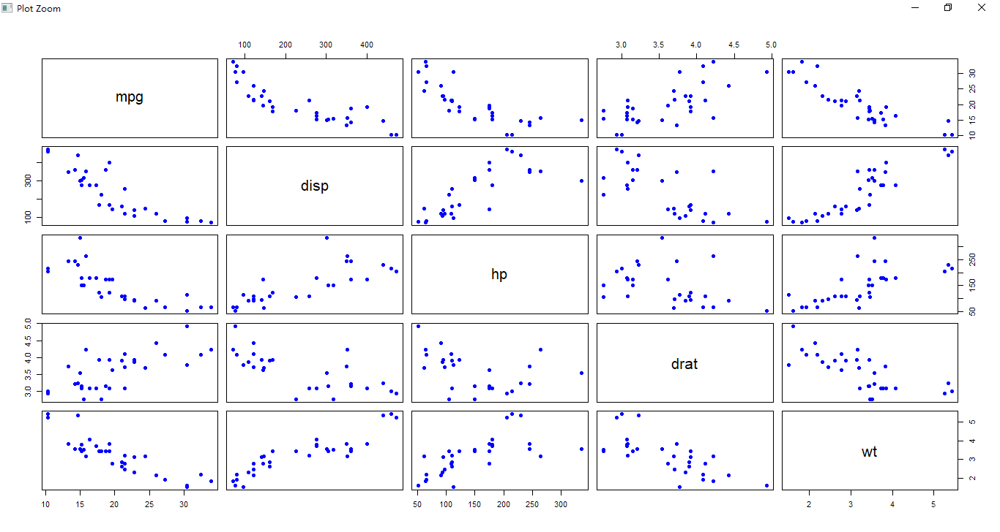

```R
panelfunc <- function(x, y) {
  points(x, y, col="blue")
  abline(lm(y~x), col="green")
}
pairs(mdata, panel = panelfunc, upper.panel = NULL)
```

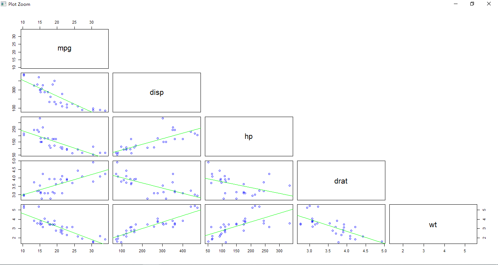

```R
install.packages("car")
library(car)
spm(mdata)
# diagnoal daɪˈæɡənl: 对角线
spm(mdata, smooth=F, diagonal=list(method="histogram"))
```

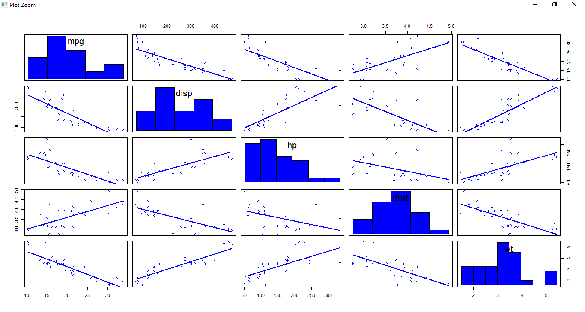

```R
# 相关系数
corr1 <- cor(mdata)
cor(mdata, method = "spearman")
cor(mdata, method = "kendall")

install.packages("ggcorrplot")
par(mfrow=c(2, 2))
library(ggcorrplot)
ggcorrplot(corr1)
ggcorrplot(corr1, lab = T)
ggcorrplot(corr1, lab = T, hc.order = T)
ggcorrplot(corr1, lab = T, hc.order = T, type = "lower")
```

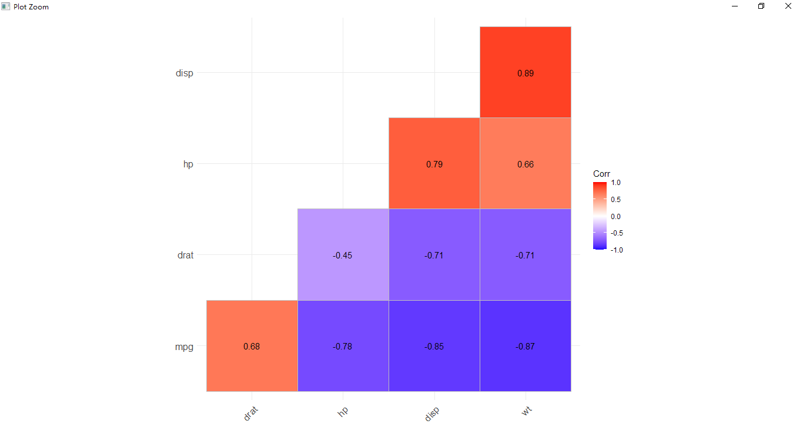

```R
# 散点密度热图
par(mfrow=c(2, 3))
a <- rnorm(5000, 0, 1)
b <- rnorm(5000, 0, 3)
smoothScatter(a, b)
smoothScatter(a, b, nrpoints = 4)
smoothScatter(a, b, nrpoints = Inf)
plot(a, b, col = densCols(a, b))
plot(a, b, col = densCols(a, b, colramp = colorRampPalette(c("yellow", "red"))))
plot(a, b, col = densCols(a, b, colramp = colorRampPalette(c("yellow", "red"))),
     pch=20, cex=1.5)
```

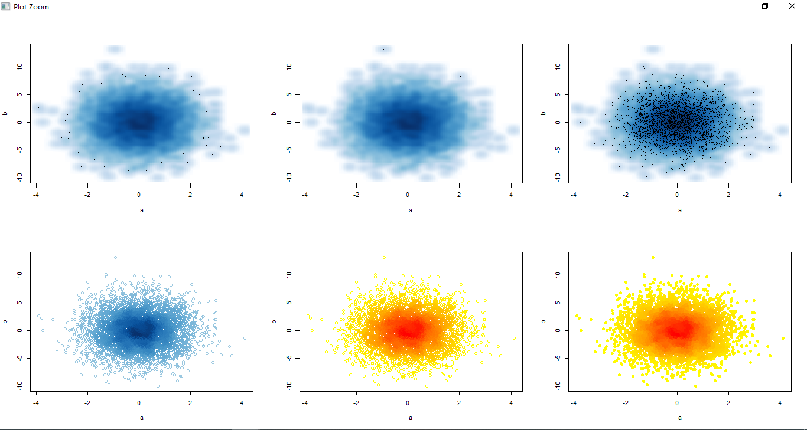

```R
# 函数图像
curve(log(x) + sqrt(x) + x^2, from = 1, to=100, n = 1000,
      main=expression(log(x) + sqrt(x) + x^2), ylab = "y")
```

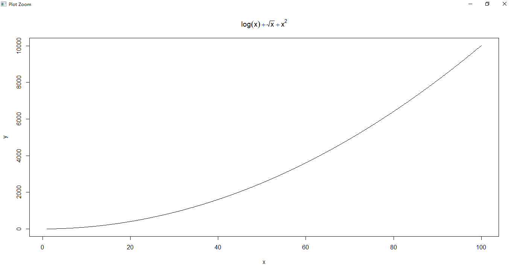

## symbols

```R
par(mfrow=c(2, 2))
symbols(mtcars$disp, mtcars$wt, circles = mtcars$mpg)
symbols(mtcars$disp, mtcars$wt, squares = mtcars$mpg)
symbols(mtcars$disp, mtcars$wt, circles = mtcars$mpg, inches = F)
symbols(mtcars$disp, mtcars$wt, circles = sqrt(mtcars$mpg), inches = 0.3,
        bg="red", fg="green")
```

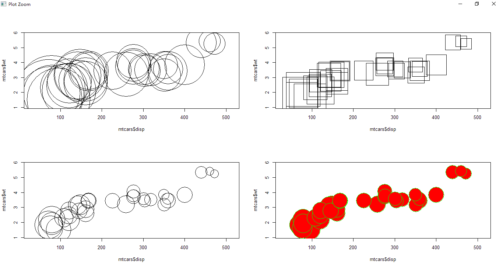

```R
n <- nrow(mtcars)
heatcols <- heat.colors(n + 2, alpha = 0.6)
barplot(rep(1, n), col = heatcols)
mtcars <- mtcars[order(mtcars$mpg, decreasing = T),]
symbols(mtcars$disp, mtcars$wt, circles = sqrt(mtcars$mpg), inches = 0.3,
        bg=heatcols, fg=heatcols)

mdisp <- mean(mtcars$disp)
mwt <- mean(mtcars$wt)
abline(v=mdisp, h=mwt, col="grey", lty=2)
```

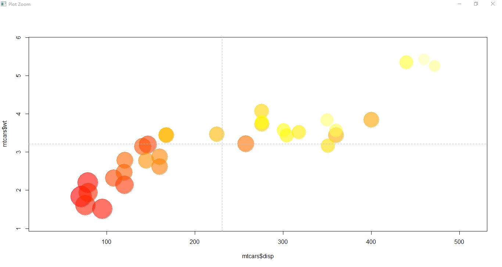

```R
mtcars["disp_wt_class"] <- ifelse(
  mtcars$disp>mdisp&mtcars$wt>mwt, 1,
  ifelse(mtcars$disp<mdisp&mtcars$wt>mwt, 2,
    ifelse(mtcars$disp<mdisp&mtcars$wt<mwt, 3, 4)
  )
)
mtcars["disp_wt_class"]
library(RColorBrewer)
display.brewer.all()
piyg <- brewer.pal(5, "PiYG")
piyg
barplot(rep(1, 5), col = piyg, names.arg = 1:5)
col1 <- piyg[1]
col2 <- piyg[2]
col3 <- piyg[5]
col4 <- piyg[4]
symbols(mtcars$disp, mtcars$wt, circles = sqrt(mtcars$mpg), inches = 0.3,
        bg=c(col1, col2, col3, col4)[mtcars$disp_wt_class], fg="white")
abline(v=mdisp, h=mwt, col="grey", lty=2)
```

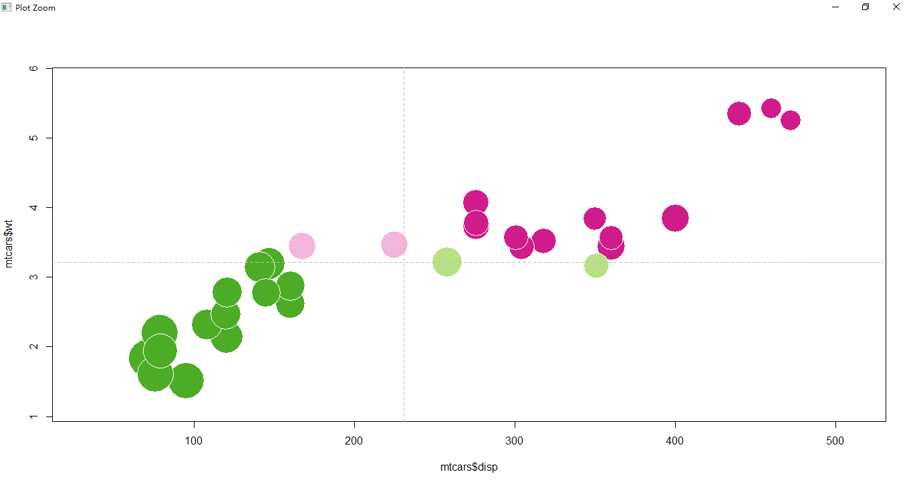

## wordcloud

```R
# install.packages("jiebaR")
library(jiebaR)
mixseg <- worker(stop_word = "data/chiese_stop_word.txt")
segment("我想吃饭", mixseg)
# [1] "想"   "吃饭"

library(readxl)
tm <- read_excel("data/tianmaoTV.xlsx", skip=1)
tm_word <- segment(tm$name, mixseg)
tm_word
mixseg <- worker(stop_word = "data/chiese_stop_word.txt")
tm_word <- segment(tm$name, mixseg)
"吋"%in%tm_word

"超高清"%in%tm_word
show_dictpath()
edit_dict()
mixseg <- worker(stop_word = "data/chiese_stop_word.txt")
tm_word <- segment(tm$name, mixseg)
"超高清"%in%tm_word

gsub('a', 'A', 'abcA')
gsub('\\d', '', '1234abc567')
tm_name <- gsub("\\d", "", tm$name) # replace number to empty
tm_word <- segment(tm_name, mixseg)
tm_word

tm_freq = table(tm_word)
tm_freq = sort(tm_freq, decreasing = T)
# install.packages("wordcloud2")
library(wordcloud2)
wordcloud2(tm_freq)
tm_freq = sqrt(tm_freq)
wordcloud2(tm_freq)
wordcloud2(tm_freq, size=0.6)
tm_freq <- tm_freq[tm_freq > 3]
tm_freq
wordcloud2(tm_freq)
wordcloud2(tm_freq, size=0.6, color = "random-light", fontWeight = "bold")

library(RColorBrewer)
display.brewer.all()
cols <- brewer.pal(11, "Set3")
cols_ramp <- colorRampPalette(cols)(length(tm_freq))
wordcloud2(tm_freq, size=0.6, color = cols_ramp, fontWeight = "bold")
```


## comprehensive case

```R
library(readxl)
tm <- read_excel("data/tianmaoTV.xlsx", skip=1)
typeof(tm["current_price"])
typeof(tm$current_price)
price_brands = aggregate(tm["current_price"], by=list(brand=tm$brand), mean)
price_brands$current_price
price_brands <- price_brands[order(price_brands$current_price, decreasing = T), ][1:10,]
price_brands
price_brands$brand
china <- c("AOC", "Hisense/海信", "乐视TV", "Skyworth/创维", "Haier/海尔")
price_brands$china <- ifelse(price_brands$brand%in%china, 1, 0)
price_brands
par()$mar
par(mar=c(5, 5, 2, 2))

price_brands <- price_brands[order(price_brands$current_price),]
x <- barplot(price_brands$current_price, names.arg = price_brands$brand,
        horiz = T, las=1,
        cex.names = 0.6,
        border = NA,
        col = "grey",
        axes = F,
        xlim = c(0, 10000))
china_price_vector <- price_brands$current_price * price_brands$china
china_price_vector
barplot(china_price_vector, names.arg = F,
        horiz = T, las=1,
        border = NA,
        col = "orange1",
        axes = F,
        add = T)
axis(side = 1, at = c(0, 2000, 4000, 6000, 8000, 10000),
     labels = c(0, 2, 4, 6, 8, '10(千元)'),
     tick = F, cex.axis = 0.6)

rect(0, -0.5, 5000, x[10] + x[1], col = rgb(191, 239, 255, 80, maxColorValue = 255), border = NA)
rect(5000, -0.5, 10000, x[10] + x[1], col = rgb(191, 239, 255, 110, maxColorValue = 255), border = NA)
```

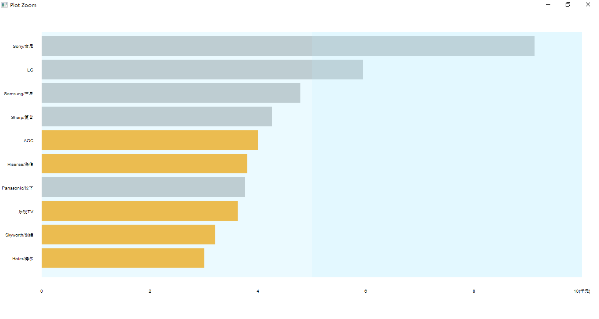

## connect Oracle

```R
install.packages("RJDBC")

Sys.setenv(JAVA_HOME='C:\\Program Files\\Java\\jdk1.8.0_181\\jre')

library(RJDBC)


# Tell R where your JDBC driver is located
driver <- JDBC("oracle.jdbc.driver.OracleDriver", "D:/maven/mavenlocal/com/oracle/ojdbc14/11.2.0/ojdbc14-11.2.0.jar", identifier.quote="`")


# Make a connection using your JDBC driver and connection URL
conn <- dbConnect(driver, "jdbc:oracle:thin:@//ip:port/instance", "username", "password")
conn

# options(java.parameters = "-Xmx800m")

data <- dbGetQuery(conn, "SELECT * FROM som_edi_temp_d")
data <- subset(data, EDI_TYPE=='850', c('CUSTOMER_ID', 'ORDERED_QUANTITY', 'UNIT_SELLING_PRICE'))
data$TOTAL_PRICE <- data$ORDERED_QUANTITY * data$UNIT_SELLING_PRICE
data = aggregate(data["TOTAL_PRICE"], by=data["CUSTOMER_ID"], sum)

par()$mar
par(mar=c(5, 5, 2, 2))

barplot(data$TOTAL_PRICE, names.arg = data$CUSTOMER_ID, axes=F, ylim = c(0, 2000000000))
axis(side = 2, at = c(0, 500000000, 1000000000, 1500000000, 2000000000),
     labels = c(0, 5, 10, 15, '20(亿)'))
```
