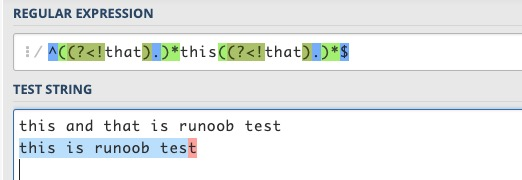
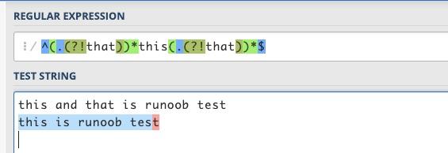
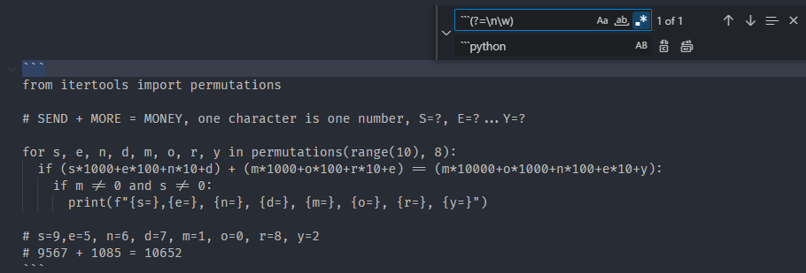

正则表达式的先行断言和后行断言一共有 4 种形式：

-   **(?=pattern)** 零宽正向先行断言(zero-width positive lookahead assertion)
-   **(?!pattern)** 零宽负向先行断言(zero-width negative lookahead assertion)
-   **(?<=pattern)** 零宽正向后行断言(zero-width positive lookbehind assertion)
-   **(?<!pattern)** 零宽负向后行断言(zero-width negative lookbehind assertion)

这里面的 **pattern** 是一个正则表达式。

如同 **^** 代表开头，**$** 代表结尾，**\b** 代表单词边界一样，先行断言和后行断言也有类似的作用，它们只匹配某些位置，在匹配过程中，不占用字符，所以被称为 **"零宽"**。所谓位置，是指字符串中(每行)第一个字符的左边、最后一个字符的右边以及相邻字符的中间（假设文字方向是头左尾右）。

下面分别举例来说明这 4 种断言的含义。

## (?=pattern) 正向先行断言

代表字符串中的一个位置，紧接该位置之后的字符序列能够匹配 pattern。

例如对 **"a regular expression"** 这个字符串，要想匹配 regular 中的 re，但不能匹配 expression 中的 re，可以用 **re(?=gular)**，该表达式限定了 re 右边的位置，这个位置之后是 gular，但并不消耗 gular 这些字符。


将表达式改为 **re(?=gular).** ，将会匹配 reg，元字符 **.** 匹配了**g**


## (?!pattern) 负向先行断言

代表字符串中的一个位置，紧接该位置之后的字符序列不能匹配 pattern。

例如对 **"regex represents regular expression"** 这个字符串，要想匹配除 regex 和 regular 之外的 re，可以用 **re(?!g)**，该表达式限定了 **re** 右边的位置，这个位置后面不是字符 **g**。

负向和正向的区别，就在于该位置之后的字符能否匹配括号中的表达式。


## (?<=pattern) 正向后行断言

代表字符串中的一个位置，紧接该位置之前的字符序列能够匹配 pattern。

例如对 **regex represents regular expression** 这个字符串，有 4 个单词，要想匹配单词内部的 re，但不匹配单词开头的 re，可以用 **(?<=\w)re**，单词内部的 re，在 re 前面应该是一个单词字符。

之所以叫后行断言，是因为正则表达式引擎在匹配字符串和表达式时，是从前向后逐个扫描字符串中的字符，并判断是否与表达式符合，当在表达式中遇到该断言时，正则表达式引擎需要往字符串前端检测已扫描过的字符，相对于扫描方向是向后的。


## (?<!pattern) 负向后行断言

代表字符串中的一个位置，紧接该位置之前的字符序列不能匹配 pattern。

例如对 **"regex represents regular expression"** 这个字符串，要想匹配单词开头的 re，可以用 **(?<!\w)re**。单词开头的 **re**，在本例中，也就是指不在单词内部的 **re**，即 **re** 前面不是单词字符。当然也可以用 **\bre** 来匹配。


对于这 4 个断言的理解，可以从两个方面入手：

1. **关于先行(lookahead)和后行(lookbehind)** 正则表达式引擎在执行字符串和表达式匹配时，会从头到尾（从前到后）连续扫描字符串中的字符，设想有一个扫描指针指向字符边界处并随匹配过程移动。先行断言，是当扫描指针位于某处时，引擎会尝试匹配指针还未扫过的字符，先于指针到达该字符，故称为先行。后行断言，引擎会尝试匹配指针已扫过的字符，后于指针到达该字符，故称为后行。
2. **关于正向(positive)和负向(negative)** 正向就表示匹配括号中的表达式，负向表示不匹配。
3. **先行和后行** 后行断言 **(?<=pattern)、(?<!pattern)** 中，有个小于号，同时也是箭头，对于自左至右的文本方向，这个箭头是指向后的，这也比较符合我们的习惯。把小于号去掉，就是先行断言。
4. **正向和负向** 不等于 **(!=)**、逻辑非 **(!)** 都是用 **!**号来表示，所以有 **!** 号的形式表示不匹配、负向；将 **!** 号换成 **=** 号，就表示匹配、正向。

我们经常用正则表达式来检测一个字符串中包含某个子串，要表示一个字符串中不包含某个字符或某些字符也很容易，用 **[^...]** 形式就可以了。要表示一个字符串中不包含某个子串（由字符序列构成）呢？

用 **[^...]** 这种形式就不行了，这时就要用到（负向）先行断言或后行断言、或同时使用。

例如判断一句话中包含 **this**，但不包含 **that**。

包含 **this** 比较好办，一句话中不包含 **that**，可以认为这句话中每个字符的前面都不是 **that** 或每个字符的后面都不是 **that**。正则表达式如下：

每个字符前都不是 **that**: `^((?<!that).)*this((?<!that).)*$`

每个字符后都不是 **that**: `^(.(?!that))*this(.(?!that))*$`

对于 **this is runoob test** 这句话，两个表达式都能够匹配成功，而 **this and that is runoob test** 都匹配失败。





在一般情况下，这两个表达式基本上都能够满足要求了。考虑极端情况，如一句话以 **that** 开头、以 **that** 结尾、**that** 和 **this** 连在一起时，上述表达式就可能不胜任了。 如 **runoob thatthis is the case** 或者 **this is the case, not that** 等。

只要灵活运用这几个断言，就很容易解决：

```
^(.(?<!that))*this(.(?<!that))*$
^(.(?<!that))*this((?!that).)*$
^((?!that).)*this(.(?<!that))*$
^((?!that).)*this((?!that).)*$
```

这 4 个正则表达式测试上述的几句话，结果都能够满足要求。

上述 4 种断言，括号里的 pattern 本身是一个正则表达式。但对 2 种后行断言有所限制，在 Perl 和 Python 中，这个表达式必须是定长(fixed length)的，即不能使用 **\*、+、?** 等元字符，如 **(?<=abc)** 没有问题，但 **(?<=a\*bc)** 是不被支持的，特别是当表达式中含有 **|**连接的分支时，各个分支的长度必须相同。之所以不支持变长表达式，是因为当引擎检查后行断言时，无法确定要回溯多少步。Java 支持 **?、{m}、{n,m}** 等符号，但同样不支持 **\*、+** 字符。JavaScript 干脆不支持后行断言，不过一般来说，这不是太大的问题。

先行断言和后行断言某种程度上就好比使用 **if** 语句对匹配的字符前后做判断验证。

## 总结 ?=、?<=、?!、?<!= 的使用

**exp1(?=exp2)**：查找 exp2 前面的 exp1。


**(?<=exp2)exp1**：查找 exp2 后面的 exp1。


**exp1(?!exp2)**：查找后面不是 exp2 的 exp1。


**(?<!=exp2)exp1**：查找前面不是 exp2 的 exp1。


## Comments

使用 **(?=pattern)** 零宽正向先行断言 (zero-width positive lookahead assertion) 替换 Markdown 两个 **```** 中的第一个为 **```python**。



