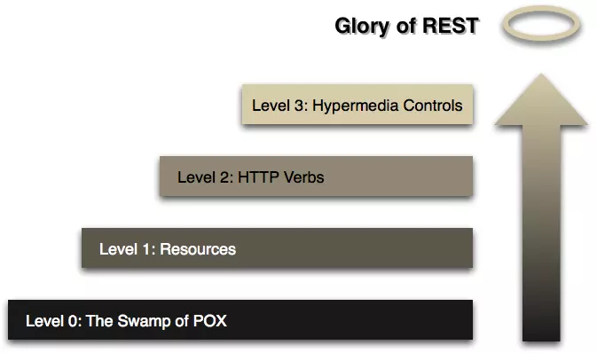

> 转载: [如何给老婆解释什么是 Restful - 简书](https://www.jianshu.com/p/e77d2f60aa5d)

老婆经常喜欢翻看我订阅的技术杂志，她总能从她的视角提出很多有趣的问题。

一个悠闲的周日下午，她午觉醒来，又习惯性的抓起这个月的杂志，饶有兴趣地看了起来。

果不其然，看着看着，她又对我发难了，“Restful 是什么呀，老公？是 restaurant 的形容词吗，突然就觉得好饿了啊......”

作为一个合格的程序员，我一直把能够将一项技术讲给老婆听，并且能给她讲懂，作为我已经掌握了这项技术的标准。
如果我直接回答说，“REST 就是 Representational State Transfer 的缩写呀，翻译为中文就是‘表述性状态转移’”，那她今晚肯定得罚我跪键盘。我必须找个合适的机会，把 Restful 的**来龙去脉**给她形象的描述一遍。

“走，咱们去楼下咖啡厅吃个下午茶吧”，我对老婆说。

“一个芝士蛋糕，一杯拿铁，两条吸管，谢谢”，我对前台的服务员说，然后我们找了个角落坐了下来。


# Level 0 - 面向前台

“刚才我们向前台点了一杯拿铁，这个过程可以用这段文字来描述”，说着，我在纸上写下了这段 JSON，虽然她不知道什么叫 JSON，但理解这段文字对于英语专业 8 级的她，实在再简单不过。

```json
{
  "addOrder": {
    "orderName": "latte"
  }
}
```

“我们通过这段文字，告诉前台，新增一笔订单，订单是一杯拿铁咖啡”，接着，前台给我们返回这么一串回复：

```json
{
  "orderId": "123456"
}
```

“订单 ID？还是订单编号？”
“恩恩，就是订单编号”
“那我们就等着前台喊‘订单 123456 的客户可以取餐了’，然后就可以开吃了！”
“哈哈，你真聪明，不过，在这之前，假设我们有一张会员卡，我们想查询一下这张会员卡的余额，这时候，要向前台发起另一个询问”，我继续在纸上写着：

```bash
"queryBalance": {
        "cardId": "886333"
    }
}
```

“查询卡号为 886333 的卡的余额？”
“真棒！接着，查询的结果返回来了”

```json
{
  "balance": "0"
}
```

“切，没钱......”
“哈哈，没钱，现在我们要跟前台说，这杯咖啡不要了”，我在纸上写到：

```json
{
  "deleteOrder": {
    "orderId": "123456"
  }
}
```

“哼，这就把订单取消啦？”

# Level 1 - 面向资源

“现在这家咖啡店越做越大，来喝咖啡的人越来越多，单靠前台显然是不行的，店主决定进行分工，每个**资源**都有专人负责，我们可以直接**面向资源**操作。”
"面向资源？”
“是的，比如还是下单，请求的内容不变，但是我们多了一条消息”，我在纸上画出这次的模型：

```bash
/orders

{
    "addOrder": {
        "orderName": "latte"
    }
}
```

“多了一个斜杠和 orders？这是什么意思？”
“这个表示我们这个请求是发给哪个资源的，订单是一种资源，我们可以理解为是咖啡厅专门管理订单的人，他可以帮我们处理所有有关订单的操作，包括新增订单、修改订单、取消订单等操作”
“Soga...”
“接着还是会返回订单的编号给我们”

```json
{
  "orderId": "123456"
}
```

“下面，我们还是要查询会员卡余额，这次请求的资源变成了 cards”

```bash
/cards

{
    "queryBalance": {
        "cardId": "886333"
    }
}
```

“接下来是取消订单”
“这个我会”，说着，她抢走我手上的笔，在纸上写了起来：

```bash
/orders

{
    "deleteOrder": {
        "orderId": "123456"
    }
}
```

# Level2 - 打上标签

“接下来，店主还想继续优化他的咖啡厅的服务流程，他发现负责处理订单的员工，每次都要去订单内容里面看是新增订单还是删除订单，还是其他的什么操作，十分不方便，于是规定，所有新增资源的请求，都在请求上面写上大大的‘POST’，表示这是一笔新增资源的请求”

“其他种类的请求，比如查询类的，用‘GET’表示，删除类的，用‘DELETE’表示”

“还有修改类的，修改分为两种，第一种，如果这个修改，**无论发送多少次，最后一次修改后的资源，总是和第一次修改后的一样**，比如将拿铁改为猫屎，那么用‘PUT’表示；第二种，如果这个修改，**每次修改都会让这个资源和前一次的不一样**，比如是加一杯咖啡，那么这种请求用‘PATCH’或者‘POST’表示”，一口气讲了这么多，发现她有点似懂非懂。

“来，我们再来重复上面那个过程，来一杯拿铁”，我边说边画着：

```bash
POST /orders

{
    "orderName": "latte"
}
```

"请求的内容简洁多啦，不用告诉店员是 addOrder，看到 POST 就知道是新增"，她听的很认真，理解的也很透彻。
"恩恩，返回的内容还是一样"

```json
{
  "orderId": "123456"
}
```

“接着是查询会员卡余额，这次也简化了很多”

```bash
GET /cards

{
    "cardId": "886333"
}
```

“这个请求我们还可以进一步优化为这样”

```undefined
GET /cards/886333
```

“Soga，直接把要查询的卡号写在后面了”
“没错，接着，取消订单”

```undefined
DELETE /orders/123456
```

# Level 3 - 完美服务

“忽然有一天，有个顾客抱怨说，他买了咖啡后，不知道要怎么取消订单，咖啡厅一个店员回了一句，你不会看我们的宣传单吗，上面不写着：

```undefined
DELETE /orders/{orderId}
```

顾客反问道，谁会去看那个啊，店员不服，又说到，你瞎了啊你......据说后面两人吵着吵着还打了起来...”
“噗，真是悲剧...”

“有了这次教训，店长决定，顾客下了单之后，不仅给他们返回订单的编号，还给顾客返回所有可以对这个订单做的操作，比如告诉用户如何删除订单。现在，我们还是发出请求，请求内容和上一次一样”

```bash
POST /orders

{
    "orderName": "latte"
}
```

“但是这次返回时多了些内容”

```json
{
  "orderId": "123456",
  "link": {
    "rel": "cancel",
    "url": "/order/123456"
  }
}
```

“这次返回时多了一项 link 信息，里面包含了一个 rel 属性和 url 属性，rel 是 relationship 的意思，这里的关系是 cancel，url 则告诉你如何执行这个 cancel 操作，接着你就可以这样子来取消订单啦”

```undefined
DELETE /orders/123456
```

“哈哈，这服务真是贴心，以后再也不用担心店员和顾客打起来了”

“订单 123456 的客户可以取餐了”，伴随着咖啡厅的广播，我们吃起了下午茶，一杯拿铁，两支吸管......

# 对程序员的话

用了大白话，给老婆讲明白了 RESTful 的来龙去脉，当然，我还是有些话想说的，只是怕老婆听完一脸懵逼，没给她说：

1、
上面讲的 Level0~Level3，来自*Leonard Richardson*提出的**Richardson Maturity Model**：



richardson-model.png

Level0 和 Level1 最大的区别，就是 Level1 拥有了 Restful 的第一个特征——**面向资源**，这对构建可伸缩、分布式的架构是至关重要的。同时，如果把 Level0 的数据格式换成 Xml，那么其实就是 SOAP，**SOAP 的特点是关注行为和处理**，和面向资源的 RESTful 有很大的不同。
Level0 和 Level1，其实都很挫，他们都**只是把 HTTP 当做一个传输的通道，没有把 HTTP 当做一种传输协议**。

Level2，真正将 HTTP 作为了一种传输协议，最直观的一点就是 Level2 使用了**HTTP 动词**，GET/PUT/POST/DELETE/PATCH....,这些都是 HTTP 的规范，规范的作用自然是重大的，用户看到一个 POST 请求，就知道它不是**幂等**的，使用时要小心，看到 PUT，就知道他是幂等的，调用多几次都不会造成问题，当然，这些的前提都是 API 的设计者和开发者也遵循这一套规范，确保自己提供的 PUT 接口是幂等的。

Level3，关于这一层，有一个古怪的名词，叫 HATEOAS（Hypertext As The Engine Of Application State），中文翻译为“将超媒体格式作为应用状态的引擎”，核心思想就是每个资源都有它的状态，不同状态下，可对它进行的操作不一样。理解了这一层，再来看看 REST 的全称，Representational State Transfer，中文翻译为“表述性状态转移”，是不是好理解多了？

Level3 的 Restful API，给使用者带来了很大的便利，使用者**只需要知道如何获取资源的入口**，**之后的每个 URI 都可以通过请求获得，无法获得就说明无法执行那个请求**。

现在绝大多数的 RESTful 接口都做到了 Level2 的层次，做到 Level3 的比较少。当然，**这个模型并不是一种规范，只是用来理解 Restful 的工具**。所以，做到了 Level2，也就是面向资源和使用 Http 动词，就已经很 Restful 了。**Restful 本身也不是一种规范**，我比较倾向于用"**风格**"来形容它。如果你想深入了解 Level3，可以阅读《Rest in Practice》第五章。

2、
我跟老婆讲的时候，用的数据格式是 JSON，但是要强调一点，Restful 对数据格式没有限制，就算你用的是 XML 或者其他格式，只要符合上面提到的几个特征，也算 Restful。

3、
关于如何写出好的 Restful API，阮一峰老师已经写过一篇非常棒的文章：[RESTful API 设计指南](https://link.jianshu.com/?t=http://www.ruanyifeng.com/blog/2014/05/restful_api.html)，这篇文章将指导你写出优雅的 Restful。

4、
我老婆长什么样子？
看来是时候晒一下了：


我是谁？
没错，正是在下：


