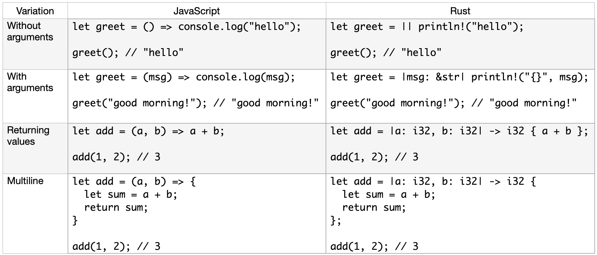

> 转载: [Rust for JavaScript Developers - Functions and Control Flow](http://www.sheshbabu.com/posts/rust-for-javascript-developers-functions-and-control-flow/)

This is the third part in a series about introducing the Rust language to JavaScript developers. Here are all the chapters:

1. [Tooling Ecosystem Overview](http://www.sheshbabu.com/posts/rust-for-javascript-developers-tooling-ecosystem-overview/)
2. [Variables and Data Types](http://www.sheshbabu.com/posts/rust-for-javascript-developers-variables-and-data-types/)
3. [Functions and Control Flow](http://www.sheshbabu.com/posts/rust-for-javascript-developers-functions-and-control-flow/)
4. [Pattern Matching and Enums](http://www.sheshbabu.com/posts/rust-for-javascript-developers-pattern-matching-and-enums/)

## Functions

Rust’s function syntax is pretty much similar to the one in JavaScript.

```rust
fn main() {
  let income = 100;
  let tax = calculate_tax(income);
  println!("{}", tax);
}

fn calculate_tax(income: i32) -> i32 {
  return income * 90 / 100;
}
```

The only difference you might see above is the type annotations for arguments and return values.

The `return` keyword can be skipped and it’s very common to see code without an explicit return. If you’re returning implicitly, make sure to remove the semicolon from that line. The above function can be refactored as:

```diff
fn main() {
  let income = 100;
  let tax = calculate_tax(income);
  println!("{}", tax);
}

fn calculate_tax(income: i32) -> i32 {
- return income * 90 / 100;
+ income * 90 / 100
}
```

## Arrow Functions

Arrow functions are a popular feature in modern JavaScript - they allow us to write functional code in a concise way.

Rust has something similar and they are called “Closures”. The name might be a bit confusing and would require getting used to because in JavaScript, closures can be created using both normal and arrow functions.

Rust’s closure syntax is very similar to JavaScript’s arrow functions:

**Without arguments:**

```javascript
// JavaScript
let greet = () => console.log("hello");

greet(); // "hello"
// Rust
let greet = || println!("hello");

greet(); // "hello"
```

**With arguments:**

```javascript
// JavaScript
let greet = (msg) => console.log(msg);

greet("good morning!"); // "good morning!"
// Rust
let greet = |msg: &str| println!("{}", msg);

greet("good morning!"); // "good morning!"
```

**Returning values:**

```javascript
// JavaScript
let add = (a, b) => a + b;

add(1, 2); // 3
// Rust
let add = |a: i32, b: i32| -> i32 { a + b };

add(1, 2); // 3
```

**Multiline:**

```javascript
// JavaScript
let add = (a, b) => {
  let sum = a + b;
  return sum;
};

add(1, 2); // 3
// Rust
let add = |a: i32, b: i32| -> i32 {
  let sum = a + b;
  return sum;
};

add(1, 2); // 3
```

Here’s a cheatsheet:


Closures don’t need the type annotations most of the time, but I’ve added them here for clarity.

## If Else

```rust
fn main() {
  let income = 100;
  let tax = calculate_tax(income);
  println!("{}", tax);
}

fn calculate_tax(income: i32) -> i32 {
  if income < 10 {
    return 0;
  } else if income >= 10 && income < 50 {
    return 20;
  } else {
    return 50;
  }
}
```

## Loops

While loops:

```rust
fn main() {
  let mut count = 0;

  while count < 10 {
    println!("{}", count);
    count += 1;
  }
}
```

Normal [for loops](https://developer.mozilla.org/en-US/docs/Web/JavaScript/Reference/Statements/for) don’t exist in Rust, we need to use `while` or `for..in` loops. `for..in` loops are similar to the `for..of` loops in JavaScript and they loop over an iterator.

```rust
fn main() {
  let numbers = [1, 2, 3, 4, 5];

  for n in numbers.iter() {
    println!("{}", n);
  }
}
```

Notice that we’re not iterating directly over the array but instead using the `iter` method of the array.

We can also loop over [ranges](https://doc.rust-lang.org/reference/expressions/range-expr.html):

```rust
fn main() {
  for n in 1..5 {
    println!("{}", n);
  }
}
```

## Iterators

In JavaScript, we can use array methods like map/filter/reduce/etc instead of `for` loops to perform calculations or transformations on an array.

For example, here we take an array of numbers, double them and filter out the elements that are less than 10:

```javascript
function main() {
    let numbers = [1, 2, 3, 4, 5];

    let double = (n) => n * 2;
    let less_than_ten = (n) => n < 10;

    let result = numbers.map(double).filter(less_than_ten);

    console.log(result); // [2, 4, 6, 8]
}
```

In Rust, we can’t directly use map/filter/etc over vectors, we need to follow these steps:

1. Convert the vector into an iterator using `iter`, `into_iter` or `iter_mut` methods
2. Chain `adapters` such as map/filter/etc on the iterator
3. Finally convert the iterator back to a vector using `consumers` such as `collect`, `find`, `sum` etc

Here’s the equivalent Rust code:

```rust
fn main() {
  let numbers = vec![1, 2, 3, 4, 5];

  let double = |n: &i32| -> i32 { n * 2 };
  let less_than_10 = |n: &i32| -> bool { *n < 10 };

  let result: Vec<i32> = numbers.iter().map(double).filter(less_than_10).collect();

  println!("{:?}", result); // [2, 4, 6, 8]
}
```

You should be able to understand most of the code above but you might notice few things off here:

-   The usage of `&` and `*` in the closure
-   The `Vec<i32>` type annotation for the `result` variable

The `&` is the reference operator and the `*` is the dereference operator. The `iter` method instead of copying the elements in the vector, it passes them as references to the next adapter in the chain. This is why we use `&i32` in the map’s closure (double). This closure returns `i32` but [filter](https://doc.rust-lang.org/std/iter/trait.Iterator.html#method.filter) calls its closure (less_than_10) with reference so that’s why we need to use `&i32` again. To dereference the argument, we use the `*` operator. We’ll cover this in more detail in future chapters.

Regarding `Vec<i32>`, so far we haven’t added type annotations to variables as Rust can infer the types automatically, but for `collect`, we need to be explicitly tell Rust that we expect a `Vec<i32>` output.

Aside from map and filter, there are ton of other [useful adapters](https://doc.rust-lang.org/std/iter/trait.Iterator.html) that we can use in iterators.

