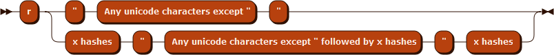

> 转载: [Rust: Raw string literals - rahul thakoor](https://rahul-thakoor.github.io/rust-raw-string-literals/)

## r#"What is this?"#

While working with Rust, you will often come across `r#"something like this"#`, especially when working with `JSON` and `TOML` files. It defines a **raw string literal**. When would you use a raw string literal and what makes a valid raw string literal?

## When would you use a raw string literal?

First, let’s understand what a string literal is. According to the The Rust Reference[1](https://rahul-thakoor.github.io/rust-raw-string-literals/#fn:1), _A string literal is a sequence of any Unicode characters enclosed within two U+0022 (double-quote) characters, with the exception of U+0022 itself2._ Escape characters in the string literal body **are** processed. The string body cannot contain a double-quote. If you need to insert one, you have to escape it like this: `\"`.

Escaping double-quotes can be cumbersome in some cases such as writing regular expressions or defining a JSON object as a string literal. In these situations, **raw string literals** are helpful since they allow you to write the literal without requiring escapes.

Here is a snippet from the `toml`[3](https://rahul-thakoor.github.io/rust-raw-string-literals/#fn:4) crate:

```rust
//source: https://github.com/alexcrichton/toml-rs/blob/master/examples/decode.rs
let toml_str = r#"
        global_string = "test"
        global_integer = 5
        [server]
        ip = "127.0.0.1"
        port = 80
        [[peers]]
        ip = "127.0.0.1"
        port = 8080
        [[peers]]
        ip = "127.0.0.1"
    "#;
```

Or another from `serde-rs`[4](https://rahul-thakoor.github.io/rust-raw-string-literals/#fn:5):

```rust
// source: https://github.com/serde-rs/json
let data = r#"{
                    "name": "John Doe",
                    "age": 43,
                    "phones": [
                      "+44 1234567",
                      "+44 2345678"
                    ]
                  }"#;

```

So, raw string literals are helpful, but what makes a valid one?

## What makes a raw string literal?

The Rust Reference defines a raw string literal as starting _with the character U+0072 (r), followed by zero or more of the character U+0023 (#) and a U+0022 (double-quote) character. The raw string body can contain any sequence of Unicode characters and is terminated only by another U+0022 (double-quote) character, followed by the same number of U+0023 (#) characters that preceded the opening U+0022 (double-quote) character._[5](https://rahul-thakoor.github.io/rust-raw-string-literals/#fn:3)

Escape characters in the raw string body are **not** processed.

Therefore the following raw string literals are all valid:

```rust
#![allow(unused)]
fn main() {
    let string1 = r""; // nothing
    let string2 = r"#"; // #
    let string3 = r" _ there are spaces here _ "; //  _ there are spaces here _
    println!("{}", string1);
    println!("{}", string2);
    println!("{}", string3);
}
```

[Try it on playpen](https://play.rust-lang.org/?gist=f07fe1a2603fb07a12ca572e639c9328)

If you need to include double-quote character in a raw string, you must tag the start and end of the raw string with hash/pound signs(`#`).

```rust
#![allow(unused)]
fn main() {
    let string1 = r#"""#; // "
    let string2 = r#""""""""#; // """"""
    let string3 = r#"He asked,"Is rust awesome?""#; // He asked,"Is rust awesome?"
    println!("{}", string1);
    println!("{}", string2);
    println!("{}", string3);
}
```

[Try it on playpen](https://play.rust-lang.org/?gist=3e109456fcdd387c6789c0d3ada68194)

The raw string body can contain any sequence of UNICODE characters except `"#` since it would terminate the literal. If you want to include the particular sequence, you have to change the number of `#` that precede the opening double-quote. For instance:

```rust
#![allow(unused)]
fn main() {
    let string = r##"He said, "I want to include "# in the sentence"."##; // " He said, "I want to include "# in the sentence".
    println!("{}", string);
}
```

[Try it on playpen](https://play.rust-lang.org/?gist=2dc72c16c57c4fd594bb648bd30452a4)

Likewise, if `"##` is to be included, you can add another `#` to the starting and ending delimiters.

## Wrap Up

Raw string literals are helpful when you need to avoid escaping characters within a literal. The characters in a raw string represent themselves. _Informally, a raw string literal is an r, followed by N hashes (where N can be zero), a quote, any characters, then a quote followed by N hashes._[6](https://rahul-thakoor.github.io/rust-raw-string-literals/#fn:6)

Here’s how visualising[7](https://rahul-thakoor.github.io/rust-raw-string-literals/#fn:7) raw string literals works for me:

Image generated using Railroad-Diagram-Generator

That’s it for now!

---

1. https://doc.rust-lang.org/stable/reference/ [[return\]](https://rahul-thakoor.github.io/rust-raw-string-literals/#fnref:1)
2. https://doc.rust-lang.org/stable/reference/tokens.html#string-literals [[return\]](https://rahul-thakoor.github.io/rust-raw-string-literals/#fnref:2)
3. https://github.com/alexcrichton/toml-rs/blob/master/examples/decode.rs [[return\]](https://rahul-thakoor.github.io/rust-raw-string-literals/#fnref:4)
4. https://github.com/serde-rs/json [[return\]](https://rahul-thakoor.github.io/rust-raw-string-literals/#fnref:5)
5. https://doc.rust-lang.org/stable/reference/tokens.html#raw-string-literals [[return\]](https://rahul-thakoor.github.io/rust-raw-string-literals/#fnref:3)
6. https://github.com/rust-lang/rust/blob/master/src/grammar/raw-string-literal-ambiguity.md [[return\]](https://rahul-thakoor.github.io/rust-raw-string-literals/#fnref:6)
7. http://www.bottlecaps.de/rr/ui [[return\]](https://rahul-thakoor.github.io/rust-raw-string-literals/#fnref:7)
