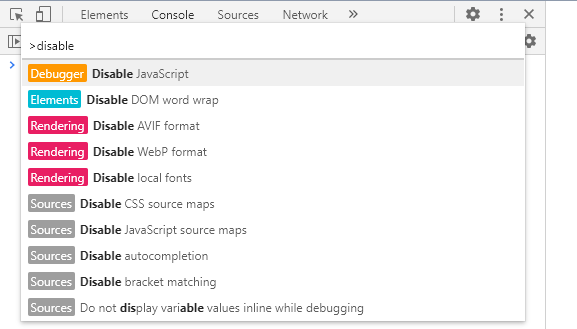

## window

### keyboard shortcuts

```yaml
Win + E: Explore，打开文件管理器／我的电脑
Win + D: Desktop，显示桌面
Win + L: Lock，锁定电脑
Win + R: Run，打开运行窗口

Alt + Tab: 切换当前桌面已打开软件窗口
Ctrl + Tab: 切换当前程序内的标签窗口（如：浏览器标签）
Win + Tab: 多桌面管理窗口
Ctrl + Shift + Enter: 在搜索框输入软件名称，按下此快捷键可以以管理员身份运行程序
Ctrl + Shift + T: 在浏览器中快速恢复刚刚关闭的一个网页
Alt + 双击: 查看文件属性
Shift + 右键 -> 复制为路径: 可快速选择复制文件路径

Ctrl + N: Explore，在当前位置打开新窗口
```

### run cmd as admin

1. `window + r` then input `cmd`
2. `ctrl + shift + enter` run as admin

### netstart -ano

1. 查看所有的端口占用情况 `netstat -ano`
   协议 本地地址 外部地址 状态 PID
   TCP 127.0.0.1:1434 0.0.0.0:0 LISTENING 3236

2. 查看指定端口的占用情况 `netstat -ano|findstr "9050"`
   协议 本地地址 外部地址 状态 PID
   TCP 127.0.0.1:9050 0.0.0.0:0 LISTENING 2016
   从上面可以看出端口 `9050` 被进程号为 `2016` 的进程占用，继续执行下面命令：(也可以去任务管理器中查看 pid 对应的进程)

3. 查看 PID 对应的进程 `tasklist|findstr "2016"`
   映像名称 PID 会话名 会话# 内存使用
   tor.exe 2016 Console 16,064 K 0
   从上面可以看出 `tor` 占用了端口

4. 结束该进程 `taskkill /f /im tor.exe` /f 强制终止 /im 指定进程名称 `taskkill /f /pid 2016` 也可以结束进程

### Test Connection

测试网址的连通性 ping/tracert

```
C:\Users\11435>ping www.youdao.com

正在 Ping www.youdao.com [220.181.76.251] 具有 32 字节的数据:
来自 220.181.76.251 的回复: 字节=32 时间=24ms TTL=51
来自 220.181.76.251 的回复: 字节=32 时间=23ms TTL=51
来自 220.181.76.251 的回复: 字节=32 时间=23ms TTL=51
来自 220.181.76.251 的回复: 字节=32 时间=23ms TTL=51

220.181.76.251 的 Ping 统计信息:
    数据包: 已发送 = 4，已接收 = 4，丢失 = 0 (0% 丢失)，
往返行程的估计时间(以毫秒为单位):
    最短 = 23ms，最长 = 24ms，平均 = 23ms

C:\Users\11435>tracert www.youdao.com

通过最多 30 个跃点跟踪
到 www.youdao.com [220.181.76.251] 的路由:

  1     3 ms     2 ms     1 ms  172.26.5.248
  2     1 ms     1 ms     1 ms  10.50.250.254
  3     1 ms    <1 毫秒    1 ms  10.200.0.66
  4     2 ms     1 ms     1 ms  222.92.90.161
  5     1 ms     1 ms     3 ms  221.224.236.1
  6     5 ms     3 ms     5 ms  218.4.125.165
  7     *        *        *     请求超时。
  8     3 ms     3 ms     2 ms  58.211.25.141
  9    19 ms    19 ms    19 ms  202.97.56.246
 10     *       22 ms     *     36.110.245.70
 11     *        *        *     请求超时。
 12    24 ms    24 ms    24 ms  220.181.17.42
 13     *        *        *     请求超时。
 14    25 ms    23 ms    24 ms  220.181.76.251

跟踪完成。
```

### service start

以管理员权限启动 cmd, 执行相关服务的开启，停止，删除

```bat
net start servicename
net start mysql
net stop  servicename
net stop  mysql
sc delete servicename
```

## Chrome

### Disable JavaScript

1. 打开开发者工具
2. Ctrl + Shift + P 输入 Disable JavaScript
3. 刷新页面, 页面中的 noscript 中的内容就会显示出来



```html
<!DOCTYPE html>
<html>
    <head>
        <title>Example HTML Page</title>
    </head>

    <body>
        <noscript>
            <p>This page requires a JavaScript-enabled browser.</p>
        </noscript>
    </body>
</html>
```

## Other

### sed delete rows

删除 o34183613.out 4044 行到 16603 行的内容，`-i` 直接修改读取的文件内容，而不是输出到终端

```sh
sed -i '4044,16603 d' o34183613.out
```

### iconv

iconv 是知名的开源跨平台编码转换库，iconv.exe 是 iconv 库在 windows 下的命令行工具，iconv.exe 的一般用法：`iconv.exe -f gbk -t utf-8 gbk.txt > utf-8.txt`。其中 -f gbk 指明转换前的文件编码是 gbk，-t utf-8 指明转换后的文件编码是 utf-8，gbk.txt 是转换前文件的名称，> utf-8.txt 指明把转换结果输出到 utf-8.txt 文件中。

当我们要转换大量文件时，我们可以结合 windows 命令和 iconv.exe 批量编码转换。用法: `for /r dir_name %i in (*.txt) do iconv.exe -f GBK -t UTF-8 %i > %~ni*utf8.txt`，其中 dir_name 是待转换文件的存放目录，`for /r dir_name %i in (\*.txt) do`命令循环 dir_name 目录下的所有 txt 文件，`iconv.exe -f GBK -t UTF-8 %i > %~ni_utf8.txt` 用于转换每一个 txt 文件。
