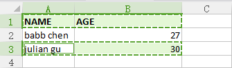
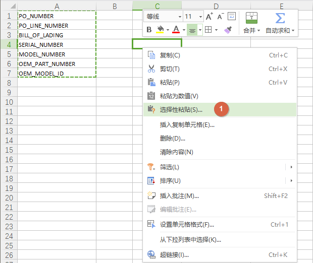
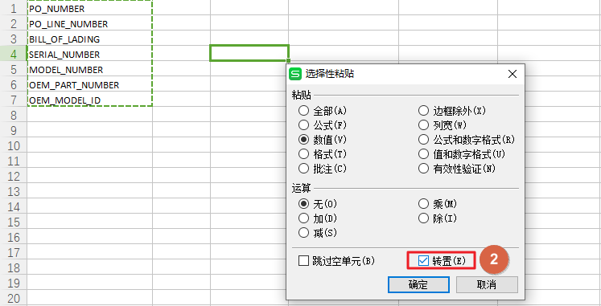
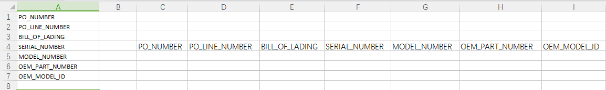
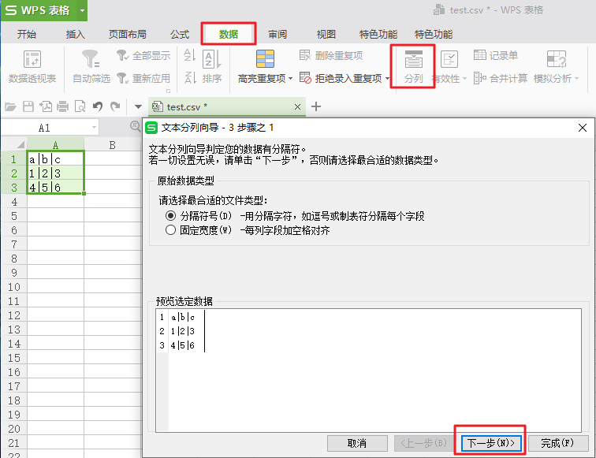
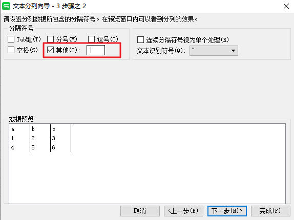

## window 

### keyboard shortcuts

```yaml
Win + E: Explore，打开文件管理器／我的电脑
Win + D: Desktop，显示桌面
Win + L: Lock，锁定电脑
Win + R: Run，打开运行窗口

Alt + Tab: 切换当前桌面已打开软件窗口
Ctrl + Tab: 切换当前程序内的标签窗口（如：浏览器标签）
Win + Tab: 多桌面管理窗口
Ctrl + Shift + Enter: 在搜索框输入软件名称，按下此快捷键可以以管理员身份运行程序
Ctrl + Shift + T: 在浏览器中快速恢复刚刚关闭的一个网页
Alt + 双击: 查看文件属性
Shift + 右键 -> 复制为路径: 可快速选择复制文件路径

Ctrl + N: Explore，在当前位置打开新窗口
```

### run cmd as admin

1. `window + r` then input `cmd`
2. `ctrl + shift + enter` run as admin

### netstart -ano

1. 查看所有的端口占用情况 `netstat -ano`
   协议 本地地址 外部地址 状态 PID
   TCP 127.0.0.1:1434 0.0.0.0:0 LISTENING 3236

2. 查看指定端口的占用情况 `netstat -ano|findstr "9050"`
   协议 本地地址 外部地址 状态 PID
   TCP 127.0.0.1:9050 0.0.0.0:0 LISTENING 2016
   从上面可以看出端口 `9050` 被进程号为 `2016` 的进程占用，继续执行下面命令：(也可以去任务管理器中查看 pid 对应的进程)

3. 查看 PID 对应的进程 `tasklist|findstr "2016"`
   映像名称 PID 会话名 会话# 内存使用
   tor.exe 2016 Console 16,064 K 0
   从上面可以看出 `tor` 占用了端口

4. 结束该进程 `taskkill /f /im tor.exe` /f 强制终止 /im 指定进程名称 `taskkill /f /pid 2016` 也可以结束进程

### service start

以管理员权限启动 cmd,  执行相关服务的开启，停止，删除

```bat
net start servicename
net start mysql
net stop  servicename
net stop  mysql
sc delete servicename
```

##  Excel

### csv to xlsx

csv 可以直接使用 excel 开启，不过对一些特殊的符号需要进行简单的处理, 例如 `="007", =007, 007` 在 excel 中的显示分別是 `007, =007, 7`

| reason                    | csv                            | xlsx                                      |
| :------------------------ | ------------------------------ | ----------------------------------------- |
| 显示逗号                  | "Taipei, Taiwan"               | Taipei, Taiwan                            |
| 显示双引号                | "12'30"""                      | 12'30"                                    |
| 显示数字或字符串前面的 00 | ="007"                         | ="007" （显示 007）                       |
| 使用 excel 公式           | =SUM(B2:B5)/"=SUM(B2:B5)"      | =SUM(B2:B5) （显示和）                    |
| 双引号前后有空格          | `A, "B,C",D`<br />`A,"B,C" ,D` |  |

### keymap

| keymap                 | function                        |
| ---------------------- | ------------------------------- |
| ctrl + up/down         | 跳到上一个/下一个有内容的单元格 |
| ctrl + shift + up/down | 选到上一个/下一个有内容的单元格 |
| ctrl + d               | 重复填充                        |
| 单元格右下角点         | 重复填充/序列填充               |
| ctrl + ；              | 生成当前日期                    |
| ctrl + ''              | 生成当前时间                    |

### vlookup

`vlookup(查找条件，查找的区域，符合条件区域第几列的值)`


###  跨行复制

如下复制第一行和第三行，按住 Ctrl，鼠标选择第一行和第三行，然后 Ctrl + C 复制



### 行列转换

Ctrl + C 复制待转换行列，移动到转换位置`选择性粘贴`，在弹出框中勾选`转置`







### open csv with delimiter

数据 -> 分列 -> 分隔符号





## chrome

####  Disable Javascript

1. 打开开发者工具
2. Ctrl + Shift + P 输入  Disable Javascript
3. 刷新页面, 页面中的 noscript 中的内容就会显示出来


```html
<!DOCTYPE html>
<html>

<head>
    <title>Example HTML Page</title>
</head>

<body>
    <noscript>
        <p>This page requires a JavaScript-enabled browser.</p>
    </noscript>
</body>

</html>
```

## Other

### sed delete rows

删除 o34183613.out 4044 行到 16603 行的内容，`-i` 直接修改读取的文件内容，而不是输出到终端

```sh
sed -i '4044,16603 d' o34183613.out
```

### iconv

iconv 是知名的开源跨平台编码转换库，iconv.exe 是 iconv 库在 windows 下的命令行工具，iconv.exe 的一般用法：`iconv.exe -f gbk -t utf-8 gbk.txt > utf-8.txt`。其中 -f gbk 指明转换前的文件编码是 gbk，-t utf-8 指明转换后的文件编码是 utf-8，gbk.txt 是转换前文件的名称，> utf-8.txt 指明把转换结果输出到 utf-8.txt 文件中。

当我们要转换大量文件时，我们可以结合 windows 命令和 iconv.exe 批量编码转换。用法: `for /r dir_name %i in (*.txt) do iconv.exe -f GBK -t UTF-8 %i > %~ni*utf8.txt`，其中 dir_name 是待转换文件的存放目录，`for /r dir_name %i in (\*.txt) do`命令循环 dir_name 目录下的所有 txt 文件，`iconv.exe -f GBK -t UTF-8 %i > %~ni_utf8.txt` 用于转换每一个 txt 文件。