> SQL 进阶教程 /（日） MICK 著；吴炎昌译.

## CASE 表达式

### CASE 表达式写法

```sql
-- 简单 CASE 表达式
CASE sex
	WHEN '1' THEN '男'
	WHEN '2' THEN '女'
ELSE '其他' END

-- 搜索 CASE 表达式
CASE WHEN sex = '1' THEN '男'
	  WHEN sex = '2' THEN '女'
ELSE '其他' END
```

### CASE 表达式注意事项

**注意事项 1：统一各分支返回的数据类型**

虽然这一点无需多言，但这里还是要强调一下：一定要注意 CASE 表达式里各个分支返回的数据类型是否一致。某个分支返回字符型，而其他分支返回数值型的写法是不正确的。

**注意事项 2：不要忘了写 END**

使用 CASE 表达式的时候，最容易出现的语法错误是忘记写 END。虽然忘记写时程序会返回比较容易理解的错误消息，不算多么致命的错误。但是，感觉自己写得没问题，而执行时却出错的情况大多是由这个原因引起的，所以请一定注意一下。

**注意事项 3：养成写 ELSE 子句的习惯**

与 END 不同， ELSE 子句是可选的，不写也不会出错。不写 ELSE 子句时，CASE 表达式的执行结果是 NULL。但是不写可能会造成“语法没有错误，结果却不对”这种不易追查原因的麻烦，所以最好明确地写上 ELSE 子句（即便是在结果可以为 NULL 的情况下）。养成这样的习惯后，我们从代码上就可以清楚地看到这种条件下会生成 NULL，而且将来代码有修改时也能减少失误。

### 将已有编号方式转换为新的方式并统计

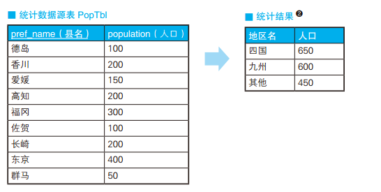

```sql
-- 把县编号转换成地区编号 (1)
SELECT CASE pref_name
			WHEN '德岛' THEN '四国'
			WHEN '香川' THEN '四国'
			WHEN '爱媛' THEN '四国'
			WHEN '高知' THEN '四国'
			WHEN '福冈' THEN '九州'
			WHEN '佐贺' THEN '九州'
			WHEN '长崎' THEN '九州'
			ELSE '其他' END AS district,
			SUM(population)
FROM PopTbl
GROUP BY CASE pref_name
			WHEN '德岛' THEN '四国'
			WHEN '香川' THEN '四国'
			WHEN '爱媛' THEN '四国'
			WHEN '高知' THEN '四国'
			WHEN '福冈' THEN '九州'
			WHEN '佐贺' THEN '九州'
			WHEN '长崎' THEN '九州'
			ELSE '其他' END


-- 按人口数量等级划分都道府县
SELECT CASE WHEN population < 100 THEN '01'
			WHEN population >= 100 AND population < 200 THEN '02'
			WHEN population >= 200 AND population < 300 THEN '03'
			WHEN population >= 300 THEN '04'
			ELSE NULL END AS pop_class,
			COUNT(*) AS cnt
FROM PopTbl
GROUP BY CASE WHEN population < 100 THEN '01'
			  WHEN population >= 100 AND population < 200 THEN '02'
			  WHEN population >= 200 AND population < 300 THEN '03'
			  WHEN population >= 300 THEN '04'
			  ELSE NULL END;

pop_class cnt
--------- ----
01 		   1
02 		   3
03        3
04        2
```

### 用一条 SQL 语句进行不同条件的统计

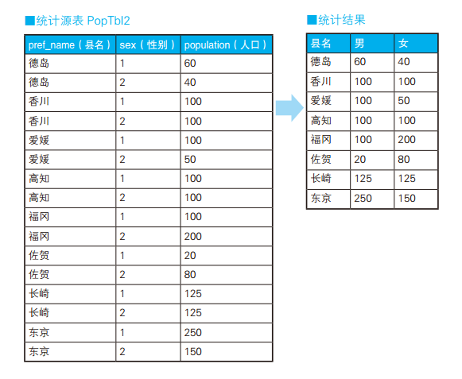

新手用 WHERE 子句进行条件分支，高手用 SELECT 子句进行条件分支。

```sql
-- 这种方式可以实现列转行
SELECT pref_name,
	   -- 男性人口
	   SUM( CASE WHEN sex = '1' THEN population ELSE 0 END) AS cnt_m,
	   -- 女性人口
	   SUM( CASE WHEN sex = '2' THEN population ELSE 0 END) AS cnt_f
FROM PopTbl2
GROUP BY pref_name;
```

### 用 CHECK 约束定义多个列的条件关系

假设某公司规定“女性员工的工资必须在 20 万日元以下”，而在这个公司的人事表中，这条无理的规定是使用 CHECK 约束来描述的，代码如下所示。

```sql
CONSTRAINT check_salary CHECK
	( CASE WHEN sex = '2'
		   THEN CASE WHEN salary <= 200000
		             THEN 1 ELSE 0 END
		   ELSE 1 END = 1 )
```

### 在 UPDATE 语句里进行条件分支

1. 对当前工资为 30 万日元以上的员工，降薪 10%。
2. 对当前工资为 25 万日元以上且不满 28 万日元的员工，加薪 20%。

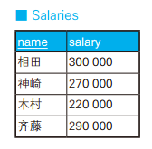

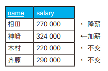

```sql
-- 用 CASE 表达式写正确的更新操作
UPDATE Salaries
   SET salary = CASE WHEN salary >= 300000
					 THEN salary * 0.9
					 WHEN salary >= 250000 AND salary < 280000
					 THEN salary * 1.2
					 ELSE salary END
```

用 CASE 表达式调换主键 a, b 的值

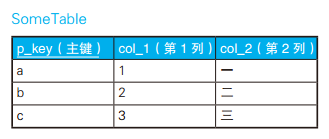

```sql
-- 用 CASE 表达式调换主键值
UPDATE SomeTable
   SET p_key = CASE WHEN p_key = 'a'
					THEN 'b'
					WHEN p_key = 'b'
					THEN 'a'
					ELSE p_key END
					WHERE p_key IN ('a', 'b');
```

### 表之间的数据匹配

与 DECODE 函数等相比，CASE 表达式的一大优势在于能够判断表达式。也就是说，在 CASE 表达式里，我们可以使用 BETWEEN、 LIKE 和 <、 > 等便利的谓词组合，以及能嵌套子查询的 IN 和 EXISTS 谓词。因此， CASE 表达式具有非常强大的表达能力。

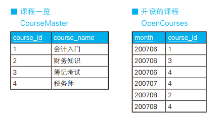

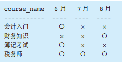

```sql
-- 表的匹配：使用IN谓词
SELECT CM.course_name,
       CASE WHEN CM.course_id IN
                    (SELECT course_id FROM OpenCourses
                      WHERE month = 200706) THEN '○'
            ELSE '×' END AS "6月",
       CASE WHEN CM.course_id IN
                    (SELECT course_id FROM OpenCourses
                      WHERE month = 200707) THEN '○'
            ELSE '×' END AS "7月",
       CASE WHEN CM.course_id IN
                    (SELECT course_id FROM OpenCourses
                      WHERE month = 200708) THEN '○'
            ELSE '×' END  AS "8月"
  FROM CourseMaster CM;


-- 表的匹配：使用EXISTS谓词
SELECT CM.course_name,
       CASE WHEN EXISTS
                    (SELECT course_id FROM OpenCourses OC
                      WHERE month = 200706
                        AND CM.course_id = OC.course_id) THEN '○'
            ELSE '×' END AS "6月",
       CASE WHEN EXISTS
                    (SELECT course_id FROM OpenCourses OC
                      WHERE month = 200707
                        AND CM.course_id = OC.course_id) THEN '○'
            ELSE '×' END AS "7月",
       CASE WHEN EXISTS
                    (SELECT course_id FROM OpenCourses OC
                      WHERE month = 200708
                        AND CM.course_id = OC.course_id) THEN '○'
            ELSE '×' END  AS "8月"
  FROM CourseMaster CM;
```

### 在 CASE 表达式中使用聚合函数

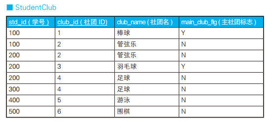

```sql
-- 在CASE表达式中使用聚合函数
SELECT std_id,
       CASE WHEN COUNT(*) = 1 -- 只加入了一个社团的学生
            THEN MAX(club_id)
            ELSE MAX(CASE WHEN main_club_flg = 'Y'
                          THEN club_id
                          ELSE NULL END)
        END AS main_club
  FROM StudentClub
 GROUP BY std_id;

 std_id main_club
------ ----------
    100  1
    200  3
    300  4
    400  5
    500  6
```

## 自连接的用法

### 可重排列、排列、组合

假设这里有一张存放了商品名称及价格的表，表里有“苹果、橘子、香蕉”这 3 条记录。在生成用于查询销售额的报表等的时候，我们有时会
需要获取这些商品的组合。

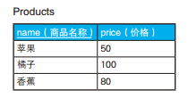

这里所说的组合其实分为两种类型。一种是有顺序的有序对（orderedpair），另一种是无顺序的无序对（unordered pair）。有序对用尖括号括起来，如 <1, 2>；无序对用花括号括起来，如 {1, 2}。在有序对里，如果元素顺序相反，那就是不同的对，因此 <1, 2> ≠ <2, 1> ；而无序对与顺序无关，因此 {1, 2}＝{2, 1}。用学校里学到的术语来说，这两类分别对应着“排列”和“组合”。

```sql
-- 用于获取可重排列的 SQL 语句 3^2
SELECT P1.name AS name_1, P2.name AS name_2
  FROM Products P1, Products P2;

name_1 name_2
------ ------
苹果    苹果
苹果    橘子
苹果    香蕉
橘子    苹果
橘子    橘子
橘子    香蕉
香蕉    苹果
香蕉    橘子
香蕉    香蕉

-- 用于获取排列的 SQL 语句 P<sub>3</sub><sup>2</sup>
SELECT P1.name AS name_1, P2.name AS name_2
  FROM Products P1, Products P2
 WHERE P1.name <> P2.name;

name_1 name_2
------ ------
苹果   橘子
苹果   香蕉
橘子   苹果
橘子   香蕉
香蕉   苹果
香蕉   橘子

-- 用于获取组合的 SQL 语句 C<sub>3</sub><sup>2</sup>
SELECT P1.name AS name_1, P2.name AS name_2
  FROM Products P1, Products P2
 WHERE P1.name > P2.name;

name_1 name_2
------ ------
苹果   橘子
香蕉   橘子
香蕉   苹果

-- 用于获取组合的 SQL 语句 ：扩展成 3 列
SELECT P1.name AS name_1, P2.name AS name_2, P3.name AS name_3
  FROM Products P1, Products P2, Products P3
 WHERE P1.name > P2.name
   AND P2.name > P3.name;

name_1  name_2   name_3
------- -------- --------
香蕉     苹果     橘子
```

### 删除重复行

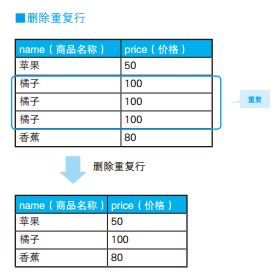

```sql
-- 用于删除重复行的SQL语句（1）：使用极值函数
DELETE FROM Products P1
 WHERE rowid < ( SELECT MAX(P2.rowid)
                   FROM Products P2
                  WHERE P1.name = P2. name
                    AND P1.price = P2.price ) ;

-- 用于删除重复行的SQL语句（2）：使用非等值连接
DELETE FROM Products P1
 WHERE EXISTS ( SELECT *
                  FROM Products P2
                 WHERE P1.name = P2.name
                   AND P1.price = P2.price
                   AND P1.rowid < P2.rowid );
```

### 查找局部不一致的列

如果家庭 ID 一样，住址也必须一样。那么我们该如何找出像前田夫妇这样的“是同一家人但住址却不同的记录”呢？

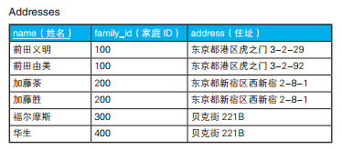

```sql
-- 用于查找是同一家人但住址却不同的记录的SQL语句
SELECT DISTINCT A1.name, A1.address
  FROM Addresses A1, Addresses A2
 WHERE A1.family_id = A2.family_id
   AND A1.address <> A2.address ;
```

### 排序

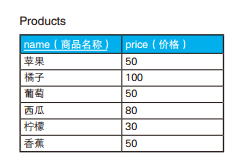

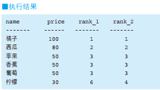

**使用窗口函数**

```sql
-- 排序：使用窗口函数
SELECT name, price,
       RANK() OVER (ORDER BY price DESC) AS rank_1,
       DENSE_RANK() OVER (ORDER BY price DESC) AS rank_2
  FROM Products;
```

**使用子查询**

```sql
-- 排序：使用子查询
SELECT P1.name,
       P1.price,
       (SELECT COUNT(P2.price) FROM Products P2 WHERE P2.price > P1.price) + 1 AS rank_1,
       (SELECT COUNT(DISTINCT P2.price) FROM Products P2 WHERE P2.price > P1.price) + 1 AS rank_2
  FROM Products P1
 ORDER BY rank_1, rank_2;
```

子查询所做的，是计算出价格比自己高的记录的条数并将其作为自己的位次。为了便于理解，我们先考虑从 0 开始，对去重之后的 4 个价格“{ 100, 80, 50, 30 }”进行排序的情况。首先是价格最高的 100，因为不存在比它高的价格，所以 COUNT 函数返回 0。接下来是价格第二高的 80，比它高的价格有一个 100，所以 COUNT 函数返回 1。同样地，价格为 50 的时候返回 2，为 30 的时候返回 3。这样，就生成了一个与每个价格对应的集合，如下表所示。

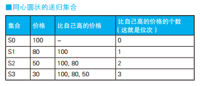

也就是说，这条 SQL 语句会生成这样几个“同心圆状的”A 递归集合，然后数这些集合的元素个数。正如“同心圆状”这个词的字面意思那样，
这几个集合之间存在如下包含关系。

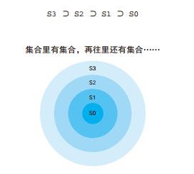

实际上，“通过递归集合来定义数”这个想法并不算新颖。有趣的是，它和集合论里沿用了 100 多年的自然数（包含 0）的递归定义（recursive
definition）在思想上不谋而合 。研究这种思想的学者形成了几个流派，其中和这道例题的思路类型相同的是计算机之父、数学家冯·诺依曼提出
的想法。冯·诺依曼首先将空集定义为 0，然后按照下面的规则定义了全体自然数。
0 = φ
1 = {0}
2 = {0, 1}
3 = {0, 1, 2}
·
·
定义完 0 之后，用 0 来定义 1，然后用 0 和 1 来定义 2，再用 0、 1 和 2 来定义 3……以此类推。这种做法与上面例题里的集合 S0 ～ S3 在
生成方法和结构上都是一样的（正是为了便于比较，例题里的位次才从 0 开始）。这道题很好地直接结合了 SQL 和集合论，而联系二者的正是
自连接。

**使用自连接**

```sql
SELECT P1.name,
       MAX(P1.price) AS price,
       COUNT(P2.name) + 1 AS rank_1
  FROM Products P1 LEFT OUTER JOIN Products P2
    ON P1.price < P2.price
 GROUP BY P1.name
 ORDER BY rank_1;
```

去掉这条 SQL 语句里的聚合并展开成下面这样，就可以更清楚地看出同心圆状的包含关系（为了看得更清楚，我们从表中去掉价格重复的行，
只留下橘子、西瓜、葡萄和柠檬这 4 行）。

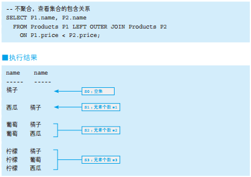

使用内连接 第 1 名“橘子”竟然从结果里消失了。没有比橘子价格更高的水果，所以它被连接条件 P1.price < P2.price 排除掉了。外连接就是这样一个用于将第 1 名也存储在结果里的小技巧 。

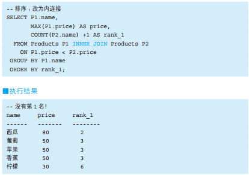

## 三值逻辑和 NULL

总之，数据库里只要存在一个 NULL，查询的结果就可能不正确。而且，一般没有办法确定具体是哪个查询返回了不正确的结果，所以所有的结果看起来都很可疑。没有谁能保证一定能从包含 NULL 的数据库里查询出正确的结果。要我说，这种情况着实令人束手无策。 —C.J. Date

### 两种 NULL、三值逻辑还是四值逻辑

说到三值逻辑，笔者认为话题应该从 NULL 开始，因为 NULL 正是产生三值逻辑的“元凶”。“两种 NULL”这种说法大家可能会觉得很奇怪，因为 SQL 里只存在一种 NULL。然而在讨论 NULL 时，我们一般都会将它分成两种类型来思考。因此这里先来介绍一些基础知识，即两种 NULL 之间的区别。两 种 NULL 分 别 指 的 是“ 未 知 ”（unknown） 和“ 不 适 用 ”（notapplicable, inapplicable）。以“不知道戴墨镜的人眼睛是什么颜色”这种情况为例，这个人的眼睛肯定是有颜色的，但是如果他不摘掉眼镜，别人就不知道他的眼睛是什么颜色。这就叫作未知。而“不知道冰箱的眼睛是什么颜色”则属于“不适用”。因为冰箱根本就没有眼睛，所以“眼睛的颜色”这一属性并不适用于冰箱。“冰箱的眼睛的颜色”这种说法和“圆的体积”“男性的分娩次数”一样，都是没有意义的。平时，我们习惯了说“不知道”，但是“不知道”也分很多种。“不适用”这种情况下的 NULL，在语义上更接近于“无意义”，而不是“不确定”。这里总结一下：“未知”指的是“虽然现在不知道，但加上某些条件后就可以知道”；而“不适用”指的是“无论怎么努力都无法知道”。

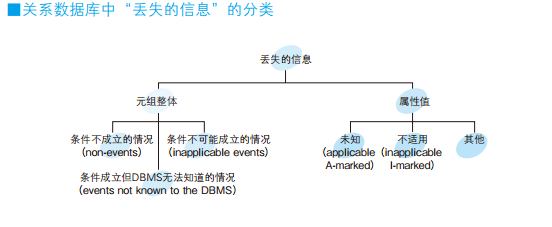

Codd 曾经认为应该严格地区分两种类型的 NULL，并提倡在关系数据库中使用四值逻辑 。不知道是幸运还是不幸（笔者认为肯定是幸运），他的这个想法并没有得到广泛支持，现在所有的 DBMS 都将两种类型的 NULL 归为了一类并采用了三值逻辑。但是他的这种分类方法本身还是有很多优点的，因此后来依然有很多学者支持。

### 为什么必须写成“IS NULL”，而不是“＝ NULL”

对 NULL 使用比较谓词后得到的结果总是 unknown。而查询结果只会包含 WHERE 子句里的判断结果为 true 的行，不会包含判断结果为 false 和 unknown 的行。不只是等号，对 NULL 使用
其他比较谓词，结果也都是一样的。

```sql
-- 以下的式子都会被判为 unknown
1 = NULL
2 > NULL
3 < NULL
4 <> NULL
NULL = NULL
```

那么，为什么对 NULL 使用比较谓词后得到的结果永远不可能为真呢？这是因为， NULL 既不是值也不是变量。 NULL 只是一个表示“没有值”的标记，而比较谓词只适用于值。因此，对并非值的 NULL 使用比较谓词本来就是没有意义的 (“我们先从定义一个表示‘虽然丢失了，但却适用的值’的标记开始。我们把它叫作 A-Mark。这个标记在关系数据库里既不被当作值（value），也不被当作变量（variable）。”（E.F. Codd， TheRelational Model for DatabaseManagement ：Version 2, P.173）“关于 NULL 的很重要的一件事情是， NULL 并不是值。”（C.J. Date，An Intruction To Database System（6thedition） , P.619） )。“列的值为 NULL”“NULL 值”这样的说法本身就是错误的。因为 NULL 不是值，所以不在定义域（domain）中。相反，如果有人认为 NULL 是值，那么笔者倒想请教一下：它是什么类型的值？关系数据库中存在的值必然属于某种类型，比如字符型或数值型等。所以，假如 NULL 是值，那么它就必须属于某种类型。

NULL 容易被认为是值的原因恐怕有两个。第一个是在 C 语言等编程语言里面， NULL 被定义为了一个常量（很多语言将其定义为了整数 0），这导致了人们的混淆。但是，其实 SQL 里的 NULL 和其他编程语言里的 NULL 是完全不同的东西。第二个原因是， IS NULL 这样的谓词是由两个单词构成的，所以人们容易把 IS 当作谓词，而把 NULL 当作值。特别是 SQL 里还有 IS TRUE、IS FALSE 这样的谓词，人们由此类推，从而这样认为也不是没有道理。但是正如讲解标准 SQL 的书里提醒人们注意的那样，我们应该把 IS NULL 看作是一个谓词。因此，如果可以的话，写成 IS_NULL 这样也许更合适 。

### unknown、第三个真值

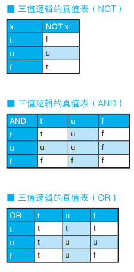

三个真值之间有下面这样的优先级顺序。

-   AND 的情况： false ＞  unknown ＞  true
-   OR 的情况： true ＞  unknown ＞  false

优先级高的真值会决定计算结果。例如 true AND unknown，因为 unknown 的优先级更高，所以结果是 unknown。而 true OR unknown 的话，因为 true 优先级更高，所以结果是 true。记住这个顺序后就能更方便地进行三值逻辑运算了。特别需要记住的是，当 AND 运算中包含 unknown 时，结果肯定不会是 true（反之，如果 AND 运算结果为 true，则参与运算的双方必须都为 true）。

问题：假设 a = 2, b = 5, c = NULL，此时下面这些式子的真值是什么？
1. a < b AND b > c
2. a > b OR b < c
3. a < b OR b < c
4. NOT (b <> c)

答案：unknown； 2. unknown； 3. true； 4. unknown

### 比较谓词和 NULL(1) ：排中律不成立

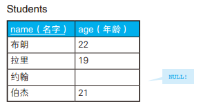

```sql
-- 查询年龄是 20 岁或者不是 20 岁的学生
SELECT *
  FROM Students
 WHERE age = 20
    OR age <> 20;

-- 1. 约翰年龄是 NULL（未知的 NULL ！
SELECT *
  FROM Students
 WHERE age = NULL
   OR age <> NULL;

-- 2. 对 NULL 使用比较谓词后，结果为 unknown
SELECT *
  FROM Students
 WHERE unknown
    OR unknown;
-- 3． unknown OR unknown 的结果是 unknown（不为 true, 约翰不会被查询出来）
SELECT *
  FROM Students
 WHERE unknown;

-- 添加第 3 个条件 ：年龄是 20 岁，或者不是 20 岁，或者年龄未知
SELECT *
  FROM Students
 WHERE age = 20
    OR age <> 20
    OR age IS NULL;
```

### 比较谓词和 NULL(2) ：CASE 表达式和 NULL

这个 CASE 表达式一定不会返回 ×。这是因为，第二个 WHEN 子句是 col_1 = NULL 的缩写形式。正如大家所知，这个式子的真值永远是 unknown。而且 CASE 表达式的判断方法与 WHERE 子句一样，只认可真值为 true 的条件。 需要将 WHEN NULL 修改为 WHEN IS NULL。

```sql
--col_1 为 1 时返回○、为 NULL 时返回 × 的 CASE 表达式？
CASE col_1
	WHEN 1 THEN '○'
    WHEN NULL THEN '×'
END
```

### NOT IN 和 NOT EXISTS 不是等价的

查询“与 B 班住在东京的学生年龄不同的 A 班学生”

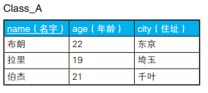

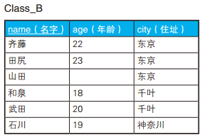

**NOT IN**

使用 NOT IN 结果是空，查询不到任何数据

```sql
-- 查询与 B 班住在东京的学生年龄不同的 A 班学生的 SQL 语句？
SELECT *
 FROM Class_A
WHERE age NOT IN ( SELECT age
                     FROM Class_B
                    WHERE city = '东京' );

--1. 执行子查询，获取年龄列表
SELECT *
  FROM Class_A
 WHERE age NOT IN (22, 23, NULL);

--2. 用 NOT 和 IN 等价改写 NOT IN
SELECT *
  FROM Class_A
 WHERE NOT age IN (22, 23, NULL);

--3. 用 OR 等价改写谓词 IN
SELECT *
  FROM Class_A
 WHERE NOT ( (age = 22) OR (age = 23) OR (age = NULL) );

--4. 使用德 · 摩根定律等价改写
SELECT *
  FROM Class_A
 WHERE NOT (age = 22) AND NOT(age = 23) AND NOT (age = NULL);

--5. 用 <> 等价改写 NOT 和 =
SELECT *
  FROM Class_A
 WHERE (age <> 22) AND (age <> 23) AND (age <> NULL);

--6. 对 NULL 使用 <> 后，结果为 unknown
SELECT *
  FROM Class_A
 WHERE (age <> 22) AND (age <> 23) AND unknown;

--7．如果 AND 运算里包含 unknown，则结果不为 true
SELECT *
FROM Class_A
WHERE false 或 unknown;
```

为了得到正确的结果，我们需要使用 EXISTS 谓词 。

```sql
-- 正确的 SQL 语句 ：拉里和伯杰将被查询到
SELECT *
  FROM Class_A A
  WHERE NOT EXISTS ( SELECT *
                       FROM Class_B B
                      WHERE A.age = B.age
                        AND B.city = '东京' );

--1. 在子查询里和 NULL 进行比较运算
SELECT *
  FROM Class_A A
 WHERE NOT EXISTS ( SELECT *
                      FROM Class_B B
                     WHERE A.age = NULL
                       AND B.city = '东京' );

--2. 对 NULL 使用“=”后，结果为 unknown
SELECT *
  FROM Class_A A
 WHERE NOT EXISTS ( SELECT *
                      FROM Class_B B
                     WHERE unknown
                       AND B.city = '东京' );

--3. 如果 AND 运算里包含 unknown，结果不会是 true
SELECT *
  FROM Class_A A
 WHERE NOT EXISTS ( SELECT *
                      FROM Class_B B
                     WHERE false 或 unknown);

--4. 子查询没有返回结果，因此相反地， NOT EXISTS 为 true
SELECT *
  FROM Class_A A
 WHERE true;
```

### 限定谓词和 NULL

SQL 里有 ALL 和 ANY 两个限定谓词。因为 ANY 与 IN 是等价的，所以
我们不经常使用 ANY。

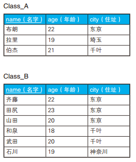

```sql
-- 查询比 B 班住在东京的所有学生年龄都小的 A 班学生
SELECT *
  FROM Class_A
 WHERE age < ALL ( SELECT age
                     FROM Class_B
                    WHERE city = '东京' );

name  age  city
----- ---- ----
拉里   19  埼 玉
```

如果山田年龄不详，就会有问题了。凭直觉来说，此时查询到的可能是比 22 岁的齐藤年龄小的拉里和伯杰。然而，这条 SQL 语句的执行结果还是空。

```sql
--1. 执行子查询获取年龄列表
SELECT *
  FROM Class_A
 WHERE age < ALL ( 22, 23, NULL );

--2. 将 ALL 谓词等价改写为 AND
SELECT *
  FROM Class_A
 WHERE (age < 22) AND (age < 23) AND (age < NULL);

--3. 对 NULL 使用“<”后，结果变为 unknown
SELECT *
  FROM Class_A
 WHERE (age < 22) AND (age < 23) AND unknown;

--4. 如果 AND 运算里包含 unknown，则结果不为 true
SELECT *
  FROM Class_A
 WHERE false 或 unknown;
```

### 限定谓词和极值函数不是等价的

```sql
-- 查询比 B 班住在东京的年龄最小的学生还要小的 A 班学生
SELECT *
  FROM Class_A
 WHERE age < ( SELECT MIN(age)
                 FROM Class_B
                WHERE city = '东京' );

name  age  city
----- ---- ----
拉里   19   埼 玉
伯杰   21   千 叶
```

即使山田的年龄无法确定，这段代码也能查询到拉里和伯杰两人。这是因为， 极值函数在统计时会把为 NULL 的数据排除掉。使用极值函数能使 Class_B 这张表里看起来就像不存在 NULL 一样。

ALL 谓词和极值函数表达的命题含义分别如下所示。

-   ALL 谓词：他的年龄比在东京住的所有学生都小 — Q1
-   极值函数：他的年龄比在东京住的年龄最小的学生还要小 — Q2

在现实世界中，这两个命题是一个意思。但是，正如我们通过前面的例题看到的那样，表里存在 NULL 时它们是不等价的。其实还有一种情况下它们也是不等价的，大家知道是什么吗？ 答案是，谓词（或者函数）的输入为空集的情况。 例如 Class_B 这张表为如下所示的情况。

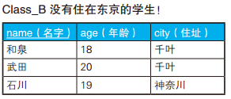

如上表所示， B 班里没有学生住在东京。这时，使用 ALL 谓词的 SQL 语句会查询到 A 班的所有学生。然而，用极值函数查询时一行数据都查询不到。这是因为，极值函数在输入为空表（空集）时会返回 NULL。因此，使用极值函数的 SQL 语句会像下面这样一步步被执行。

```sql
--1. 极值函数返回 NULL
SELECT *
  FROM Class_A
 WHERE age < NULL;

--2. 对 NULL 使用“<”后结果为 unknown
SELECT *
  FROM Class_A
 WHERE unknown;
```

### 聚合函数和 NULL

实际上，当输入为空表时返回 NULL 的不只是极值函数， COUNT 以外的聚合函数也是如此。

```sql
-- 查询比住在东京的学生的平均年龄还要小的 A 班学生的 SQL 语句？
SELECT *
  FROM Class_A
 WHERE age < ( SELECT AVG(age)
                 FROM Class_B
                WHERE city = '东京' );
```

没有住在东京的学生时， AVG 函数返回 NULL。因此，外侧的 WHERE 子句永远是 unknown，也就查询不到行。使用 SUM 也是一样。这种情况的解决方法只有两种：要么把 NULL 改写成具体值，要么闭上眼睛接受 NULL。但是如果某列有 NOT NULL 约束，而我们需要往其中插入平均值或汇总值，那么就只能选择将 NULL 改写成具体值了。

## HAVING 子句的力量

### 寻找缺失的编号

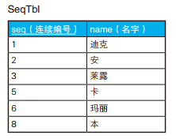

```sql
-- 如果有查询结果，说明存在缺失的编号
SELECT '存在缺失的编号' AS gap
  FROM  SeqTbl
HAVING COUNT(*) <> MAX(seq);

gap
----------
'存在缺失的编号'
```

如果用集合论的语言来描述，那么这个查询所做的事情就是检查自然数集合和 SeqTbl 集合之间是否存在一一映射（又称双射）。换句话说，就是像下图展示的那样， MAX(seq) 计算的，是由“到 seq 最大值为止的没有缺失的连续编号（即自然数）”构成的集合的元素个数，而 COUNT(\*) 计算的是 SeqTbl 这张表里实际的元素个数（即行数）。

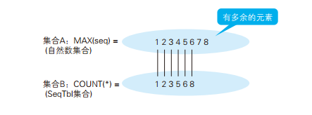

查询缺失编号的最小值

```sql
-- 查询缺失编号的最小值
SELECT MIN(seq + 1) AS gap
  FROM SeqTbl
  WHERE (seq+ 1) NOT IN ( SELECT seq FROM SeqTbl);

gap
---
4
```

上面展示了通过 SQL 语句查询缺失编号的最基本的思路，然而这个查询还不够周全，并不能涵盖所有情况。例如，如果表 SeqTbl 里没有编号 1，那么缺失编号的最小值应该是 1，但是这两条 SQL 语句都不能得出正确的结果。

### 用 HAVING 子句进行子查询 ：求众数

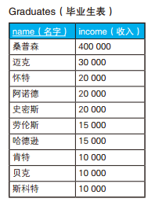

```sql
-- 求众数的SQL语句（1）：使用谓词
SELECT income, COUNT(*) AS cnt
  FROM Graduates
 GROUP BY income
HAVING COUNT(*) >= ALL ( SELECT COUNT(*)
						   FROM Graduates
					   GROUP BY income);

income cnt
------ ---
10000  3
20000  3
```

GROUP BY 子句的作用是根据最初的集合生成若干个子集。因此，将收入（income）作为 GROUP BY 的列时，将得到 S1 ～ S5 这样 5 个子集。这几个子集里，元素数最多的是 S3 和 S5，都是 3 个元素，因此查询的结果也是这 2 个集合。

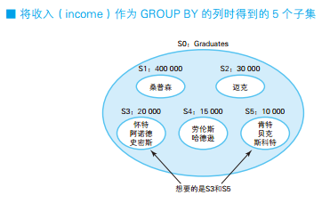

ALL 谓词用于 NULL 或空集时会出现问题，可以用极值函数来代替。这里要求的是元素数最多的集合，因此可以用 MAX 函数。

```sql
-- 求众数的SQL语句(2)：使用极值函数
SELECT income, COUNT(*) AS cnt
  FROM Graduates
 GROUP BY income
HAVING COUNT(*) >=  ( SELECT MAX(cnt)
                        FROM ( SELECT COUNT(*) AS cnt
                                 FROM Graduates
                             GROUP BY income) TMP) ;
```

### 用 HAVING 子句进行自连接 ：求中位数

将集合里的元素按照大小分为上半部分和下半部分两个子集，同时让这 2 个子集共同拥有集合正中间的元素。这样，共同部分的元素的平均值就是中位数，思路如下图所示。

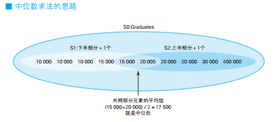

```sql
-- 求中位数的SQL语句：在HAVING子句中使用非等值自连接
SELECT AVG(DISTINCT income)
  FROM (SELECT T1.income
          FROM Graduates T1, Graduates T2
      GROUP BY T1.income
               -- S1的条件
        HAVING SUM(CASE WHEN T2.income >= T1.income THEN 1 ELSE 0 END)
                   >= COUNT(*) / 2
               -- S2的条件
           AND SUM(CASE WHEN T2.income <= T1.income THEN 1 ELSE 0 END)
                   >= COUNT(*) / 2 ) TMP;
```

这条 SQL 语句的要点在于比较条件`>= COUNT(*)/2`里的等号，这个等号是有意地加上的。加上等号并不是为了清晰地分开子集 S1 和 S2，而是为了让这 2 个子集拥有共同部分。如果去掉等号，将条件改成`>COUNT(*)/2`，那么当元素个数为偶数时， S1 和 S2 就没有共同的元素了，也就无法求出中位数了。

### 查询不包含 NULL 的集合

COUNT 函数的使用方法有 `COUNT(*) 和 COUNT( 列名 ) `两种，它们的区
别有两个：第一个是性能上的区别；第二个是` COUNT(*)` 可以用于 NULL，
而 `COUNT( 列名 )`与其他聚合函数一样，要先排除掉 NULL 的行再进行统计。第二个区别也可以这么理解： `COUNT(*) `查询的是所有行的数目，而
`COUNT( 列名 )`查询的则不一定是。
对一张全是 NULL 的表 NullTbl 执行 SELECT 子句就能清楚地知道两
者的区别了。

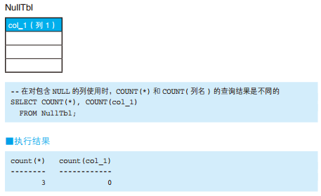

如下一张存储了学生提交报告的日期的表 Students 。学生提交报告后，“提交日期”列会被写入日期，而提交之前是 NULL。现在我们需要从这张表里找出哪些学院的学生全部都提交了报告（即理学院、经济学院）。

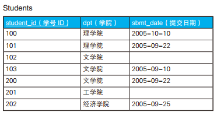

以“学院”为 GROUP BY 的列生成下面这样的子集。

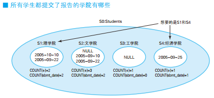

这样生成的 4 个子集里，我们想要的是 S1 和 S4。那么，这 2 个子集具备而其他子集不具备的特征是`COUNT(*) 和 COUNT(sbmt_date) 结果一致`。这是因为 S2 和 S3 这 2 个子集里存在 NULL。

```sql
-- 查询“提交日期”列内不包含NULL的学院(1)：使用COUNT函数
SELECT dpt
  FROM Students
 GROUP BY dpt
HAVING COUNT(*) = COUNT(sbmt_date);

dpt
--------
理学院
经济学院
```

使用 CASE 表达式也可以实现同样的功能，而且更加通用。

```sql
-- 查询“提交日期”列内不包含NULL的学院(2)：使用CASE表达式
SELECT dpt
  FROM Students
 GROUP BY dpt
HAVING COUNT(*) = SUM(CASE WHEN sbmt_date IS NOT NULL
                           THEN 1
                           ELSE 0 END);
```

可以看到，使用 CASE 表达式时，将“提交日期”不是 NULL 的行标记为 1，将“提交日期”为 NULL 的行标记为 0。在这里， CASE 表达式的 作用相当于进行判断的函数，用来判断各个元素（= 行）是否属于满足了某种条件的集合。这样的函数我们称为特征函数（characteristic function），或者从定义了集合的角度来将它称为定义函数。

### 用关系除法运算进行购物篮分析

如下是全国连锁折扣店的商品表 Items，以及各个店铺的库存管理表 ShopItems。

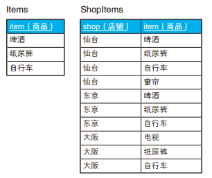

这次我们要查询的是囊括了表 Items 中所有商品的店铺。也就是说，要查询的是仙台店和东京店。大阪店没有啤酒，所以不是我们的目标。这个问题在实际工作中的原型是数据挖掘技术中的“购物篮分析” (购物篮分析是市场分析领域常用的一种分析手段，用来发现“经常被一起购买的商品”具有的规律。有一个有名的例子：某家超市发现，虽然不知为什么，但啤酒和纸尿裤经常被一起购买也许是因为来买纸尿裤的爸爸都会想顺便买些啤酒回去，于是便将啤酒和纸尿裤摆在相邻的货架，从而提升了销售额。)

```sql
-- 查询啤酒、纸尿裤和自行车同时在库的店铺：正确的SQL语句
SELECT SI.shop
  FROM ShopItems SI, Items I
 WHERE SI.item = I.item
 GROUP BY SI.shop
HAVING COUNT(SI.item) = (SELECT COUNT(item) FROM Items);

shop
----
仙台
东京
```

如果把 HAVING 子句改成 HAVING COUNT(SI.item) =COUNT(I.item)，结果就不对了。如果使用这个条件，仙台、东京、大阪这 3 个店铺都会被选中。这是因为，受到连接操作的影响， COUNT(I.item) 的值和表 Items 原本的行数不一样了。

```sql
-- COUNT(I.item)的值已经不一定是3了
SELECT SI.shop, COUNT(SI.item), COUNT(I.item)
  FROM ShopItems SI, Items I
 WHERE SI.item = I.item
 GROUP BY SI.shop;

shop  COUNT(SI.item)  COUNT(I.item)
----- --------------- --------------
仙台   3               3
东京   3               3
大阪   2               2
```

这里也可以使用外连接

```sql
-- 用外连接进行关系除法运算：差集的应用
SELECT DISTINCT shop
  FROM ShopItems SI1
WHERE NOT EXISTS
      (SELECT I.item
         FROM Items I LEFT OUTER JOIN ShopItems SI2
           ON SI1.shop = SI2.shop
          AND I.item   = SI2.item
        WHERE SI2.item IS NULL) ;
```

接下来我们把条件变一下，看看如何排除掉仙台店（仙台店的仓库中存在“窗帘”，但商品表里没有“窗帘”），让结果里只出现东京店。这类问题被称为“精确关系除法”（exact relational division），即只选择没有剩余商品的店铺（与此相对，前一个问题被称为“带余除法”（division with a remainder））。解决这个问题我们需要使用外连接。

```sql
-- 精确关系除法运算：使用外连接和COUNT函数
  SELECT SI.shop
    FROM ShopItems AS SI LEFT OUTER JOIN Items AS I
      ON SI.item=I.item
GROUP BY SI.shop
  HAVING COUNT(SI.item) = (SELECT COUNT(item) FROM Items)   -- 条件1
     AND COUNT(I.item)  = (SELECT COUNT(item) FROM Items);  -- 条件2

shop
----
东京
```

以表 ShopItems 为主表进行外连接操作后，因为表 Items 里不存在窗帘和电视，所以连接后相应行的“I.item”列是 NULL。然后，我们就可以使用之前用到的检查学生提交报告日期的 COUNT 函数的技巧了。条件 1 会排除掉 COUNT(SI.item) = 4 的仙台店，条件 2 会排除掉 COUNT(I.item)= 2 的大阪店（NULL 不会被计数）。

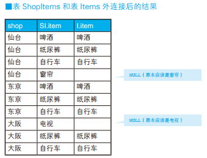

### 关系除法运算

如果模仿数值运算的写法来写，可以写作 ShopItems ÷ Items。至于为什么称它为除法运算，我们可以从除法运算的逆运算——乘法运算的角度来理解一下。除法运算和乘法运算之间有这样的关系：除法运算的商和除数的乘积等于被除数。

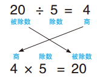

在 SQL 里，交叉连接相当于乘法运算。把商和除数（表 Items）交叉连接，然后求笛卡儿积，就能得到表 ShopItems 的子集（不一定是完整的表 ShopItems），也就是被除数。这就是“除法运算”这一名称的由来。

关系除法运算是关系代数中知名度最低的运算。不过，在实际工作中用到的机会并不少。像文中例题这样，应用场景很多（很多时候都是不经意间就使用了）。关系除法运算也是 Codd 最初定义的 8 种关系运算中的一种，也算正
宗的关系运算。

### 各队，全体点名

查出现在可以出勤的队伍。可以出勤即队伍里所有队员都处于“待命”状态。

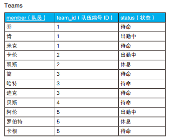

用谓词表达全称量化命题,“所有队员都处于待命状态”＝“不存在不处于待命状态的队员”

```sql
/* 用谓词表达全称量化命题 */
SELECT team_id, member
  FROM Teams T1
 WHERE NOT EXISTS
        (SELECT *
           FROM Teams T2
          WHERE T1.team_id = T2.team_id
            AND status <> '待命' );

team_id member
------- ------
3       简
3       哈特
3       迪克
4       贝斯
```

用集合表达全称量化命题

```sql
/* 用集合表达全称量化命题（1） */
SELECT team_id
  FROM Teams
 GROUP BY team_id
HAVING COUNT(*) = SUM(CASE WHEN status = '待命'
                           THEN 1
                           ELSE 0 END);
team_id
-------
3
4
```

使用 GROUP BY 子句将 Teams 集合以队伍为单位划分成几个子集。

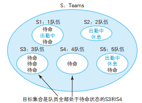

目标集合是 S3 和 S4，那么只有这两个集合拥有而其他集合没有的特征是什么呢？答案是，处于“待命”状态的数据行数与集合中数据总行数相等。这个条件可以用 CASE 表达式来表达，状态为“待命”的情况下返回 1，其他情况下返回 0。也许大家已经注意到了，这里使用的是特征函数的方法。
根据是否满足条件分别为表里的每一行数据加上标记 1 或 0，这样更好理解一些。

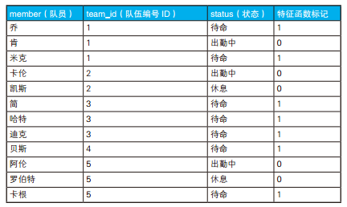

HAVING 子句中的条件还可以像下面这样写 。某个集合中，如果元素最大值和最小值相等，那么这个集合中肯定只有一种值。因为如果包含多种值，最大值和最小值肯定不会相等。极值函数可以使用参数字段的索引，所以这种写法性能更好 。

```sql
/* 用集合表达全称量化命题（2） */
SELECT team_id
  FROM Teams
 GROUP BY team_id
HAVING MAX(status) = '待命'
   AND MIN(status) = '待命';
```

当然也可以把条件放在 SELECT 子句里，以列表形式显示出各个队伍是否所有队员都在待命，这样的结果更加一目了然。 需要注意的是，条件移到 SELECT 子句后，查询可能就不会被数据库优化了，所以性能上相比 HAVING 子句的写法会差一些。

```sql
/* 列表显示各个队伍是否所有队员都在待命 */
SELECT team_id,
       CASE WHEN MAX(status) = '待命' AND MIN(status) = '待命'
            THEN '全都在待命'
            ELSE '队长！人手不够' END AS status
  FROM Teams
 GROUP BY team_id;

team_id status
------- --------------------------
1       队长！人手不够
2       队长！人手不够
3       全都在待命
4       全都在待命
5       队长！人手不够
```

### 单重集合与多重集合

查出存在重复材料的生产地。

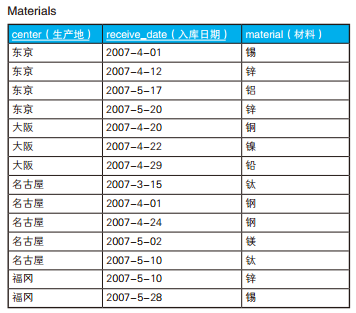

从表中我们可以看到，一个生产地对应着多条数据，因此“生产地”这一实体在表中是以集合的形式，而不是以元素的形式存在的。处理这种情况的基本方法就是使用 GROUP BY 子句将集合划分为若干个子集，像下面这样。

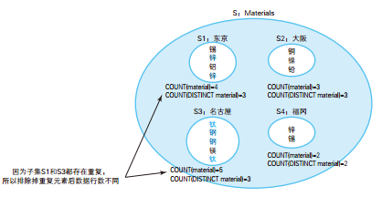

目标集合是锌重复的东京，以及钛和钢重复的名古屋。那么这两个集合满足而其他集合不满足的条件是什么呢？这个条件是，“排除掉重复元素后和排除掉重复元素前元素个数不相同”。这是因为，如果不存在重复的元素，不管是否加上 DISTINCT 可选项，COUNT 的结果都是相同的。

```sql
/* 选中材料存在重复的生产地 */
SELECT center
  FROM Materials
 GROUP BY center
HAVING COUNT(material) <> COUNT(DISTINCT material);

center
------
东京
名古屋
```

这个问题也可以通过将 HAVING 改写成 EXISTS 的方式来解决。用 EXISTS 改写后的 SQL 语句也能够查出重复的具体是哪一种材料，而且使用 EXISTS 后性能也很好。相反地，如果想要查出不存在重复材料的生产地有哪些，只需要把 EXISTS 改写为 NOT EXISTS 就可以了。

```sql
/* 存在重复的集合：使用EXISTS */
SELECT center, material
  FROM Materials M1
 WHERE EXISTS
       (SELECT *
          FROM Materials M2
         WHERE M1.center = M2.center
           AND M1.receive_date <> M2.receive_date
           AND M1.material = M2.material);

center  material
------- ---------
东京     锌
东京     锌
名古屋   钛
名古屋   钢
名古屋   钢
名古屋   钛
```

### 寻找缺失的编号 ： 升级版

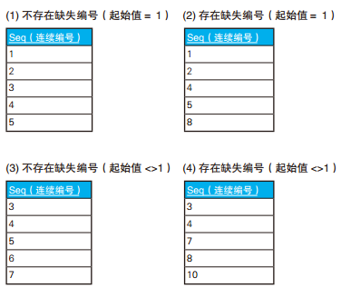

```sql
/* 如果有查询结果，说明存在缺失的编号：只调查数列的连续性 */
SELECT '存在缺失的编号' AS gap
  FROM SeqTbl
HAVING COUNT(*) <> MAX(seq) - MIN(seq) + 1;

/* 不论是否存在缺失的编号都返回一行结果 */
SELECT CASE WHEN COUNT(*) = 0
               THEN '表为空'
            WHEN COUNT(*) <> MAX(seq) - MIN(seq) + 1
               THEN '存在缺失的编号'
            ELSE '连续' END AS gap
  FROM SeqTbl;
```

查找最小的缺失编号 。

```sql
/* 查找最小的缺失编号：表中没有1时返回1 */
-- Oracle: ORA-00937: not a single-group group function
SELECT CASE COUNT(*) = 0 OR WHEN MIN(seq) > 1    /* 最小值不是1时→返回1 */
            THEN 1
            ELSE (SELECT MIN(seq +1)  /* 最小值是1时→返回最小的缺失编号 */
                    FROM SeqTbl S1
                   WHERE NOT EXISTS
                        (SELECT *
                           FROM SeqTbl S2
                          WHERE S2.seq = S1.seq + 1))
             END AS min_gap
  FROM SeqTbl;
```

### 为集合设置详细的条件

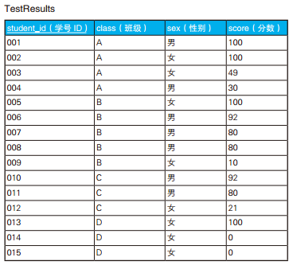

查询出 75% 以上的学生分数都在 80 分以上的班级

```sql
/* 75%以上的学生分数都在80分以上的班级 */
SELECT class
  FROM TestResults
GROUP BY class
HAVING COUNT(*) * 0.75
         <= SUM(CASE WHEN score >= 80
                     THEN 1
                     ELSE 0 END) ;

class
-------
B
```

查询出分数在 50 分以上的男生的人数比分数在 50 分以上的女生的人数多的班级

```sql
/* 分数在50分以上的男生的人数比分数在50分以上的女生的人数多的班级 */
SELECT class
  FROM TestResults
GROUP BY class
HAVING SUM(CASE WHEN score >= 50 AND sex = '男'
                THEN 1
                ELSE 0 END)
       > SUM(CASE WHEN score >= 50 AND sex = '女'
                  THEN 1
                  ELSE 0 END) ;

class
-------
B
C
```

查询出女生平均分比男生平均分高的班级

```sql
/* 比较男生和女生平均分的SQL语句（1）：对空集使用AVG后返回0 */
SELECT class
  FROM TestResults
 GROUP BY class
HAVING AVG(CASE WHEN sex = '男'
                THEN score
                ELSE 0 END)
     < AVG(CASE WHEN sex = '女'
                THEN score
                ELSE 0 END) ;

class
-------
A
D
```

从表中的数据我们可以发现， D 班全是女生。在上面的解答中，用于判断男生的 CASE 表达式里分支 ELSE 0 生效了，于是男生的平均分就成了 0 分。对于女生的平均分约为 33.3 的 D 班，条件 0 < 33.3 也成立，所以 D 班也出现在查询结果里了。这种处理方法看起来好像也没什么问题。但是，如果学号 013 的学生分数刚好也是 0 分，结果会怎么样呢？这种情况下，女生的平均分会变为 0 分，所以 D 班不会被查询出来。男生和女生的平均分都是 0，但是两个 0 的意义完全不同。女生的平均分是正常计算出来的，而男生的平均分本来就无法计算，只是强行赋值为 0 而已。真正合理的处理方法是，保证对空集求平均的结果是“未定义”，就像除以 0 的结果是未定义一样。根据标准 SQL 的定义，对空集使用 AVG 函数时，结果会返回 NULL （用 NULL 来代替未定义这种做法本身也有问题，但是在这里我们不深究)。这回 D 班男生的平均分是 NULL。因此不管女生的平均分多少， D 班都会被排除在查询结果之外。这种处理方法和 AVG 函数的处理逻辑也是一致的。

```sql
/* 比较男生和女生平均分的SQL语句（2）：对空集求平均值后返回NULL */
SELECT class
  FROM TestResults
 GROUP BY class
HAVING AVG(CASE WHEN sex = '男'
                THEN score
                ELSE NULL END)
     < AVG(CASE WHEN sex = '女'
                THEN score
                ELSE NULL END);
```

### 调查集合性质时经常用到的条件

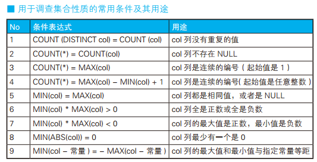

## 外连接的用法

### 用外连接进行行列转换 (1)（行 → 列）：制作交叉表

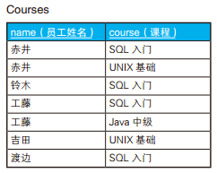

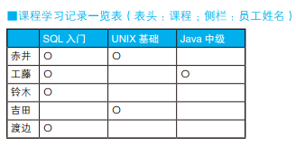

```sql
-- 水平展开求交叉表（1）：使用外连接
SELECT C0.name,
       CASE WHEN C1.name IS NOT NULL THEN '○' ELSE NULL END AS "SQL入门",
       CASE WHEN C2.name IS NOT NULL THEN '○' ELSE NULL END AS "UNIX基础",
       CASE WHEN C3.name IS NOT NULL THEN '○' ELSE NULL END AS "Java中级"
  FROM  (SELECT DISTINCT name FROM  Courses) C0
    LEFT OUTER JOIN
    (SELECT name FROM Courses WHERE course = 'SQL入门' ) C1
    ON  C0.name = C1.name
      LEFT OUTER JOIN
        (SELECT name FROM Courses WHERE course = 'UNIX基础' ) C2
        ON  C0.name = C2.name
          LEFT OUTER JOIN
            (SELECT name FROM Courses WHERE course = 'Java中级' ) C3
            ON  C0.name = C3.name;
```

一般情况下，外连接都可以用标量子查询替代 。这种做法的优点在于，需要增加或者减少课程时，只修改 SELECT 子句即可，代码修改起来比较简单。对于需要动态生成 SQL 的系统也是很有好处的。缺点是性能不太好，目前在 SELECT 子句中使用标量子查询（或者关联子查询）的话，性能开销还是相当大的。

```sql
-- 水平展开（2）：使用标量子查询
SELECT  C0.name,
  (SELECT '○'
     FROM Courses C1
    WHERE course = 'SQL入门'
      AND C1.name = C0.name) AS "SQL入门",
  (SELECT '○'
     FROM Courses C2
    WHERE course = 'UNIX基础'
      AND C2.name = C0.name) AS "UNIX基础",
  (SELECT '○'
     FROM Courses C3
    WHERE course = 'Java中级'
      AND C3.name = C0.name) AS "Java中级"
  FROM (SELECT DISTINCT name FROM Courses) C0;
```

使用 CASE 表达式。 CASE 表达式可以写在 SELECT 子句里的聚合函数内部，也可以写在聚合函数外部。这里，我们先把 SUM 函数的结果处理成 1 或者 NULL，然后在外层的 CASE 表达式里将 1 转换成 ○。 如果不使用聚合，那么返回结果的行数会是表 Courses 的行数，所以这里以参加培训课程的员工为单位进行聚合。这种做法和标量子查询的做法一样简洁，也能灵活地应对需求变更。

```sql
-- 水平展开（3）：嵌套使用CASE表达式
SELECT  name,
        CASE WHEN SUM(CASE WHEN course = 'SQL入门' THEN 1 ELSE NULL END) >= 1
             THEN '○' ELSE NULL END AS "SQL入门",
        CASE WHEN SUM(CASE WHEN course = 'UNIX基础' THEN 1 ELSE NULL END) >= 1
             THEN '○' ELSE NULL END AS "UNIX基础",
        CASE WHEN SUM(CASE WHEN course = 'Java中级' THEN 1 ELSE NULL END) >= 1
             THEN '○' ELSE NULL END AS "Java中级"
  FROM Courses
 GROUP BY name;
```

### 用外连接进行行列转换 (2)（列 → 行）：汇总重复项于一列

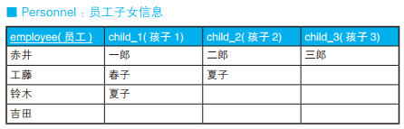

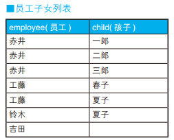

```sql
-- 获取员工子女列表的SQL语句（没有孩子的员工也输出）
SELECT EMP.employee, CHILDREN.child
 FROM  Personnel EMP
  LEFT OUTER JOIN
   (SELECT child_1 AS child FROM Personnel
    UNION
    SELECT child_2 AS child FROM Personnel
    UNION
    SELECT child_3 AS child FROM Personnel) CHILDREN
  ON CHILDREN.child IN (EMP.child_1, EMP.child_2, EMP.child_3);
```

### 在交叉表里制作嵌套式表侧栏

表 TblPop 是一张按照县、年龄层级和性别统计的人口分布表，要求根据表 TblPop 生成交叉表“包含嵌套式表侧栏的统计表”。

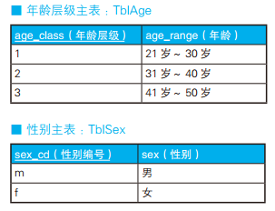

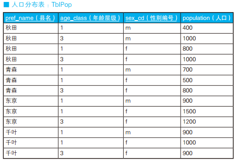

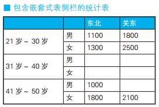

```sql
-- 使用外连接生成嵌套式表侧栏：错误的SQL语句
SELECT MASTER1.age_class AS age_class,
       MASTER2.sex_cd AS sex_cd,
       DATA.pop_tohoku AS pop_tohoku,
       DATA.pop_kanto AS pop_kanto
  FROM (SELECT age_class, sex_cd,
               SUM(CASE WHEN pref_name IN ('青森', '秋田')
                        THEN population ELSE NULL END) AS pop_tohoku,
               SUM(CASE WHEN pref_name IN ('东京', '千叶')
                        THEN population ELSE NULL END) AS pop_kanto
          FROM TblPop
         GROUP BY age_class, sex_cd) DATA
        RIGHT OUTER JOIN TblAge MASTER1  -- 外连接1：和年龄层级主表进行外连接
           ON MASTER1.age_class = DATA.age_class
              RIGHT OUTER JOIN TblSex MASTER2 -- 外连接2：和性别主表进行外连接
                 ON MASTER2.sex_cd = DATA.sex_cd;

age_class sex_cd pop_tohoku pop_kanto
--------- ------ ---------- ---------
1         m      1100       1800
1         f      1300       2500
3         m      1000
3         f      1800       2100
```

原因是表 TblPop 里没有年龄层级为 2 的数据。 实际上，与年龄层级主表外连接之后，结果里是包含年龄层级为 2 的数据的。但是虽然年龄层级 2 确实可以通过外连接从表 TblAge 获取，但是在表 TblPop 里，与之相应的“性别编号”列却是 NULL。原因也不难理解。表 TblPop 里本来就没有年龄层级为 2 的数据，自然也没有相应的性别信息 m 或 f，于是“性别编号”列只能是 NULL。因此与性别主表进行外连接时，连接条件会变成 ON MASTER2.sex_cd =
NULL，结果是 unknown。因此，最终结果里永远不会出现年龄层级为 2 的数据，即使改变两次外连接的先后顺序，结果也还是一样的

```sql
-- 停在第1个外连接处时：结果里包含年龄层级为2的数据
SELECT MASTER1.age_class AS age_class,
       DATA.sex_cd AS sex_cd,
       DATA.pop_tohoku AS pop_tohoku,
       DATA.pop_kanto AS pop_kanto
  FROM (SELECT age_class, sex_cd,
               SUM(CASE WHEN pref_name IN ('青森', '秋田')
                        THEN population ELSE NULL END) AS pop_tohoku,
               SUM(CASE WHEN pref_name IN ('东京', '千叶')
                        THEN population ELSE NULL END) AS pop_kanto
          FROM TblPop
         GROUP BY age_class, sex_cd) DATA
        RIGHT OUTER JOIN TblAge MASTER1
           ON MASTER1.age_class = DATA.age_class;
age_class sex_cd pop_tohoku pop_kanto
--------- ------ ---------- ---------
1         m      1100       1800
1         f      1300       2500
2                           -- 存在年龄层级为 2 的数据
3         m      1000
3         f      1800       2100
```

如果不允许进行两次外连接，那么调整成一次就可以了。

```sql
-- 使用外连接生成嵌套式表侧栏：正确的SQL语句
SELECT
  MASTER.age_class AS age_class,
  MASTER.sex_cd    AS sex_cd,
  DATA.pop_tohoku  AS pop_tohoku,
  DATA.pop_kanto   AS pop_kanto
FROM
  (SELECT
     age_class,
     sex_cd,
     SUM(CASE WHEN pref_name IN ('青森', '秋田')
              THEN population ELSE NULL END) AS pop_tohoku,
     SUM(CASE WHEN pref_name IN ('东京', '千叶')
              THEN population ELSE NULL END) AS pop_kanto
   FROM TblPop
   GROUP BY age_class, sex_cd) DATA
     RIGHT OUTER JOIN
       (SELECT age_class, sex_cd
          FROM TblAge
                CROSS JOIN
               TblSex ) MASTER
     ON  MASTER.age_class = DATA.age_class
    AND  MASTER.sex_cd    = DATA.sex_cd;
```

### 作为乘法运算的连接


```sql
-- 解答（1）：通过在连接前聚合来创建一对一的关系
SELECT I.item_no, SH.total_qty
  FROM Items I LEFT OUTER JOIN
       (SELECT item_no, SUM(quantity) AS total_qty
          FROM SalesHistory
         GROUP BY item_no) SH
    ON I.item_no = SH.item_no;
```

如果从性能角度考虑，上述 SQL 语句还是有些问题的。比如临时视图 SH 的数据需要临时存储在内存里，还有就是虽然通过聚合将 item_no 变成了主键，但是 SH 上却不存在主键索引，因此我们也就无法利用索引优化查询。要改善这个查询，关键在于导入“把连接看作乘法运算”这种视点。商品主表 Items 和视图 SH 确实是一对一的关系，但其实从“item_no”列看，表 Items 和表 SalesHistory 是一对多的关系。而且，当连接操作的双方是一对多关系时，结果的行数并不会增加。这就像普通乘法里任意数乘以 1 后，结果不会变化一样 。

```sql
-- 解答(2)：先进行一对多的连接再聚合
SELECT I.item_no, SUM(SH.quantity) AS total_qty
  FROM Items I LEFT OUTER JOIN SalesHistory SH
    ON I.item_no = SH.item_no -- 一对多的连接
 GROUP BY I.item_no;
```

### 全外连接

在两张班级学生表里，田中和铃木同时属于两张表，而伊集院和西园寺只属于其中一张表。全外连接是能够从这样两张内容不一致的表里，没有遗漏地获取全部信息的方法，所以也可以理解成“把两张表都当作主表来使用”的连接。


```sql
-- 全外连接保留全部信息
SELECT COALESCE(A.id, B.id) AS id, --COALESCE 是SQL 的标准函数，可以接受多个参数，功能是返回第一个非 NULL 的参数。
       A.name AS A_name,
       B.name AS B_name
FROM Class_A  A  FULL OUTER JOIN Class_B  B
  ON A.id = B.id;

id   A_name B_name
---- ------ ------
1    田中   田中
2    铃木   铃木
3    伊集院
4           西园寺
```

如果所用的数据库不支持全外连接，可以分别进行左外连接和右外连接，再把两个结果通过 UNION 合并起来，也能达到同样的目的 。这种写法虽然也能获取到同样的结果，但是代码比较冗长，而且使用两次连接后还要用 UNION 来合并，性能也不是很好。

```sql
-- 数据库不支持全外连接时的替代方案
SELECT A.id AS id, A.name, B.name
  FROM Class_A  A   LEFT OUTER JOIN Class_B  B
    ON A.id = B.id
UNION
SELECT B.id AS id, A.name, B.name
  FROM Class_A  A  RIGHT OUTER JOIN Class_B  B
    ON A.id = B.id;
```

其实，我们还可以换个角度，把表连接看成集合运算。内连接相当于求集合的积（INTERSECT，也称交集），全外连接相当于求集合的和（UNION，
也称并集）。下面是两者的维恩图（Venn Diagram，亦称文氏图）。


### 用外连接进行集合运算

**用外连接求差集 ： A － B**


**用全外连接求异或集**
接下来我们考虑一下如何求两个集合的异或集。 SQL 没有定义求异或集的运算符，如果用集合运算符，可以有两种方法。一种是 (A UNION B)
EXCEPT (A INTERSECT B)，另一种是 (A EXCEPT B) UNION (B EXCEPT A)。两种方法都比较麻烦，性能开销也会增大。

```sql
SELECT COALESCE(A.id, B.id) AS id,
       COALESCE(A.name , B.name ) AS name
 FROM  Class_A A FULL OUTER JOIN Class_B B
   ON A.id = B.id
WHERE A.name IS NULL
   OR B.name IS NULL;

id   name
---- -----
3    伊集院
4    西园寺
```

## 用关联子查询比较行与行

### 增长、减少、维持现状


```sql
-- 求与上一年营业额一样的年份（1）：使用关联子查询
SELECT year,sale
  FROM Sales S1
 WHERE sale = (SELECT sale
                 FROM Sales S2
                WHERE S2.year = S1.year - 1)
 ORDER BY year;

year  sale
----- ----
1993  52
1995  50
```


子查询里的 S2.year = S1.year – 1 这个条件起到了将要比较的数据偏移一行的作用。关联子查询和自连接在很多时候都是等价的，所以我
们也可以像下面这样使用自连接来实现。

```sql
-- 求与上一年营业额一样的年份（2）：使用自连接
SELECT S1.year, S1.sale
  FROM Sales S1,
       Sales S2
 WHERE S2.sale = S1.sale
   AND S2.year = S1.year - 1
 ORDER BY year;
```

**用列表展示与上一年的比较结果**

```sql
-- 求出是增长了还是减少了，抑或是维持现状（1）：使用关联子查询
SELECT S1.year, S1.sale,
       CASE WHEN sale =
             (SELECT sale
                FROM Sales S2
               WHERE S2.year = S1.year - 1) THEN '→' -- 持平
            WHEN sale >
             (SELECT sale
                FROM Sales S2
               WHERE S2.year = S1.year - 1) THEN '↑' -- 增长
            WHEN sale <
             (SELECT sale
                FROM Sales S2
               WHERE S2.year = S1.year - 1) THEN '↓' -- 减少
       ELSE '—' END AS var
  FROM Sales S1
 ORDER BY year;


year   sale var
------ ---- ---
1990   50    —
1991   51    ↑
1992   52    ↑
1993   52    →
1994   50    ↓
1995   50    →
1996   49    ↓
1997   55    ↑
```

同样，这里也可以改写一下 SQL 语句，使用自连接来实现。采用这种实现方法时，由于这里没有 1990 年之前的数据，所以 1990 年会被排除掉，执行结果会少一行。

```sql
-- 求出是增长了还是减少了，抑或是维持现状（2）：使用自连接查询
SELECT S1.year, S1.sale,
       CASE WHEN S1.sale = S2.sale THEN '→'
            WHEN S1.sale > S2.sale THEN '↑'
            WHEN S1.sale < S2.sale THEN '↓'
       ELSE '—' END AS var
  FROM Sales S1, Sales S2
 WHERE S2.year = S1.year-1
 ORDER BY year;
```

### 时间轴有间断时 ： 和过去最临近的时间进行比较


使用子查询

```sql
-- 查询与过去最临近的年份营业额相同的年份
SELECT year, sale
  FROM Sales2 S1
 WHERE sale =
   (SELECT sale
      FROM Sales2 S2
     WHERE S2.year =
       (SELECT MAX(year)            -- 条件2：在满足条件1的年份中，年份最早的一个
          FROM Sales2 S3
         WHERE S1.year > S3.year))  -- 条件1：与该年份相比是过去的年份
 ORDER BY year;

year  sale
----- ----
1992  50
1997  55
```

使用自连接

```sql
-- 查询与过去最临近的年份营业额相同的年份：同时使用自连接
SELECT S1.year AS year,
       S1.sale AS sale
  FROM Sales2 S1, Sales2 S2
 WHERE S1.sale = S2.sale
   AND S2.year = (SELECT MAX(year)
                    FROM Sales2 S3
                   WHERE S1.year > S3.year)
 ORDER BY year;
```

通过这个方法，我们可以查询每一年与过去最临近的年份之间的营业额之差。

```sql
-- 求每一年与过去最临近的年份之间的营业额之差（1）：结果里不包含最早的年份
SELECT S2.year AS pre_year,
       S1.year AS now_year,
       S2.sale AS pre_sale,
       S1.sale AS now_sale,
       S1.sale - S2.sale  AS diff
 FROM Sales2 S1, Sales2 S2
 WHERE S2.year = (SELECT MAX(year)
                    FROM Sales2 S3
                   WHERE S1.year > S3.year)
 ORDER BY now_year;

pre_year now_year pre_sale now_sale diff
-------- -------- -------- -------- ----
1990     1992     50       50       0 --50 - 50 = 0
1992     1993     50       52       2 --52 - 50 = 2
1993     1994     52       55       3 --55 - 52 = 3
1994     1997     55       55       0 --55 - 55 = 0
```

这条 SQL 语句无法获取到最早年份 1990 年的数据。这是因为，表里没有比 1990 年更早的年份，所以在进行内连接的时候 1990 年的数据就被排除掉了。如果想让结果里出现 1990 年的数据，可以使用“自外连接”来实现。

```sql
-- 求每一年与过去最临近的年份之间的营业额之差（2）：使用自外连接。结果里包含最早的年份
SELECT S2.year AS pre_year,
       S1.year AS now_year,
       S2.sale AS pre_sale,
       S1.sale AS now_sale,
       S1.sale - S2.sale AS diff
 FROM Sales2 S1 LEFT OUTER JOIN Sales2 S2
   ON S2.year = (SELECT MAX(year)
                   FROM Sales2 S3
                  WHERE S1.year > S3.year)
 ORDER BY now_year;

pre_year now_year pre_sale now_sale diff
-------- -------- -------- -------- ----
         1990              50         --1990 年也会出现
1990     1992     50       50       0 --50 - 50 = 0
1992     1993     50       52       2 --52 - 50 = 2
1993     1994     52       55       3 --55 - 52 = 3
1994     1997     55       55       0 --55 - 55 = 0
```

### 移动累计值和移动平均值


```sql
-- 求累计值：使用窗口函数
SELECT prc_date, prc_amt,
       SUM(prc_amt) OVER (ORDER BY prc_date) AS onhand_amt
  FROM Accounts;
```

```sql
-- 求累计值：使用冯·诺依曼型递归集合
SELECT prc_date, A1.prc_amt,
      (SELECT SUM(prc_amt)
         FROM Accounts A2
        WHERE A1.prc_date >= A2.prc_date ) AS onhand_amt
  FROM Accounts A1
 ORDER BY prc_date;

prc_date   prc_amt onhand_amt
---------- ------- ----------
2006-10-26 12000   12000 -- 12000
2006-10-28 2500    14500 -- 12000 + 2500
2006-10-31 -15000  -500 -- 12000 + 2500 + (-15000)
2006-11-03 34000   33500 -- 12000 + 2500 + (-15000) + 34000
2006-11-04 -5000   28500 -- 下同
2006-11-06 7200    35700 -- ：
2006-11-11 11000   46700 -- ：
```

求移动累计值

```sql
-- 求移动累计值（1）：使用窗口函数
SELECT prc_date, prc_amt,
       SUM(prc_amt) OVER (ORDER BY prc_date
                           ROWS 2 PRECEDING) AS onhand_amt
  FROM Accounts;
```

```sql
-- 求移动累计值（2）：不满3行的时间区间也输出
SELECT prc_date, A1.prc_amt,
      (SELECT SUM(prc_amt)
         FROM Accounts A2
        WHERE A1.prc_date >= A2.prc_date
          AND (SELECT COUNT(*)
                 FROM Accounts A3
                WHERE A3.prc_date
                  BETWEEN A2.prc_date AND A1.prc_date  ) <= 3 ) AS mvg_sum
  FROM Accounts A1
 ORDER BY prc_date;


prc_date   prc_amt mvg_sum
---------- ------- -------
2006-10-26 12000   12000 --12000
2006-10-28 2500    14500 --12000 + 2500
2006-10-31 -15000  -500 --12000 + 2500 + (-15000)
2006-11-03 34000   21500 --2500 + (-15000) + 34000
2006-11-04 -5000   14000 -- 下同
2006-11-06 7200    36200 -- ：
2006-11-11 11000   13200 -- ：
```

```sql
-- 求移动累计值（3）：不满3行的区间按无效处理
SELECT prc_date, A1.prc_amt,
 (SELECT SUM(prc_amt)
    FROM Accounts A2
   WHERE A1.prc_date >= A2.prc_date
     AND (SELECT COUNT(*)
            FROM Accounts A3
           WHERE A3.prc_date
             BETWEEN A2.prc_date AND A1.prc_date  ) <= 3
   HAVING  COUNT(*) =3) AS mvg_sum  -- 不满3行数据的不显示
  FROM  Accounts A1
 ORDER BY prc_date;

prc_date   prc_amt mvg_sum
---------- ------- -------
2006-10-26 12000   -- 不满 3 行数据，所以不显示
2006-10-28 2500    -- 不满 3 行数据，所以不显示
2006-10-31 -15000  -500 -- 凑够了 3 行，所以输出
2006-11-03 34000   21500
2006-11-04 -5000   14000
2006-11-06 7200    36200
2006-11-11 11000   13200
```

如果觉得这条 SQL 语句的处理过程难以理解，我们可以输出去掉聚合后的明细数据来看一下，这样应该会好理解 。

```sql
-- 去掉聚合并输出
SELECT A1.prc_date AS A1_date,
       A2.prc_date AS A2_date,
       A2.prc_amt AS amt
 FROM Accounts A1, Accounts A2
WHERE A1.prc_date >= A2.prc_date
  AND (SELECT COUNT(*)
       FROM Accounts A3
       WHERE A3.prc_date BETWEEN A2.prc_date AND A1.prc_date ) <= 3
 ORDER BY A1_date, A2_date;

A1_date    A2_date    amt
---------- ---------- -------
2006-10-26 2006-10-26 12000

2006-10-28 2006-10-26 12000
2006-10-28 2006-10-28 2500

2006-10-31 2006-10-26 12000
2006-10-31 2006-10-28 2500   …S1 ： -500
2006-10-31 2006-10-31 -15000

2006-11-03 2006-10-28 2500
2006-11-03 2006-10-31 -15000 …S2 ： 21500
2006-11-03 2006-11-03 34000

2006-11-04 2006-10-31 -15000
2006-11-04 2006-11-03 34000  …S3 ： 14000
2006-11-04 2006-11-04 -5000

2006-11-06 2006-11-03 34000
2006-11-06 2006-11-04 -5000  …S4 ： 36200
2006-11-06 2006-11-06 7200

2006-11-11 2006-11-04 -5000
2006-11-11 2006-11-06 7200   …S5 ： 13200
2006-11-11 2006-11-11 11000
```

像上面这样展开后，我们发现，这里的思路与冯·诺依曼型递归集合一样，生成了几个集合。只不过，这些集合间的关系不是嵌套，而是存在交集，又有一点“偏移”。而且，集合 S3 刚好与所有集合都有交集。


通过将这个集合簇与冯·诺依曼型同心圆式嵌套集合进行对比，我们可以明白，集合的生成方式是多种多样的，也是非常有趣的。如果自连接的关键字是“嵌套（递归）”，那么这里的关键字可以暂定为“偏移”。

### 查询重叠的时间区间

表 Reservations，记录了酒店或者旅馆的预约情况。 这张表里没有房间编号，请把表中数据当成是某一房间在某段期间内的预约情况。那么，正常情况下，每天只能有一组客人在该房间住宿。从表中数据可以看出，这里存在重叠的预定日期。


```sql
-- 求重叠的住宿期间
SELECT reserver, start_date, end_date
  FROM Reservations R1
 WHERE EXISTS
       (SELECT *
          FROM Reservations R2
         WHERE R1.reserver <> R2.reserver  -- 与自己以外的客人进行比较
           AND ( R1.start_date BETWEEN R2.start_date AND R2.end_date    -- 条件（1）：自己的入住日期在他人的住宿期间内
              OR R1.end_date  BETWEEN R2.start_date AND R2.end_date));  -- 条件（2）：自己的离店日期在他人的住宿期间内

reserver start_date end_date
-------- ---------- ----------
荒木      2006-10-28 2006-10-31
堀　      2006-10-31 2006-11-01
山本      2006-11-03 2006-11-04
内田      2006-11-03 2006-11-05
```

如果山本的入住日期不是 11 月 3 号，而是推迟了一天，即 11 月 4 号，那么查询结果里将不会出现内田。这是因为，内田的入住日期和离店日期都不再与任何人重叠，于是条件 (1) 和条件 (2) 就都不满足了。换句话说，像内田这种自己的住宿期间完全包含了他人的住宿期间的情况，会被这条 SQL 语句排除掉。

```sql
-- 升级版：把完全包含别人的住宿期间的情况也输出
SELECT reserver, start_date, end_date
 FROM Reservations R1
WHERE EXISTS
       (SELECT *
          FROM Reservations R2
         WHERE R1.reserver <> R2.reserver
           AND (  (     R1.start_date BETWEEN R2.start_date AND R2.end_date
                     OR R1.end_date   BETWEEN R2.start_date AND R2.end_date)
                OR (    R2.start_date BETWEEN R1.start_date AND R1.end_date
                    AND R2.end_date   BETWEEN R1.start_date AND R1.end_date)));
```

## 用 SQL 进行集合运算

### 集合运算的几个注意事项

注意事项 1： SQL 能操作具有重复行的集合，可以通过可选项 ALL 来支持
一般的集合论是不允许集合里存在重复元素的，因此集合 {1, 1, 2, 3, 3,3} 和集合 {1, 2, 3} 被视为相同的集合。但是关系数据库里的表允许存在重复行，称为多重集合（multiset, bag）。因此，SQL 的集合运算符也提供了允许重复和不允许重复的两种用法。如果直接使用 UNION 或 INTERSECT，结果里就不会出现重复的行。如果想在结果里留下重复行，可以加上可选项 ALL，写作 UNION ALL。 ALL 的作用和 SELECT 子句里的 DISTINCT 可选项刚好相反。但是，不知道为什么，SQL 并不支持 UNION DISTINCT 这样的写法。除了运算结果以外，这两种用法还有一个不同。集合运算符为了排除
掉重复行，默认地会发生排序，而加上可选项 ALL 之后，就不会再排序，所以性能会有提升。这是非常有效的用于优化查询性能的方法，所以如果不关心结果是否存在重复行，或者确定结果里不会产生重复行，加上可选项 ALL 会更好些。

注意事项 2：集合运算符有优先级
标准 SQL 规定， INTERSECT 比 UNION 和 EXCEPT 优先级更高。因此，当同时使用 UNION 和 INTERSECT，又想让 UNION 优先执行时，必须用括
号明确地指定运算顺序

注意事项 3：各个 DBMS 提供商在集合运算的实现程度上参差不齐
前面说过，早期的 SQL 对集合运算的支持程度不是很高。受到这一点影响，各个数据库提供商的实现程度也参差不齐。 SQL Server 从 2005 版开始支持 INTERSECT 和 EXCEPT，而 MySQL 还都不支持（包含在“中长期计划”里）。还有像 Oracle 这样，实现了 EXCEPT 功能但却命名为 MINUS 的数据库。这一点比较麻烦，因为 Oracle 用户需要在使用时将 EXCEPT 全部改写成 MINUS。

注意事项 4：除法运算没有标准定义

四则运算里的和（UNION）、差（EXCEPT）、积（CROSS JOIN）都被引 入了标准 SQL。但是很遗憾，商（DIVIDE BY）因为各种原因迟迟没能标
准化。因此，现阶段我们需要自己写 SQL 语句来实现除法运算。

### 比较表和表 ： 检查集合相等性


在集合论里，判定两个集合是否相等时，一般使用下面两种方法。
1. (A  ∩ B )  且  (A ∩  B) ⇔ (A = B) 
2. (A ∪ B ) = (A ∩ B) ⇔ (A = B)

```sql
-- 比较表和表：（在Oracle中使用 Minus）
SELECT DISTINCT CASE WHEN COUNT(*) = 0
                     THEN '相等'
                     ELSE '不相等' END AS result
  FROM ((SELECT * FROM  tbl_A
         UNION
         SELECT * FROM  tbl_B)
         EXCEPT
        (SELECT * FROM  tbl_A
         INTERSECT
         SELECT * FROM  tbl_B)) TMP;
```

### 用差集实现关系除法运算

从表 EmpSkills 中找出精通表 Skills 中所有技术的员工。也就是说，答案是相田和神崎。平井很可惜，会的技术很多，但是不会 Java，所以落选了。


```sql
-- 用求差集的方法进行关系除法运算（有余数）
SELECT DISTINCT emp
  FROM EmpSkills ES1
 WHERE NOT EXISTS
        (SELECT skill
           FROM Skills
         EXCEPT
         SELECT skill
           FROM EmpSkills ES2
          WHERE ES1.emp = ES2.emp);
```

### 寻找相等的子集

如下是 供应商及其经营的零件的表 ，找出经营的零件在种类数和种类上都完全相同的供应商组合。由表格我们可以看出，答案是 A-C 和 B-D 这两组。


```sql
-- 寻找相等的子集
SELECT SP1.sup, SP2.sup
  FROM SupParts SP1, SupParts SP2
 WHERE SP1.sup < SP2.sup              -- 生成供应商的全部组合
   AND SP1.part = SP2.part            -- 条件1：经营同种类型的零件
GROUP BY SP1.sup, SP2.sup
HAVING COUNT(*) = (SELECT COUNT(*)    -- 条件2：经营的零件种类数相同
                     FROM SupParts SP3
                    WHERE SP3.sup = SP1.sup)
   AND COUNT(*) = (SELECT COUNT(*)
                     FROM SupParts SP4
                    WHERE SP4.sup = SP2.sup);
```

### 用于删除重复行的高效 SQL


```sql
-- 删除重复行 ：使用关联子查询
DELETE FROM Products
 WHERE rowid < ( SELECT MAX(P2.rowid)
                   FROM Products P2
                  WHERE Products.name = P2. name
                    AND Products.price = P2.price ) ;
```

```sql
-- 用于删除重复行的高效SQL语句（1）：通过EXCEPT求补集
DELETE FROM Products
 WHERE rowid IN ( SELECT rowid
                    FROM Products
                  EXCEPT
                  SELECT MAX(rowid)
                    FROM Products
                   GROUP BY name, price);
```

```sql
-- 删除重复行的高效SQL语句（2）：通过NOT IN求补集
DELETE FROM Products
 WHERE rowid NOT IN ( SELECT MAX(rowid)
                        FROM Products
                       GROUP BY name, price);
```

## EXISTS 谓词的用法

### 什么是谓词

SQL 的保留字中，有很多都被归为谓词一类。例如，“=、 <、 >”等比 较谓词，以及 BETWEEN、 LIKE、 IN、 IS NULL 等。在写 SQL 语句时我们几乎离不开这些谓词，那么到底什么是谓词呢？ 用一句话来说，谓词就是函数。当然，谓词与 SUM 或 AVG 这样的函数并不一样，否则就无需再分出谓词这一类，而是统一都叫作函数了。实际上，谓词是一种特殊的函数，返回值是真值。前面提到的每个谓词，返回值都是 true、 false 或者 unknown（一般的谓词逻辑里没有 unknown，但是 SQL 采用的是三值逻辑，因此具有三种真值）。 谓词逻辑提供谓词是为了判断命题（可以理解成陈述句）的真假。例如，我们假设存在“x 是男的”这样的谓词，那么我们只要指定 x 为“小明”或者“小红”，就能判断命题“小明是男的”“小红是男的”是真命题还是假命题。在谓词逻辑出现之前，命题逻辑中并没有像这样能够深入调查命题内部的工具。谓词逻辑的出现具有划时代的意义，原因就在于为命题分析提供了函数式的方法 。

在关系数据库里，表中的一行数据可以看作是一个命题。


例如，这张表里第一行数据就可以认为表示这样一个命题：田中性别是男，而且年龄是 28 岁。表常常被认为是行的集合，但从谓词逻辑的观点看，也可以认为是命题的集合（＝陈述句的集合）。 C.J. Date 曾经这样调侃过：数据库这种叫法有点名不副实，它存储的与其说是数据，还不如说是命题 。

同样，我们平时使用的 WHERE 子句，其实也可以看成是由多个谓词组合而成的新谓词。只有能让 WHERE 子句的返回值为真的命题，才能从表（命
题的集合）中查询到。

### 实体的阶层

同样是谓词，但是与 =、 BETWEEN 等相比， EXISTS 的用法还是大不相同的。概括来说，区别在于“谓词的参数可以取什么值”。EXISTS 参数是行数据的集合。之所以这么说，是因为无论子查询中选择什么样的列，对于 EXISTS 来说都是一样的。在 EXISTS 的子查询里，SELECT 子句的列表可以有下面这三种写法。

1. 通配符： SELECT \*
2. 常量： SELECT '这里的内容任意'
3. 列名： SELECT col

但是，不管采用上面这三种写法中的哪一种，得到的结果都是一样的。


从上面的图表我们可以知道， EXISTS 的特殊性在于输入值的阶数（输出值和其他谓词一样，都是真值）。谓词逻辑中，根据输入值的阶数对谓词进行分类。 = 或者 BETWEEEN 等输入值为一行的谓词叫作“一阶谓词”，而像 EXISTS 这样输入值为行的集合的谓词叫作“二阶谓词”。阶（order）是用来区分集合或谓词的阶数的概念。

### 全称量化和存在量化

从这些我们可以知道，形式语言没必要同时显式地支持 EXISTS 和 FORALL 两者。但是实际上，我们希望同时支持这两者，因为有些问题适合使用 EXISTS 来解决，而有的问题适合使用 FORALL。例如， SQL 支持 EXISTS，不支持 FORALL。于是会有一些查询只能选择用 EXISTS，那么代码写起来就会非常麻烦。 —C.J. Date

谓词逻辑中有量词（限量词、数量词）这类特殊的谓词。我们可以用它们来表达一些这样的命题：“所有的 x 都满足条件 P”或者“存在（至少 一个）满足条件 P 的 x”。前者称为“全称量词”，后者称为“存在量词”，分别记作 ∀、 ∃。这两个符号看起来很奇怪。其实，全称量词的符号其实是将字母 A 上下颠倒而形成的，存在量词则是将字母 E 左右颠倒而形成的。“对于所有的 x，……”的英语是“for All x， …”，而“存在满足……的 x”的英语是“there Exists x that…”，这就是这两个符号的由来。也许大家已经明白了， SQL 中的 EXISTS 谓词实现了谓词逻辑中的存在量词。然而遗憾的是，对于与本节核心内容有关的另一个全称量词，SQL 却并没有予以实现。 C.J. Date 在自己的书里写了 FORALL 谓词，但实际上 SQL 里并没有这个实现。但是没有全称量词并不算是 SQL 的致命缺陷。因为全称量词和存在量词只要定义了一个，另一个就可以被推导出来。具体可以参考下面这个等价改写的规则（德·摩根定律）。


因此在 SQL 中，为了表达全称量化，需要将“所有的行都满足条件 P”这样的命题转换成“不存在不满足条件 P 的行”。就像 C.J. Date 所说，虽然 SQL 里有全称量词会很方便，但是既然 SQL 并没有实现它，我们也就没有办法了。

### 查询表中“不”存在的数据


从这张表中求出“参加了某次会议的人”是很容易的。但是，如果反过来求“没有参加某次会议的人”，该怎么做呢？例如，伊藤参加了第 1 次会议和第 2 次会议，但是没有参加第 3 次会议；坂东没有参加第 2 次会议。也就是说，目标结果如下所示，是各次会议缺席者的列表。

```sql
meeting    person
---------- --------
第 1 次    宫田
第 2 次    坂东
第 2 次    水岛
第 3 次    伊藤
```

```sql
-- 用于求出缺席者的SQL语句（1）：存在量化的应用
SELECT DISTINCT M1.meeting, M2.person
  FROM Meetings M1 CROSS JOIN Meetings M2
 WHERE NOT EXISTS
        (SELECT *
           FROM Meetings M3
          WHERE M1.meeting = M3.meeting
            AND M2.person = M3.person);
```

```sql
-- 用于求出缺席者的SQL语句（2）：使用差集运算
SELECT M1.meeting, M2.person
  FROM Meetings M1, Meetings M2
EXCEPT
SELECT meeting, person
  FROM Meetings;
```

### 全称量化 (1) ：习惯“肯定 ⇔ 双重否定”之间的转换


查询出“所有科目分数都在 50 分以上的学生”。答案是学号分别为 100、 200、 400 的 3 人。

```sql
-- 全称量化（1）：习惯“肯定<＝>双重否定”之间的转换
SELECT DISTINCT student_id
  FROM TestScores TS1
 WHERE NOT EXISTS  -- 不存在满足以下条件的行
        (SELECT *
           FROM TestScores TS2
          WHERE TS2.student_id = TS1.student_id
            AND TS2.score < 50);   -- 分数不满50分的科目
```

查询“数学的分数在 80 分以上， 语文的分数在 50 分以上的学生“

```sql
-- 全称量化（1）：习惯“肯定<＝>双重否定”之间的转换
SELECT DISTINCT student_id
  FROM TestScores TS1
 WHERE subject IN ('数学', '语文')
   AND NOT EXISTS
        (SELECT *
           FROM TestScores TS2
          WHERE TS2.student_id = TS1.student_id
            AND 1 = CASE WHEN subject = '数学' AND score < 80 THEN 1
                         WHEN subject = '语文' AND score < 50 THEN 1
                         ELSE 0 END);
```

排除掉没有语文分数的学号为 400 的学生。

```sql
-- 全称量化（1）：习惯“肯定<＝>双重否定”之间的转换
SELECT student_id
  FROM TestScores TS1
 WHERE subject IN ('数学', '语文')
   AND NOT EXISTS
        (SELECT *
           FROM TestScores TS2
          WHERE TS2.student_id = TS1.student_id
            AND 1 = CASE WHEN subject = '数学' AND score < 80 THEN 1
                         WHEN subject = '语文' AND score < 50 THEN 1
                         ELSE 0 END)
 GROUP BY student_id
HAVING COUNT(*) = 2; -- 必须两门科目都有分数

student_id
----------
100
200
```

### 全称量化 (2)：集合 VS 谓词——哪个更强大？

从这张表中查询出哪些项目已经完成到了工程 1。可以明显地看出，只完成到工程 0 的项目 AA100 以及还没有开始的项目 B200 不符合条件，而项目 CS300 符合条件。项目 DY400 已经完成到了工程 2，是否符合条件有点微妙，我们先按它不符合条件来实现。


```sql
-- 查询完成到了工程1的项目：面向集合的解法
SELECT project_id
  FROM Projects
 GROUP BY project_id
HAVING COUNT(*) = SUM(CASE WHEN step_nbr <= 1 AND status = '完成' THEN 1
                           WHEN step_nbr > 1 AND status = '等待' THEN 1
                           ELSE 0 END);

project_id
-----------
CS300
```

谓词逻辑的解法

```sql
-- 查询完成到了工程1的项目：谓词逻辑的解法
SELECT *
  FROM Projects P1
 WHERE NOT EXISTS
        (SELECT status
           FROM Projects P2
          WHERE P1.project_id = P2. project_id  -- 以项目为单位进行条件判断
            AND status <> CASE WHEN step_nbr <= 1 -- 使用双重否定来表达全称量化命题
                               THEN '完成'
                               ELSE '等待' END);

project_id  step_nbr status
----------- -------- ------
CS300       0        完成
CS300       1        完成
CS300 	    2        等待
CS300       3        等待
```

虽然两者都能表达全称量化，但是与 HAVING 相比，使用了双重否定的 NOT EXISTS 代码看起来不是那么容易理解，这是它的缺点。但是这种写法也有优点。第一个优点是性能好。只要有一行满足条件，查询就会终止，不一定需要查询所有行的数据。而且还能通过连接条件使用“project_id”列的索引，这样查询起来会更快。第二个优点是结果里能包含的信息量更大。如果使用 HAVING，结果会被聚合，我们只能获取到项目 ID，而如果使用 EXISTS，则能把集合里的元素整体都获取到。

### 对列进行量化：查询全是 1 的行


查询“都是 1”的行。

```sql
-- “列方向”的全称量化：优雅的解答
SELECT *
  FROM ArrayTbl
 WHERE 1 = ALL (col1, col2, col3, col4, col5, col6, col7, col8, col9, col10);


-- 上面的代码在PostgreSQL中运行时会报错。将代码改为下面这样即可成功运行
SELECT *
  FROM ArrayTbl
 WHERE 1 = ALL (values (col1), (col2), (col3), (col4), (col5), (col6), (col7), (col8), (col9), (col10));
```

查询“至少有一个 9”的行。

```sql
-- “列方向”的存在量化（1）
SELECT *
  FROM ArrayTbl
 WHERE 9 = ANY (col1, col2, col3, col4, col5, col6, col7, col8, col9, col10);

/*上面的代码在PostgreSQL中运行时会报错。将代码改为下面这样即可成功运行
SELECT *
  FROM ArrayTbl
 WHERE 9 = ANY (values (col1), (col2), (col3), (col4), (col5), (col6), (col7), (col8), (col9), (col10));

-- “列方向”的存在量化（2）
SELECT *
  FROM ArrayTbl
 WHERE 9 IN (col1, col2, col3, col4, col5, col6, col7, col8, col9, col10);
```

查询全是 NULL 的行

```sql
-- 查询全是NULL的行：正确的解法
SELECT *
  FROM ArrayTbl
 WHERE COALESCE(col1, col2, col3, col4, col5, col6, col7, col8, col9, col10) IS NULL;
```

## 用 SQL 处理数列

### 生成连续编号


```SQL
-- 求连续编号（1）：求0到99的数
SELECT D1.digit + (D2.digit * 10)  AS seq
  FROM Digits D1, Digits D2
ORDER BY seq;
```

```SQL
-- 求连续编号（2）：求1到542的数
SELECT D1.digit + (D2.digit * 10) + (D3.digit * 100) AS seq
  FROM Digits D1, Digits D2, Digits D3
 WHERE D1.digit + (D2.digit * 10) + (D3.digit * 100) BETWEEN 1 AND 542
ORDER BY seq;
```

### 求全部的缺失编号


```sql
-- 生成序列视图（包含0到999）
CREATE VIEW Sequence (seq)
AS SELECT D1.digit + (D2.digit * 10) + (D3.digit * 100)
     FROM Digits D1, Digits D2, Digits D3;

-- 求所有缺失编号：EXCEPT版
SELECT seq
  FROM Sequence
 WHERE seq BETWEEN 1 AND 12
EXCEPT
SELECT seq FROM SeqTbl;

-- 求所有缺失编号：NOT IN版
SELECT seq
  FROM Sequence
 WHERE seq BETWEEN 1 AND 12
   AND seq NOT IN (SELECT seq FROM SeqTbl);

-- 动态地指定连续编号范围的SQL语句
SELECT seq
  FROM Sequence
 WHERE seq BETWEEN (SELECT MIN(seq) FROM SeqTbl)
               AND (SELECT MAX(seq) FROM SeqTbl)
EXCEPT
SELECT seq FROM SeqTbl;
```

### 三个人能坐得下吗


假设一共 3 个人一起去旅行，准备预订这列火车的车票。问题是，从 1 ～ 15 的座位编号中，找出连续 3 个空位的全部组合。我们把由连续
的整数构成的集合，也就是连续编号的集合称为“序列”。


```sql
-- 找出需要的空位（1）：不考虑座位的换排
SELECT S1.seat   AS start_seat, '～' , S2.seat AS end_seat
  FROM Seats S1, Seats S2
 WHERE S2.seat = S1.seat + (3 -1)  -- 决定起点和终点
   AND NOT EXISTS
          (SELECT *
             FROM Seats S3
            WHERE S3.seat BETWEEN S1.seat AND S2.seat
              AND S3.status <> '未预订' )
ORDER BY start_seat;

start_seat ~  end_seat
---------  -- ----------
    3	   ~	5
    7	   ~	9
    8	   ~	10
    9 	   ~	11
```

考虑发生换排的情况。假设这列火车每一排有 5 个座位。我们在表中加上表示行编号“row_id”列表示某一排的编号。


```SQL
-- 找出需要的空位（2）：考虑座位的换排
SELECT S1.seat   AS start_seat, '～' , S2.seat AS end_seat
  FROM Seats2 S1, Seats2 S2
 WHERE S2.seat = S1.seat + (3 -1)  --决定起点和终点
   AND NOT EXISTS
          (SELECT *
             FROM Seats2 S3
            WHERE S3.seat BETWEEN S1.seat AND S2.seat
              AND (    S3.status <> '未预订'
                    OR S3.row_id <> S1.row_id))
ORDER BY start_seat;

start_seat ~  end_seat
---------  -- ----------
    3	   ~	5
    8	   ~	10
    11 	   ~	13
```

### 最多能坐下多少人

查询“按现在的空位状况，最多能坐下多少人”。 针对表 Seats3 中的数据，要想保证从座位 A 到另一个座位 B 是一个序列，则下面的 3 个条件必须全部都满足。

-   条件 1：起点到终点之间的所有座位状态都是“未预订”。
-   条件 2：起点之前的座位状态不是“未预订”。
-   条件 3：终点之后的座位状态不是“未预订”。


```sql
-- 第一阶段：生成存储了所有序列的视图
CREATE VIEW Sequences (start_seat, end_seat, seat_cnt) AS
SELECT S1.seat  AS start_seat,
       S2.seat  AS end_seat,
       S2.seat - S1.seat + 1 AS seat_cnt
  FROM Seats3 S1, Seats3 S2
 WHERE S1.seat <= S2.seat  -- 第一步：生成起点和终点的组合
   AND NOT EXISTS   -- 第二步：描述序列内所有点需要满足的条件
       (SELECT *
          FROM Seats3 S3
         WHERE (     S3.seat BETWEEN S1.seat AND S2.seat
                 AND S3.status <> '未预订')                         -- 条件1的否定
            OR  (S3.seat = S2.seat + 1 AND S3.status = '未预订' )    -- 条件2的否定
            OR  (S3.seat = S1.seat - 1 AND S3.status = '未预订' ));  -- 条件3的否定

-- 第二阶段：求最长的序列
SELECT start_seat, '～', end_seat, seat_cnt
  FROM Sequences
 WHERE seat_cnt = (SELECT MAX(seat_cnt) FROM Sequences);
```

### 单调递增和单调递减

求一下股价单调递增的时间区间。目标结果是 2007-01-06 ～ 2007-01-08 和 2007-01-14 ～ 2007-01-17 。


```sql
-- 求单调递增的区间的SQL语句：子集也输出
SELECT S1.deal_date   AS start_date,
       S2.deal_date   AS end_date
  FROM MyStock S1, MyStock S2
 WHERE S1.deal_date < S2.deal_date  -- 第一步：生成起点和终点的组合
   AND  NOT EXISTS                  -- 第二步：描述区间内所有日期需要满足的条件
           ( SELECT *
               FROM MyStock S3, MyStock S4
              WHERE S3.deal_date BETWEEN S1.deal_date AND S2.deal_date
                AND S4.deal_date BETWEEN S1.deal_date AND S2.deal_date
                AND S3.deal_date < S4.deal_date
                AND S3.price >= S4.price)
ORDER BY start_date, end_date;

start_date   end_date
------------ -------------
2007-01-06   2007-01-08
2007-01-14   2007-01-16
2007-01-14   2007-01-17
2007-01-16   2007-01-17
```

这个查询的结果里包含像 2007-01-14 ～ 2007-01-17 或 2007-01-16 ～ 2007-01-17 这样的子集。最后，我们要把这些不需要的子集排除掉。使用极值函数很容易就能实现。

```sql
--排除掉子集，只取最长的时间区间
SELECT MIN(start_date) AS start_date,          -- 最大限度地向前延伸起点
       end_date
  FROM  (SELECT S1.deal_date AS start_date,
                MAX(S2.deal_date) AS end_date  -- 最大限度地向后延伸终点
           FROM MyStock S1, MyStock S2
          WHERE S1.deal_date < S2.deal_date
            AND NOT EXISTS
             (SELECT *
                FROM MyStock S3, MyStock S4
               WHERE S3.deal_date BETWEEN S1.deal_date AND S2.deal_date
                 AND S4.deal_date BETWEEN S1.deal_date AND S2.deal_date
                 AND S3.deal_date < S4.deal_date
                 AND S3.price >= S4.price)
         GROUP BY S1.deal_date) TMP
GROUP BY end_date
ORDER BY start_date;
```

## 让 SQL 飞起来

### 使用高效查询

**参数是子查询时，使用 EXISTS 代替 IN**


```sql
-- 慢
SELECT *
  FROM Class_A
 WHERE id IN (SELECT id
               FROM Class_B);
-- 快
SELECT *
  FROM Class_A A
 WHERE EXISTS
        (SELECT *
           FROM Class_B B
          WHERE A.id = B.id);
```

使用 EXISTS 时更快的原因有以下两个。

-   如果连接列（id）上建立了索引，那么查询 Class_B 时不用查实际的表，只需查索引就可以了。
-   如果使用 EXISTS，那么只要查到一行数据满足条件就会终止查询，不用像使用 IN 时一样扫描全表。在这一点上 NOT EXISTS 也一样。

当 IN 的参数是子查询时，数据库首先会执行子查询，然后将结果存储在一张临时的工作表里（内联视图），然后扫描整个视图。很多情况下这种做法都非常耗费资源。使用 EXISTS 的话，数据库不会生成临时的工作表。 在 Oracle 数据库中，如果我们使用了建有索引的列，那么即使使用 IN 也会先扫描 索引。此外，PostgreSQL 从版本 7.4 起也改善了使用子查询作为 IN 谓词参数时的查询速度。

**参数是子查询时，使用连接代替 IN**

要想改善 IN 的性能，除了使用 EXISTS，还可以使用连接。前面的查询语句就可以像下面这样“扁平化”。

```sql
-- 使用连接代替 IN
SELECT A.id, A.name
  FROM Class_A A INNER JOIN Class_B B
    ON A.id = B.id;
```

### 避免排序

与面向过程语言不同，在 SQL 语言中，用户不能显式地命令数据库进行排序操作。对用户隐藏这样的操作正是 SQL 的设计思想。但是，这样并不意味着在数据库内部也不能进行排序。其实正好相反，在数据库内部频繁地进行着暗中的排序。因此最终对于用户来说，了解都有哪些运算会进行排序很有必要（从这个意义上讲，“隐藏操作”这个目标的实现似乎还任重道远）。

会进行排序的代表性的运算有下面这些。

-   GROUP BY 子句
-   ORDER BY 子句
-   聚合函数（SU M、 COUNT、 AVG、 MAX、 MIN）
-   DISTINCT
-   集合运算符（UNION、 INTERSECT、 EXCEPT）
-   窗口函数（RANK、 ROW_NUMBER 等）

**灵活使用集合运算符的 ALL 可选项 **

如果不在乎结果中是否有重复数据，或者事先知道不会有重复数据，请使用 UNION ALL 代替 UNION。这样就不会进行排序了。

```sql
SELECT * FROM Class_A
UNION ALL
SELECT * FROM Class_B;
```


**使用 EXISTS 代替 DISTINCT **

为了排除重复数据， DISTINCT 也会进行排序。如果需要对两张表的连接结果进行去重，可以考虑使用 EXISTS 代替 DISTINCT，以避免排序。


从上面的商品表 Items 中找出同时存在于销售记录表 SalesHistory 中的商品。简而言之，就是找出有销售记录的商品。

```sql
SELECT DISTINCT I.item_no
  FROM Items I INNER JOIN SalesHistory SH
    ON I. item_no = SH. item_no;

item_no
-------
10
20
30
```

更好的做法是使用 EXISTS。

```sql
SELECT item_no
  FROM Items I
 WHERE EXISTS
    (SELECT *
       FROM SalesHistory SH
      WHERE I.item_no = SH.item_no);
```

**在极值函数中使用索引（MAX/MIN） **

SQL 语言里有 MAX 和 MIN 两个极值函数。使用这两个函数时都会进行排序。但是如果参数字段上建有索引，则只需要扫描索引，不需要扫描整张表。以刚才的表 Items 为例来说， SQL 语句可以像下面这样写。因为 item_no 是表 Items 的唯一索引，所以效果更好。对于联合索引，只要查询条件是联合索引的第一个字段，索引就是有效的。这种方法并不是去掉了排序这一过程，而是优化了排序前的查找速度，从而减弱排序对整体性能的影响。

```sql
-- 这样写需要扫描全表
SELECT MAX(item)
  FROM Items;

-- 这样写能用到索引
SELECT MAX(item_no)
  FROM Items;
```

**能写在 WHERE 子句里的条件不要写在 HAVING 子句里 **

例如，下面两条 SQL 语句返回的结果是一样的。

```sql
-- 聚合后使用 HAVING 子句过滤
SELECT sale_date, SUM(quantity)
  FROM SalesHistory
 GROUP BY sale_date
HAVING sale_date = '2007-10-01';

-- 聚合前使用 WHERE 子句过滤
SELECT sale_date, SUM(quantity)
  FROM SalesHistory
 WHERE sale_date = '2007-10-01'
GROUP BY sale_date;

sale_date      sum(quantity)
-------------- --------------
'2007-10-01'   17
```

但是从性能上来看，第二条语句写法效率更高。原因通常有两个。第一个是在使用 GROUP BY 子句聚合时会进行排序，如果事先通过 WHERE 子句筛选出一部分行，就能够减轻排序的负担。第二个是在 WHERE 子句的条件里可以使用索引。 HAVING 子句是针对聚合后生成的视图进行筛选的，但是很多时候聚合后的视图都没有继承原表的索引结构。

**在 GROUP BY 子句和 ORDER BY 子句中使用索引 **

一般来说， GROUP BY 子句和 ORDER BY 子句都会进行排序，来对行进行排列和替换。不过，通过指定带索引的列作为 GROUP BY 和 ORDERBY 的列，可以实现高速查询。特别是，在一些数据库中，如果操作对象的列上建立的是唯一索引，那么排序过程本身都会被省略掉。

### 真的用到索引了吗

假设我们在一个叫作 col_1 的列上建立了索引，然后来看一看下面这条 SQL 语句。这条 SQL 语句本来是想使用索引，但实际上执行时却进行了全表扫描。很多时候，大家是否也在无意识间就这么写了呢？

**在索引字段上进行运算**

使用索引时，条件表达式的左侧应该是原始字段 。

```sql
-- 不会使用索引
SELECT *
  FROM SomeTable
 WHERE col_1 * 1.1 > 100;

-- 会使用索引
SELECT *
  FROM SomeTable
 WHERE col_1 > 100 / 1.1;

--在查询条件的左侧使用函数时，也不能用到索引。
SELECT *
  FROM SomeTable
 WHERE SUBSTR(col_1, 1, 1) = 'a';
```

**使用 IS NULL 谓词**
通常，索引字段是不存在 NULL 的，所以指定 IS NULL 和 IS NOTNULL 的话会使得索引无法使用，进而导致查询性能低下。关于索引字段不存在 NULL 的原因，简单来说是 NULL 并不是值。非值不会被包含在值的集合中。

```sql
SELECT *
  FROM SomeTable
 WHERE col_1 IS NULL;
```

然而，如果需要使用类似 IS NOT NULL 的功能，又想用到索引，那么可以使用下面的方法，假设“col_1”列的最小值是 1。

```sql
--IS NOT NULL 的代替方案
SELECT *
  FROM SomeTable
 WHERE col_1 > 0;
```

原理很简单，只要使用不等号并指定一个比最小值还小的数，就可以选出 col_1 中所有的值。因为 col_1 > NULL 的执行结果是 unknown，所以当“col_1” 列的值为 NULL 的行不会被选择。不过，如果要选择“非 NULL 的行”，正确的做法还是使用 IS NOT NULL。上面这种写法意思有些容易混淆，所以也不太推荐，请只在应急的情况下使用。

**使用否定形式 **

下面这几种否定形式不能用到索引。

-   <>
-   !=
-   NOT IN

因此，下面的 SQL 语句也会进行全表扫描。

```sql
SELECT *
  FROM SomeTable
 WHERE col_1 <> 100;
```

**使用 OR**
在 col_1 和 col_2 上分别建立了不同的索引，或者建立了（col_1,col_2）这样的联合索引时，如果使用 OR 连接条件，那么要么用不到索引，要么用到了但是效率比 AND 要差很多。如果无论如何都要使用 OR，那么有一种办法是位图索引。但是这种索引的话更新数据时的性能开销会增大，所以使用之前需要权衡一下利弊。

```sql
SELECT *
  FROM SomeTable
 WHERE col_1 > 100
    OR col_2 = 'abc';
```

**使用联合索引时，列的顺序错误**

假设存在这样顺序的一个联合索引“col_1, col_2, col_3”。这时，指定条件的顺序就很重要。联合索引中的第一列（col_1）必须写在查询条件的开头，而且索引中列的顺序不能颠倒。有些数据库里顺序颠倒后也能使用索引，但是性能还是比顺序正确时差一些。如果无法保证查询条件里列的顺序与索引一致，可以考虑将联合索引拆分为多个索引。

```sql
○ SELECT * FROM SomeTable WHERE col_1 = 10 AND col_2 = 100 AND col_3 = 500;
○ SELECT * FROM SomeTable WHERE col_1 = 10 AND col_2 = 100 ;
× SELECT * FROM SomeTable WHERE col_1 = 10 AND col_3 = 500 ;
× SELECT * FROM SomeTable WHERE col_2 = 100 AND col_3 = 500 ;
× SELECT * FROM SomeTable WHERE col_2 = 100 AND col_1 = 10 ;
```

**使用 LIKE 谓词进行后方一致或中间一致的匹配**

使用 LIKE 谓词时，只有前方一致的匹配才能用到索引。

```sql
× SELECT * FROM SomeTable WHERE col_1 LIKE '%a';
× SELECT * FROM SomeTable WHERE col_1 LIKE '%a%';
○ SELECT * FROM SomeTable WHERE col_1 LIKE 'a%';
```

**进行默认的类型转换**

对 char 类型的“col_1”列指定条件的示例，默认的类型转换不仅会增加额外的性能开销，还会导致索引不可用，可以说是有百害而无一利。

```sql
× SELECT * FROM SomeTable WHERE col_1 = 10;
○ SELECT * FROM SomeTable WHERE col_1 = '10';
○ SELECT * FROM SomeTable WHERE col_1 = CAST(10, AS CHAR(2));
```

### 减少中间表

**灵活使用 HAVING 子句 **

对聚合结果指定筛选条件时，使用 HAVING 子句是基本原则。不习惯使用 HAVING 子句的数据库工程师可能会倾向于像下面这样先生成一张中间表，然后在 WHERE 子句中指定筛选条件。

```sql
SELECT *
  FROM (SELECT sale_date, MAX(quantity) AS max_qty
	      FROM SalesHistory
         GROUP BY sale_date) TMP 没用的中间表
 WHERE max_qty >= 10;

sale_date    tot_qty
------------ ---------
07-10-01     10
07-10-03     32
07-10-04     22
```

然而，对聚合结果指定筛选条件时不需要专门生成中间表，像下面这样使用 HAVING 子句就可以。HAVING 子句和聚合操作是同时执行的，所以比起生成中间表后再执行的 WHERE 子句，效率会更高一些，而且代码看起来也更简洁。

```sql
SELECT sale_date, MAX(quantity)
  FROM SalesHistory
 GROUP BY sale_date
HAVING MAX(quantity) >= 10;
```

**需要对多个字段使用 IN 谓词时，将它们汇总到一处 **

```sql
SELECT id, state, city
  FROM Addresses1 A1
 WHERE state IN (SELECT state
                   FROM Addresses2 A2
                  WHERE A1.id = A2.id)
  AND city IN (SELECT city
                 FROM Addresses2 A2
                WHERE A1.id = A2.id);
```

这段代码中用到了两个子查询。但是，如果像下面这样把字段连接在一起，那么就能把逻辑写在一处了。这样一来，子查询不用考虑关联性，而且只执行一次就可以。

```sql
SELECT *
  FROM Addresses1 A1
 WHERE id || state || city
   IN (SELECT id || state|| city
         FROM Addresses2 A2);
```

此外，如果所用的数据库实现了行与行的比较，那么我们也可以像下面这样，在 IN 中写多个字段的组合。这种方法与前面的连接字段的方法相比有两个优点。一是不用担心连接字段时出现的类型转换问题，二是这种方法不会对字段进行工，因此可以使用索引。

```sql
SELECT *
  FROM Addresses1 A1
 WHERE (id, state, city)
    IN (SELECT id, state, city
          FROM Addresses2 A2);
```

**先进行连接再进行聚合**

连接和聚合同时使用时，先进行连接操作可以避免产生中间表。原因是，从集合运算的角度来看，连接做的是“乘法运算”。连接表双方是一对一、一对多的关系时，连接运算后数据的行数不会增加。而且，因为在很多设计中多对多的关系都可以分解成两个一对多的关系，因此这个技巧在大部分情况下都可以使用。

```sql
-- 通过在连接前聚合来创建一对一的关系
SELECT I.item_no, SH.total_qty
  FROM Items I LEFT OUTER JOIN
      (SELECT item_no, SUM(quantity) AS total_qty
       FROM SalesHistory
       GROUP BY item_no) SH
   ON I.item_no = SH.item_no;

-- 先进行一对多的连接再聚合
SELECT I.item_no, SUM(SH.quantity) AS total_qty
  FROM Items I LEFT OUTER JOIN SalesHistory SH
    ON I.item_no = SH.item_no 一对多的连接
 GROUP BY I.item_no;
```

**合理地使用视图**

视图是非常方便的工具，相信日常工作中很多人都在频繁地使用。但是，如果没有经过深入思考就定义复杂的视图，可能会带来巨大的性能问题。特别是视图的定义语句中包含以下运算的时候， SQL 会非常低效，执行速度也会变得非常慢。

-   聚合函数（AVG、 COUNT、 SUM、 MIN、 MAX）
-   集合运算符（UNION、 INTERSECT、 EXCEPT 等）

一般来说， 要格外注意避免在视图中进行聚合操作后需要特别注意。最近越来越多的数据库为了解决视图的这个缺点，实现了物化视图（materialized view）等技术。当视图的定义变得复杂时，可以考虑使用一下。
