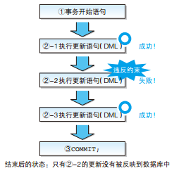
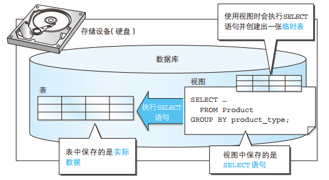
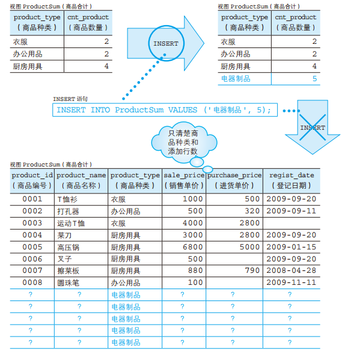
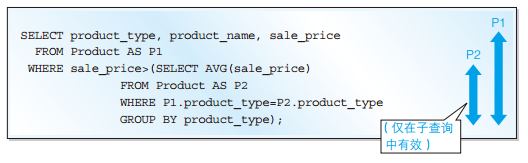
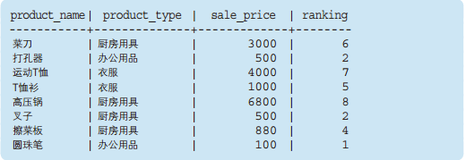

> SQL 基础教程 /（日） MICK 著；孙淼，罗勇译.

## DISTINCT 和 GROUP BY

DISTINCT 和 GROUP BY 子句，都能够删除后续列中的重复数据。除此之外，它们还都会把 NULL 作为一个独立的结果返回。其实不仅处理结果相同，执行速度也基本上差不多（它们都是数据的内部处理，都是通过排序处理来实现的），那么到底应该使用哪一个呢？

这个问题本身就是本末倒置的，我们应该考虑的是该 SELECT 语句是否满足需求。选择的标准其实非常简单，在“想要删除选择结果中的重复记录”时使用 DISTINCT，在“想要计算汇总结果”时使用 GROUP BY。不使用 COUNT 等聚合函数，而只使用 GROUP BY 子句的 SELECT 语句，会让人觉得非常奇怪，使人产生“到底为什么要对表进行分组呢？这样做有必要吗？”等疑问。

## 事务处理何时开始

之前我们说过，事务并没有标准的开始指令存在，而是根据 DBMS 的不同而不同。

实际上，几乎所有的数据库产品的事务都无需开始指令。这是因为大部分情况下，事务在数据库连接建立时就已经悄悄开始了，并不需要用户再明确发出开始指令。例如，使用 Oracle 时，数据库连接建立之后，第一条 SQL 语句执行的同时，事务就已经悄悄开始了。

像这样不使用指令而悄悄开始事务的情况下，应该如何区分各个事务呢？通常会有如下两种情况。

1. 每条 SQL 语句就是一个事务（自动提交模式）
2. 直到用户执行 COMMIT 或者 ROLLBACK 为止算作一个事务

通常的 DBMS 都可以选择其中任意一种模式。默认使用自动提交模式的 DBMS 有 SQL Server、 PostgreSQL 和 MySQL（例如: PostgreSQL 中所有的 SQL 指令语句都在事务内执行。即使不执行 BEGIN，这些命令语句也会在执行时悄悄被括在 BEGIN 和 COMMIT（如果成功的话）之间。）。该模式下的 DML 语句如下所示，每一条语句都括在事务的开始语句和结束语句之中。

```sql
BEGIN TRANSACTION; -- MySQL use START TRANSACTION
-- 将运动T恤的销售单价降低1000日元
UPDATE Product
SET sale_price = sale_price - 1000
WHERE product_name = '运动T恤';
COMMIT;

BEGIN TRANSACTION;
-- 将T恤衫的销售单价上浮1000日元
UPDATE Product
SET sale_price = sale_price + 1000
WHERE product_name = 'T恤衫';
COMMIT;
```

在默认使用 B 模式的 Oracle 中，事务都是直到用户自己执行提交或者回滚指令才会结束。自动提交的情况需要特别注意的是 DELETE 语句。如果不是自动提交，即使使用 DELETE 语句删除了数据表，也可以通过 ROLLBACK 命令取消该事务的处理，恢复表中的数据。但这仅限于明示开始事务，或者关闭自动提交的情况。如果不小心在自动提交模式下执行了 DELETE 操作，即使再回滚也无济于事了。这是一个很严重的问题，初学者难免会碰到这样的麻烦。一旦误删了数据，如果无法重新插入，是不是想哭的心都有了？所以一定要特别小心。

## ACID

DBMS 的事务都遵循四种特性，将这四种特性的首字母结合起来统称为 ACID 特性。这是所有 DBMS 都必须遵守的规则。

**原子性（Atomicity）**

原子性是指在事务结束时，其中所包含的更新处理要么全部执行，要么完全不执行，也就是要么占有一切要么一无所有。例如，在之前的例子中，在事务结束时，绝对不可能出现运动 T 恤的价格下降了，而 T 恤衫的价格却没有上涨的情况。该事务的结束状态，要么是两者都执行了（COMMIT），要么是两者都未执行（ROLLBACK）。从事务中途停止的角度去考虑，就能比较容易理解原子性的重要性了。由于用户在一个事务中定义了两条 UPDATE 语句， DBMS 肯定不会只执行其中一条，否则就会对业务处理造成影响。

**一致性（Consistency）**

一致性指的是事务中包含的处理要满足数据库提前设置的约束，如主键约束或者 NOT NULL 约束等。例如，设置了 NOT NULL 约束的列是不能更新为 NULL 的，试图插入违反主键约束的记录就会出错，无法执行。对事务来说，这些不合法的 SQL 会被回滚。也就是说，这些 SQL 处理会被取消，不会执行。一致性也称为完整性。



**隔离性（Isolation）**

隔离性指的是保证不同事务之间互不干扰的特性。该特性保证了事务之间不会互相嵌套。此外，在某个事务中进行的更改，在该事务结束之前，对其他事务而言是不可见的。因此，即使某个事务向表中添加了记录，在没有提交之前，其他事务也是看不到新添加的记录的。

**持久性（Durability）**

持久性也可以称为耐久性，指的是在事务（不论是提交还是回滚）结束后， DBMS 能够保证该时间点的数据状态会被保存的特性。即使由于系统故障导致数据丢失，数据库也一定能通过某种手段进行恢复。如果不能保证持久性，即使是正常提交结束的事务，一旦发生了系统故障，也会导致数据丢失，一切都需要从头再来。保证持久性的方法根据实现的不同而不同，其中最常见的就是将事务的执行记录保存到硬盘等存储介质中（该执行记录称为日志）。当发生故障时，可以通过日志恢复到故障发生前的状态。

## 视图和表

视图和表区别是“是否保存了实际的数据”。通常，我们在创建表时，会通过 INSERT 语句将数据保存到数据库之中，而数据库中的数据实际上会被保存到计算机的存储设备（通常是硬盘）中。因此，我们通过 SELECT 语句查询数据时，实际上就是从存储设备（硬盘）中读取数据，进行各种计算之后，再将结果返回给用户这样一个过程。

但是使用视图时并不会将数据保存到存储设备之中，而且也不会将数据保存到其他任何地方。实际上视图保存的是 SELECT 语句。我们从视图中读取数据时，视图会在内部执行该 SELECT 语句并创建出一张临时表。



## 视图的限制

**定义视图时不能使用 ORDER BY 子句**

为什么不能使用 ORDER BY 子句呢？这是因为视图和表一样， 数据行都是没有顺序的。实际上，有些 DBMS 在定义视图的语句中是可以使用 ORDER BY 子句的（例如，在 PostgreSQL 中 上 述 SQL 语句就没有问题，可以执行。），但是这并不是通用的语法。因此，在定义视图时请不要使用 ORDER BY 子句。

**对视图进行更新**

标准 SQL 中有这样的规定：如果定义视图的 SELECT 语句能够满足某些条件，那么这个视图就可以被更新。下面就给大家列举一些比较具有代表性的条件。

1. SELECT 子句中未使用 DISTINCT
2. FROM 子句中只有一张表
3. 未使用 GROUP BY 子句
4. 未使用 HAVING 子句

为什么通过汇总得到的视图不能进行更新呢？

视图归根结底还是从表派生出来的，因此，如果原表可以更新，那么视图中的数据也可以更新。反之亦然，如果视图发生了改变，而原表没有进行相应更新的话，就无法保证数据的一致性了。

使用前述 INSERT 语句，向视图 ProductSum 中添加数据 ('电器制品', 5) 时，原表 Product 应该如何更新才好呢？按理说应该向表中添加商品种类为“电器制品”的 5 行数据，但是这些商品对应的商品编号、商品名称和销售单价等我们都不清楚。数据库在这里就遇到了麻烦。



## 关联子查询结合条件一定要写在子查询中

错误的关联子查询书写方法, 将关联条件移到子查询之外.

```sql
SELECT product_type, product_name, sale_price
  FROM Product AS P1
 WHERE P1.product_type = P2.product_type -- 将关联条件移到子查询之外
   AND sale_price > (SELECT AVG(sale_price)
                       FROM Product AS P2
                      GROUP BY product_type);
```

SQL 的规则禁止这样的书写方法。该书写方法究竟违反了什么规则呢？那就是关联名称的作用域。虽然这一术语看起来有些晦涩难懂，但是一解释大家就明白了。关联名称就是像 P1、 P2 这样作为表别名的名称，作用域（scope）就是生存范围。也就是说，关联名称存在一个有效范围的限制。具体来讲，子查询内部设定的关联名称，只能在该子查询内部使用。换句话说，就是“内部可以看到外部，而外部看不到内部”。请大家一定不要忘记关联名称具有一定的有效范围。如前所述，SQL 是按照先内层子查询后外层查询的顺序来执行的。这样，子查询执行结束时只会留下执行结果，作为抽出源的 P2 表其实已经不存在了。因此，在执行外层查询时，由于 P2 表已经不存在了，因此就会返回“不存在使用该名称的表”这样的错误。



## 联结的特定语法和过时语法

**使用过时语法的内联结**

```sql
SELECT SP.shop_id, SP.shop_name, SP.product_id, P.product_name, P.sale_price
  FROM ShopProduct SP, Product P
 WHERE SP.product_id = P.product_id
   AND SP.shop_id = '000A';
```

这样的书写方式所得到的结果与标准语法完全相同，并且这样的语法可以在所有的 DBMS 中执行，并不能算是特定的语法，只是过时了而已。但是，由于这样的语法不仅过时，而且还存在很多其他的问题，因此不推荐大家使用，理由主要有以下三点。

第一，使用这样的语法无法马上判断出到底是内联结还是外联结（又或者是其他种类的联结）。
第二，由于联结条件都写在 WHERE 子句之中，因此无法在短时间内分辨出哪部分是联结条件，哪部分是用来选取记录的限制条件。
第三，我们不知道这样的语法到底还能使用多久。每个 DBMS 的开发者都会考虑放弃过时的语法，转而支持新的语法。虽然并不是马上就不能使用了，但那一天总会到来的。

**标准语法的内联结**

```sql
SELECT SP.shop_id, SP.shop_name, SP.product_id, P.product_name, P.sale_price
  FROM ShopProduct SP INNER JOIN Product P
    ON SP.product_id = P.product_id
 WHERE SP.shop_id = '000A';
```

## 窗口函数

### 窗口函数只能写在 SELECT 子句

**RANK 函数**

计算排序时，如果存在相同位次的记录，则会跳过之后的位次。
例）有 3 条记录排在第 1 位时：1 位、1 位、1 位、4 位……

**DENSE_RANK 函数**

同样是计算排序，即使存在相同位次的记录，也不会跳过之后的位次。
例）有 3 条记录排在第 1 位时：1 位、1 位、1 位、2 位……

**ROW_NUMBER 函数**

赋予唯一的连续位次。
例）有 3 条记录排在第 1 位时：1 位、2 位、3 位、4 位

窗口函数只能书写在一个特定的位置。这个位置就是 SELECT 子句之中。反过来说，就是这类函数不能在 WHERE 子句或者 GROUP BY 子句中使用。

但是为什么窗口函数只能在 SELECT 子句中使用呢（也就是不能在 WHERE 子句或者 GROUPBY 子句中使用）？下面我们就来简单说明一下其中的理由。其理由就是，在 DBMS 内部，窗口函数是对 WHERE 子句或者 GROUP BY 子句处理后的“结果”进行的操作。大家仔细想一想就会明白，在得到用户想要的结果之前，即使进行了排序处理，结果也是错误的。在得到排序结果之后，如果通过 WHERE 子句中的条件除去了某些记录，或者使用 GROUP BY 子句进行了汇总处理，那好不容易得到的排序结果也无法使用了。正是由于这样的原因， 在 SELECT 子句之外“使用窗口函数是没有意义的”，所以在语法上才会有这样的限制。

### 两个 ORDER BY

最后我们来介绍一下使用窗口函数时与结果形式相关的注意事项，那就是记录的排列顺序。因为使用窗口函数时必须要在 OVER 子句中使用 ORDER BY，所以可能有读者乍一看会觉得结果中的记录不会按照该 ORDER BY 指定的顺序进行排序。但其实这只是一种错觉。 OVER 子句中的 ORDER BY 只是用来决定窗口函数按照什么样的顺序进行计算的，对结果的排列顺序并没有影响。因此如下代码可能得到一个记录的排列顺序比较混乱的结果。有些 DBMS 也可以按照窗口函数的 ORDER BY 子句所指定的顺序对结果进行排序，但那也仅仅是个例而已。

```sql
SELECT product_name, product_type, sale_price,
        RANK () OVER (ORDER BY sale_price) AS ranking
  FROM Product;
```



那么，如何才能让记录切实按照 ranking 列的升序进行排列呢？答案非常简单。那就是在 SELECT 语句的最后，使用 ORDER BY 子句进行指定。这样就能保证 SELECT 语句的结果中记录的排列顺序了，除此之外也没有其他办法了。也许大家会觉得在一条 SELECT 语句中使用两次 ORDER BY 会有点别扭，但是尽管这两个 ORDER BY 看上去是相同的，但其实它们的功能却完全不同。

```sql
--Oracle SQL Server DB2 PostgreSQL
SELECT product_name, product_type, sale_price,
       RANK () OVER (ORDER BY sale_price) AS ranking
  FROM Product
 ORDER BY ranking;
```

## SQL基础教程


