### ER Digram

MySQL Workbench 菜单 Database -> Reverse Engineer 选择相关 Database 生成 Model Digram

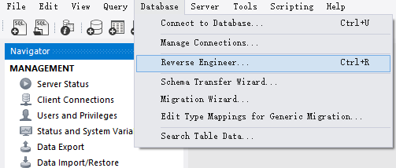

如下是 sql_store 的 ER Digram(Entity RelationShip)

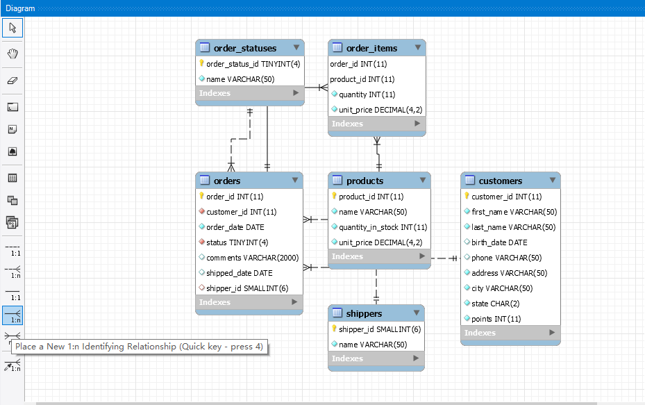

Identifying relationships exist when the primary key of the parent entity is included in the primary key of the child entity. On the other hand, a non-identifying relationship exists when the primary key of the parent entity is included in the child entity but not as part of the child entity’s primary key.

当父实体的主键包含在子实体的主键中时，存在标识关系。另一方面，如果父实体的主键包含在子实体中，但不作为子实体的主键的一部分，则存在非标识关系。

### Notes

**mysql 除了 select 以外的子句都是可选的**

```sql
select 1, 2;
```

**mysql 栏位值不区分大小写**

```sql
select * from customers where state = 'va';
```

| customer_id | first_name | last_name  | birth_date | phone        | address                | city    | state | points |
| ----------- | ---------- | ---------- | ---------- | ------------ | ---------------------- | ------- | ----- | ------ |
| 2           | Ines       | Brushfield | 1986-04-13 | 804-427-9456 | 14187 Commercial Trail | Hampton | VA    | 947    |

**mysql 默认日期格式是 `%Y-%m-%d`

```mysql
select * from customers where birth_date > '1990-01-01';
```

**varchar 和 char**

name varchar(50) 如果 name 只有 5 个字符那么 varchar(50) 只使用 5 个字符，不会浪费空间；

name char(50) 如果 name 只有 5 个字符会插入 45 个空白字符填满到 50 个字符。

**default**

default 表示让 mysql 生成这个值，可以用于主键自增栏位和有默认值的栏位

```mysql
insert into customers values(default, 'babb', 'chen', default, default, '18896763538', 'henan', 'xy', default);
update customers set points = default where customer_id = 1;
```


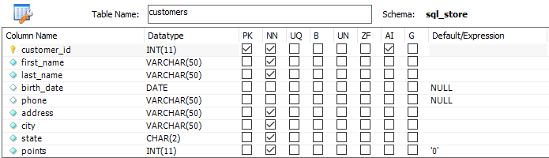

**insert multi row**

```sql
insert into shippers (name)
values ('Shipper1'),
       ('Shipper2'),
       ('Shipper3');
```

**insert multi table**

```sql
insert into orders (customer_id, order_date, status) values (1, '2010-02-02', 1);

insert into order_items
values (last_insert_id(), 1, 1, 2.95), -- last_insert_id() 插入 orders 中的 order_id
       (last_insert_id(), 2, 1, 3.95);
```

### Regexp

查询 last_name 包含 field|mac|rose 的数据

```sql
select * from customers where last_name regexp 'field|mac|rose';
```

查询 last_name 包含 ge|ie|me 的数据

```sql
select * from customers where last_name regexp '[gim]e';
```

查询 last_name 以 b 开头且包含 ge|ie|me 的数据

```sql
select * from customers where last_name regexp '^b.*?[gim]e';
```

### Limit

跳过前 6 条记录，然后获取 3 条记录

```sql
select * from customers limit 6, 3;
```

### Order

默认状态下 group by 会按照 group by 子句中指定的列排序会影响性能, 所以查询或 view 中应尽量避免使用 group by

```sql
select client_id, sum(invoice_total) as total_sales 
  from invoices
 group by client_id;
```

| client_id | total_sales |
| --------- | ----------- |
| 1         | 802.89      |
| 2         | 101.79      |
| 3         | 705.90      |
| 5         | 980.02      |

### Aggregate Function

```sql
use sql_invoicing;
select * from sql_invoicing.invoices;
```

| invoice_id | number      | client_id | invoice_total | payment_total | invoice_date | due_date   | payment_date |
| ---------- | ----------- | --------- | ------------- | ------------- | ------------ | ---------- | ------------ |
| 1          | 91-953-3396 | 2         | 101.79        | 0.00          | 2019-03-09   | 2019-03-29 |              |
| 2          | 03-898-6735 | 5         | 175.32        | 8.18          | 2019-06-11   | 2019-07-01 | 2019-02-12   |
| 3          | 20-228-0335 | 5         | 147.99        | 0.00          | 2019-07-31   | 2019-08-20 |              |
| 4          | 56-934-0748 | 3         | 152.21        | 0.00          | 2019-03-08   | 2019-03-28 |              |
| 5          | 87-052-3121 | 5         | 169.36        | 0.00          | 2019-07-18   | 2019-08-07 |              |
| 6          | 75-587-6626 | 1         | 157.78        | 74.55         | 2019-01-29   | 2019-02-18 | 2019-01-03   |
| 7          | 68-093-9863 | 3         | 133.87        | 0.00          | 2019-09-04   | 2019-09-24 |              |
| 8          | 78-145-1093 | 1         | 189.12        | 0.00          | 2019-05-20   | 2019-06-09 |              |
| 9          | 77-593-0081 | 5         | 172.17        | 0.00          | 2019-07-09   | 2019-07-29 |              |
| 10         | 48-266-1517 | 1         | 159.50        | 0.00          | 2019-06-30   | 2019-07-20 |              |
| 11         | 20-848-0181 | 3         | 126.15        | 0.03          | 2019-01-07   | 2019-01-27 | 2019-01-11   |
| 13         | 41-666-1035 | 5         | 135.01        | 87.44         | 2019-06-25   | 2019-07-15 | 2019-01-26   |
| 15         | 55-105-9605 | 3         | 167.29        | 80.31         | 2019-11-25   | 2019-12-15 | 2019-01-15   |
| 16         | 10-451-8824 | 1         | 162.02        | 0.00          | 2019-03-30   | 2019-04-19 |              |
| 17         | 33-615-4694 | 3         | 126.38        | 68.10         | 2019-07-30   | 2019-08-19 | 2019-01-15   |
| 18         | 52-269-9803 | 5         | 180.17        | 42.77         | 2019-05-23   | 2019-06-12 | 2019-01-08   |
| 19         | 83-559-4105 | 1         | 134.47        | 0.00          | 2019-11-23   | 2019-12-13 |              |

#### max, avg, sum, count

max, min, avg, sum, count 等聚合函数会忽略 null 的记录, 聚合栏位前添加 distinct 可以排除重复记录

```sql
select 
	max(invoice_total) as highest,
    min(invoice_total) as lowest,
    avg(invoice_total) as average,
    sum(invoice_total) as total,
    count(invoice_total) as number_of_invoices,
	count(payment_date) as number_of_payments,
    count(*) as total_records,
    count(client_id) as number_of_clients,
    count(distinct client_id) as number_of_distinct_clients
from invoices;
```

| highest | lowest | average    | total   | number_of_invoices | number_of_payments | total_records | number_of_clients | number_of_distinct_clients |
| ------- | ------ | ---------- | ------- | ------------------ | ------------------ | ------------- | ----------------- | -------------------------- |
| 189.12  | 101.79 | 152.388235 | 2590.60 | 17                 | 7                  | 17            | 17                | 4                          |

#### rollup

根据 group by 栏位分层归纳汇总 

```sql
select client_id, 
       sum(invoice_total) as total_sales 
  from invoices 
 group by client_id with rollup;
```

| client_id | total_sales |
| --------- | ----------- |
| 1         | 802.89      |
| 2         | 101.79      |
| 3         | 705.90      |
| 5         | 980.02      |
|           | 2590.60     |

```sql
select state, 
	   city,
       sum(invoice_total) as total_sales 
  from invoices i
  join clients using (client_id)    --using (client_id) <=> invoices.client_id = clients.client_id
 group by state, city with rollup;
```

| state | city          | total_sales |
| ----- | ------------- | ----------- |
| CA    | San Francisco | 705.90      |
| CA    |               | 705.90      |
| NY    | Syracuse      | 802.89      |
| NY    |               | 802.89      |
| OR    | Portland      | 980.02      |
| OR    |               | 980.02      |
| WV    | Huntington    | 101.79      |
| WV    |               | 101.79      |
|       |               | 2590.60     |

### Common Use Function

#### numeric

rand() 返回 0 - 1 之间的随机数

```sql
SELECT 
    ROUND(5.73),
    ROUND(5.73, 1),
    TRUNCATE(5.73, 1),
    CEILING(5.73),
    FLOOR(5.73),
    RAND();
```

| round(5.73) | round(5.73, 1) | truncate(5.73, 1) | ceiling(5.73) | floor(5.73) | rand()              |
| ----------- | -------------- | ----------------- | ------------- | ----------- | ------------------- |
| 6           | 5.7            | 5.7               | 6             | 5           | 0.27181225481611887 |

#### string

```sql
select upper('sky') a, lower('Sky') b,
       ltrim(' sky') c, rtrim('sky ') d, trim(' sky ') e,
       left('babb chen', 4) f, right('babb chen', 4) g, -- left, right 返回前,后几个字符
       substring('babb chen', 6, 4) h,
       locate('c', 'babb chen') i, locate('chen', 'babb chen') j,  -- locate 返回字符或字符串索引
       replace('babb chen', 'babb', 'bob') k,
       concat('babb', 'chen') l;
```

| a    | b    | c    | d    | e    | f    | g    | h    | i    | j    | k        | l        |
| ---- | ---- | ---- | ---- | ---- | ---- | ---- | ---- | ---- | ---- | -------- | -------- |
| SKY  | sky  | sky  | sky  | sky  | babb | chen | chen | 6    | 6    | bob chen | babbchen |

#### date

```sql
select now(), curdate(), curtime();
```

| now()               | curdate()  | curtime() |
| ------------------- | ---------- | --------- |
| 2020-09-12 16:02:08 | 2020-09-12 | 16:02:08  |

```sql
select year(now()), month(now()), day(now()), hour(now()), minute(now()), second(now());
```

| year(now()) | month(now()) | day(now()) | hour(now()) | minute(now()) | second(now()) |
| ----------- | ------------ | ---------- | ----------- | ------------- | ------------- |
| 2020        | 9            | 12         | 16          | 4             | 53            |

extract 也可b以用来提取日期的一部分，并且 extract 是 sql 标准的一部分

```sql
select extract(year from now()) as year, 
	   extract(month from now()) as month, 
	   extract(day from now()) as day, 
       extract(hour from now()) as hour, 
       extract(minute from now()) as minute, 
       extract(second from now()) as second; 
```

| year | month | day  | hour | minute | second |
| ---- | ----- | ---- | ---- | ------ | ------ |
| 2020 | 9     | 12   | 16   | 9      | 27     |

```sql
select date_format(now(), '%Y-%m-%d %H:%i %p') as date;

date
-----
2020-09-12 16:14 PM
```

日期的相关计算

msyql 在执行查询语句时，会先对 SELECT 子句里的列表进行扫描，并对列进行计算, 所以 (select datediff(tomorrow, yesterday)) as datediff 可以正确运行

```sql
select date_add(now(), interval 1 day) as tomorrow,
       date_sub(now(), interval 1 day) as yesterday,
       (select datediff(tomorrow, yesterday)) as datediff, 
        time_to_sec('09:00') - time_to_sec('09:02') as secdiff;
```

| tomorrow            | yesterday           | datediff | secdiff |
| ------------------- | ------------------- | -------- | ------- |
| 2020-09-13 16:35:38 | 2020-09-11 16:35:38 | 2        | -120    |

#### null

coalesce 返回多个值中的第一个非 null 值

```sql
select ifnull(null, 'unknown') column_a, ifnull('a', 'unknown') column_b,
       coalesce(null, null, null, 'b') column_c, coalesce(null, 'a', 'b') column_d;

column_a	column_b	column_c	column_d
-------     --------    -------     --------
unknown	    a	        b	        a
```

#### case

```sql
select order_id, 
       if(year(order_date) = year(now()),
          'Active',
          'Archived') as category 
  from orders;
  
select order_id, 
       case 
		  when year(order_date) = year(now()) then 'Active'
          when year(order_date) = year(now()) - 1 then 'Last Year'
          when year(order_date) < year(now()) - 1 then 'Archived'
          else 'Future'
	   end as category
  from orders;
```

### View

updateable view

可更新视图是指不包含 distinct，aggregate function(min，max， sum， min， max)，group by， having，union 的视图，可以执行 update，insert，delete 操作。通过 view 更新数据可能导致更新后的数据从 view 中删除，可以添加 `with check option` 子句防止行消失

```sql
create or replace view invices_with_balance as
select invoice_id,
       number,
       client_id,
       invoice_total,
       payment_total,
       invoice_total - payment_total as balance,
       invoice_date,
       due_date,
       payment_date
  from invoices
 where (invoice_total - payment_total) > 0
  with check option;
  
select * from invices_with_balance;
```

| invoice_id | number      | client_id | invoice_total | payment_total | balance | invoice_date | due_date   | payment_date |
| ---------- | ----------- | --------- | ------------- | ------------- | ------- | ------------ | ---------- | ------------ |
| 1          | 91-953-3396 | 2         | 101.79        | 0.00          | 101.79  | 2019-03-09   | 2019-03-29 |              |
| 2          | 03-898-6735 | 5         | 175.32        | 8.18          | 167.14  | 2019-06-11   | 2019-07-01 | 2019-02-12   |
| ...        |             |           |               |               |         |              |            |              |

执行如下 sql 会 产生  Error Code: 1369. CHECK OPTION failed 'sql_invoicing.invices_with_balance'， 因为更新之后 invoice_total - payment_total = 0 ，不满足大于 0 的条件会导致 invoice_id = 1 的数据从 view 中移除。

```sql
update invices_with_balance
   set payment_total = invoice_total
 where invoice_id = 1;
```

### Procedure

```sql
delimiter $$

drop procedure if exists get_unpaid_invoices_for_client;

create  procedure get_unpaid_invoices_for_client(
	client_id int,
    out invoices_count int,
    out invoices_total decimal
)
begin
	select count(*), sum(invoice_total)
      into invoices_count, invoices_total
      from invoices i 
	 where i.client_id = client_id
       and i.payment_total = 0;
end $$

delimiter ;

set @invoices_count = 0;
set @invoices_total = 0;
call get_unpaid_invoices_for_client(5, @invoices_count,  @invoices_total);
select @invoices_count,  @invoices_total;

@invoices_count	 @invoices_total
---------------  ----------------
3	             490
```

### Function

```sql
delimiter $$

drop function if exists get_risk_factor_for_client;

create function get_risk_factor_for_client(client_id int)
returns integer
-- deterministic -- 确定性，给定函数参数一组值永远返回相同的值
-- modifies sql data -- 修改 sql 数据
reads sql data -- 读取 sql 数据
begin
	declare risk_factor decimal(9, 2) default 0;
    declare invoices_total decimal(9, 2);
    declare invoices_count int;
    
    select count(*), sum(invoice_total)
      into invoices_count, invoices_total
      from invoices
	 where client_id = client_id;
      
	set risk_factor = invoices_total / invoices_count * 5;
    
    return ifnull(risk_factor, 0);
    
end $$

delimiter ;


select 
   client_id,
   name,
   get_risk_factor_for_client(client_id) as risk_factor
 from clients;
```

### Event

开启 event_scheduler

```sql
show variables like 'event%';
set global event_scheduler = on;
```

定义 event

```sql
delimiter $$

drop event if exists yearly_delete_stale_audit_rows;

create event yearly_delete_stale_audit_rows
on schedule
    -- at '2019-05-01'
	every 1 year starts '2019-01-01' ends '2029-01-01'
do 
begin
	delete from payment_audit
    where action_date < now() - interval 1 year;  -- <=> datesub(now(), interval 1 year)
end $$

delimiter ;
```

查看 event

```sql
show events;
show events like 'yearly%';
```

| Db            | Name                           | Definer        | Time zone | Type      | Execute at | Interval value | Interval field | Starts              | Ends                | Status  | Originator | character_set_client | collation_connection | Database Collation |
| ------------- | ------------------------------ | -------------- | --------- | --------- | ---------- | -------------- | -------------- | ------------------- | ------------------- | ------- | ---------- | -------------------- | -------------------- | ------------------ |
| sql_invoicing | yearly_delete_stale_audit_rows | root@localhost | SYSTEM    | RECURRING |            | 1              | YEAR           | 2019-01-01 00:00:00 | 2029-01-01 00:00:00 | ENABLED | 1          | utf8mb4              | utf8mb4_0900_ai_ci   | utf8_general_ci    |

启用禁用 event

```sql
alter event yearly_delete_stale_audit_rows disable;
alter event yearly_delete_stale_audit_rows enable;
```

### Transactions

**autocommit**

每执行一条语句，MySQL 会将该语句放在事务中，如果没有错误，会自动提交

```sql
show variables like 'autocommit';

Variable_name	Value
------------    -----
autocommit	    ON
```

**创建 transaction**

```sql
start transaction; -- 1

insert into orders(customer_id, order_date, status)
values (1, '2020-01-01', 1); -- 2

insert into order_items
values (last_insert_id(), 1, 1, 1); -- 3

commit;
```

模拟执行到 insert into  order_items 时断开 server 连接

Workbench 菜单 Query -> Excute Current Statement (Ctrl + Enter)  执行 1， 2， 关闭连接，重新连接查询 orders 数据没有被插入

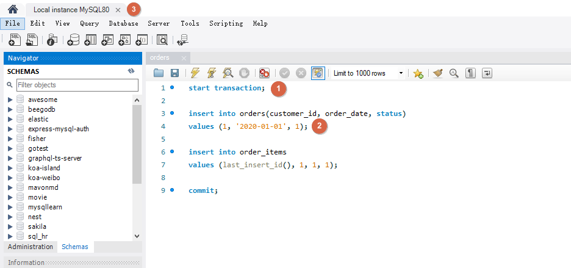

**concurrency and locking**

```sql
select * from customers where customer_id = 1;
```

| customer_id | first_name | last_name  | birth_date | phone        | address        | city    | state | points |
| ----------- | ---------- | ---------- | ---------- | ------------ | -------------- | ------- | ----- | ------ |
| 1           | Babara     | MacCaffrey | 1986-03-28 | 781-932-9754 | 0 Sage Terrace | Waltham | MA    | 2303   |

如下在第一个连接中将客户的积分加 10 但是没有提交。在第二个连接中同样执行将客户的积分加 10 的操作，此时会等待第一个连接操作的 commit 或 rollback

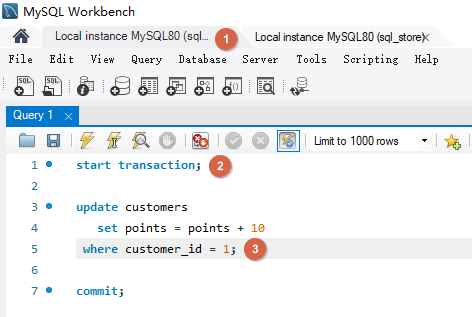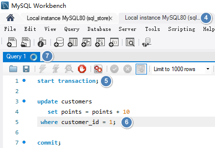

将第一个操作 commit 之后，第二个也进行 commit, 如下客户 customer_id 为 1 的积分会增加 20。

| customer_id | first_name | last_name  | birth_date | phone        | address        | city    | state | points |
| ----------- | ---------- | ---------- | ---------- | ------------ | -------------- | ------- | ----- | ------ |
| 1           | Babara     | MacCaffrey | 1986-03-28 | 781-932-9754 | 0 Sage Terrace | Waltham | MA    | 2323   |

**Lost Updates**

当两个事务尝试更新相同的数据并且没有上锁时，就会发生这种情况，较晚提交的事务会覆盖较早事务做的更改。

如下事务  A 和事务 B 对同一数据修改，如果事务 B 更晚提交就会覆盖事务 A 的提交，事务 A 的更新就会丢失。解决方法是使用锁。默认情况下 MySQL 会使用锁定机制。防止两个事务同时更新同样的数据。它们会一个一个按照顺序执行, 这样连个更新都能完成。


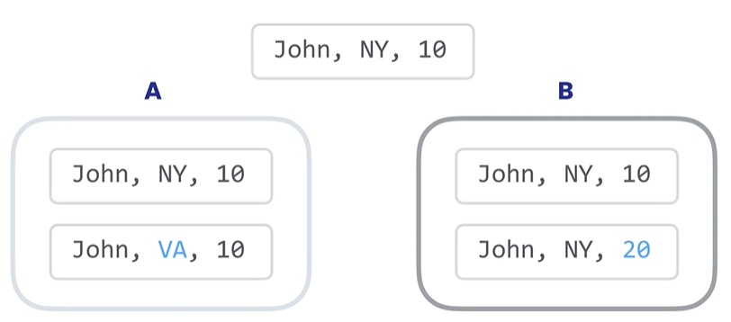

**Dirty Reads**

脏读就是一个事务读取了尚未被提交的数据。事务 B 读取了事务 A 尚未提交的数据，并基于数据做了决策（每点积分给予 1% 折扣），但是之后事务 A 又进行了回滚，实际客人没有 20 积分, 事务 B 却给了 20 % 折扣。解决此问题需要为事务建立隔离级别 READ COMMITTED，这样事务就只能读取已经提交的数据。

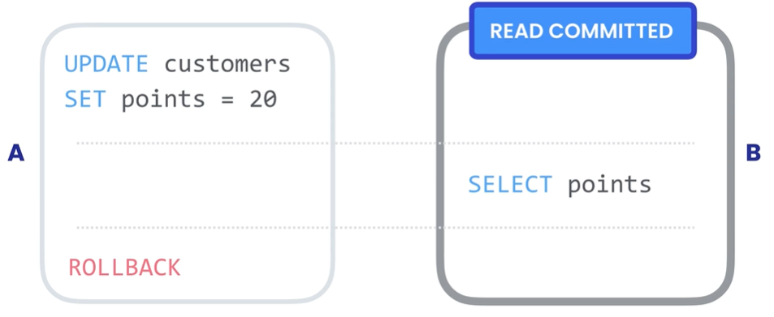

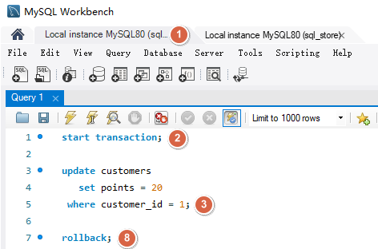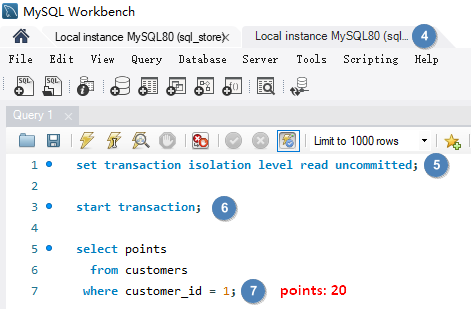

使用隔离级别 READ COMMITTED `set transaction isolation level read uncommitted;`

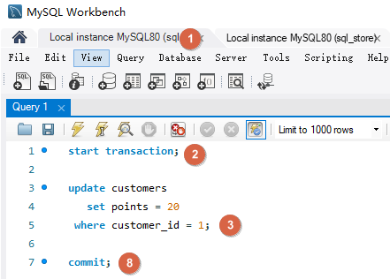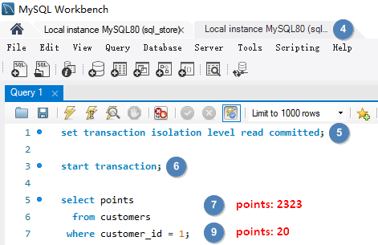

**Non-repeating Reads**

不可重复读就是在事务过程中读取了某个数据两次，得到了不同结果。解决此问题需要为事务建立隔离级别 REPEATABLE READ, 将它与其他事务隔离，确保数据更改对事务不可见，读取的数据是可重复和一致的，即使其它事务更改了数据，我们会看到首次读取就创建的快照。

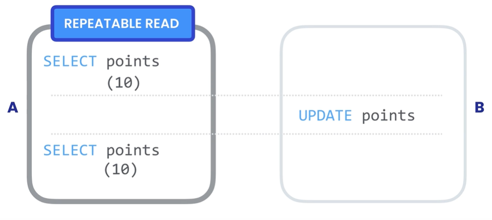

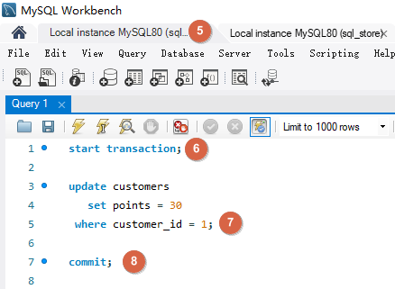 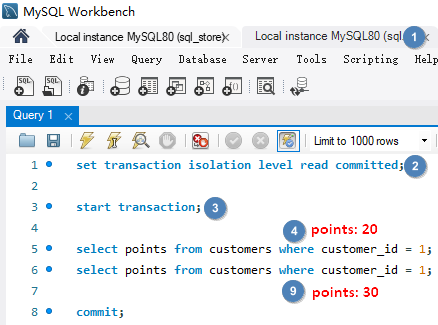 

使用隔离级别 REPEATABLE READ `set transaction isolation level repeatable read`

 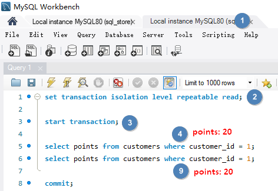

**Phantom Reads**

幻读是指在事务执行查询之后进行了添加，更新或删除，实际读取的是添加，更新或删除之前的数据，事务执行完成之后仍然有符合条件的数据，这种突然出现的数据就像幽灵👻一样。解决此问题需要为事务建立隔离级别 SERIALIZABLE, 它能保证当有别的事务在更新数据时，我们的事务能够知晓变动，如果有其它事务修改了可能影响查询结果的数据，我们的事务必须等待它们完成。这是事务的最高隔离级别，保证最大的确定性，但是会影响性能。

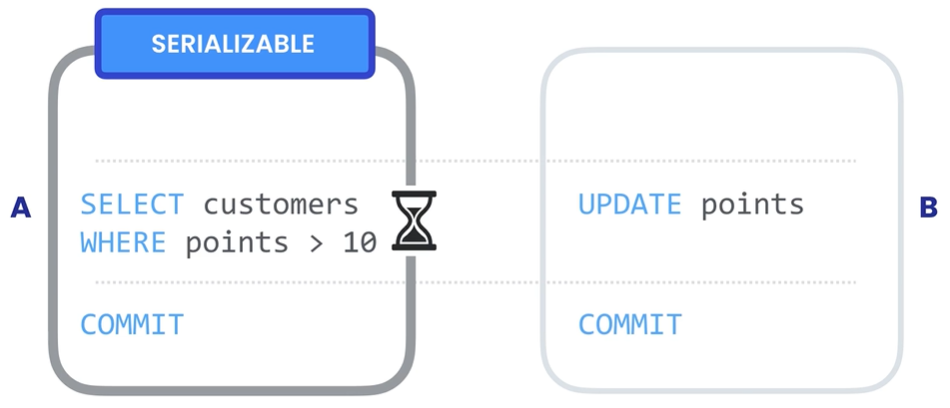


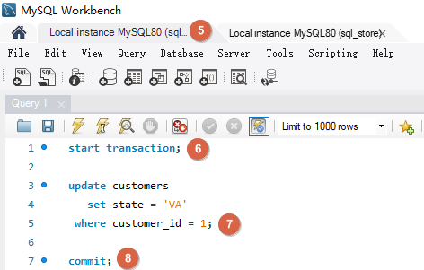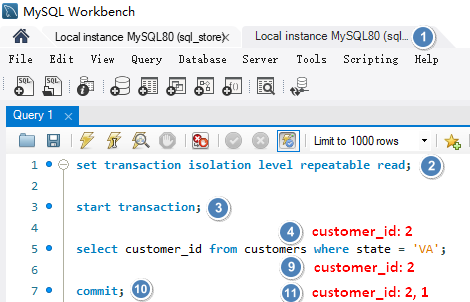

使用隔离级别 SERIALIZABLE `set transaction isolation level serializable`

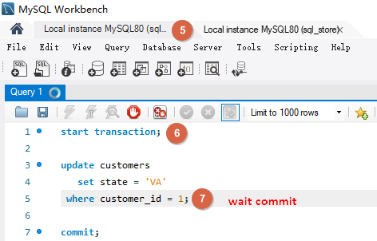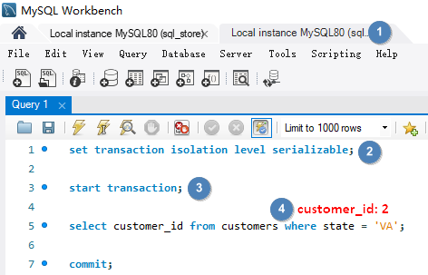


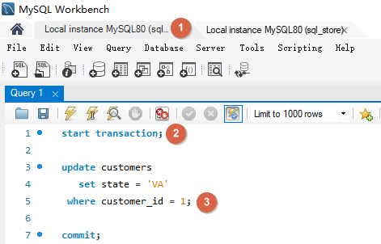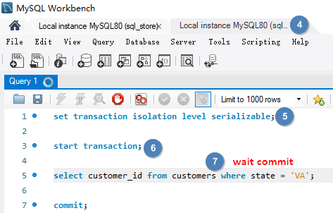

更高的隔离级别意味着更低的并发问题，但同时也意味着更多的锁和过呢更低的并发性能。

MySQL 的默认隔离级别时 REPEATABLE READ

```sql
show variables like 'transaction_isolation';

Variable_name            Value
--------------           ------------
transaction_isolation    REPEATABLE-READ

set session transaction isolation level serializable;
set global transaction isolation level serializable;
```


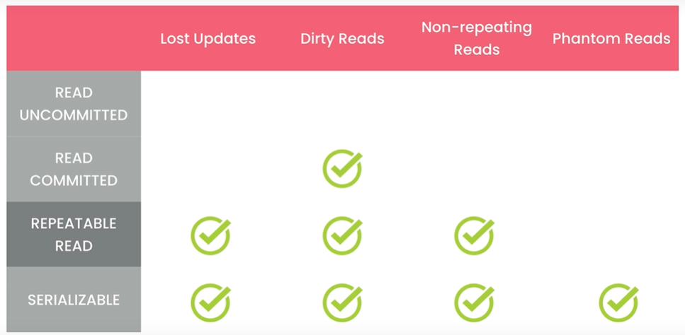

### Datatype

#### json

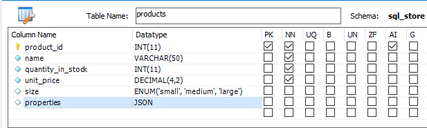

json raw string

```sql
update products set properties  = '
{
	"dimensions": [1, 2, 3],
    "weight": 10,
    "manufactor": { "name": "sony" }
}
'
where product_id = 1;

select * 
  from products
 where product_id = 1;
```

| product_id | name              | quantity_in_stock | unit_price | size  | properties                                                   |
| :--------- | ----------------- | ----------------- | ---------- | ----- | ------------------------------------------------------------ |
| 1          | Foam Dinner Plate | 70                | 1.21       | small | {"weight": 10, "dimensions": [1, 2, 3], "manufactor": {"name": "sony"}} |

json_object, json_array

```sql
update products set properties  =  json_object(
	'weight', 10,
    'dimensions', json_array(1, 2, 3),
    'manufactor', json_object('name', 'sony')
)
where product_id = 1;
```

json_extract

```sql
select json_extract(properties, '$.weight') as extract_weight,
       properties -> '$.weight' as weight,
       properties -> '$.dimensions[0]' as x, 
       properties -> '$.dimensions[1]' as y,
       properties -> '$.dimensions[2]' as z,
       properties -> '$.manufactor.name' as manufactor_in_quotes,
       properties ->> '$.manufactor.name' as manufactor
  from products
 where properties ->> '$.manufactor.name' = 'sony';
```

| extract_weight | weight | x    | y    | z    | manufactor_in_quotes | manufactor |
| -------------- | ------ | ---- | ---- | ---- | -------------------- | ---------- |
| 10             | 10     | 1    | 2    | 3    | "sony"               | sony       |

json_set

```sql
update products
   set properties = json_set(
		properties,
		'$.weight', 20,
		'$.age', 10
	)
 where product_id = 1;
```

json_remove

```sql
update products
   set properties = json_remove(
		properties,
		'$.age'
	)
 where product_id = 1;
```

### Data Modelling

#### conceptual model

Represents the entities and their relationships. Generally use ER(Entity Relationship) Digram or UML


#### logic model

Logic model is independent of database technologics. It's just an abstract data model that clearly shows our entities. But there's something more detailed than the conceptual model.

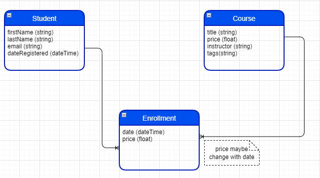

#### physic model

File -> New Model

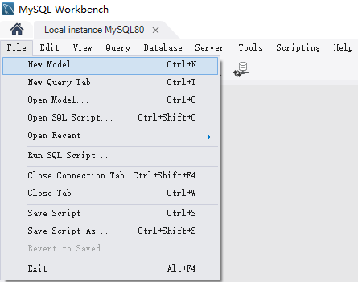

Add Diagram

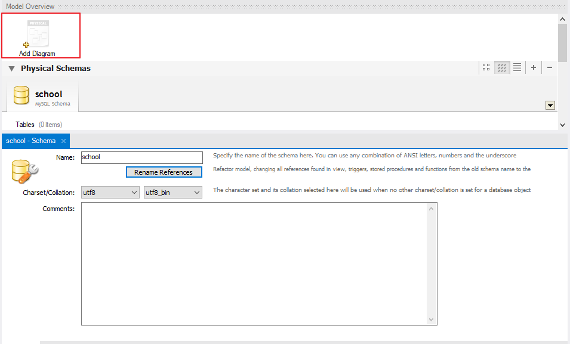

Add Tables and Columns

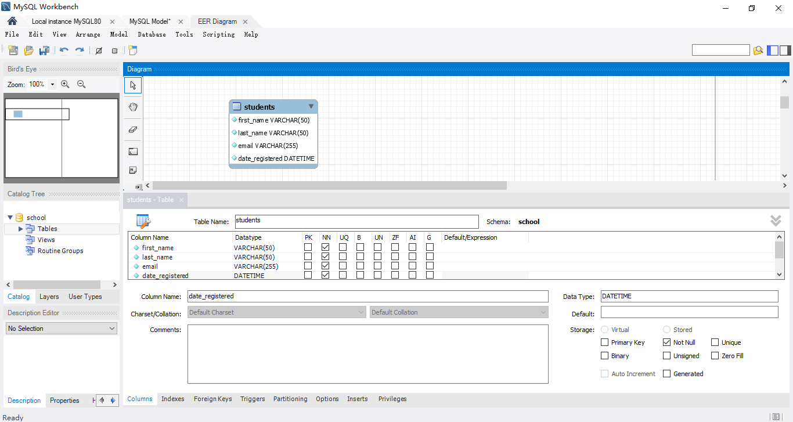

Add Primary Key, Foreign Key and Relationship

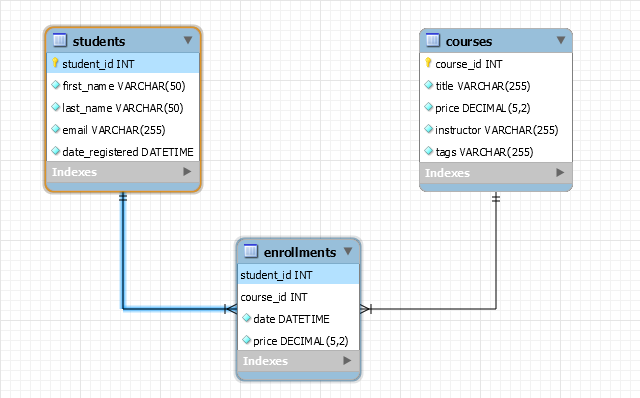

 Setting Foreign Key，CASCADE on update, NO ACTION(RESTRICT) on delete (reject delete)

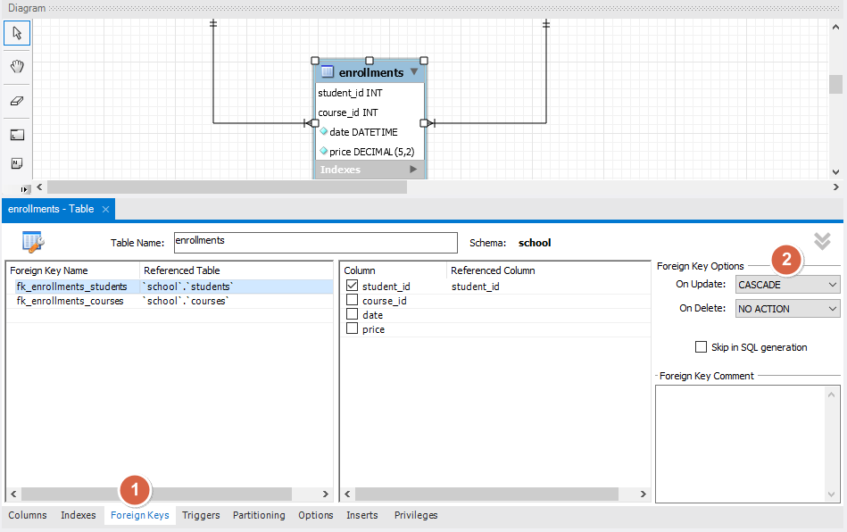