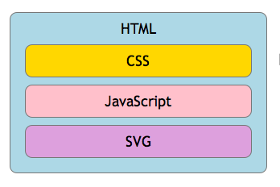
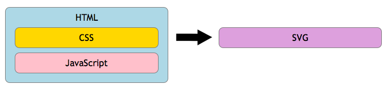
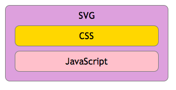
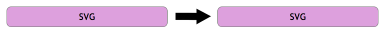
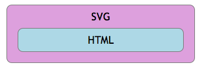

> 转载： [SVG deployment · WebPlatform Docs](https://webplatform.github.io/docs/svg/tutorials/smarter_svg_deploy/)

This brief guide shows different ways to deploy SVG, either within HTML or as standalone files, with various options to reference CSS and JavaScript.

Until recently, SVG was fairly difficult to incorporate with other web content, and there are still many challenges. The HTML5 standard provides a way to insert _inline_ regions of SVG into HTML files.



It translates to this basic HTML markup structure, where CSS and JavaScript may affect both HTML and SVG content:

```html
<!DOCTYPE html>
<html>
  <head>
    <link href="styles/html_and_svg.css" rel="stylesheet" />
  </head>
  <body>
    <script defer type="text/javascript" src="js/html_and_svg.js"></script>
    <svg>
      <!-- define graphics here -->
    </svg>
  </body>
</html>
```

There are also other ways to do it. You can reference external SVG files, and render them interactively within the HTML using either [**iframe**](https://webplatform.github.io/docs/html/elements/iframe), [**embed**](https://webplatform.github.io/html/elements/embed), or [**object**](https://webplatform.github.io/html/elements/object) tags:

```html
<!DOCTYPE html>
<html>
  <head>
    <link href="styles/html_and_svg.css" rel="stylesheet" />
  </head>
  <body>
    <script defer type="text/javascript" src="js/html_and_svg.js"></script>
    <iframe src=’graphics.svg’></iframe>
    <embed src=’graphics.svg’></embed>
    <object data=’graphics.svg’ type=’image/svg+xml’></object>
  </body>
</html>
```

It’s also common to reference external SVG files to present static SVG graphics via CSS. The example below shows how you might place a right-aligned navigation arrow within a mobile interface, rendering as crisply as possible on high-resolution handsets:



```css
a[href] {
  background-image: url(img/nav_arrow.svg);
  background-position: center 0 right 10px;
  background-size: contain;
  display: block;
  min-height: 2em;
  border-radius: 0.5em;
  padding: 0.5em;
}
```

As you will see, you can also use URL anchors to reference individual component graphics that are collected within an SVG file. This assigns a custom bullet shape:

```css
ul > li {
  list-style-image: url(img/components.svg#bullet);
}
```

Less common in practice, SVG files can be viewed as standalone files, perhaps as the target of a navigation. Any SVG file or [**svg**](https://webplatform.github.io/docs/svg/elements/svg) tag region can reference its own set of CSS and JavaScript, which only applies within the SVG:



This example shows how to embed or reference either CSS or JavaScript from within an SVG file:

```html
<?xml version="1.0" standalone="no"?>
<!-- reference CSS here: -->
<?xml-stylesheet href="css/styles.css" type="text/css"?>
<!DOCTYPE svg PUBLIC "-//W3C//DTD SVG 1.1//EN" "http://www.w3.org/Graphics/SVG/1.1/DTD/svg11.dtd">
<svg
  xmlns="http://www.w3.org/2000/svg"
  version="1.1"
  width="700px"
  height="500px"
  viewBox="0 0 1000 500"
>
  <defs>
    <style type="text/css">
      <![]]>
    </style>
  </defs>
  <script type="application/ecmascript">
    <![]]>
  </script>
  <!-- or reference JavaScript here: -->
  <script type="application/ecmascript" xlink:href="js/app.js"></script>
  <!-- define graphics here -->
</svg>
```

From within an SVG, you can also reference components from other SVG files. The example that follows shows how you might import a graphic of a cat from another SVG file, then style it _calico_ based on referenced CSS:



```html
<?xml version="1.0" encoding="UTF-8" standalone="no"?>
<?xml-stylesheet href="css/svg_styles.css" type="text/css"?>
<svg
  xmlns="http://www.w3.org/2000/svg"
  xmlns:xlink="http://www.w3.org/1999/xlink"
  width="1000"
  height="1000"
>
  <use xlink:href="components.svg#cat" class="calico" />
</svg>
```

You may also be able to use the [**foreignObject**](https://webplatform.github.io/w/index.php?title=svg/elements/foreignObject&action=edit&redlink=1) tag to render live HTML content within an SVG graphic environment. This example uses the [**switch**](https://webplatform.github.io/docs/svg/elements/switch) tag to test whether the feature works, as recognized by the tag’s [**requiredExtensions**](https://webplatform.github.io/w/index.php?title=svg/attributes/requiredExtensions&action=edit&redlink=1) attribute. If not, it uses fallback [**text**](https://webplatform.github.io/docs/svg/elements/text):



```html
<?xml version="1.0" standalone="yes"?>
<svg width="4in" height="3in" version="1.1" xmlns="http://www.w3.org/2000/svg">
  <desc>
    use 'switch' to test if foreignObject works, otherwise render fallback
    'text' content
  </desc>
  <switch>
    <foreignObject
      width="100"
      height="50"
      requiredExtensions="http://example.com/SVGExtensions/EmbeddedXHTML"
    >
      <!-- XHTML content goes here -->
      <body xmlns="http://www.w3.org/1999/xhtml">
        <p>Here is a paragraph that requires word wrap</p>
        <iframe src="external.html">...or an iframe...</iframe>
      </body>
    </foreignObject>
    <text font-size="10" font-family="Verdana">
      <tspan x="10" y="10">Here is a paragraph that</tspan>
      <tspan x="10" y="20">requires word wrap.</tspan>
    </text>
  </switch>
</svg>
```

**Comments**

 SVG 文件也可以 `data URI ` 的方式内嵌到样式表中，甚至不需要用 base64 或 URLencode 来对其编码 。另外需要把一句 CSS 代码打断为多行，只需要用反斜杠 `\ ` 来转义每行末尾的换行就可以了。

```css
body {
  background: #eee url('data:image/svg+xml,\
      <svg xmlns="http://www.w3.org/2000/svg" \
      width="100" height="100" \
      fill-opacity=".25">\
      <rect x="50" width="50" height="50" /> \
      <rect y="50" width="50" height="50" /> \
      </svg>');
  background-size: 30px 30px;
}
```


