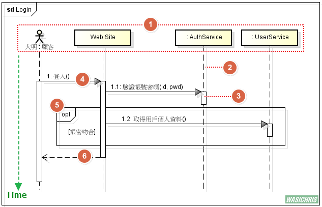
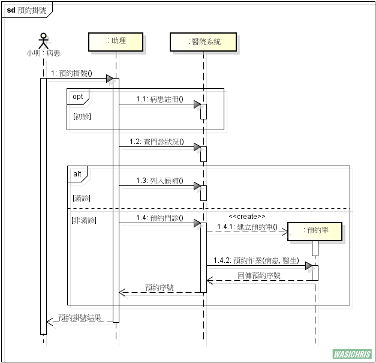
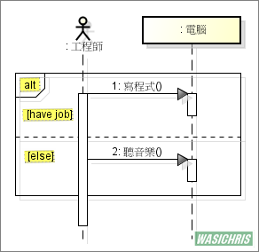
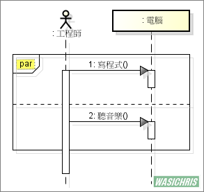
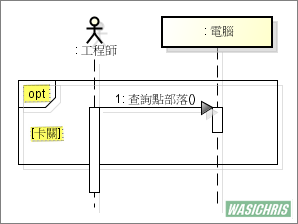
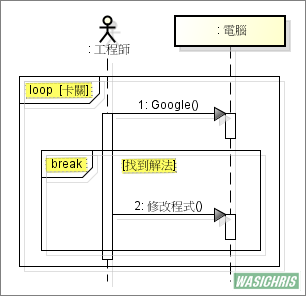
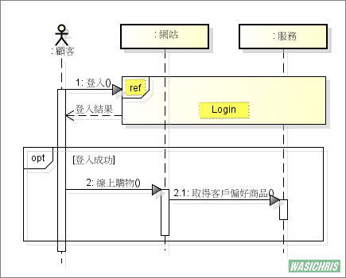
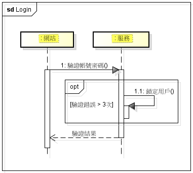

> 转载：[UML 使用循序圖傳達各物件互動及時序關係 | 搞搞就懂 - 點部落](https://dotblogs.com.tw/wasichris/2016/03/17/232341)

使用 UML 循序圖(Sequence Diagram)來傳達物件互動及時序關係

## 前言

在程式開發的過程中，難免需要跟 IT 客戶溝通一些較為細節的流程設計，此時如果空口說白話是很難以了解彼此的想法是否在同一平面上，因此需要一些輔助圖來協助知識的傳遞；另外，在 SD 設計告一段落進入開發時，有些比較複雜的流程其實是很難用文字快速傳達給開發人員了解，此時圖的使用就會扮演很重要的角色。說了這麼多就是要來說說循序圖(Sequence Diagram)，以及要如何繪製一張大家都明瞭的圖。

## 循序圖說明

使用循序圖就是要清楚地傳遞各物件在時間軸上的互動情境，因此會透過以下這張圖來標示參與的所有物件有哪些，以及在各時間點彼此互動的情況，幫助閱讀的人可以快速及清晰地掌握細節。以下分別就各組成說明。

1. **參與者(Participants)**：參與互動的物件，內文格式為 `名稱 : 類別名稱`
2. **生命線(Lifeline)**：表示互動發生的時間軸
3. **執行發起(Execution Occurrence)**：描繪生命線內某個執行單元
4. **訊息(Message)**：呼叫目標物件的實際作為
5. **合併片段(Combined Fragment)**：描述不同情況下可能發生的變化(opt=option)
6. **回傳訊息(Reply Message)**：非必須符號，因為執行發起的結束點就隱含此意了

## 範例

光說不練是假把戲，所以筆者使用比較貼近生活的預約掛號情境來實際演練一下。我想每個人都有預約掛號的經驗，最直接就是跟助理約時間，而助理通常都會問病患是否初診，如果初診就會要求病患填寫基本資料，並且透過醫院系統註冊新病患資料。

接著就會詢問要掛哪位醫生的門診，所以就需要透過醫院系統來查詢門診是否額滿，此時就只會有兩種情況產生了，因此透過 alt 片段來區隔不同情況下所發生的變化。當滿診的情況下，助理會將病患列入候補清單，若有其他病患退掛會主動通知(此流程於此不詳述)；當該醫生門診尚未額滿時，助理會透過醫院系統建立一張預約單，並且執行預約作業(輸入病患及醫生門診資訊)，完成後會取得一組預約序號。最後整個流程結束後為由助理回應病患此次預約掛號的處理結果。

說了這麼多我們來試想一下，如果今天是直接口述此流程，我想可能很難讓一個沒有經歷過此生活體驗的人快速掌握各別物件的互動及時序關係吧? 因此若是有以下循序圖來加以輔助，搞不好直接看圖就可以掌握個 8 成細節流程，而剩下的只需要再口述引導一次就搞定了，是不是很節省彼此寶貴的時間呢?

## 片段型態

在繪製循序圖時會經常使用到片段，且會因應各種情境存在許多種型態，以下整理比較常見的片段進行說明。

alt (Alternatives) : 任何情況只有一個序列發生，是互斥的條件。

ex. 工程師有工作就用電腦寫程式，不然就用電腦聽音樂

par (Parallel) : 平行處理，片段中的事件可以交錯執行。

ex. 工程師用電腦邊寫程式邊聽音樂，先後順序是可以交錯

opt (Option) : 選擇項，不一定會發生的序列(要符合條件)。

ex. 工程師卡關的時候會查詢點部落求解答

loop : 重複片段。可以設立重複的條件，若未設定最小級最大重複次數，預設表示無限制。

ex. 工程師只要卡關，直接無窮盡地使用電腦進行 Google 搜尋，直到找到解決方案才會罷休。

ref (Reference) : 表示參考另一個互動循序圖，屬於 Interaction Use 範疇。

ex. 顧客在使用網站時都需要登入，而登入細節於此不贅述(直接參考到登入循序圖即可)。

以下是被參考到的 Login 互動循序圖，所有登入細節統一由此進行細節說明。

## 參考資訊

http://www.uml-diagrams.org/sequence-diagrams-combined-fragment.html
