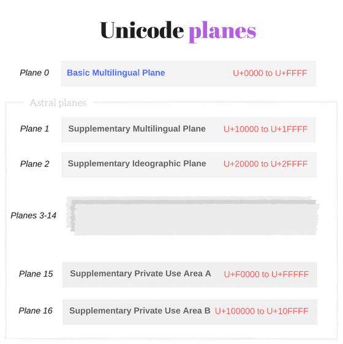
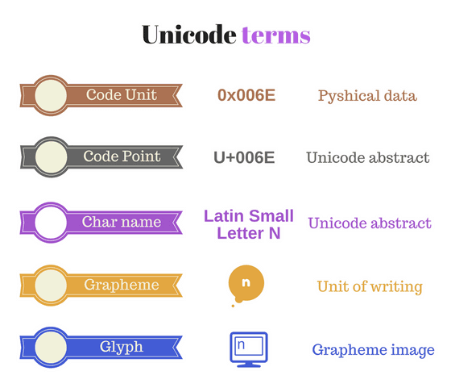
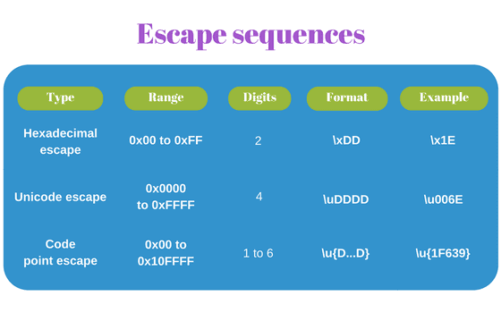

> 转载：[What every JavaScript developer should know about Unicode](https://dmitripavlutin.com/what-every-javascript-developer-should-know-about-unicode/#1-the-idea-behind-unicode)

This story starts with a confession: I was afraid of Unicode for a long time. When a programming task required Unicode knowledge, I was searching for a hackable solution for the problem, without a good understanding of what I was doing.

My avoidance continued until I faced a problem that required detailed Unicode knowledge. There was no way to apply situational solutions.

After putting in some effort, reading a bunch of articles — surprisingly it wasn't hard to understand it. Well... some articles have required reading at least 3 times.

As it turns out, Unicode is a universal and elegant standard, but it may be tough because of a bunch of abstract terms it operates with.

If you have gaps in understanding Unicode, now is the right time to face it! It's not that hard. Make yourself a tasteful tea or coffee ☕. And let's dive into the wonderful world of abstraction, characters, astrals, and surrogates.

The post explains the basic concepts of Unicode, creating the necessary ground.

Then it clarifies how JavaScript works with Unicode and what traps you may encounter.
You'll learn also how to apply new ECMAScript 2015 features to solve a part of the difficulties.

Ready? Let's start!

## 1. The idea behind Unicode

Let's start with a simple question. How are you able to read and understand the current article? Simply: because you know the meaning of letters and words as a group of letters.

Why are you able to understand the meaning of letters? Simply: because you (reader) and me (writer) have an agreement over the association between the graphical symbol (what is seen on the screen) and the English language letter (the meaning).

The same happens with computers. The difference is that computers don't understand the meaning of letters. For computers, the letters are just sequences of bits.

Imagine the _User1_ sends through the network a message `'hello'` to _User2_ .

_User1_'s computer doesn't know the meaning of letters. So it transforms `'hello'` into a sequence of numbers `0x68 0x65 0x6C 0x6C 0x6F`, where each letter uniquely corresponds to a number: `h` is `0x68`, `e` is `0x65`, etc. These numbers are sent to _User2_'s computer.

When the computer of _User2_ receives the sequence of numbers `0x68 0x65 0x6C 0x6C 0x6F`, it uses the same letter to number correspondence and restores the message. Then it displays the correct message: `'hello'`.

The agreement between the two computers about the correspondence between letters and numbers is what **Unicode** standardizes.

In terms of Unicode, `h` is an abstract character named _LATIN SMALL LETTER H_. This character has the corresponding number `0x68`, which is a code point in notation `U+0068`.

The role of Unicode is to provide a list of abstract characters (character set) and assign to each character a unique identifier code point (coded character set).

## 2. Basic Unicode terms

The [`www.unicode.org`](http://unicode.org/) websites mentions:

> **Unicode** provides a unique number for every character, no matter what the platform, no matter what the program, no matter what the language.

Unicode is a universal character set that defines the list of characters from the majority of the writing systems, and associates for every character a unique number (code point).


Unicode includes characters from most of today's languages, punctuation marks, diacritics, mathematical symbols, technical symbols, arrows, emoji, and more.

The first Unicode version 1.0 was published in October 1991 and had 7,161 characters. The latest version 14.0 (published in September 2021) provides codes for 144,697 characters.

The universal and embracing approach of Unicode solves a major problem that existed before when vendors implemented a lot of character sets and encodings that were difficult to handle.

It was complicated to create an application that supports all character sets and encodings.

_If you think that Unicode is hard, programming without Unicode would be even more difficult._

I still remember picking random charsets and encodings to read the content of files. Pure lottery!

### 2.1 Characters and code points

> **Abstract character** (or character) is a unit of information used for the organization, control, or representation of textual data.

Unicode deals with characters as abstract terms. Every abstract character has an associated name, e.g. _LATIN SMALL LETTER A_. The rendered form (glyph) of this character is `a`.

> **Code point** is a number assigned to a single character.

Code points are numbers in the range from `U+0000` to `U+10FFFF`.

`U+<hex>` is the format of code points, where `U+` is a prefix meaning **U**nicode and `<hex>` is a number in hexadecimal. For example, `U+0041` and `U+2603` are code points.

Remember that a code point is a simple number. And that's how you should think about it. The code point is a kind of index of an element in an array.

The magic happens because Unicode associates a code point with a character. For example `U+0041` corresponds to the character named _LATIN CAPITAL LETTER A_ (rendered as `A`), or `U+2603` corresponds to the character named _SNOWMAN_ (rendered as `☃`).

Not all code points have associated characters. `1,114,112` code points are available (the range `U+0000` to `U+10FFFF`), but only `144,697` (as of September 2021) have associated characters.

### 2.2 Unicode planes

> **Plane** is a range of 65,536 (or 1000016) contiguous Unicode code points from `U+n0000` up to `U+nFFFF`, where `n` can take values from 016 to 1016.

The whole set of Unicode code points is split into 17 planes:

- _Plane 0_ contains code points from `U+0000` to `U+FFFF`,
- _Plane 1_ contains code points from `U+**1**0000` to `U+**1**FFFF`
- ...
- _Plane 16_ contains code points from `U+**10**0000` to `U+**10**FFFF`.



#### Basic Multilingual Plane

_Plane 0_ is a special one, named **Basic Multilingual Plane** or shortly **BMP**. It contains characters from most of the modern languages ([Basic Latin](<https://en.wikipedia.org/wiki/Basic_Latin_(Unicode_block)>), [Cyrillic](<https://en.wikipedia.org/wiki/Cyrillic_(Unicode_block)>), [Greek](https://en.wikipedia.org/wiki/Greek_and_Coptic), etc) and a big number of [symbols](https://en.wikipedia.org/wiki/Unicode_symbols).

As mentioned above, the code points from the Basic Multilingual Plane are in the range from `U+0000` to `U+FFFF` and can have up to 4 hexadecimal digits.

The developer usually deals with characters from BMP.

Some characters from BMP:

- `e` is `U+0065` named _LATIN SMALL LETTER E_
- `|` is `U+007C` named _VERTICAL BAR_
- `■` is `U+25A0` named _BLACK SQUARE_
- `☂` is `U+2602` named _UMBRELLA_

#### Astral planes

The 16 planes beyond the BMP (_Plane 1_, _Plane 2_, ..., _Plane 16_) are named **astral planes** or **supplementary planes**.

The code points that are part of the astral planes are named **astral code points**. These code points are in the range from `U+10000` to `U+10FFFF`.

An astral code point can have 5 or 6 digits in hexadecimal: `U+ddddd` or `U+dddddd`.

Let's see some characters from astral planes:

- `𝄞` is `U+1D11E` named _MUSICAL SYMBOL G CLEF_
- `𝐁` is `U+1D401` named _MATHEMATICAL BOLD CAPITAL B_
- `🀵` is `U+1F035` named _DOMINO TITLE HORIZONTAL-00-04_
- `😀` is `U+1F600` named _GRINNING FACE_

### 2.3 Code units

Ok, the Unicode characters, code points, and planes are abstractions.

But now let's see how Unicode is implemented at the physical, hardware level.

A computer at the memory level doesn't use code points or abstract characters. It needs a physical way to represent Unicode code points: the code units.

> **Code unit** is a bit sequence used to encode each character within a given encoding form.

The [character encoding](https://en.wikipedia.org/wiki/Character_encoding) is what transforms abstract code points into physical bits: code units. In other words, the character encoding translates the Unicode code points to unique code unit sequences.

Popular encodings are [UTF-8](https://en.wikipedia.org/wiki/UTF-8), [UTF-16](https://en.wikipedia.org/wiki/UTF-16) and [UTF-32](https://en.wikipedia.org/wiki/UTF-32).

Most **JavaScript engines use UTF-16** encoding, so let's detail into UTF-16.

UTF-16 (the long name: 16-bit Unicode Transformation Format) is a [variable-length](https://en.wikipedia.org/wiki/Variable-width_encoding) encoding:

- Code points from BMP are encoded using a single code unit of 16-bit
- Code points from astral planes are encoded using two code units of 16-bit each.

Ok, that would be all for the dry theory. Let's follow some examples.

Suppose you want to save to hard drive _LATIN SMALL LETTER A_ character `a`. Unicode tells you that _LATIN SMALL LETTER A_ abstract character maps to `U+0061` code point.

Now let's ask UTF-16 encoding how `U+0061` should be transformed. The encoding specification says that for BMP code point take its hexadecimal number `U+**0061**` and store it into **one code unit** of 16-bit: `0x0061`.

As you can see, code points from BMP fit into a single 16-bit code unit.

### 2.4 Surrogate pairs

Now let's study a complex case. Suppose you want to encode _GRINNING FACE_ character `😀`. This character maps to `U+1F600` code point, from an astral plane.

Because astral code points require 21 bits to save the information, UTF-16 says that you need **two code units** of 16-bit. The code point `U+1F600` is split into so-called surrogate pair: `0xD83D` (high-surrogate code unit) and `0xDE00` (low-surrogate code unit).

> **Surrogate pair** is a representation for a single abstract character that consists of a sequence of code units of two 16-bit code units, where the first value of the pair is a **high-surrogate code unit** and the second value is a **low-surrogate code unit**.

An astral code point requires two code units — a surrogate pair. E.g. to encode `U+1F600` (`😀`) in UTF-16 a surrogate pair is used: `0xD83D 0xDE00`.

```js
console.log("\uD83D\uDE00"); // => '😀'
```

High-surrogate code unit takes values from range `0xD800` to `0xDBFF`. Low-surrogate code unit takes values from range `0xDC00` to `0xDFFF`.

The algorithm of converting a surrogate pair into astral code point and vice-versa is the following:

```js
function getSurrogatePair(astralCodePoint) {
  let highSurrogate = Math.floor((astralCodePoint - 0x10000) / 0x400) + 0xd800;
  let lowSurrogate = ((astralCodePoint - 0x10000) % 0x400) + 0xdc00;
  return [highSurrogate, lowSurrogate];
}
getSurrogatePair(0x1f600); // => [0xD83D, 0xDE00]
function getAstralCodePoint(highSurrogate, lowSurrogate) {
  return (highSurrogate - 0xd800) * 0x400 + lowSurrogate - 0xdc00 + 0x10000;
}
getAstralCodePoint(0xd83d, 0xde00); // => 0x1F600
```

Surrogate pairs are not comfortable. You have to handle them as special cases when dealing with strings in JavaScript, as described below in the article.

However, UTF-16 is memory efficient. 99% of the processed characters are from BMP, which requires one code unit and saves lots of memory.

### 2.5 Combining marks

> A **grapheme**, or **symbol**, is a minimally distinctive unit of writing in the context of a particular writing system.

A **grapheme** is how a user thinks about a character. A concrete image of a grapheme displayed on the screen is named **glyph**.

In many cases, a single Unicode character represents a single grapheme. For instance `U+0066` _LATIN SMALL LETTER F_ is an English writing `f`.

There are cases when a grapheme contains a sequence of characters.

For example, `å` is an atomic grapheme in the Danish writing system. It is displayed using `U+0061` _LATIN SMALL LETTER A_ (rendered as `a`) combined with a special character `U+030A` [_COMBINING RING ABOVE_](<https://en.wikipedia.org/wiki/Ring_(diacritic)>) (rendered as ◌̊).

`U+030A` modifies the precedent character and is named **combining mark**.

```js
console.log("\u0061\u030A"); // => 'å'
console.log("\u0061"); // => 'a'
```

> **Combining mark** is a character that applies to the precedent base character to create a new grapheme.

Combining marks include such characters as accents, diacritics, Hebrew points, Arabic vowel signs, and Indic matras.

Combining marks aren't normally used in isolation, i.e. without the base character. You should avoid displaying them isolated.

As well as the surrogate pairs, combining marks are tough to handle in JavaScript.

A combining character sequence (base character + combining mark) is distinguished by the user as a single symbol (e.g. `'\u0061\u030A'` is `'å'`). But the developer must determine that 2 code points `U+0061` and `U+030A` are used to construct `å`.

]

## 3. Unicode in JavaScript

ES2015 specification [mentions](http://www.ecma-international.org/ecma-262/6.0/#sec-source-text) that source code text is expressed using Unicode (version 5.1 and above). The source text is a sequence of code points from `U+0000` to `U+10FFFF`. The way source code is stored or interchanged is not relevant to ECMAScript specification, but usually is encoded in UTF-8 (the preferred encoding for the web).

I recommend keeping the source code text with characters from [Basic Latin Unicode block](<https://en.wikipedia.org/wiki/Basic_Latin_(Unicode_block)>) (or ASCII). Characters outside ASCII should be escaped. This will ensure fewer problems when comes to encoding.

Internally, at the language level, ECMAScript 2015 provides an explicit [definition](http://www.ecma-international.org/ecma-262/6.0/#sec-ecmascript-language-types-string-type) what strings are in JavaScript:

> The String type is the set of all ordered sequences of zero or more 16-bit unsigned integer values ("elements") up to a maximum length of 253-1 elements. The String type is generally used to represent textual data in a running ECMAScript program, in which case each element in the String is treated as a **UTF-16 code unit** value.

Every element of a string is interpreted by the engine as a code unit. The way a string is rendered does not provide a deterministic way to decide what code units (that represent code points) it contains. See the following example:

```js
console.log("cafe\u0301"); // => 'café'
console.log("café"); // => 'café'
```

`'cafe\u0301'` and `'café'` literals have slightly different code units, but both are rendered the same sequence of symbols `café`.

> **The length of a String** is the number of elements (i.e., 16-bit values) within it. [...] Where ECMAScript operations interpret String values, each element is interpreted as a single UTF-16 code unit.

As you know from surrogate pairs and combining marks above chapters, some symbols need 2 or more code units to be represented. So you should take precautions when counting the number of characters or accessing characters by index:

```js
const smile = "\uD83D\uDE00";
console.log(smile); // => '😀'
console.log(smile.length); // => 2
const letter = "e\u0301";
console.log(letter); // => 'é'
console.log(letter.length); // => 2
```

`smile` string contains 2 code units: `\uD83D` (high-surrogate) and `\uDE00` (low-surrogate). Since the string is a sequence of code units, `smile.length` evaluates to `2`. Even if rendered `smile` has only one symbol `'😀'`.

The same scenario happens with `letter` string. The combining mark `U+0301` applies to the previous character and the rendered result is one symbol `'é'`. However `letter` contains `2` code units, thus `letter.length` is `2`.

My advice: **always think of string in JavaScript as a sequence of code units**. The way string is rendered on the screen cannot say clearly what code units it contains.

Astral symbols and combining character sequences require 2 or more code units to be encoded but are treated as a single grapheme. If a string has surrogate pairs or combining marks, you may be confused when evaluating string length or accessing a character by index without keeping this idea in mind.

Most of the JavaScript string methods are not Unicode-aware. If your string contains compound Unicode characters, take precaution when using `myString.slice()`, `myString.substring()`, etc.

### 3.1 Escape sequences

Escape sequences in strings are used to express code units based on code point numbers. JavaScript has 3 escape types, one which was introduced in ECMAScript 2015.

Let's see them in more detail.

#### Hexadecimal escape sequence

The shortest form is named **hexadecimal escape sequence**: `\x<hex>`, where `\x` is a prefix followed by a hexadecimal number `<hex>` with a fixed length of 2 digits.
For example `'\x30'` (symbol `'0'`) or `'\x5B'` (symbol `'['`).

The hexadecimal escape sequence in a string literal or regular expression looks this way:

```js
const str = "\x4A\x61vaScript";
console.log(str); // => 'JavaScript'
const reg = /\x4A\x61va.*/;
console.log(reg.test("JavaScript")); // => true
```

A hexadecimal escape sequence can escape code points in a limited range: from `U+00` to `U+FF` because only 2 digits are allowed. But hexadecimal escape is nice because it's short.

#### Unicode escape sequence

If you want to escape code points from the entire BMP, then use an **unicode escape sequence**. The escape format is `\u<hex>`, where `\u` is a prefix followed by a hexadecimal number `<hex>` with a fixed length of 4 digits. For example `'\u0051'` (symbol `'Q'`) or `'\u222B'` (integral symbol `'∫'`).

Let's use some unicode escape sequences:

```js
const str = "I\u0020learn \u0055nicode";
console.log(str); // => 'I learn Unicode'
const reg = /\u0055ni.*/;
console.log(reg.test("Unicode")); // => true
```

An unicode escape sequence can escape code points in a limited range: from `U+0000` to `U+FFFF` (all BMP code points) because only 4 digits are allowed. Mostly that's enough to represent the commonly used symbols.

To indicate an astral symbol in a JavaScript literal you have to use two joined unicode escape sequences (a high surrogate and low surrogate), which creates a surrogate pair:

```js
const str = "My face \uD83D\uDE00";
console.log(str); // => 'My face 😀'
```

`\uD83D\uDE00` is a surrogate pair created using 2 escape sequences.

#### Code point escape sequence

ECMAScript 2015 provides escape sequences that represent code points from the entire Unicode space: `U+0000` to `U+10FFFF`, i.e. BMP and astral planes.

The new format is called **code point escape sequence**: `\u{<hex>}`, where `<hex>` is a hexadecimal number with a variable length of 1 to 6 digits.

For example `'\u{7A}'` (symbol `'z'`) or `'\u{1F639}'` (funny cat symbol `😹`).

Let's see how you can use it in literals:

```js
const str = "Funny cat \u{1F639}";
console.log(str); // => 'Funny cat 😹'
const reg = /\u{1F639}/u;
console.log(reg.test("Funny cat 😹")); // => true
```

The regular expression `/\u{1F639}/u` has a special flag `u`, which enables additional Unicode features (see more about that in [3.5 Regular expression match](https://dmitripavlutin.com/what-every-javascript-developer-should-know-about-unicode/#35regularexpressionmatch)).

I like that code point escape gets rid of surrogate pair to represent an astral symbol. For example, let's escape `U+1F607` _SMILING FACE WITH HALO_ code point:

```js
const niceEmoticon = "\u{1F607}";
console.log(niceEmoticon); // => '😇'
const spNiceEmoticon = "\uD83D\uDE07";
console.log(spNiceEmoticon); // => '😇'
console.log(niceEmoticon === spNiceEmoticon); // => true
```

The string literal assigned to variable `niceEmoticon` has a code point escape `'\u{1F607}'` that represents an astral code point `U+1F607`.

Nevertheless, under the hood, the code point escape creates a surrogate pair (2 code units). The `spNiceEmoticon` (created using a surrogate pair of unicode escapes `'\uD83D\uDE07'`) equals to `niceEmoticon`.



When a regular expression is created using `RegExp` constructor, in the string literal you must replace each `\` with `\\` to indicate unicode escapes. The following regular expression objects are equivalent:

```js
const reg1 = /\x4A \u0020 \u{1F639}/;
const reg2 = new RegExp("\\x4A \\u0020 \\u{1F639}");
console.log(reg1.source === reg2.source); // => true
```

### 3.2 String comparison

Strings in JavaScript are sequences of code units. You could expect that string comparison involves the evaluation of code units for a match: if the code units from both strings are equal.

This approach is fast and effective. It works nicely with "simple" strings:

```js
const firstStr = "hello";
const secondStr = "\u0068ell\u006F";
console.log(firstStr === secondStr); // => true
```

`firstStr` and `secondStr` strings have the same sequence of code units — they are equal.

However, suppose you want to compare two strings that look the same rendered but contain different code unit sequences. Then you may have an unexpected result, because strings that visually look the same are not equal in a comparison:

```js
const str1 = "ça va bien";
const str2 = "c\u0327a va bien";
console.log(str1); // => 'ça va bien'
console.log(str2); // => 'ça va bien'
console.log(str1 === str2); // => false
```

`str1` and `str2` when rendered look the same, but have different code units.
It happens because `ç` grapheme can be constructed in two ways:

- Using `U+00E7` _LATIN SMALL LETTER C WITH CEDILLA_
- Or using a combining character sequence: `U+0063` _LATIN SMALL LETTER C_ plus the combining mark `U+0327` _COMBINING CEDILLA_.

How to handle such situations and compare correctly the strings? The answer is string normalization.

#### Normalization

> **Normalization** is a string conversion to a canonical representation, to ensure that canonical-equivalent (and/or compatibility-equivalent) strings have unique representations.

In other words, when a string has a complex structure containing combining character sequences or other compound constructs, you can _normalize_ it to a canonical form. Normalized strings are painless to compare or perform string operations like text search, etc.

[Unicode Standard Annex #15](http://unicode.org/reports/tr15/) has interesting details about the normalization process.

In JavaScript to normalize a string invoke `myString.normalize([normForm])` method, available in ES2015. `normForm` is an optional parameter (defaults to `'NFC'`) and can take one of the following normalization forms:

- `'NFC'` as Normalization Form Canonical Composition
- `'NFD'` as Normalization Form Canonical Decomposition
- `'NFKC'` as Normalization Form Compatibility Composition
- `'NFKD'` as Normalization Form Compatibility Decomposition

Let's improve the previous example by applying a string normalization to correctly compare the strings:

```js
const str1 = "ça va bien";
const str2 = "c\u0327a va bien";
console.log(str1.normalize() === str2.normalize()); // => true
console.log(str1 === str2);
```

When `str2.normalize()` is invoked, a canonical version of `str2` is returned (`'c\u0327'` is replaced with `'ç'`). So the comparison `str1.normalize() === str2.normalize()` returns `true` as expected.

`str1` is not affected by the normalization, since it's already in a canonical form.

### 3.3 String length

The common way to determine the string length is, of course, reading the `myString.length` property. This property indicates the number of code units that a string has.

The evaluation of the string length that contains code points from BMP works usually as expected:

```js
const color = "Green";
console.log(color.length); // => 5
```

Each code unit in `color` corresponds to a single grapheme. The expected length of the string is `5`.

#### Length and surrogate pairs

The situation becomes tricky when a string contains surrogate pairs, to represent astral code points. Since each surrogate pair contains 2 code units (a high-surrogate and a low-surrogate), the length property is greater than expected.

Take a look at the example:

```js
const str = "cat\u{1F639}";
console.log(str); // => 'cat😹'
console.log(str.length); // => 5
```

When `str` string is rendered, it contains 4 symbols `cat😹`.

However `smile.length` evaluates to `5`, because `U+1F639` is an astral code point encoded with 2 code units (a surrogate pair).

Unfortunately, a native and performant way to fix the problem is not available at the moment.

At least ECMAScript 2015 introduced algorithms that are aware of astral symbols. The astral symbol is counted as a single character, even being encoded with 2 code units.

Unicode-aware is the string iterator [`String.prototype[@@iterator]()`](https://developer.mozilla.org/en-US/docs/Web/JavaScript/Reference/Global_Objects/String/@@iterator). You can combine the string with spread operator `[...str]` or `Array.from(str)` function (both consume the string iterator). Then count the number of symbols in the returned array.

However, the above solution may cost you slight performance losses when used extensively.

Let's improve the above example with a spread operator:

```js
const str = "cat\u{1F639}";
console.log(str); // => 'cat😹'
console.log([...str]); // => ['c', 'a', 't', '😹']
console.log([...str].length); // => 4
```

`[...str]` creates an array of 4 symbols. The surrogate pair that encodes `U+1F639` _CAT FACE WITH TEARS OF JOY_ 😹 is kept intact, because the string iterator is Unicode-aware.

#### Length and combining marks

What about combining character sequences? Because each combining mark is a code unit, you can encounter the same difficulties.

The problem is solved when normalizing the string. If you're lucky, the combining character sequence is normalized to a single character. Let's try:

```js
const drink = "cafe\u0301";
console.log(drink); // => 'café'
console.log(drink.length); // => 5
console.log(drink.normalize()); // => 'café'
console.log(drink.normalize().length); // => 4
```

`drink` string contains 5 code units (thus `drink.length` is `5`), even if rendered it displays 4 symbols.

When normalizing `drink`, luckily the combining character sequence `'e\u0301'` has a canonical form `'é'`. So `drink.normalize().length` contains the expected `4` symbols.

Unfortunately, normalization is not a universal solution. Long combining character sequences do not always have canonical equivalents in one symbol. Let's see such a case:

```js
const drink = "cafe\u0327\u0301";
console.log(drink); // => 'cafȩ́'
console.log(drink.length); // => 6
console.log(drink.normalize()); // => 'cafȩ́'
console.log(drink.normalize().length); // => 5
```

`drink` has 6 code units and `drink.length` evaluates to `6`. However `drink` has 4 symbols.

The normalization `drink.normalize()` transforms the combining sequence `'e\u0327\u0301'` into a canonical form of two characters `'ȩ\u0301'` (by removing only one combining mark).

Sadly `drink.normalize().length` evaluates to `5` and still does not indicate the visually expected number of symbols.

### 3.4 Character positioning

Because the string is a sequence of code units, accessing the character in a string by index has difficulties also.

When a string contains only BMP characters the character positioning works correctly.

```js
const str = "hello";
console.log(str[0]); // => 'h'
console.log(str[4]); // => 'o'
```

Each symbol is encoded with a single code unit, so accessing by index a string character is correct.

#### Character positioning and surrogate pairs

The situation changes when the string contains astral symbols.

An astral symbol is encoded using 2 code units (a surrogate pair). So accessing string characters by index may return a separated high-surrogate or low-surrogate, which are invalid symbols.

The following example accesses characters from an astral symbol:

```js
const omega = "\u{1D6C0} is omega";
console.log(omega); // => '𝛀 is omega'
console.log(omega[0]); // => '' (unprintable symbol)
console.log(omega[1]); // => '' (unprintable symbol)
```

Because `U+1D6C0` _MATHEMATICAL BOLD CAPITAL OMEGA_ is an astral character, it is encoded using a surrogate pair of 2 code units.

`omega[0]` accesses the high-surrogate code unit and `omega[1]` the low-surrogate, breaking apart the surrogate pair.

There are 2 possibilities to access astral symbols correctly in a string:

- Use the Unicode-aware string iterator and generate an array of symbols `[...str][index]`
- Get code point number using `number = myString.codePointAt(index)`, then transform the number to a symbol using `String.fromCodePoint(number)` (recommended option).

Let's apply both options:

```js
const omega = "\u{1D6C0} is omega";
console.log(omega); // => '𝛀 is omega'
// Option 1
console.log([...omega][0]); // => '𝛀'
// Option 2
const number = omega.codePointAt(0);
console.log(number.toString(16)); // => '1d6c0'
console.log(String.fromCodePoint(number)); // => '𝛀'
```

`[...omega]` returns an array of symbols that `omega` string contains. Surrogate pairs are evaluated correctly, so accessing the first character works as expected. `[...smile][0]` is `'𝛀'`.

`omega.codePointAt(0)` method call is Unicode-aware, so it returns the astral code point number `0x1D6C0` of the first character in `omega` string. The function `String.fromCodePoint(number)` returns the symbol based on the code point number: `'𝛀'`.

#### Character positioning and combining marks

Character positioning in strings with combining marks has the same problem as string length described above.

Accessing characters by index in a string is accessing code units. However, the combining mark sequence should be accessed as a whole, without splitting into separated code units.

The following example demonstrates the problem:

```js
const drink = "cafe\u0301";
console.log(drink); // => 'café'
console.log(drink.length); // => 5
console.log(drink[3]); // => 'e'
console.log(drink[4]); // => ◌́
```

`drink[3]` accesses only the base character `e`, without the combining mark `U+0301` _COMBINING ACUTE ACCENT_ (rendered as ◌́ ).
`drink[4]` accesses the isolated combining mark ◌́ .

In such cases apply a string normalization. The combining character sequence `U+0065` _LATIN SMALL LETTER E_ + `U+0301` _COMBINING ACUTE ACCENT_ has a canonical equivalent `U+00E9` _LATIN SMALL LETTER E WITH ACUTE_ `é`.

Let's improve the previous code sample:

```js
const drink = "cafe\u0301";
console.log(drink.normalize()); // => 'café'
console.log(drink.normalize().length); // => 4
console.log(drink.normalize()[3]); // => 'é'
```

Unfortunately, not all combining character sequences have canonical equivalents as a single symbol. So the normalization solution is not universal.

Fortunately, it should work in most of the cases for European / North America's languages.

### 3.5 Regular expression match

Regular expressions, as well as strings, work in terms of code units. Similar to previously described scenarios, this creates difficulties when processing surrogate pairs and combining character sequences using regular expressions.

BMP characters match as expected because a single code unit represents a symbol:

```js
const greetings = "Hi!";
const regex = /^.{3}$/;
console.log(regex.test(greetings)); // => true
```

`greetings` has 3 symbols encoded with 3 code units. Regular expression `/.{3}/`, which expects 3 code units, matches `greetings`.

When matching astral symbols (which are encoded with a surrogate pair of 2 code units), you may encounter difficulties:

```js
const smile = "😀";
const regex = /^.$/;
console.log(regex.test(smile)); // => false
```

`smile` contains the astral symbol `U+1F600` _GRINNING FACE_. `U+1F600` is encoded using a surrogate pair `0xD83D`+`0xDE00`.

However, the regular expression `/^.$/` expects one code unit, so the match fails: `regexp.test(smile)` is `false`.

It's even worse when defining character classes with astral symbols. JavaScript throws an error:

```js
const regex = /[😀-😎]/;
// => SyntaxError: Invalid regular expression: /[😀-😎]/:
// Range out of order in character class
```

The astral code points are encoded to surrogate pairs. So JavaScript represents the regular expression using code units `/[\uD83D\uDE00-\uD83D\uDE0E]/`. Each code unit is considered a separate element in the pattern, so the regular expression ignores the concept of a surrogate pair.

The `\uDE00-\uD83D` part of the character class is not valid, because `\uDE00` is greater than `\uD83D`. As a result, an error is generated.

#### Regular expression _u_ flag

Fortunately, ECMAScript 2015 introduced a useful `u` flag, making the regular expression Unicode-aware. This flag enables the correct processing of astral symbols.

You can use unicode escape sequences in regular expressions `/u{1F600}/u`. This escape is shorter than indicating the high-surrogate and low-surrogate pair `/\uD83D\uDE00/`.

Let's apply `u` flag and see how `.` operator (including quantifiers `?`, `+`, `*` and `{3}`, `{3,}`, `{2,3}`) matches the astral symbol:

```js
const smile = "😀";
const regex = /^.$/u;
console.log(regex.test(smile)); // => true
```

`/^.$/u` regular expression, which is Unicode-aware because of the `u` flag, now matches `😀` astral symbol.

The `u` flag enables the correct processing of astral symbols in character classes too:

```js
const smile = "😀";
const regex = /[😀-😎]/u;
const regexEscape = /[\u{1F600}-\u{1F60E}]/u;
const regexSpEscape = /[\uD83D\uDE00-\uD83D\uDE0E]/u;
console.log(regex.test(smile)); // => true
console.log(regexEscape.test(smile)); // => true
console.log(regexSpEscape.test(smile)); // => true
```

`[😀-😎]` is now evaluated as a range of astral symbols. `/[😀-😎]/u` matches `'😀'`.

#### Regular expression and combining marks

Unfortunately, with `u` flag or without it regular expression treats the combining marks as separate code units.

If you need to match a combining character sequence, you have to match the base character and the combining mark separately.

Take a look at the following example:

```js
const drink = "cafe\u0301";
const regex1 = /^.{4}$/;
const regex2 = /^.{5}$/;
console.log(drink); // => 'café'
console.log(regex1.test(drink)); // => false
console.log(regex2.test(drink)); // => true
```

The string rendered has 4 symbols `café`.

Nevertheless, the regular expression matches `'cafe\u0301'` as a sequence of 5 elements `/^.{5}$/`.

## 4. Summary

Probably the most important concept about Unicode in JavaScript is **to treat strings as sequences of code units**, as they really are.

The confusion appears when the developer thinks that strings are composed of graphemes (or symbols), ignoring the code unit sequence concept.

It creates misunderstanding when processing strings that contain surrogate pairs or combining character sequences:

- Getting the string length
- Character positioning
- Regular expression matching

Note that most of the string methods in JavaScript are not Unicode-aware: like `myString.indexOf()`, `myString.slice()`, etc.

ECMAScript 2015 introduced nice features like code point escape sequences `\u{1F600}` in strings and regular expressions.

The new regular expression flag `u` enables Unicode-aware string matching. It easies matching astral symbols.

String iterator `String.prototype[@@iterator]()` is Unicode-aware. You can use the spread operator `[...str]` or `Array.from(str)` to create an array of symbols and calculate the string length or access characters by index without breaking the surrogate pair. Note that these operations have some performance impact.

If you need a better way to process Unicode characters, you can use [punycode](https://github.com/bestiejs/punycode.js/) library or [generate](https://github.com/mathiasbynens/regenerate) specialized regular expressions.

I hope the article has helped you master Unicode!

_Do you know other interesting Unicode nuances in JavaScript? Feel free to write a comment below!_
