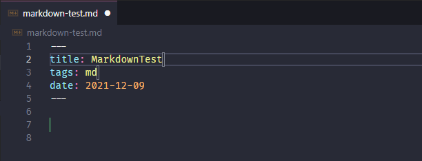

> 转载: [Visual Studio Code 常用快捷键](https://lzw.me/a/vscode-visual-studio-code-shortcut.html)

## 主命令框

`F1` 或 `Ctrl+Shift+P`: 打开命令面板。在打开的输入框内，可以输入任何命令，例如：

-   按一下 `Backspace` 会进入到 `Ctrl+P` 模式
-   在 `Ctrl+P` 下输入 `>` 可以进入 `Ctrl+Shift+P` 模式

在 `Ctrl+P` 窗口下还可以:

-   直接输入文件名，跳转到文件
-   `?` 列出当前可执行的动作
-   `!` 显示 `Errors`或 `Warnings`，也可以 `Ctrl+Shift+M`
-   `:` 跳转到行数，也可以 `Ctrl+G` 直接进入
-   `@` 跳转到 `symbol`（搜索变量或者函数），也可以 `Ctrl+Shift+O` 直接进入
-   `@` 根据分类跳转 `symbol`，查找属性或函数，也可以 `Ctrl+Shift+O` 后输入:进入
-   `#` 根据名字查找 `symbol`，也可以 `Ctrl+T`

## 常用快捷键

### 编辑器与窗口管理

-   打开一个新窗口： `Ctrl+Shift+N`
-   关闭窗口： `Ctrl+Shift+W`
-   同时打开多个编辑器（查看多个文件）
-   新建文件 `Ctrl+N`
-   文件之间切换 `Ctrl+Tab`
-   切出一个新的编辑器（最多 `3` 个） `Ctrl+\`，也可以按住 `Ctrl` 鼠标点击 `Explorer` 里的文件名
-   左中右 `3` 个编辑器的快捷键 `Ctrl+1` `Ctrl+2` `Ctrl+3`
-   `3` 个编辑器之间循环切换 `Ctrl+`
-   编辑器换位置， `Ctrl+k`然后按 `Left`或 `Right`

### 代码编辑

#### 格式调整

-   代码行缩进 `Ctrl+[` 、 `Ctrl+]`
-   `Ctrl+C` 、 `Ctrl+V` 复制或剪切当前行/当前选中内容
-   代码格式化： `Shift+Alt+F`，或 `Ctrl+Shift+P` 后输入 `format code`
-   上下移动一行： `Alt+Up` 或 `Alt+Down`
-   向上向下复制一行： `Shift+Alt+Up` 或 `Shift+Alt+Down`
-   在当前行下边插入一行 `Ctrl+Enter`
-   在当前行上方插入一行 `Ctrl+Shift+Enter`

#### 光标相关

-   移动到行首： `Home`
-   移动到行尾： `End`
-   移动到文件结尾： `Ctrl+End`
-   移动到文件开头： `Ctrl+Home`
-   移动到定义处： `F12`
-   定义处缩略图：只看一眼而不跳转过去 `Alt+F12`
-   移动到后半个括号： `Ctrl+Shift+]`
-   选择从光标到行尾： `Shift+End`
-   选择从行首到光标处： `Shift+Home`
-   删除光标右侧的所有字： `Ctrl+Delete`
-   扩展/缩小选取范围： `Shift+Alt+Left` 和 `Shift+Alt+Right`
-   多行编辑(列编辑)：`Alt+Shift+鼠标左键`，`Ctrl+Alt+Down/Up`
-   同时选中所有匹配： `Ctrl+Shift+L`
-   `Ctrl+D` 下一个匹配的也被选中 (在 sublime 中是删除当前行，后面自定义快键键中，设置与 `Ctrl+Shift+K` 互换了)
-   回退上一个光标操作： `Ctrl+U`

#### 重构代码

-   找到所有的引用： `Shift+F12`
-   同时修改本文件中所有匹配的： `Ctrl+F12`
-   重命名：比如要修改一个方法名，可以选中后按 `F2`，输入新的名字，回车，会发现所有的文件都修改了
-   跳转到下一个 `Error` 或 `Warning`：当有多个错误时可以按 `F8` 逐个跳转
-   查看 `diff`： 在 `explorer` 里选择文件右键 `Set file to compare`，然后需要对比的文件上右键选择 `Compare with file_name_you_chose`

#### 查找替换

-   查找 `Ctrl+F`
-   查找替换 `Ctrl+H`
-   整个文件夹中查找 `Ctrl+Shift+F`

### 显示相关

-   全屏：`F11`
-   zoomIn/zoomOut：`Ctrl +/-`
-   侧边栏显/隐：`Ctrl+B`
-   显示资源管理器 `Ctrl+Shift+E`
-   显示搜索 `Ctrl+Shift+F`
-   显示 Git `Ctrl+Shift+G`
-   显示 Debug `Ctrl+Shift+D`
-   显示 Output `Ctrl+Shift+U`

## 其他

-   自动保存：`File -> AutoSave` ，或者 `Ctrl+Shift+P`，输入 `auto`

## 修改默认快捷键

打开默认键盘快捷方式设置：
`File -> Preferences -> Keyboard Shortcuts`，或者：`Alt+F -> p -> k`

修改 `keybindings.json`：

```json
// Place your key bindings in this file to overwrite the defaults
[
    // ctrl+space 被切换输入法快捷键占用
    {
        "key": "ctrl+alt+space",
        "command": "editor.action.triggerSuggest",
        "when": "editorTextFocus"
    },
    // ctrl+d 删除一行
    {
        "key": "ctrl+d",
        "command": "editor.action.deleteLines",
        "when": "editorTextFocus"
    },
    // 与删除一行的快捷键互换
    {
        "key": "ctrl+shift+k",
        "command": "editor.action.addSelectionToNextFindMatch",
        "when": "editorFocus"
    },
    // ctrl+shift+/多行注释
    {
        "key": "ctrl+shift+/",
        "command": "editor.action.blockComment",
        "when": "editorTextFocus"
    },
    // 定制与 sublime 相同的大小写转换快捷键，需安装 TextTransform 插件
    {
        "key": "ctrl+k ctrl+u",
        "command": "uppercase",
        "when": "editorTextFocus"
    },
    {
        "key": "ctrl+k ctrl+l",
        "command": "lowercase",
        "when": "editorTextFocus"
    }
]
```

## 前端开发必备插件

-   PostCSS Sorting
-   stylelint
-   stylefmt
-   ESLint
-   javascript standard format
-   beautify
-   Babel ES6/ES7
-   Debugger for Chrome
-   Add jsdoc comments
-   javascript(ES6) code snippets
-   vue
-   weex
-   Reactjs code snippets
-   React Native Tools
-   Npm Intellisense
-   Instant Markdown
-   Markdown Shortcuts
-   TextTransform

## 自定义设置参考

vscode 自定义配置参考：

```json
{
    "editor.fontSize": 18,
    "files.associations": {
        "*.es": "javascript",
        "*.ES6": "javascript"
    },
    // 控制编辑器是否应呈现空白字符
    "editor.renderWhitespace": true,
    // 启用后，将在保存文件时剪裁尾随空格。
    "files.trimTrailingWhitespace": true,
    // File extensions that can be beautified as javascript or JSON.
    "beautify.JSfiles": [
        "",
        "es",
        "ES6",
        "js",
        "json",
        "jsbeautifyrc",
        "jshintrc"
    ]
}
```

## 补充插件

-   [quotify](https://marketplace.visualstudio.com/items?itemName=alanmbarr.quotify)

-   [change-case](https://marketplace.visualstudio.com/items?itemName=wmaurer.change-case)

-   [简体与繁体互转](https://marketplace.visualstudio.com/items?itemName=cipchk.zh-hans-tt-hant-vscode)

-   [vscode-faker](https://marketplace.visualstudio.com/items?itemName=deerawan.vscode-faker)

-   [Code Runner](https://marketplace.visualstudio.com/items?itemName=formulahendry.code-runner)

-   [Batch Rename](https://marketplace.visualstudio.com/items?itemName=JannisX11.batch-rename-extension)

-   [Better Comments](https://marketplace.visualstudio.com/items?itemName=aaron-bond.better-comments)

-   [Indent one space](https://marketplace.visualstudio.com/items?itemName=usernamehw.indent-one-space)

-   [Bracket Pair Colorizer](https://marketplace.visualstudio.com/items?itemName=CoenraadS.bracket-pair-colorizer)

-   [Code Spell Checker](https://marketplace.visualstudio.com/items?itemName=streetsidesoftware.code-spell-checker)

-   [Diff Tool](https://marketplace.visualstudio.com/items?itemName=jinsihou.diff-tool)

-   [Edi X12 Support](https://marketplace.visualstudio.com/items?itemName=Silvenga.edi-x12-support)

-   [Rainbow CSV](https://marketplace.visualstudio.com/items?itemName=mechatroner.rainbow-csv)

-   [Edit csv](https://marketplace.visualstudio.com/items?itemName=janisdd.vscode-edit-csv)

-   [XML Tools](https://marketplace.visualstudio.com/items?itemName=DotJoshJohnson.xml)

-   [Highlight Bad Chars](https://marketplace.visualstudio.com/items?itemName=wengerk.highlight-bad-chars)

-   [Live Server](https://marketplace.visualstudio.com/items?itemName=ritwickdey.LiveServer)

- [REST Client](https://marketplace.visualstudio.com/items?itemName=humao.rest-client)

  ```python
  @host=http://localhost:3000
  
  ### Get Request
  GET {{host}}/api/v1/products HTTP/1.1
  
  ### Post Request
  # @name login
  POST {{host}}/api/v1/auth/login HTTP/1.1
  Content-Type: application/json
  
  {
      "username": "xxx",
      "password": "XXX"
  }
  
  
  ### Pass Token
  GET {host}}/api/v1/user/info HTTP/1.1
  token: {{login.response.body.data}}
  ```

- [Prettier - Code formatter](https://marketplace.visualstudio.com/items?itemName=esbenp.prettier-vscode)

- [Formatting Toggle](https://marketplace.visualstudio.com/items?itemName=tombonnike.vscode-status-bar-format-toggle)

- [Quokka.js](https://marketplace.visualstudio.com/items?itemName=WallabyJs.quokka-vscode)

- [Color Manager](https://marketplace.visualstudio.com/items?itemName=RoyAction.color-manager)

- [Peacock](https://marketplace.visualstudio.com/items?itemName=johnpapa.vscode-peacock)

- [Transformer](https://marketplace.visualstudio.com/items?itemName=dakara.transformer)

- [Dyno File Utils](https://marketplace.visualstudio.com/items?itemName=dyno-nguyen.vscode-dynofileutils)

- [Project Manager](https://marketplace.visualstudio.com/items?itemName=alefragnani.project-manager)

- [Placeholder Images](https://marketplace.visualstudio.com/items?itemName=JakeWilson.vscode-placeholder-images)

- [Image preview](https://marketplace.visualstudio.com/items?itemName=kisstkondoros.vscode-gutter-preview)

- [Font Switcher](https://marketplace.visualstudio.com/items?itemName=evan-buss.font-switcher)

- [Color Highlight](https://marketplace.visualstudio.com/items?itemName=naumovs.color-highlight)

- [Emoji Snippets](https://marketplace.visualstudio.com/items?itemName=devzstudio.emoji-snippets)

## Q&A

### Code Runner 运行代码包含中文会乱码

test-chinese.kt

```kotlin
fun main() {
    println("世界，你好！")
}
// [Running] cd "d:\study\kotlin\basic\" && kotlinc test-chinese.kt -include-runtime -d test-chinese.jar && java -jar test-chinese.jar
// ���磬��ã�
```

test-chinese.py

```python
print("世界，你好！")

# [Running] python -u "d:\study\kotlin\basic\test-chinese.py"
# ���磬��ã�
```

修改 code runner 配置 `"code-runner.runInTerminal": true`
然后运行 python 成功， kotlin 依旧失败。控制台输出如下：

```
cd "d:\study\kotlin\basic\" && kotlinc test-chinese.kt -include-runtime -d test-chinese.jar && java -jar test-chinese.jar>
```

原因是因为我的 VSCode Terminal 使用的是 Git, 不能使用反斜杠作为目录分割符，修改 Code Runner 的 executorMap 去掉 cd 到目录这部分。

```json
"code-runner.executorMap": {
  "kotlin": "kotlinc $fileName -include-runtime -d $fileNameWithoutExt.jar && java -jar $fileNameWithoutExt.jar"
}
```

## Markdown snippets

```json
"Meta of markdown file": {
    "prefix": "meta",
    "body": [
        "---",
        "title: ${TM_FILENAME/(.*)\\..*/${1:/pascalcase}/}$1",
        "tags: ${TM_FILENAME/(.*\\.)//}$2",
        "date: $CURRENT_YEAR-$CURRENT_MONTH-$CURRENT_DATE",
        "---\n",
        "$0",
    ],
    "description": "Meta of markdown file"
}
```

在 settings.json 中设置如下，使 meta 可以被 trigger。

```json
"[markdown]": {
    "editor.quickSuggestions": true
},
```

以 markdown-test.md 为例, 输入 meta 点击 tab 。



## Screencast 显示按键

`Ctrl+Shift+P` 输入 `Developer: Toogle Screencast Mode` 会打开 Screencast 模式, 之后会在屏幕上显示按下的键
