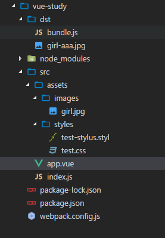

> 文件结构

 

> 初始化项目 & 安装依赖

```javascript
npm init
npm i webpack vue vue-loader style-loader url-loader file-loader stylus stylus-loader
// npm WARN vue-loader@13.7.0 requires a peer of css-loader@* but none is installed. You must install peer dependencies yourself.
// npm WARN vue-loader@13.7.0 requires a peer of vue-template-compiler@^2.0.0 but none is installed. You must install peer dependencies yourself.
// 出现警告，根据提示安装css-loader  vue-template-compiler
npm i css-loader  vue-template-compiler
npm i cross-env             // 解决不同平台设置参数方式不同的问题
npm i webpack-dev-server    // 热加载
npm i html-webpack-plugin
// html-webpack-plugin
// 1. 为 html 文件中引入的外部资源如 script、link 动态添加每次 compile 后的 hash，防止引用缓存的外部文件问题
// 2. 可以生成 html 入口文件，比如单页面可以生成一个 html 文件入口，配置 N 个 html-webpack-plugin 可以生成N个页面入口
```

> package.json

```json
{
  "name": "vue-study",
  "version": "1.0.0",
  "description": "",
  "main": "index.js",
  "scripts": {
    "test": "echo \"Error: no test specified\" && exit 1",
    // 生产环境
    "build": "cross-env NODE_ENV=production webpack --config webpack.config.js",
    // 调试环境
    "dev": "cross-env NODE_ENV=development webpack-dev-server --config webpack.config.js"
  },
  "author": "",
  "license": "ISC",
  "dependencies": {
    "cross-env": "^5.1.3",
    "css-loader": "^0.28.9",
    "file-loader": "^1.1.6",
    "html-webpack-plugin": "^2.30.1",
    "style-loader": "^0.19.1",
    "stylus": "^0.54.5",
    "stylus-loader": "^3.0.1",
    "url-loader": "^0.6.2",
    "vue": "^2.5.13",
    "vue-loader": "^13.7.0",
    "vue-template-compiler": "^2.5.13",
    "webpack": "^3.10.0",
    "webpack-dev-server": "^2.11.1"
  }
}
```

> webpack.config.js

```javascript
const path = require('path')
const HTMLPlugin = require('html-webpack-plugin')
const webpack = require('webpack')
const isDev = process.env.NODE_ENV === 'development' // process.env.NODE_ENV获取参数值

const config = (module.exports = {
  target: 'web', // webpack-dev-server目标是web页面
  entry: path.join(__dirname, 'src/index.js'), // 入口文件
  output: {
    filename: 'bundle.js', //打包文件名
    path: path.join(__dirname, 'dst') //打包到的目录
  },
  module: {
    rules: [
      {
        test: /\.vue$/,
        loader: 'vue-loader' // 使用 vue-loader 加载 vue 文件
      },
      {
        test: /\.css$/,
        use: [
          'style-loader', // 将 css 文件插入到 bndle.js
          'css-loader' // 先进行 css-loader 再进行 style-loade 处理 css 文件
        ]
      },
      {
        test: /\.styl$/,
        use: [
          'style-loader',
          'css-loader',
          'stylus-loader' // css预处理器(like sass-loader...)
        ]
      },
      {
        test: /\.(gif|jpg|png|svg)$/,
        use: [
          {
            loader: 'url-loader',
            options: {
              limit: 1024, // < 1m 转为base64写到代码中, > 1m 打包到指定的dst目录
              name: '[name]-aaa.[ext]'
            }
          }
        ]
      }
    ]
  },
  plugins: [
    new webpack.DefinePlugin({
      'process.env': {
        // webpack 编译过程中和页面 js 代码中可以使用 process.env
        NODE_ENV: isDev ? '"development"' : '"production"'
      }
    }),
    new HTMLPlugin() //使用HTMLPlugin
  ]
})

if (isDev) {
  config.devtool = '#cheap-module-eval-source-map' //代码映射,在浏览器里显示的还是vue的代码便于调试
  ;(config.devServer = {
    port: 8000,
    host: '0.0.0.0', //0.0.0.0 可以用127.0.0.1/localhost/内网访问
    overlay: {
      errors: true //错误显示在网页上
    },
    // open:true 自动打开浏览器
    hot: true //只重新渲染修改的部分
  }),
    config.plugins.push(
      new webpack.HotModuleReplacementPlugin(), //自动刷新浏览器
      new webpack.NoEmitOnErrorsPlugin()
    )
}
module.exports = config //导出配置
```

> index.js

```javascript
import Vue from 'vue'
import App from './app.vue'
import './assets/styles/test.css'
import './assets/styles/test-stylus.styl'
import './assets/images/girl.jpg'

const root = document.createElement('div')
document.body.appendChild(root)

new Vue({
  //h(App) createApp
  render: h => h(App)
}).$mount(root) //挂载到dom上

/*
render: h => h(App) 是下面内容的缩写：

render: function (createElement) {
    return createElement(App);
}

进一步缩写为(ES6 语法)：
render (createElement) {
    return createElement(App);
}

再进一步缩写为：

render (h){
    return h(App);
}

按照 ES6 箭头函数的写法，就得到了：
render: h => h(App);
*/
```

> app.vue

```javascript
<template>
    <div id='test'>{{text}}</div>
</template>

<script>
    export default{
        data(){
            return{
                text:'abc'
            }
        }
    }
</script>
<style>
    #test{
        color:red;
    }
</style>
```

> styles

```css
/* test.css */
body{
    color:red;
    background-image: url('../images/girl.jpg');
}
/* test-stylus.styl */
body
  font-size 40px
```
