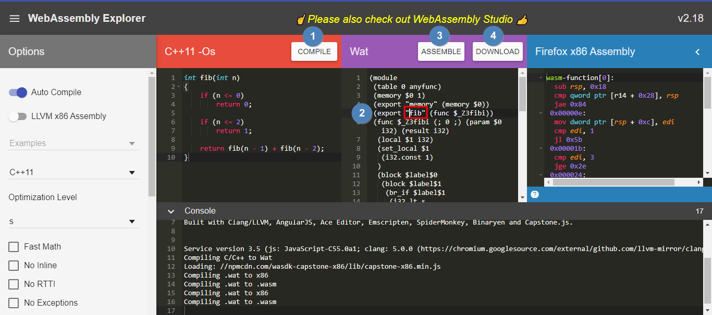

### c++ fibnacci

```c++
#include <iostream>
#include <ctime>

using namespace std;

int fib(int n)
{
    if (n <= 0)
        return 0;

    if (n <= 2)
        return 1;

    return fib(n - 1) + fib(n - 2);
}

int main()
{
    int t1, t2;

    t1 = clock();

    fib(40);

    t2 = clock();

    cout << t2 - t1 << "ms" << endl;

    return 0;
}

// g++ .\fib.cpp -o fib   // 509ms
// g++ .\fib.cpp -o fib -O4  // optimize 288ms
```

### js fibnacci

```js
<!DOCTYPE html>
<html lang="en">
    <head>
        <meta charset="UTF-8" />
        <meta name="viewport" content="width=device-width, initial-scale=1.0" />
        <title>fib</title>
    </head>
    <body>
        <script>
            function fib(n) {
                if (n <= 0) {
                    return 0;
                }

                if (n <= 2) {
                    return 1;
                }

                return fib(n - 1) + fib(n - 2);
            }

            console.time("test fib: ");
            const res = fib(40);
            console.timeEnd("test fib: "); // test fib: : 1006.141845703125ms
        </script>
    </body>
</html>
```

### webassemby fibnacci

[WasmExplorer](https://mbebenita.github.io/WasmExplorer/) complie c++ to wasm



load wasm

```html
<!DOCTYPE html>
<html lang="en">
    <head>
        <meta charset="UTF-8" />
        <meta name="viewport" content="width=device-width, initial-scale=1.0" />
        <title>fib</title>
    </head>

    <body>
        <script>
            fetch("./fib.wasm")
                .then((response) => {
                    return response.arrayBuffer();
                })
                .then((bytes) => {
                    return WebAssembly.compile(bytes);
                })
                .then((mod) => {
                    const instance = new WebAssembly.Instance(mod);
                    const { fib } = instance.exports;
                    console.time("test wasm fib: ");
                    const res = fib(40);
                    console.timeEnd("test wasm fib: "); // test wasm fib: : 840.23291015625ms
                });
        </script>
    </body>
</html>
```

