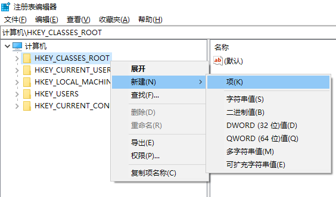
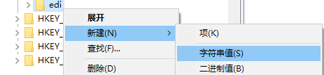
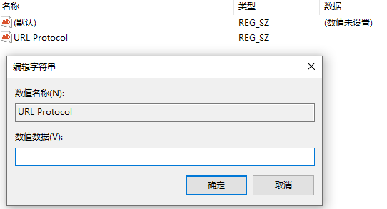
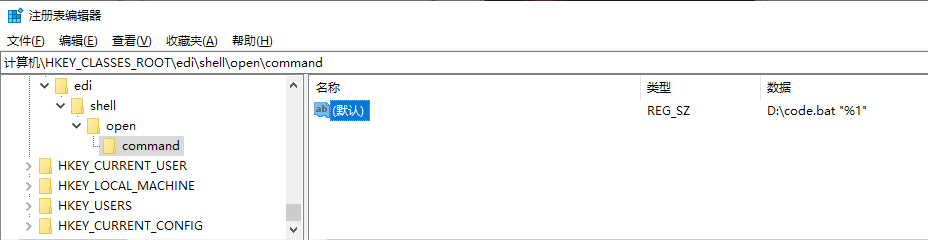
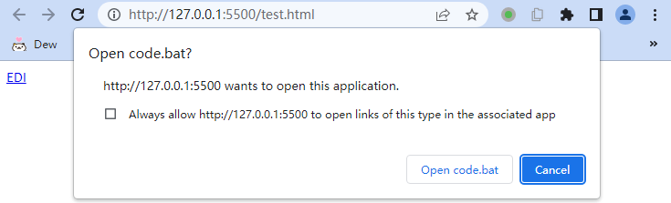

> 引用: [How do I register a custom URL protocol in Windows? - Stack Overflow](https://stackoverflow.com/questions/80650/how-do-i-register-a-custom-url-protocol-in-windows)

1. 打开注册表编辑器 **regedit**, 在 HKEY_CLASSES_ROOT 新建项，填入你自定义的协议名称，这里填写 edi (注意名称需要小写).

   

2. 在新建的 edi 项下新建字符串值，数值名称为 **URL Protocol**，数值数据为空。

   

   

3. 在 edi 项按照层级依次建立 shell, open 和 command 项，然后在 command 项默认的数值名称的数据中填入要调用的命令`D:\code.bat "%1"`。 其中 `%1` 是使用是整个 URL 地址, 例如 `"edi://localhost/D:/test.edi"`.

    

4. code.bat 代码如下。

   ```bat
   @echo off
   
   setlocal enabledelayedexpansion
   
   @REM url is like "edi://localhost/D:\test.edi" or "edi://localhost/D:/test.edi"
   set url=%1
   @REM set url="edi://localhost/D:/test.edi"
   
   
   @REM remove prefix edi://localhost/ and suffix "
   @REM filepath is like D:%5Ctest.edi or D:/test.edi
   set filepath=%url:~17,-1% 
   
   @REM restore %5C to \
   set filepath=!filepath:%%5C=\!
   echo %filepath%
   
   @REM use VSCode oepn edi file
   code %filepath%
   ```

5. 在`a`标签中使用自定义的协议，当点击 EDI 时，浏览器会询问是否打开 code.bat, 允许之后会使用 VSCode 打开 D 盘下的 test.edi 文件。

   ```html
   <!DOCTYPE html>
   <html>
     <head>
       <title>Window custom URL protocol</title>
     </head>
   
     <body>
       <a href="edi://localhost/D:\test.edi"
         >EDI</a
       >
     </body>
   </html>
   ```

   

6. 自定义 URL protocol 还可以用来使用 GoldenDict 搜索单词，`<a href="gdlookup://localhost/mouse deer">mouse deer</a>`
    ```bat
    @echo off 

    setlocal enabledelayedexpansion
    @REM url is like "gdlookup://localhost/mouse%20%deer\?gdanchor=g1bd08aec62cc0aded1a907a893b58c82_172fdc30"
    @REM note that "\?" is ? when parsed
    set url=%1

    @REM short-url is like gdlookup://localhost/mouse%20%deer
    for /f "tokens=1 delims=?" %%i in (%url%) do (set short-url=%%i)
    echo %short-url%

    @REM word is mouse%20%deer
    for /f "tokens=3 delims=/" %%j in ("%short-url%") do (set word=%%j)
    @REM echo %word%

    @REM restore url encode space
    set replaced=!word:%%20= !
    @REM echo %replaced%

    D:\GoldenDict\GoldenDict.exe "%replaced%"

    @REM pause
    ```

