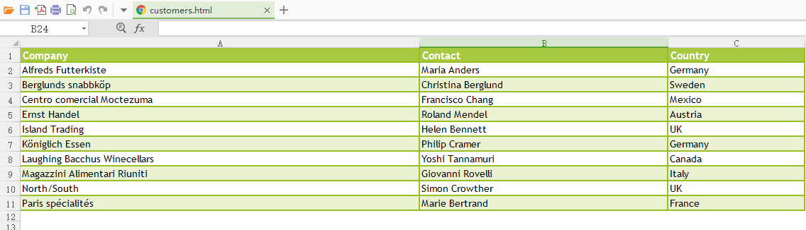
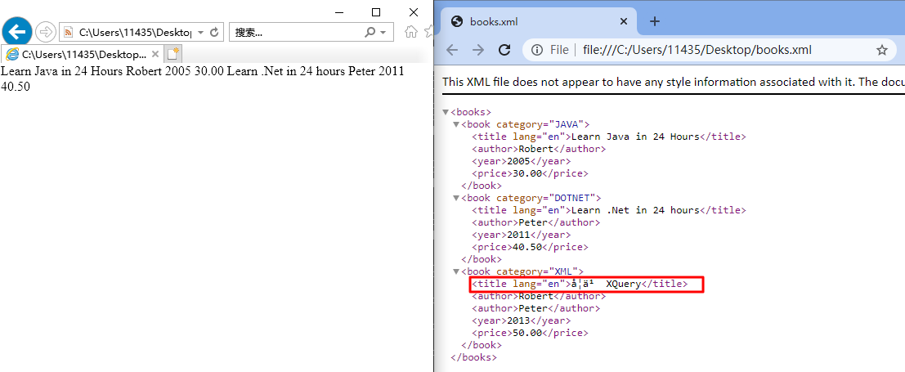

> [XML Technologies Tutorials](https://www.tutorialspoint.com/xml_technologies_tutorials.htm)

## DTD

> [DTD - Quick Guide - Tutorialspoint](https://www.tutorialspoint.com/dtd/dtd_quick_guide.htm)

address.xml

```xml-dtd
<?xml version = "1.0" encoding = "UTF-8" standalone = "yes" ?>

<!DOCTYPE address [
   <!ELEMENT address (name,company,phone)>
   <!ELEMENT name (#PCDATA)>
   <!ELEMENT company (#PCDATA)>
   <!ELEMENT phone (#PCDATA)>
]>

<address>
   <name>Tanmay Patil</name>
   <company>TutorialsPoint</company>
   <phone>(011) 123-4567</phone>
</address>
```

address.xml & address.dtd

```xml
<?xml version = "1.0" encoding = "UTF-8" standalone = "no" ?>
<!DOCTYPE address SYSTEM "address.dtd">

<address>
  <name>Tanmay Patil</name>
  <company>TutorialsPoint</company>
  <phone>(011) 123-4567</phone>
</address>
```

```dtd
<!ELEMENT address (name,company,phone)>
<!ELEMENT name (#PCDATA)>
<!ELEMENT company (#PCDATA)>
<!ELEMENT phone (#PCDATA)>
```

## XSD

> [XSD - Quick Guide - Tutorialspoint](https://www.tutorialspoint.com/xsd/xsd_quick_guide.htm)

students.xml

```xml
<?xml version = "1.0"?>

<!-- <class xmlns = "http://www.tutorialspoint.com"
   xmlns:xsi = "http://www.w3.org/2001/XMLSchema-instance"
   xsi:schemaLocation = "http://www.tutorialspoint.com student.xsd">  -->

<class xmlns:xsi="http://www.w3.org/2001/XMLSchema-instance"
       xsi:noNamespaceSchemaLocation="students.xsd">
   <student rollno = "393">
      <firstname>Dinkar</firstname>
      <lastname>Kad</lastname>
      <nickname>Dinkar</nickname>
      <marks>85</marks>
   </student>

   <student rollno = "493">
      <firstname>Vaneet</firstname>
      <lastname>Gupta</lastname>
      <nickname>Vinni</nickname>
      <marks>95</marks>
   </student>

   <student rollno = "593">
      <firstname>Jasvir</firstname>
      <lastname>Singh</lastname>
      <nickname>Jazz</nickname>
      <marks>90</marks>
   </student>
</class>
```

students.xsd

```xml
<?xml version = "1.0"?>

<xs:schema xmlns:xs = "http://www.w3.org/2001/XMLSchema">
   <xs:element name = 'class'>
      <xs:complexType>
         <xs:sequence>
             <xs:element name = 'student' type = 'StudentType' minOccurs = '0'
                maxOccurs = 'unbounded' />
         </xs:sequence>
      </xs:complexType>
   </xs:element>

   <xs:complexType name = "StudentType">
      <xs:sequence>
         <xs:element name = "firstname" type = "xs:string"/>
         <xs:element name = "lastname" type = "xs:string"/>
         <xs:element name = "nickname" type = "xs:string"/>
         <xs:element name = "marks" type = "xs:positiveInteger"/>
      </xs:sequence>
      <xs:attribute name = 'rollno' type = 'xs:positiveInteger'/>
   </xs:complexType>
</xs:schema>
```

## DOM

> [XML DOM - Quick Guide - Tutorialspoint](https://www.tutorialspoint.com/dom/xml_dom_quick_guide.htm)

node.xml

```xml
<Company>
   <Employee category = "Technical" id = "firstelement">
      <FirstName>Tanmay</FirstName>
      <LastName>Patil</LastName>
      <ContactNo>1234567890</ContactNo>
      <Email>tanmaypatil@xyz.com</Email>
   </Employee>

   <Employee category = "Non-Technical">
      <FirstName>Taniya</FirstName>
      <LastName>Mishra</LastName>
      <ContactNo>1234667898</ContactNo>
      <Email>taniyamishra@xyz.com</Email>
   </Employee>

   <Employee category = "Management">
      <FirstName>Tanisha</FirstName>
      <LastName>Sharma</LastName>
      <ContactNo>1234562350</ContactNo>
      <Email>tanishasharma@xyz.com</Email>
   </Employee>
</Company>
```

index.html

```html
<!DOCTYPE html>
<html>
    <body>
        <div>
            <b>FirstName:</b> <span id="FirstName"></span><br />
            <b>LastName:</b> <span id="LastName"></span><br />
            <b>ContactNo:</b> <span id="ContactNo"></span><br />
            <b>Email:</b> <span id="Email"></span>
        </div>
        <script>
            const xmlhttp;

            //if browser supports XMLHttpRequest
            if (window.XMLHttpRequest) {
                // Create an instance of XMLHttpRequest object. code for IE7+, Firefox, Chrome, Opera, Safari
                xmlhttp = new XMLHttpRequest();
            } else {
                // code for IE6, IE5
                xmlhttp = new ActiveXObject("Microsoft.XMLHTTP");
            }

            // sets and sends the request for calling "node.xml"
            xmlhttp.open("GET", "/dom/node.xml", false);
            xmlhttp.send();

            // sets and returns the content as XML DOM
            xmlDoc = xmlhttp.responseXML;

            //parsing the DOM object
            document.getElementById("FirstName").innerHTML =
                xmlDoc.getElementsByTagName("FirstName")[0].childNodes[0].nodeValue;
            document.getElementById("LastName").innerHTML =
                xmlDoc.getElementsByTagName("LastName")[0].childNodes[0].nodeValue;
            document.getElementById("ContactNo").innerHTML =
                xmlDoc.getElementsByTagName("ContactNo")[0].childNodes[0].nodeValue;
            document.getElementById("Email").innerHTML =
                xmlDoc.getElementsByTagName("Email")[0].childNodes[0].nodeValue;s
        </script>
    </body>
</html>
```

## XPath

> [XPath - Quick Guide - Tutorialspoint](https://www.tutorialspoint.com/xpath/xpath_quick_guide.htm)

students.xml

```xml
<?xml version = "1.0"?>
<?xml-stylesheet type = "text/xsl" href = "students.xsl"?>
<class>
   <student rollno = "393">
      <firstname>Dinkar</firstname>
      <lastname>Kad</lastname>
      <nickname>Dinkar</nickname>
      <marks>85</marks>
   </student>
   <student rollno = "493">
      <firstname>Vaneet</firstname>
      <lastname>Gupta</lastname>
      <nickname>Vinni</nickname>
      <marks>95</marks>
   </student>
   <student rollno = "593">
      <firstname>Jasvir</firstname>
      <lastname>Singh</lastname>
      <nickname>Jazz</nickname>
      <marks>90</marks>
   </student>
</class>
```

students.xsl

```xml
<?xml version = "1.0" encoding = "UTF-8"?>
<xsl:stylesheet version = "1.0"
   xmlns:xsl = "http://www.w3.org/1999/XSL/Transform">

   <xsl:template match = "/">
      <html>
         <body>
            <h2>Students</h2>
            <table border = "1">
               <tr bgcolor = "#9acd32">
                  <th>Roll No</th>
                  <th>First Name</th>
                  <th>Last Name</th>
                  <th>Nick Name</th>
                  <th>Marks</th>
               </tr>
               <xsl:for-each select = "class/student">
                  <tr>
                     <td><xsl:value-of select = "@rollno"/></td>
                     <td><xsl:value-of select = "firstname"/></td>
                     <td><xsl:value-of select = "lastname"/></td>
                     <td><xsl:value-of select = "nickname"/></td>
                     <td><xsl:value-of select = "marks"/></td>
                  </tr>
               </xsl:for-each>
            </table>
         </body>
      </html>
   </xsl:template>

</xsl:stylesheet>
```

## XQuery

> [XQuery - Quick Guide - Tutorialspoint](https://www.tutorialspoint.com/xquery/xquery_quick_guide.htm)

books.xml

```xml
<?xml version="1.0" encoding="UTF-8"?>
<books>

   <book category="JAVA">
      <title lang="en">Learn Java in 24 Hours</title>
      <author>Robert</author>
      <year>2005</year>
      <price>30.00</price>
   </book>

   <book category="DOTNET">
      <title lang="en">Learn .Net in 24 hours</title>
      <author>Peter</author>
      <year>2011</year>
      <price>40.50</price>
   </book>

   <book category="XML">
      <title lang="en">Learn XQuery in 24 hours</title>
      <author>Robert</author>
      <author>Peter</author>
      <year>2013</year>
      <price>50.00</price>
   </book>

   <book category="XML">
      <title lang="en">Learn XPath in 24 hours</title>
      <author>Jay Ban</author>
      <year>2010</year>
      <price>16.50</price>
   </book>

</books>
```

books.xqy

```xquery
for $x in doc("books.xml")/books/book
where $x/price>30
return $x/title

(: result :)
(: <title lang="en">Learn .Net in 24 hours</title> :)
(: <title lang="en">Learn XQuery in 24 hours</title> :)
```

## XSLT

> [XSLT - Quick Guide - Tutorialspoint](https://www.tutorialspoint.com/xslt/xslt_quick_guide.htm)

students.xml

```xml
<?xml version = "1.0"?>
<?xml-stylesheet type = "text/xsl" href = "students.xsl"?>
<class>
   <student rollno = "393">
      <firstname>Dinkar</firstname>
      <lastname>Kad</lastname>
      <nickname>Dinkar</nickname>
      <marks>85</marks>
   </student>
   <student rollno = "493">
      <firstname>Vaneet</firstname>
      <lastname>Gupta</lastname>
      <nickname>Vinni</nickname>
      <marks>95</marks>
   </student>
   <student rollno = "593">
      <firstname>Jasvir</firstname>
      <lastname>Singh</lastname>
      <nickname>Jazz</nickname>
      <marks>90</marks>
   </student>
</class>
```

students.xsl

```xml
<?xml version = "1.0" encoding = "UTF-8"?>
<xsl:stylesheet version = "1.0"
   xmlns:xsl = "http://www.w3.org/1999/XSL/Transform">

   <xsl:template match = "/">
      <html>
         <body>
            <h2>Students</h2>
            <table border = "1">
               <tr bgcolor = "#9acd32">
                  <th>Roll No</th>
                  <th>First Name</th>
                  <th>Last Name</th>
                  <th>Nick Name</th>
                  <th>Marks</th>
               </tr>
               <xsl:for-each select = "class/student">
                  <tr>
                     <td><xsl:value-of select = "@rollno"/></td>
                     <td><xsl:value-of select = "firstname"/></td>
                     <td><xsl:value-of select = "lastname"/></td>
                     <td><xsl:value-of select = "nickname"/></td>
                     <td><xsl:value-of select = "marks"/></td>
                  </tr>
               </xsl:for-each>
            </table>
         </body>
      </html>
   </xsl:template>

</xsl:stylesheet>
```


## XML Tool

>  [BaseX | The XML Framework: Lightweight and High-Performance Data Processing](https://basex.org/)

> [XML - Visual Studio Code Plugin](https://marketplace.visualstudio.com/items?itemName=redhat.vscode-xml)

> [XML Tools - Visual Studio Code Plugin](https://marketplace.visualstudio.com/items?itemName=DotJoshJohnson.xml)

## XML、HTML and Excel

XML 和 HTML 可以使用 Excel 打开，并且HTML 中可以使用 CSS 样式。

customers.html

```html
<!DOCTYPE html>
<html lang="en">
    <!-- <head>
        <meta charset="UTF-8" />
        <meta name="viewport" content="width=device-width, initial-scale=1.0" />
        <title>table</title>
    </head> -->
    <style>
        #customers {
            font-family: "Trebuchet MS", Arial, Helvetica, sans-serif;
            width: 100%;
            border-collapse: collapse;
        }

        #customers td,
        #customers th {
            font-size: 1em;
            border: 1px solid #98bf21;
            padding: 3px 7px 2px 7px;
        }

        #customers th {
            font-size: 1.1em;
            text-align: left;
            padding-top: 5px;
            padding-bottom: 4px;
            background-color: #a7c942;
            color: #ffffff;
        }

        #customers tr.alt td {
            color: #000000;
            background-color: #eaf2d3;
        }
    </style>
    <body>
        <table id="customers">
            <tr>
                <th>Company</th>
                <th>Contact</th>
                <th>Country</th>
            </tr>
            <tr>
                <td>Alfreds Futterkiste</td>
                <td>Maria Anders</td>
                <td>Germany</td>
            </tr>
            <tr class="alt">
                <td>Berglunds snabbköp</td>
                <td>Christina Berglund</td>
                <td>Sweden</td>
            </tr>
            <tr>
                <td>Centro comercial Moctezuma</td>
                <td>Francisco Chang</td>
                <td>Mexico</td>
            </tr>
            <tr class="alt">
                <td>Ernst Handel</td>
                <td>Roland Mendel</td>
                <td>Austria</td>
            </tr>
            <tr>
                <td>Island Trading</td>
                <td>Helen Bennett</td>
                <td>UK</td>
            </tr>
            <tr class="alt">
                <td>Königlich Essen</td>
                <td>Philip Cramer</td>
                <td>Germany</td>
            </tr>
            <tr>
                <td>Laughing Bacchus Winecellars</td>
                <td>Yoshi Tannamuri</td>
                <td>Canada</td>
            </tr>
            <tr class="alt">
                <td>Magazzini Alimentari Riuniti</td>
                <td>Giovanni Rovelli</td>
                <td>Italy</td>
            </tr>
            <tr>
                <td>North/South</td>
                <td>Simon Crowther</td>
                <td>UK</td>
            </tr>
            <tr class="alt">
                <td>Paris spécialités</td>
                <td>Marie Bertrand</td>
                <td>France</td>
            </tr>
        </table>
    </body>
</html>
```



目前发现需要注意的问题：

- 01 在 Excel 中会显示为 1, 需要在 XML、HTML 中写成 ="01",  类似 csv 使用 Excel 打开的表现。
- XML 中的元素属性也会变成 Excel 中的一列。
- HTML 中不应该有 header 标签否则样式不生效。

扩展：在 ERP 中使用 RTF 开发报表时生成的 xls 文件实际就是包含样式的 HTML 文件，所以可以考虑不借助 RTF Template 而是直接输出 HTML 并将文件后缀修改为 xls（可以用 Excel 直接打开，并进行公式计算等）. 这种做法的好处是比较灵活，例如可以为不同客户编写不同的样式文件，也可以定义多套样式，每次报表输出随机选择其中一个样式等。 

## XML Parser

不同的解析器对 xml 的表现可能存在差异, 如下 xml 中包含中文 `学习`, 但是 encoding 使用 `ASCII`, 分別在 IE 和 Chrome 中打开。

```xml
<?xml version="1.0" encoding="ASCII"?>
<books>

   <book category="JAVA">
      <title lang="en">Learn Java in 24 Hours</title>
      <author>Robert</author>
      <year>2005</year>
      <price>30.00</price>
   </book>

   <book category="DOTNET">
      <title lang="en">Learn .Net in 24 hours</title>
      <author>Peter</author>
      <year>2011</year>
      <price>40.50</price>
   </book>

   <book category="XML">
      <title lang="en">学习 XQuery</title>
      <author>Robert</author>
      <author>Peter</author>
      <year>2013</year>
      <price>50.00</price>
   </book>

</books>
```

如下，IE 发现非 ASCII 字符会停止解析，Chrome 会尝试解析但是中文也会显示错误，因为 xml 中指定 `encoding="ASCII"` 但是 `ASCII ` 不包含中文。如果 xml 中包含中文需要使用 `encoding="UTF-8"`.

