## 虫师

> 梦与现实的夹缝处就是“魂居之处”，谁若能通过这条路，就能看见那个世界。 -漆原友纪

## 夏目友人帐

> 我想成为一个温柔的人，因为曾被温柔的人那样对待，深深了解那种被温柔相待的感觉。

> 其实，我呼唤了无数次，每一次，终究没都没有人回答。无论如何呼唤，如何祈愿，都有无法企及的东西。 然后，我决定不再呼唤那些，即使呼唤也没有回应的东西。

> 孤单一人很寂寞，会害怕迈出第一步。我还是老样子，过着繁琐的日子，虽然还是不擅长对付妖怪，只是偶尔陪他们交交心的话也不错。

> 每次将名字还给妖怪们时，对玲子的回忆也日渐增强，慢慢地汇成思念流入我体内的玲子外婆的点点滴滴。-绿川幸

## 萤火之森

> 如果时光可以倒流，我还是会选择认识你，虽然会伤痕累累，但是心中的温暖记忆是谁都无法给予的，谢谢你来过我的世界。-绿川幸

## 未闻花名

> 藏好了吗，藏好了哟，找到你了，被找到了。

> 我最喜欢仁太。 仁太的这个最喜欢是想成为仁太的新娘子的那个最喜欢。

> 我很想见你，一直很想见到你，想呼唤你的名字，想向你道歉，想说喜欢你。但是大家也是一样的，大家都想说喜欢你，大家都想见你，大家都等着你，等着我们，在那个属于我们的地方。

> 在我们走过的季节里，路旁盛开的花朵也在不断变化，那个季节盛开的花是叫什么来着？轻轻摇曳着，一碰会微微刺痛，靠近一闻，隐约有股青涩的阳光的气息。那气息渐渐地淡去，我们也在慢慢长大。可是，那朵花一定还在某个地方盛开着……对，我们永远都会继续实现那朵花的愿望。-（导演）长井龙雪，（编剧）冈田麿里

## 三月的狮子

> 小时候我曾在 大白天看过落雷
> 水色的天空中 如同水银 倾泻而下一般
> 淡淡的闪光 我 被那不可捉摸的模样深吸引
> ——就算 那道光芒
> 在其后 将会带来沉重激烈的滂沱大雨 -羽海野千花

## 蜂蜜与四叶草

> 在我还很小的时候，骑着那辆，无论走到那里都陪伴着我的蓝色自行车，有时，突然想到，如果一次也不回头，我能走到那里呢？那个时候，我想尝试的，究竟是什么呢？-羽海野千花

## 四月是你的谎言

> 春天，马上就要来了。让我与你相遇的春天，就要来了。再也没有你的春天，就要来了。-新川直司

## 强风吹拂

> 以为只要努力就一定能成功，其实是一种傲慢。 -三浦紫苑

## 编舟记

> 词语的海洋浩瀚无边，词典是那片大海中的一叶扁舟，人类靠着这叶名为词典的扁舟航海，找寻最能表达自己心情的言语。那是找到独一无二的奇迹，献给想与人关联期望渡过浩淼大海人们的词典，那就是《大渡海》。-三浦紫苑

## 十二国记

> 人真的容易和其他人竞争不幸呢。明明死去的人才是最可怜的。一旦同情别人，就好像自己输了一样。也许”自己最可怜”和”自己最幸福”的想法同样让人自我感觉良好吧。当被人提醒”你错了”时，会很生气吧。这时人会想”为什么还要指责已经如此可怜如此不幸的我。” -小野不由美

## 尸鬼

> 葬礼是为活着的人准备的，他们需要一个宣泄伤感的场所。-小野不由美

## 犬夜叉

> 我是风，自由的风。

> 一切开始于神木，不断寻求，不断战斗，从中产生强烈的羁绊，穿越千百年的时光，在最后仅存的四魂之玉碎片，引导着各自的命运，战国的童话故事-犬夜叉。 -高桥留美子

## 钢之炼金术师

> 人没有牺牲的话就什么也得不到，为了得到什么就必须要做出同等的代价，这就是炼金术的等价交换原则，那时的我们相信这就是世界的真实。-荒川弘

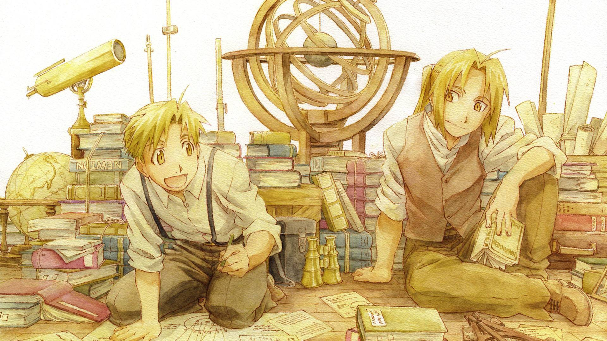

## 玻璃假面

> 时间有匹敌千军万马的力量，是我最可靠的伙伴。-美内铃惠

## 地狱少女

> 人世有情，相连的红线不停的缠绕，脆弱又惹人怜的彼岸花。愤怒、悲伤、终日以泪洗面，在子夜凌晨的夜幕后，为你消除无法平息的怨恨。-（原案）渡边浩、（导演）大森貴弘

## 蔷薇少女

> 但是与我的战斗相伴的痛苦也好，悲伤也好，从今以后也会经常受伤或者伤害到别人吧！还有无法如愿的事，反复的睡去与醒来，怀抱着多次的相逢与离别，记忆的面纱像花瓣一样重叠，围绕着时间和人开花，我们高贵的盛开，因为我们是蔷薇少女。-PEACH-PIT

## 死亡笔记

> 死神界的苹果像沙一样，人间界的苹果多汁。（硫克）

> 如果世上都是些“虚伪”的天使，那么我愿意做最真实的“恶魔”！-大场鸫、小畑健

## 食梦者

> 亚城木梦叶 - 亚豆美保，真诚最高，高木秋人，梦想实现。-大场鸫、小畑健

## 棋魂

> 连接遥远的过去与未来，我们为此而存在…… -堀田由美、小畑健

## 死神

> 如果我是雨的话，也能像连接那永远都不将交汇的天空和大地一样，去连接某个人的心吗？ -久保带人

## 银魂

> 眼泪这东西啊，是流出来就能把辛酸和悲伤都冲走的好东西。可等你们长大成人了就会明白，人生还有眼泪也冲刷不干净的巨大悲伤，还有难忘的痛苦让你们即使想哭也不能流泪，所以真正坚强的人，都是越想哭反而笑得越大声，怀揣着痛苦和悲伤，即使如此也要带上它们笑着前行。-空知英秋

## 王者天下

> 我以前也很讨厌月亮呢，处于痛苦深渊的底层时抬头看到的月亮，会比平时更加的光辉艳丽，仿佛就是在嘲笑自己似的，开什么玩笑！那时的我就是怀着这种心情看着月亮的，可是，却有人告诉我事情并非如此，月亮之所以会比平时更加的光辉艳丽，实际上是在鼓励你，不要因为挫折而放弃。-原泰久

## 浪客剑心

> 对与错，应该由历史来决定。我们能做的，就是相信自己认为是对的事，然后为此战斗……不过我认为那个强者生，弱者死的……弱肉强食时代，绝对是错的！绝对错！-和月伸宏

## 薄樱鬼

> 绚烂如繁樱，瞬息绽放后凋落。花以香为证，曾美至惊心动魄。-藤泽经清

## 黑执事

> 用我那牵强的微笑，活出无人能比的骄傲。-枢梁

## 火影忍者

> 木叶飞舞之处，火亦生生不息。-岸本齐史

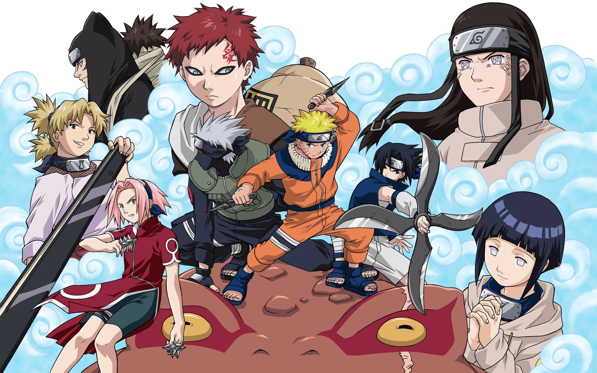

## 海贼王

> 历史传承的意志，时代的浪潮，人的梦想，这些都是挡不住的，只要人们继续追求自由的解答，这一切都将永不停止。-尾田荣一郎

## 家庭教师

> 雾可以阻挡天空的视线，却不能锁住天空前进的脚步。-天野明

## 名侦探柯南

> 夕阳，将世界像血一样染红了的，太阳的最终宿命，我还可以看多少次，这种悲哀的天色。-青山刚昌

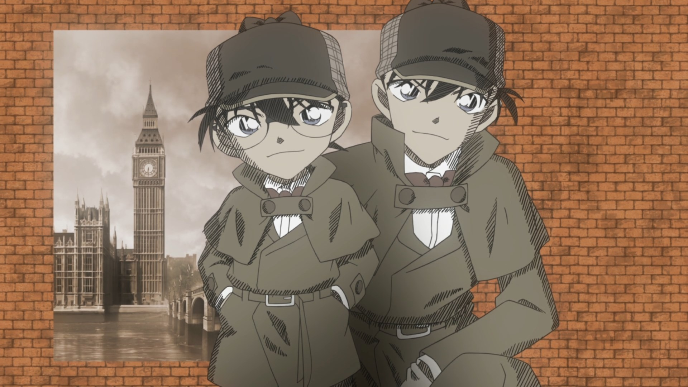

## 网球王子

> You Still Have Lots More To Work On！你还差的远呢！-许斐刚

## JOJO 的奇妙冒险

> 但我拒绝！我岸边露伴最喜欢的事情之一，就是向那些自以为是的家伙说，NO！

> 无论是何等样人，都有契合自身特性的发挥空间，君王有君王的领域，厨师有厨师的舞台，这就是所谓活着。-荒木飞吕彦

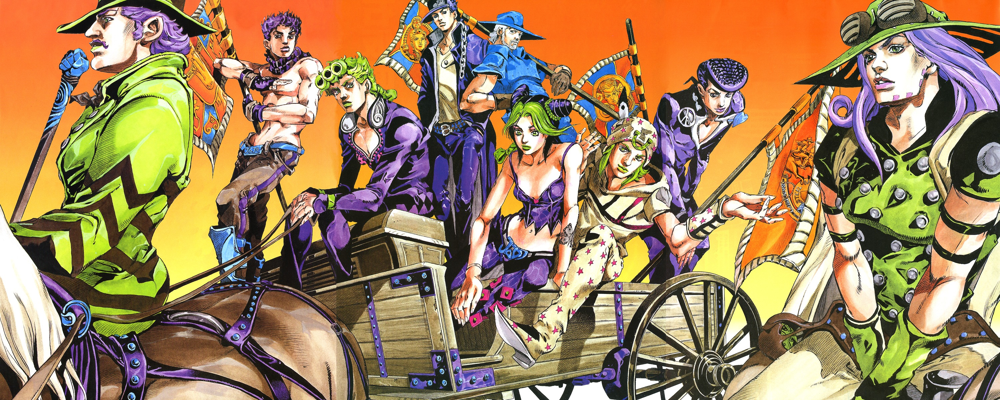

## 妖精的尾巴

> 我不认为依赖一个人有什么不对，在你的身边有许许多多的人，人与人之间总是紧密相连的，只要你伸出手我们就在你的身边。当你发现一个人很寂寞的时候，人就会变得温柔起来。-真岛浩

## 空之境界

> 逃避有两种：我们把有目的的逃避叫做飞翔，把没有目的的逃避叫做漂浮。-奈须蘑菇

## Fate/Zero

> 不过傲慢分为两种。一种是能力过于低下，还有一种是志向异常远大的。前者显得非常愚蠢，后者是难得一见的珍贵种类。-虚渊玄

## Fate/stay night

> 当一个人公平公正地去对待每个人的时候，那便等同于他已经无法爱上任何人。-奈须蘑菇/TYPE-MOON

## 魔法少女小圆

> 越是重复，就越是偏离你和我生活过的时间。心意也相互偏离，言语也渐渐无法相通。我想我大概早已经迷路了。“要拯救你”这是我最初的心意，而到如今，这是最后留下的唯一路标。-(编剧)虚渊玄、(导演)新房昭之

## 命运石之门

> 这一切都是命运石之门的选择！

## 凉宫春日

> 真正的危机不是机器人像人一样思考，而是人像机器一样思考。
>
> 我对普通的人类没有兴趣，你们当中要是有外星人、未来人、异世界人以及超能力者的话，就尽管来找我吧！-谷川流

## 只有我不存在的城市

> 『如果当时这么做就好了』这句话每天都萦绕于心。但是，它并没有化作真切的悔意。只是转瞬即逝的托词罢了。-三部敬

## 一拳超人

> 世界上，没有一拳解决不了的事，如果有，那就两拳。-ONE

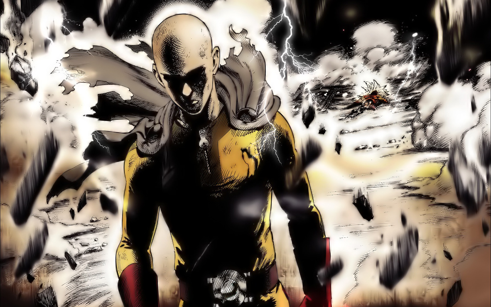

## 灵能百分百

> 既然你在为过去后悔，就该庆幸自己醒悟的及时啊！（灵幻新隆）

> 虽然我们生来便有和人们不同的“特别力量”，但绝对不能误以为自己是特别的存在。跑步快的人、唱歌好听的人、学习优秀的人、说话风趣的人、能使用超能力的人，你能断定他们孰优孰劣吗？对自己能力充满自信是好事，但不能骄傲。-ONE

## 暗杀教室

> 被大家所依赖的人，在自己受伤的时候往往只能独自面对痛苦。-松井优征

## 花田少年史

## 滑头鬼之孙

> 就算风吹散了冰雪，想念也会留存下来。-椎桥宽

## 野良神

> 在此引起骚乱者，吾神夜斗降临与此，臣服于雪器之威，去除各种污秽障壁！-安达渡嘉

## 东京暗鸦

> 或许这么做是错的，但是这是我所做出的选择啊！-字野耕平（あざの耕平）

## 黑之契约者

> 适用于所有的人的正义并不存在，有时候为了贯彻正义必须牺牲小部分人的利益而保护大多数人的利益，而这样的正义有时会被“完美”正义论者指责，而这也无可奈何，因为说远比做要简单得多。-BONES、冈村天斋

## 异度侵入

## 心理测量者 PSYCHO-PASS

> 人类可以通过内心的阴暗面，正视到隐藏在内心的残暴性，从而能培养出制约它们的良知、理性和善意。(原案)虚渊玄、(导演)本广克行、盐谷直义

## 幻灵镇魂曲 Phantom

> 没有拒绝孵化的蛋，更没有不想盛开的花朵，这不是意志的问题。-虚渊玄

## 黑礁

> 每个人的脚踝都陷于污水中，有些人选择挣脱污水，也有些人选择在污水中腐烂。 -广江礼威

## 无头骑士异闻录

> 距离男孩开门还有 17s，距离男孩看见女孩还有 14s，距离男孩踢飞男孩的朋友还有 12s，距离男孩像女孩表白还有...... -成田良悟

## 文豪野犬

> 从前，我不曾为自己的所作所为而后悔过，唯独对于没做过的事，总是后悔莫及。

> 金钱就是噩梦，想要的东西一到手，你就少了一个欲望，最终这个世界就会像枯叶燃烧时的青烟一样，变得乏味无趣。

> 不想失去的东西，总有一天还是会离你而去。人们渴求的一切存在价值的东西，从得到它的那一刻起就注定有失去的一天，不惜延长痛苦人生也要去追求的东西，一个都不存在。- 朝雾卡夫卡、春河 35

## 刀剑神域

> 这个世界，只需要一把剑就可以去往任何地方。-川原砾

## 加速世界

> 每个人都是活在以自己为主角的世界中。-川原砾

## 某科学的超电磁炮

> 当面对两难的抉择时，不妨丢一枚硬币吧，并非是要靠那二分之一的机运来帮你做出抉择！而是因为当硬币被抛上空中，开始旋转的那一瞬间你会突然明白，自己想要的！-镰池和马

## 罪恶王冠

> 就算是对我抱有敌意的人，也是被某个人深爱着而降生在这个世界上的。-（原创）Production I.G、（导演）荒木哲郎

## Another

> 夜见的黄昏下，空洞的苍之眸。-绫辻行人

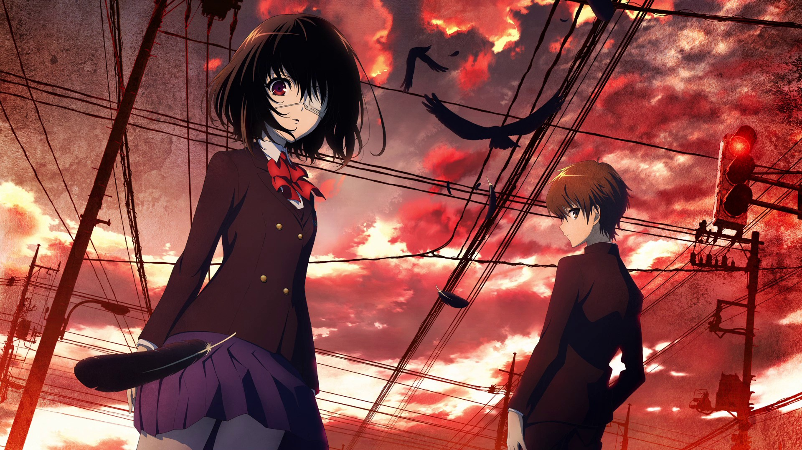

## 未来日记

> 雪辉，就由我来保护！所以雪辉你只要利用我就好了。-えすのサカエ

## 来自新世界

> 一旦醉心于狩猎，不到最后关头不会发现自己才是猎物。-贵志祐介

## 来自风平浪静的明天

> 自己觉得不错的东西，就会想要和自己觉得不错的伙伴们一起观赏。-冈田麿里

## 魔笛 MAGI

> 朋友，你是要跟我走一辈子的人，即使不在路上，你也永远住在我心里。-大高忍

## 相合之物

## 宝石之国

> 因为硬度低，如果没有了勇气就什么都不剩了。 -市川春子

## 多罗罗

> 难道我捡到并救活了你，就是为了让你尝遍伤心的滋味吗? -手冢治虫

## EVA 新世纪福音战士

> 所谓长大成人，就是不断的聚了散，散了又聚，为了让彼此不会受伤害而保持一个适当的距离！

> 雨
> 忧郁的感觉
> 就像我的感觉
> 我不喜欢
> 夕阳
> 逐渐消失的生命
> 我的愿望
> 我不喜欢
> 早上
> 是今天的开始
> 讨厌的一天的开始
> 我不喜欢
> 蓝天
> 不习惯的东西
> 恐怖的东西
> 不需要的东西
> 我不喜欢 -贞本义行

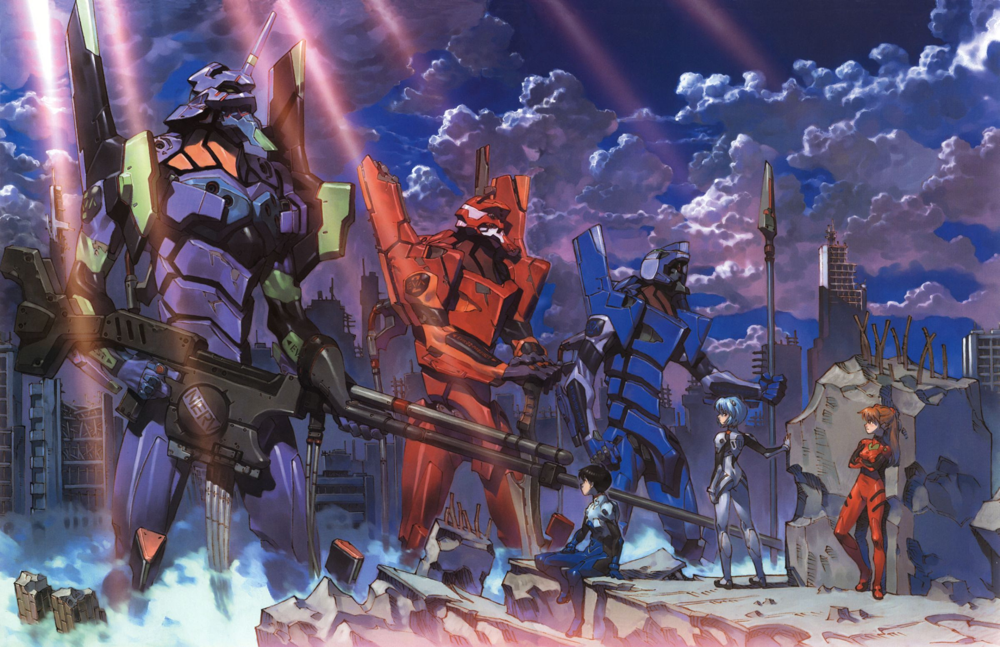

## 玉子市场

> 年轻人总是急于求成，就连等待一匙砂糖彻底溶解的耐心也没有，后悔所带来的苦涩，恰好印证了你曾经有所作为，这一点一滴都将成为点缀人生的各种味道。-（原创）京都动画、（导演）山田尚子

## 吹响吧!上低音号

> 人真是单纯，一旦知道有回报，就会去努力。努力若有成果，就会加倍努力。-武田绫乃

## 冰菓

> 我很好奇！(千反田爱瑠) -米泽穗信

## 文学少女

> 如果一个人感到寂寞的时候，就读书吧。想象一下，那个人在思考什么，想传达什么。那样的话，或许就会找到绝美的宝藏。-野村美月

## 高分少女

## 歌剧少女

## 花开伊吕波

> 有的人虽然没有自己的梦想，无法自己奔跑，但是努力追随有梦想的人，对他们来说也就是他们自己的梦想。-P.A.Works

## 花牌情缘

> 花开难波津，寒冬闭羞颜。今兮春满地，花开香芬芳。《小仓百人一首》-末次由纪

## 樱花庄的宠物女孩

> 我发现了，无聊的不是这段时光，而是和别人相似的自己。-鸭志田一

## 我们大家的河合庄

> 我不讨厌一个人，却讨厌被人觉得我很孤单。-宮原琉璃

## 更衣人偶坠入爱河

> 我们无从知晓他人心中所想，但每个人心中都有万千思绪。-福田晋一

## 我的青春恋爱物语果然有问题

> 温柔正确的人总是难以生存，因为这世界既不温柔，也不正确。-渡航

## 元气囝仔

> 所见之物皆美丽动人，这就是所谓的成长吗？-吉野五月

## 即使如此世界依然美丽

> 你虽然得到了世界，眼眸中却什么都没映出来呢? -椎名橙

## 月刊少女野崎君

> 就算犯规也无所谓，比赛就是要进行到被罚下场的那一刻。-椿泉

## 翼·年代记

> 一个人脸上有太多笑，是因为心中有太多泪。-CLAMP

## 四月一日灵异事件簿

> 世上没有偶然，有的只是必然。-CLAMP

## 人形电脑天使心

> 给东西取个名字然后去爱它，是成为变态的第一步。-CLAMP

## 通灵王

> 不管做什么事，必定有人赞成有人反对，因为大家重视的东西都有所不同。而且，不管什么事情，都可以随意给他加上好与不好的理由，所以，如果一定要分清争议与罪恶的行为，反而有问题呢。因此，重要的事情由心去决定就行了，不是凭感情，而是凭心！-武井宏之

## 七大罪

> 高举的手势即为胜利的证明，其背影阐述的便是最强二字。-铃木央

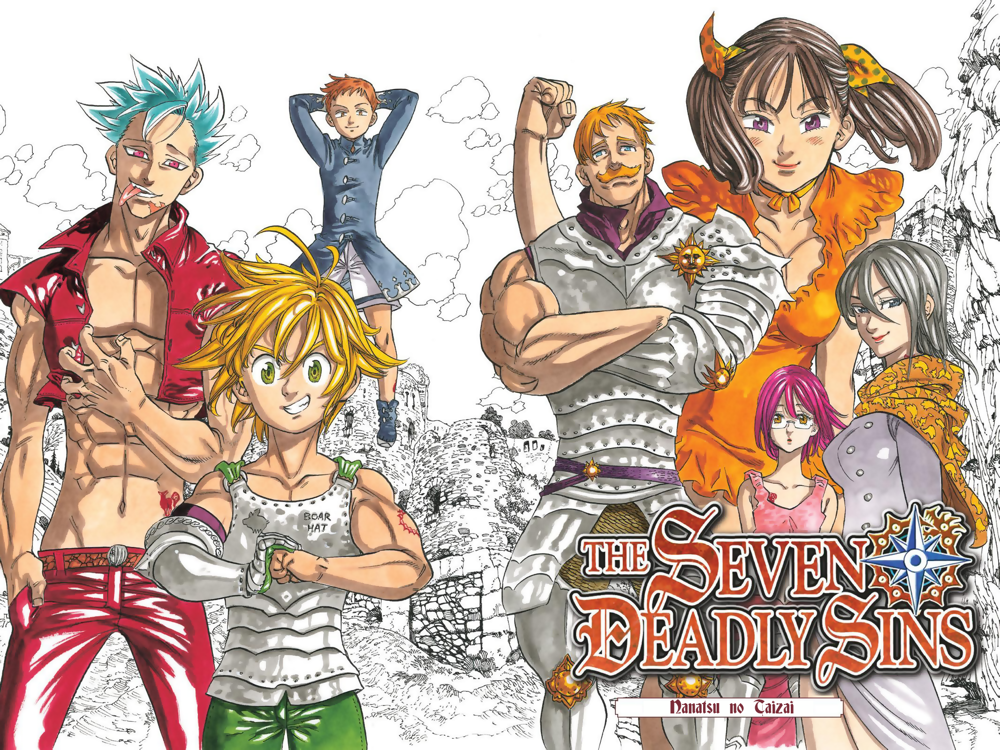

## 寄生兽

> 人类之所以会去照顾其他生物，是因为他感到空虚。之所以会想保护环境，是因为他不想被环境毁灭。-岩明均

## 东京喰种

> 无法舍弃两个方中的任何一方，那不是温柔，那不过是软弱罢了。-石田翠

## 电锯人

## 亚人

> 我只会表面做做样子，从来不会管别人的死活。-樱井画门

## 甲铁城的卡巴内瑞

> 看啊，被你们鄙视的男人流血不死，睁大眼看清楚，我会救你们的，让被自己抛弃的人拯救的记忆折磨你们一生，而我则会在地下嘲笑，你们活该。-(原创)WIT STUDIO

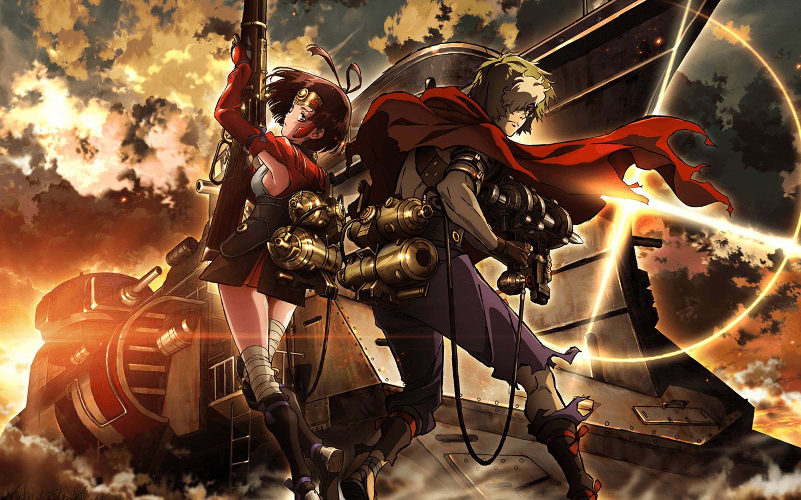

## 反叛的鲁路修

> 知道雪为什么是白色的吗？因为它忘记了自己曾经的颜色。-谷口悟朗、大河内一楼

## 大剑

> 相反的行为，矛盾的思想，还有被撕裂的精神，为了生存而做出的一切，将我的内心杀死了。-八木教广

## 全职猎人

> 尽可能预想所有残酷的可能性、因为现实永远让你无法预警，而且又吝于给人慈悲。-富坚义博

## 幽游白书

> 你刚才说我喜欢维持正义，其实你错了，只是碰巧我讨厌的人大多是恶徒。-富坚义博

## 怪物 MONSTER

> “不可思议呢，时间越长，悲伤慢慢淡去，快乐却逐渐清晰，人类真是自私的动物呢。”
> “所以才能存活下来吧。” -浦泽直树

## 日常

> 我们所过的每个平凡的日常，也许就是连续发生的奇迹。-あらゐけいいち

## 悠哉日常大王

> 这是我住的村子，是个悠哉宁静的地方，但是，有时我会想，莫非我是......住在乡下？-atto

## 男子高校生的日常

> 今天的风 甚为喧嚣啊
> 不过这风似乎 在哭泣的样子
>
> 这股风把一些坏东西 带到镇上去了
> 快走吧 趁风停止之前
> 要来不及了 那边的便利商店 洋芋片只要半价 -山内泰延

## 乒乓

> 你正手无力，反手不精，脚步松散，反应迟钝，没一个动作像样的！就凭这还想和我同场竞技？做你的美梦！-松本大洋

## 昭和元禄落语心中

> 人并不能互相完全了解，但即便如此人还是要一起生活，人是喜欢分享那些不值一提无聊之事的生物，所以人才无法独处吧。-云田晴子

## 冰海战记

> 明知人总有一天会死，还能够珍惜生命吗？明知一切终有尽头，是否还要继续活下去呢？-幸村诚

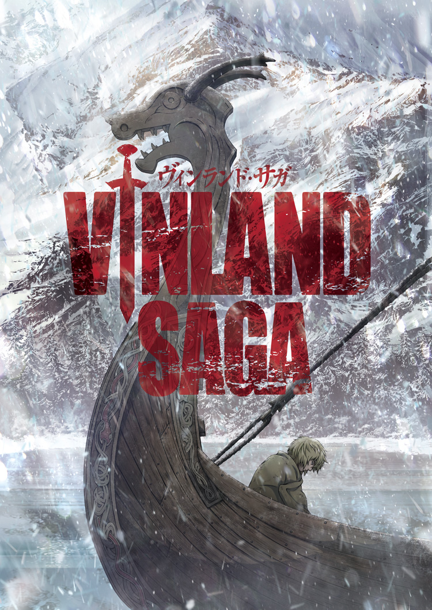

## 俺物语

> 好女孩的朋友不一定都是好女孩哦，有可能因为她人太好才会“被交朋友”。-河原和音

## CLANNAD

> 世界是美丽的，就算充满悲伤和泪水。也请睁开你的双眼，去做你想要做的事情，成为你想要成为的人，去找到你的朋友。不必焦躁，慢慢地去长大。-（原创）Key、（导演）石原立也

## 石纪元

> 我们不是神，也不是天才，只能一步步地，勤勤恳恳埋头苦干，把它做出来。我们要向石之路线前进，要脚踏实地，一步步发展，一口气穿越 200 万年的科学史，这就是能获得万能药的科学规划图。-稻垣理一郎

## 齐木楠雄的灾难

> 不过被给予同时也意味着被剥夺。就像被宠坏了的孩子，虽然给予了一切，但也被剥夺了独立的能力。我被夺走了很多东西，包括费尽心力完成一件事情的成就感，或者是竞技胜利的兴奋，又或者是惊喜，紧张之类的情绪，我从来感觉不到，也不会在我身上体现出来。不仅没有愤怒悲伤，连喜悦开心也没有，这就是我到目前为止的人生。-麻生周一

## 奇巧计程车

## 动物狂想曲 BEASTARS

## 动物新世代 Brand New Animals

## 奇诺之旅

> 无论什么人看到天空飞翔的鸟，都会想去旅行吧? -时雨泽惠一

## 昨日之歌

> 人类并不是那么会改变，可是时间却一点一点的流逝。-冬目景

## 辉夜大小姐想让我告白

> 为什么你要这么努力啊？因为不想被别人看到我不帅气的样子，要展示给别人的，还是要帅气的样子才行。-赤坂明

## 月色真美

> 我喜欢的人…也能喜欢上自己，我认为这就是奇迹。-（原创）feel.、（导演）岸诚二

## 工作细胞

> 那个呢，那个呢，因为出了些状况，施工进度推迟了 -清水茜

## 咒术回战

## 鬼灭之刃

## 黑色四叶草

## 转生成蜘蛛又怎样！

> 并不是因为外表丑陋，内心就会跟着丑陋，而是因为外表丑陋，周围就会让你的内心变得丑陋。-马场翁、辉龙司

## 致不灭的你

## 死神少爷与黑女仆

> 枯萎的白玫瑰的花语是至死不渝。-井上小春（イノウエ）

## 异世界迷宫黑心企业

## 我们的重置人生

## 阴晴不定大哥哥

## 头文字 D

> 人最重要是找到属于自己的世界，只要找到属于自己的世界，人生才有意义。-重野秀一

## 灰与幻想的格林姆迦尔

> 我睁开眼睛，眼前所见的风景毫无变化，真是残酷。-十文字青、白井锐利

## 记录的地平线

> 我经常被人叫做故作老成的孩子，我在小孩中的确算是有理解力和自制心的。但是正因如此，我也疏远了和同年纪孩子们之间的距离。犯下了许多过错。鄙弃了他人的温柔，甩开了他人向我伸来的手。将自己放到了与他人为敌的立场上。连理解双亲的辛劳和心情，我也做不到。每一件都是细微但又无法挽回的失败。每次我都是来到这哭泣。就算发誓不会再犯，却重蹈覆辙。-橙乃真希、原和弘

## 关于前辈很烦人的事

## 关于完全听不懂老公在说什么的事

> 日常不会就这样戏剧性地结束，静静的，偶尔也会巨变，混杂着喜悦与不安。无论闲暇还是繁忙，若即若离，勇往前行。-酷教信徒

## 擅长捉弄的高木同学

## 小林家的龙女仆

> 大部分人并不想长大 只是没办法继续当一个小孩子。-酷教信者

## 南家三姐妹

## 间谍过家家

## 夏日重现

> 时间缓缓书写着夏日，留下对逝去时间的心安和落寞，以及痛楚。-田中靖规

## 紫罗兰永恒花园

> 如果有客人需要的话，无论何处都能赶到，这里是自动人偶服务。-晓佳奈、高濑亚贵子

## ReLIFE

> 烟火带有一丝哀伤，华丽的炒热了气氛，却又黯然的消失，总觉得有些寂寞。但这份短暂的虚幻，也是烟火的漂亮之处。-夜宵草

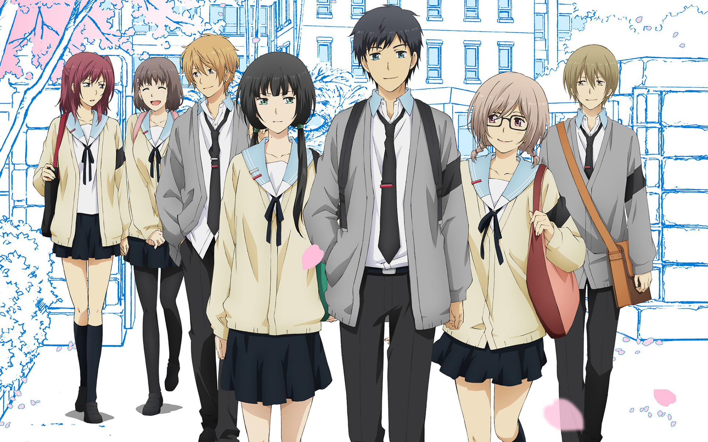

## 散华礼弥

## 比宇宙更遥远的地方

> 离开一直以来依赖的东西，去往一无所有的世界，去往不知向右有什么，不知家在何方的世界，去往明天会身处何处，后天向哪里前进都无法想象的世界，即使如此也要出发。-Yorimoi（よりもい）

## 干物妹！小埋

> 随心所欲就是面对「最喜欢」的人的表现。-三角头

## 白兔糖

## 天真与闪电(甘々と稲妻)

> 如果能通过我喜欢的事让大家高兴，那就太开心了！-雨隠ギド

## 真实之泪

> 什么都不知道，不是好事。我就是因为什么都不知道，才会伤害了人。-La'cryma

## 碧蓝之海

> 谁都不希望自己喜欢的东西被别人否定，想有更多同伴分享同一份感动，哪怕多一个人也好，自己能开心，对方也开心。-井上坚二、吉冈公威

## 约定的梦幻岛

## 声之形

## 少女终末旅行

## 黄金神威

## 妖精森林的小不点

## 刻刻

## 来自深渊

> 无法回头的旅途，无法再次获得的宝物，无法死而复生的生命，这个世界上大部分的事物都是无法恢复原状的，人们熟知这一点，至今也在一步步地前行，为了看到未曾见过的风景，从未停下脚步。-土笔章人

## 在下坂本，有何贵干

> 人们在紧急情况下达成共同的目的，自然而然的就会拉近彼此的距离。-佐野菜见

## OVERLOAD

> 唉，对第一次见面的人只能产生如同对待昆虫的亲切感。不过深入交谈之后，就会涌现出对待小动物的眷恋。-丸山黄金

## 从零开始的异世界生活

## 路人女主的养成方法

> 远的不是距离，而是次元啊。-丸户史明、深崎暮人

## 超能力女儿

> 他不会再回来了，而会驰骋在充满欲望的夜色中，直到毁灭为止。-大武政夫

## 中二病也要谈恋爱

> 爆裂吧，现实！粉碎吧，精神！Banishment this world！-虎虎、逢坂望美

## 电波女与青春男

> 有时候大人的正确意见，对小孩子来说会是铺得太平整的路。-入间人间

## 轻音少女

> 重要的，珍惜的，一直在身边，一旦成为理所当然，就难以发现。-kakifly

## 孤独摇滚

> 孤僻和喜欢独处的人之间，已经隔了一条可怕的鸿沟。-滨路晶

## Do It Yourself!!

> 虽然我很想早日建好秘密基地，但是怎么说呢，这样永远建不好也挺好的。-IMAGO、Avex Pictures

## 明日酱的水手服

## endro!

> 当在迷宫里不知如何前进的时候，回到起始点也是一种方法。 -い～あ～るぴ～

## Angel Beats

> 一路走来形影单只
> 转身回望大家已经远去
> 即使如此我依然前行
> 这正是我的坚强
> 经历使我无所畏惧
> 再多冷漠也是一句叹息
> 总有一天人将学会独立
> 在回忆中寻找自己的影子
> 为了那笑容下与孤独作伴的勇气
> 决定战斗到底 -麻枝准

## 绝园的暴风雨

> 总是留恋失去的东西，只是向着死胡同奔跑而已。-城平京

## 一周的朋友

> 就算只有一周的记忆，我也永远不会忘记你。-叶月抹茶

## 物语系列

> 总之就是比起不去怀疑、去相信，人其实是“不想怀疑”，想要相信自己所生活的世界，周围是足以信任、足以安心的。 想要安心。 所以不陷入疑神疑鬼之中，去相信。 要是怀疑的话还不如被骗了比较好。这种想法愚蠢透顶，但不可思议的是有很多人都这样想。-西尾维新

## 进击的巨人

> 我一直以来都弄不明白，为什么不管做了多么明智合理的选择，在结果出来之前，谁都无法知道它的对错。到头来我们被允许做的，只是坚信那个选择，尽量不留下后悔而已。-谏山创

## ACCA13 区监察课

## 游戏人生

## 剑风传奇

> 人类是很肤浅的，嫉妒比自己优等的人，轻视比自己劣等的人，为了一点差距就会害怕，憎恨。-三浦健太郎

## 狼与香辛料

> 说谎的时候，重点不在于说谎的内容，而在于为何要说谎。
>
> 怀念总是在带来愉快的心情后，又带来寂寞。
>
> 被骗时只懂得生气的人根本不成对手。应该要懂得佩服这种手法，才算是真正的商人。
>
> 虽然贪欲会失去很多东西，可是禁欲也不会有任何建设。
>
> 旅行唯有出发前最愉快，狗儿唯有叫声最吓人，女人唯有背影最美丽。随随便便抛头露面，会坏了人家的美梦，这种事情咱做不来。
>
> 如果只注意森林里的一株枯树，会觉得这株枯树对森林有害；但如果以整体森林来看，这株枯树会成为提供其他树木成长的养分来源，那就是对森林有益。如果用不同的观点来观察眼前的状况，经常会发现完全相反的事实。
>
> 弱势的人发现比自己更弱势的人时，理所当然会咬住对方不放。
>
> 廉价的自尊、粗劣的傲气，无论哪个后生小辈都很重视这些东西。-支仓冻砂

## 校园迷糊大王

> 虽然会错意，但爱还是爱啊。-小林尽

## 关于我转生成史莱姆这档事

> 我好像真的转生成-史莱姆了，就这样日子一天天过去，不得不说这样的身体还挺方便的，不吃饭不睡觉也照样是活蹦乱跳的，什么？你问我那干嘛还要吃草？当然是因为我闲的啃草啊，虽说没什么意义，不过不干点什么心里总归没底。-伏濑

## 龙王的工作

## 埃罗芒阿老师

> 如果 100 分是满分的话，有趣可以打 100 万分。-伏见司

## 徒然喜欢你

## 新人炼金术师的店铺经营

> 朝着理想努力固然重要，但也不能太过受其束缚，偶尔任性一点也无妨。-いつきみずほ

## 这个勇者明明超强却过分慎重

## CAROLE & TUESDAY

## GOSICK

> 我最大的敌人是无聊，但第二大敌人是吵闹。-樱庭一树

## 伪恋

> 恭喜你，还有，我喜欢你。-古味直志

## 弹丸论破

> 规矩，既是束缚，也是保护。(黑白熊) -（原作）Spike

## SSSS.电光机王

## 巴克亚罗（BACK ARROW）

## 天元突破红莲螺岩

> 听好西蒙，别忘了，相信自己，不是我相信着的你，也不是你相信着的我，相信，相信着你自己的你吧。
>
> 我的钻头是可以突破天际的！-（原作）GAINAX、（导演）今石洋之

## 白箱

> 我啊，其实并不是打从一开始就知道自己要前进的方向的，回过神时，自己便置身于此地了。仅此而已。-（原作）武藏野动画、（导演）水岛努

## 可塑性记忆

> 时光流转，愿你与珍爱之人，能够再次重逢。- (原创) ANIPLEX

## 秘密内幕，女警的反击

> 你很想让那些被开罚单还满口抱怨的人看看吧！看看印在脑海中的情景，你是不是很来气，会想『你们什么都不知道』，不过，他们没必要知道那样的情景，只要不成为当事人，他们就没必要知道，这就是我们的工作。-泰三子

## 我的英雄学院

> 无论如何，你都会挺身而出，去拯救那些求救的人，而在这时，任何高墙都会在你面前荡然无存。-堀越耕平

## 怪化猫

> 不如像个看客，索性泡壶茶坐下，静看这魑魅魍魉、百鬼夜行的世界，人间就像一副艳丽、浮华、喧嚣、令人惊艳不已的浮世绘。可是驱散了眼前的莺莺燕燕，最终讲的还不是一场场悲怆的荒诞剧目。-（导演）中村健治

## 交响情人梦

> 我们总幻想着彼此的未来 、却也总惦记着对方的过去。-二之宫知子

## 好想告诉你

## 邻座的怪同学

## 晨曦公主

## 灼眼的夏娜

> 用别人的回忆充实自己是没有意义。-高桥弥七郎

## 斩·赤红之瞳

> 我的强大源于我所背负的沉重。-贵博（タカヒロ）

## 食梦者玛利

## 神不在的星期天

> 愿望，最好还是不要实现，轻而易举许下愿望就实现的话，就不知道下一步该做些什么了......-入江君人

## 神的记事本

> 我一直都是一个人，脑袋空空的，觉得人生就是随波逐流地度过。-杉井光

## 只有神知道的世界

## 龙与虎

> 天空是连着的，如果我们也能各自发光的话，无论距离有多远，都能看到彼此努力的身影。-竹宫悠由子

## 星合之空

## 对某飞行员的追忆

## 血意少年

> 这双手不是为了击败 敌人，而是为了不再放开重要之物。-小玉由起

## 十二大战

> 人终有一死，大家都是被命运抛弃的孤儿；正因如此，他们才都欲向你举起反旗；在成千上万的理论范畴之外；寻找着一个不受约束的生命。-西尾维新

## 体操武士

## 排球少年

> 正因为没有“羽翼”，人类才会寻找飞翔的方法。
>
> 无论多么困难的球，去追的理由只有一个：因为球还没有落地！无论是多么劣势，继续战斗的理由只有一个：因为还没有输！
>
> 挡在我面前的，是一面很高很高的墙。墙的另一头，是怎样的风景呢，在我眼里会呈现出怎样的风景呢？顶端的景色，那是单凭我一人绝对无法看到的景色。但是，不只是我一个人的话...... -古馆春一

## 青之芦苇

> 自己想出的答案，一辈子都不会忘记。-小林有吾

## 蓝色监狱

> 不当世界第一的利己主义者，就当不上世界第一的前锋。 -金城宗幸

## 黑子的篮球

> 不要拿我跟任何人比，我不是谁的影子，更不是谁的替代品。-藤卷忠俊

## 听我的电波吧

> 何为字，字为明镜；既映人形，亦现人心。-沙村广明

## 赌博默示录

> 越是觉得自己正确的人越深信不疑自己的正确，尤其是他靠“理”来取胜的时候，更是如此，正因为有“理”，所以才无防备。-福本伸行

## 东方 project

> 墨樱落无痕，白楼寂无声。永夜迷蝶舞，幽幽亡者魂。

## 此花亭奇谭

> 世界万物就这样和我们毫无关联独自变化，一眨眼，一低头，景色立刻就会不一样，没有察觉到这个的话，感觉就很可惜呢？-天乃咲哉

## 派对浪客诸葛孔明

> 去者日以疏 佚名〔中国两汉〕
> 去者日以疏，来者日以亲。
> 出郭门直视，但见丘与坟。
> 古墓犁为田，松柏摧为薪。
> 白杨多悲风，萧萧愁杀人。
> 思还故里闾，欲归道无因。- 四叶夕ト

## 国王排名

## 刺客伍六七

> 我是刺客五六七，刺客排行榜一万七千三百六十九位，最擅长剪空气刘海，一直以优质的服务和亲民的价格深受村民的喜爱，目前的情感状况是单身，不如一起去喝杯东西交流.. -何小疯

## 罗小黑战记

> 既然你无法相信我，那就由我相信你开始吧！-木头

## 一人之下

> 他们都说我瓜，其实我一点也不瓜，有的时候我还机智的一逼。(冯宝宝) -米二

## 捉妖小红娘

> 你们都错了，所有人都觉得，他应该死了，但是在他心里，一定感觉，从未像现在一般活着。-庹小新

## 秦时明月

> 天下皆白，唯我独黑；非攻墨门，兼爱平生。-温世仁

## 魔道祖师

> 蓝曦臣！我这一生害人无数，杀父杀兄杀妻杀子杀师杀友，天下的坏事我什么没做过，可我独独没有想过要害你。-墨香铜臭

## 魁拔

> 脉术那么差，根本打不过，为什么还要打？
> 我知道我根本打不过，但是我要用行动来告诉你我的态度，我是你的敌人！

## 凹凸世界

> 他的眼里有星辰大海，是骑士触不可及的光芒。-七创社

## 万国志

> 一叶一菩提，一花一世界，要我说，这里就是一城一世界。

## 剑网 3·侠肝义胆沈剑心

> 酷白发，小酒窝，主角标配的帅小伙。

## 凸变英雄 LEAF

> 小时候憧憬着长大，因为成年后，可以拥有更多的权利去选择自己想做的事，但事实，什么是最好，什么是最高，真正的长大后才知道，选择的权力本身其实是一种约束，因为它并不是一种开放式的答辩题，而是已经准备好答案的选择题，但是，选了正确的就一定是对的吗？

## 迷域行者

## 镇魂街

> 末将于禁，愿为曹家世代赴汤蹈火。-许辰

## 秒速五厘米

> 我们仰望着同一片天空却看着不同的地方。
>
> 时间带着鲜明的恶意，从我身上慢慢流走；我深知，这以后的将来，我们不可能一起走过。
>
> “呐，你知道吗？听说樱花飘落的速度是秒速五厘米哦。” 秒速 5 厘米，那是樱花飘落的速度，那么怎样的速度才能走完我与你之间的距离？-新海诚

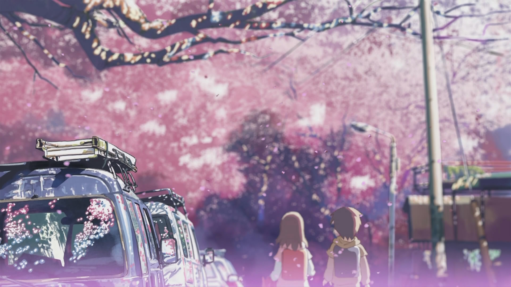

## 言叶之庭

> 隐约雷鸣 阴霾天空 但盼风雨来 能留你在此
> 隐约雷鸣 阴霾天空 即使天无雨 我亦留此地
>
> 小时候，天空分明触手可及，于是喜欢上雨，因它带来天空的气味。 经常在下雨的早晨，不再换乘地铁，转身走出车站。 -新海诚

## 你的名字

> 彼方为谁 无我有问
> 九月露湿 待君之前
>
> 只要记住你的名字，不管你在世界的哪个地方，我一定会，去见你。
>
> 重要之人，不能忘记之人，不想忘记之人。你，是谁？-新海诚

## 辉夜姬物语

人的一生，就是在爱恨中痛苦挣扎，没有人可以遁逃，只能努力忍耐。-高畑勋

## 百变狸猫

> 光阴似箭，春天很快就到来了。恋爱求偶的季节，大地回春。去年狸猫们压抑着自己的思春期，今年实在忍无可忍了。所谓春光无限好，大家都争着拍拖，务求春色无边，连天空都闪耀着玫瑰色的光芒。-高畑勋

## 岁月的童话

> 回忆是一种很奇妙的东西，它生活在过去，存在于现在，却能影响未来。
>
> 岁月似一掬清水，无论平摊还是紧握在手掌，总会有一点一滴从指缝中流逝。
>
> 如果真的有一天。某个回不来的人消失了。某个离不开的人离开了。也没关系。时间会带你去最正确的人身边。请你先好好爱着自己。然后那个还不知道在哪里的人。会来接你。
>
> 若干年后女孩在失眠的夜里想起，曾经有个木讷的男生站在她回家的路口，问她：你比较喜欢哪一个？阴天还是晴天… -高田勋

## 萤火虫之墓

> 珍惜今天，珍惜现在，谁知道明天和意外，哪一个先来。
>
> 如果你能看到我的世界里那些渐渐消逝的美好，你就能体会到现在所拥有的幸福。
>
> 你愿用一生，等待，然后呵护这短暂的光亮吗？即使，明知它会消失。
>
> 那是个温暖的时空，没有战争，没有饥饿，也没有冷暖人情，只有点点萤火虫映衬着节子可爱的脸。
>
> 当我想起，我没有爸爸，没有妈妈，没有妹妹，我只有不停的哭。
>
> 为什么萤火虫都那么快死？-高田勋

## 哈尔的移动城堡

> 人老了的好处，就是可失去的东西越来越少了.
>
> 世界这么大，人生这么长，总有一个人，让你想要温柔对待。
>
> 因为爱你，只要你一个肯定，我就足够勇敢。
>
> 爱，不是寻找一个完美的人，而是学会用完美的眼光，欣赏那个并不完美的人。-宫崎骏

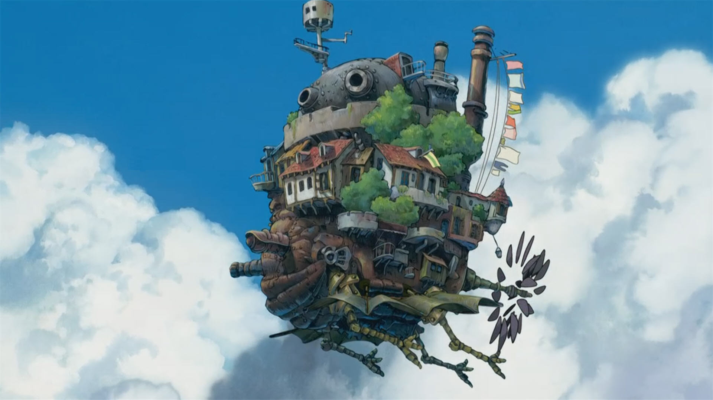

## 天空之城

> 我们的孤独就像天空中漂浮的城市，仿佛是一个秘密，却无从述说。
>
> 有时候，坚持了你最不想干的事情之后，便可得到你最想要的东西。
>
> 很多事情都是命中注定的，就好像你会遇到什么样的人，经历什么样的伤痛，最终如何离开这个世界，没什么能改变命运。-宫崎骏

## 起风了

> 起风了，唯有努力生存。
>
> 原来我和你竟是如此深爱着对方。在我们相爱之前，你不存在；我也不曾存在。-堀辰雄

## 魔女宅急便

> 从一个城市到另一个城市，只有靠自己努力。学会长大，学会承受，学会哭过之后，还可以微笑地拥抱爸爸妈妈。
>
> 只有一个人在旅行时，才听得到自己的声音，它会告诉你，这世界比想象中的宽阔。
>
> 成长是一笔交易，我们都是用朴素的童真与未经人事的洁白交换长大的勇气。
>
> 在这个世界上别太依赖任何人，因为当你在黑暗中挣扎时，连你的影子都会离开你。-角野荣子

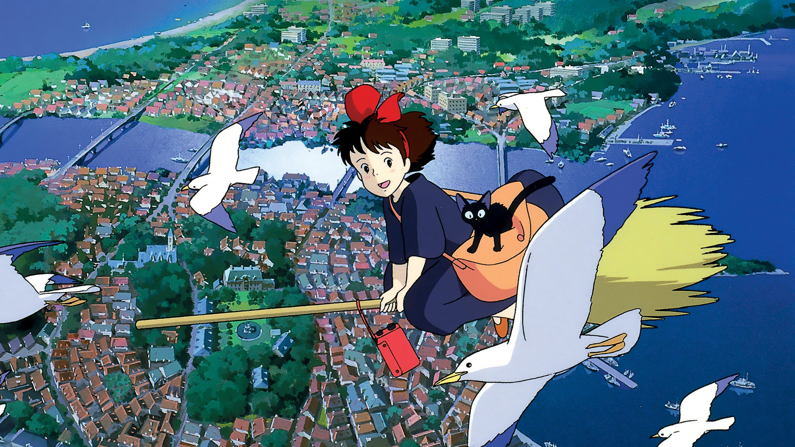

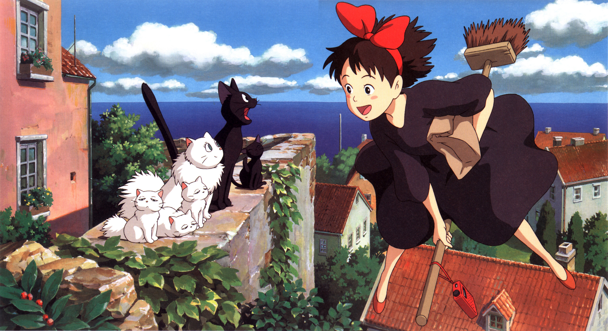

## 千与千寻

> 不管前方的路有多苦，只要走的方向正确，不管多么崎岖不平，都比站在原地更接近幸福。
>
> 我不知道离别的滋味是这样凄凉，我不知道说声再见要这么坚强。
>
> 我不知道将去何方，但我已在路上。
>
> 人永远不知道，谁哪次不经意的跟你说了再见之后，就真的不会再见了。
>
> 我只能送你到这里了，剩下的路你要自己走，不要回头。
>
> 已经走到尽头的东西，重生也不过是再一次的消亡。就像所有的开始，其实都只是一个写好了的结局。
>
> 人们常常会欺骗你，是为了让你明白，有时候，你唯一应该相信的人就是你自己。
>
> 我已经准备好了足够挡雨的伞，可是却迟迟没有等到雨的到来，这样的尴尬只是我漫长人生中的小插曲罢了。
>
> 很多事情不能自己掌控，即使再孤单再寂寞，仍要继续走下去，不许停、也不能回头。-宫崎骏

## 侧耳倾听

> 因为你，我想要变成一个更好的人，不想成为你的负担，因此发奋，只是想证明我足以与你相配。
>
> 真是不可思议，我有种感觉，好像很久以前，就已经认识你了。有时候，又一直急着想要看到你，今天看到你，又觉得心里酸酸的。
>
> 我早就决定，要这样载着你...翻山越岭。
>
> 决不能习惯失败，因为你要知道，身体的疲惫，不是真正的疲惫；精神上的疲惫，才是真的劳累。-(原作)柊葵、（导演）近藤喜文

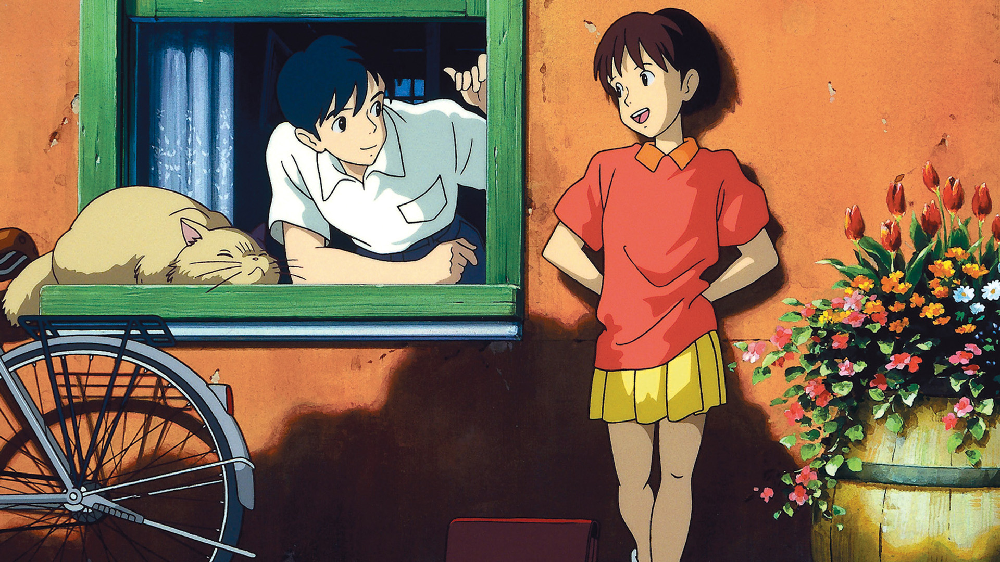

## 悬崖上的金鱼姬

> 一举一动，都是承诺，会被另一个人看在眼里，记在心上的。
>
> 我浑身伤痛，跋涉万里，疲倦地寻找，只为来与你相见。-宫崎骏

## 龙猫

> 生活坏到一定程度就会好起来，因为它无法更坏。努力过后，才知道许多事情，坚持坚持，就过来了。
>
> 有些烦恼，丢掉了，才有云淡风轻的机会。
>
> 如果把童年再放映一遍，我们一定会先大笑，然后放声痛哭，最后挂着泪，微笑着睡去。
>
> 什么时候我们开始无法像孩子一样肆意地大呼小叫了？心里的小情绪堆积得像山一样高，直到溢出来。
>
> 与其如此，不如永远像孩子一样。
>
> 有时我沉默，不是不快乐，只是想把心净空。有时候你需要退开一点，清醒一下，然后提醒自己，我是谁，要去哪里。
>
> 当你无法再拥有时，你唯一能做的就是不要再忘记。
>
> 我们大笑看看，可怕的东西它就跑掉了。
>
> 人总在记忆中沉沦，为路过我们生命的那些人哭着，笑着。
>
> 有雨伞好棒，可是雨伞在流泪。-宫崎骏

## 幽灵公主

> 不管你曾经被伤害得有多深，总会有一个人的出现，让你原谅之前生活对你所有的刁难。
>
> 到不了的地方都叫做远方，回不去的世界都叫做家乡，我一直向往的却是比远方更远的地方。-宫崎骏

## 借东西的小人阿莉埃蒂

> 许多时候，让我们放不下的，其实并不是对方，而是那些逝去的共同回忆。
>
> 借走的糖，还回的心。你的世界是我最勇敢的一次冒险。
>
> 有一天，蓦然回首，你会发现，那个给你许多痛苦的人，却也是你的救赎。
>
> 欣赏夏日雨后的天空，在花园里为你摘下一朵小花。穿过小径，那里是另外一个世界，蝴蝶在空中飞舞，然而有人在那里等我吗？” -(原作)玛丽·诺顿、（导演）米林宏昌

## 风之谷

> 火在一天之内把森林烧成灰烬，水和风却需要一百年以上的时间来造林。
>
> 最远的旅行，是从自己的身体到自己的心，是从一个人的心到另一个人的心。坚强不是面对悲伤不流一滴泪，而是擦干眼泪后微笑面对以后的生活。
>
> 人类，就是一直在重复过去的道路。每个人都认为自己是对的，然后就由罪恶衍生出更多的罪恶，悲哀衍生出更多的悲哀，永远找不到出路。
>
> 带上信仰，去寻找属于你自己的国度吧!哪怕倾尽一生。-宫崎骏

## 红猪

> 不与世俗为伍，哪怕这是自己许给自己的诅咒。
>
> 不能飞的猪，就只是猪而已。
>
> 云层上的飞行者啊，能否为我摘下你的墨镜，让我看看你真实的容颜？只要你踏上这片秘密花园，你就能轻易将我俘获。从此一张干净的小桌，一杯晕红的葡萄酒，远山的落日里静静地从过去到未来。 -宫崎骏

## 虞美人盛开的山坡

> 多年后，再回想年少时的迷茫和执着，或许原因都不记得了。青春就是让你张扬地笑，也给你莫名的痛。
>
> 当一个女人的嘴里反复出现一个男人的名字时，无论是夸那个男人还是骂那个男人，潜台词都是我爱他。
>
> 没有人是傻瓜。只是有时候，我们选择装傻来感受那一点点叫做幸福的东西
>
> 有一些事情是不得不去做的。不得不去做而去做它，是成熟；不得不去做而把它做好，是勇敢。牺牲一些遥远崇高的东西以换得眼前的平衡，是一种机智，这里面含有人生真正的悲壮。-(原作)佐山哲郎、(导演)宫崎吾郎

## 猫的报恩

> 人是要长大的，有天你也会推着婴儿车幸福地在街上行走，而曾经的喜欢，不管曾经怎样，都会幻化成风，消失在时光的隧道。所以向前走，向前走，无须回头。
>
> 你应该要学着做你自己，面对真实的自我，只要做到这一点你就什么都不用惧怕。
>
> 当人类用感情和希望去创造一样东西，那一样东西就会被赋予灵魂。-(原作)柊葵、(导演)宫崎骏

## 听到涛声

> 如果说多数的梦是黑白的，那么，我觉得也可以说多数的记忆是平面的。-(原作)冰室冴子、(导演)宫崎骏

## 怪物之子

> 学，就要学个彻底。-细田守

## 夏日大作战

> 人生最糟糕的事，一个是饿肚子，一个是孤独。-细田守

## 狼的孩子雨和雪

> 刚被雨水冲洗过的山毛榉叶子，刚被雨水冲洗过的蜘蛛巢，刚被雨水冲洗过的天空，万物都在太阳下闪耀着仿佛世界在一夜之间重生。-细田守

## 穿越时空的少女

> “我在未来等你”
> “嗯，我马上去，我会用跑的！”
>
> 能在无尽的时间洪流中与你相遇这件事，比任何事都更令我坚强。-筒井康隆, (导演)细田守

## 春宵苦短，少女前进吧

> 因为你总是不停向前跑，所以别人总难得追上你，但他却能一次次从你面前经过，你不觉得奇怪吗？-森见登美彦,(导演)汤浅政明

## 河童之夏

> 父亲说过，人类将我们生存的水塘和沼泽夺走，然后是风，还有天空，渐渐地将神灵的地方都据为己有，作为代价的是，他们都失去了灵魂。-木暮正夫, (导演)原惠一

## 你看起来好像很好吃

> 你没有变, 我一眼就认出你了。
>
> 无论什么时候，无论在哪里，我都会爱着你，永远，永远。-宫西达也

## 酷爱电影的庞波小姐

> 幸福感会剥夺创造力。

> 这很罕见，在看到某人的瞬间，脑海中就构思出了完美的故事，这种灵感肯定能带来一部相当棒的作品。-杉谷庄吾

## 隐瞒之事

## 东京教父

## 朝花夕誓

## 混合同人

